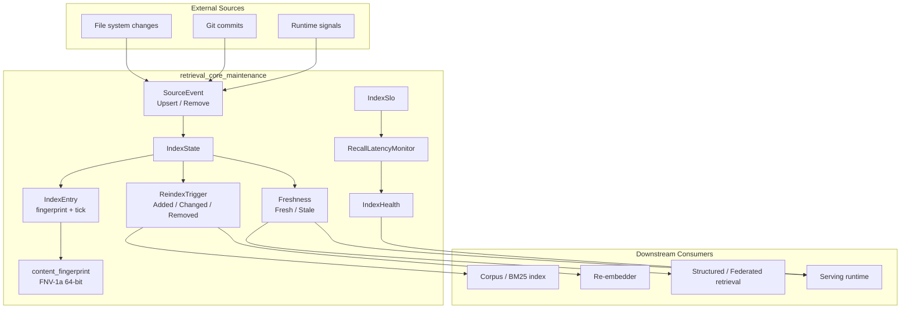
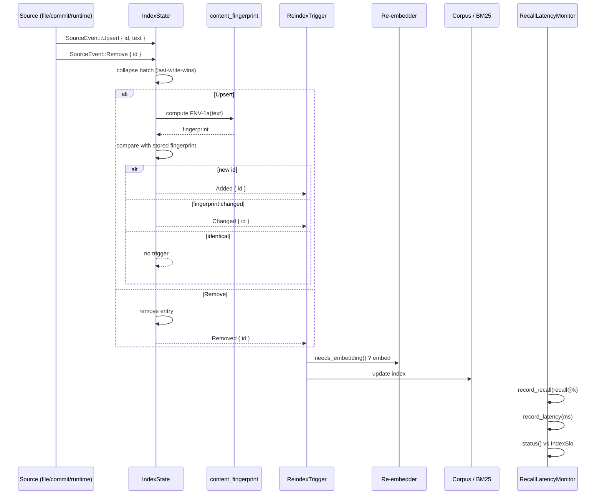
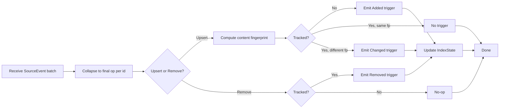
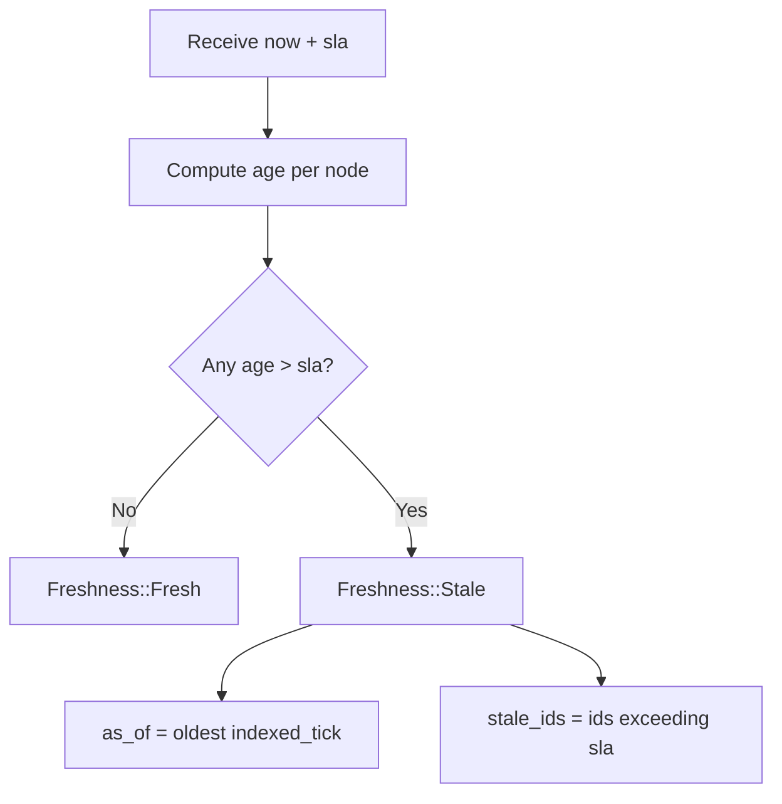
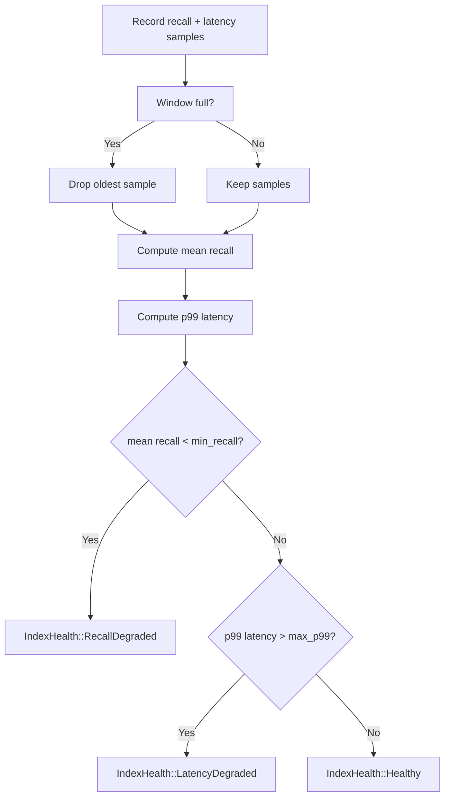

# retrieval_core_maintenance

## Brief Introduction

The `retrieval_core_maintenance` module provides **event-driven, incremental index maintenance** for the knowledge retrieval fabric. It sits above the immutable [`Corpus`](retrieval_core_hybrid_retrieval.md) snapshot and tracks, per node, the content fingerprint and logical tick at which it was last indexed. By applying batches of `SourceEvent`s (file saves, commits, runtime signals), it emits the exact set of `ReindexTrigger`s needed to keep embeddings and indexes current—without ever requiring a full rebuild. The module also monitors vector-index health through recall@k and p99 latency SLOs, surfacing degradation before answer quality silently drops.

This module is a core building block of [`retrieval_core`](retrieval_core.md) and is used by higher-level retrieval, context, and runtime components to ensure that served knowledge is fresh, deterministic, and observable.

---

## Core Components

| Component | File | Responsibility |
|-----------|------|----------------|
| `IndexState` | `crates/ainxt-retrieval/src/maintenance.rs` | Tracks per-node fingerprint and indexed tick; applies event batches and produces `ReindexTrigger`s. |
| `IndexEntry` | `crates/ainxt-retrieval/src/maintenance.rs` | Internal per-node bookkeeping record (fingerprint + tick). |
| `IndexSlo` | `crates/ainxt-retrieval/src/maintenance.rs` | SLO thresholds for vector-index recall@k and p99 latency. |
| `RecallLatencyMonitor` | `crates/ainxt-retrieval/src/maintenance.rs` | Rolling-window monitor that reports `IndexHealth` against `IndexSlo`. |

---

## Module Architecture

---

## Component Relationships

### `IndexState` — the event-driven tracker

`IndexState` is the central mutable structure. It stores a `BTreeMap<String, IndexEntry>` keyed by node id, which guarantees deterministic iteration order (id-sorted output). Its `apply` method:

1. Collapses a batch of `SourceEvent`s to the final intended state per id (last-write-wins).
2. Computes a stable FNV-1a content fingerprint for any upserted text.
3. Compares the new fingerprint with the previously stored one.
4. Emits exactly one `ReindexTrigger` per affected node: `Added`, `Changed`, or `Removed`.

Upserts with an unchanged fingerprint produce **no trigger** and do **not** bump `indexed_tick`, avoiding wasted re-embedding work.

### `IndexEntry` — per-node bookkeeping

`IndexEntry` is a private struct holding:

- `fingerprint: u64` — the FNV-1a hash of the text last indexed.
- `indexed_tick: i64` — the logical tick at which the node was last indexed.

The tick is passed in by callers; no wall clock is used, satisfying the system's `DETERMINISTIC` mandate.

### `ReindexTrigger` — minimal rebuild instructions

Each trigger names one node and indicates whether an embedding is required:

- `Added { id }` → index + embed the new node.
- `Changed { id }` → re-index + re-embed because content changed.
- `Removed { id }` → drop from index and cascade-delete the embedding row.

`needs_embedding()` returns `true` for `Added` and `Changed`, which drives the re-embedding pipeline.

### `Freshness` and staleness

`IndexState` can compute:

- `stale(now, max_age)` — ids whose `indexed_tick` is older than the SLA.
- `stale_as_of()` — the oldest `indexed_tick` across all tracked nodes.
- `freshness(now, sla)` — a `Freshness` verdict (`Fresh` or `Stale { as_of, stale_ids }`).

This lets downstream modules flag responses with a freshness watermark rather than silently serving stale data.

### `IndexSlo` and `RecallLatencyMonitor`

`IndexSlo` defines:

- `min_recall_at_k: f64` — floor for recall@k against exact-search ground truth.
- `max_p99_latency_ms: u64` — ceiling for tail latency.

`RecallLatencyMonitor` keeps bounded rolling windows of recall and latency samples and reports `IndexHealth`:

- `Healthy`
- `RecallDegraded`
- `LatencyDegraded`
- `NoData`

Recall is judged on the mean over the window; latency is judged on the nearest-rank p99.

---

## Data Flow

---

## Process Flows

### Incremental maintenance on a batch of events

### Freshness check

### Index health monitoring

---

## Integration with the Broader System

`retrieval_core_maintenance` is one of four submodules under [`retrieval_core`](retrieval_core.md):

- [`retrieval_core_hybrid_retrieval`](retrieval_core_hybrid_retrieval.md) — owns the immutable `Corpus`, BM25, embedding, and reranking logic.
- [`retrieval_core_acl`](retrieval_core_acl.md) — access-control lists for retrieval nodes.
- `retrieval_core_maintenance` (this module) — event-driven staleness tracking and SLO monitoring.
- [`retrieval_core_reembed`](retrieval_core_reembed.md) — plans and executes embedding migrations.

The `ReindexTrigger`s emitted by `IndexState` are consumed by the re-embedding and corpus-rebuild machinery in [`retrieval_core_reembed`](retrieval_core_reembed.md) and [`retrieval_core_hybrid_retrieval`](retrieval_core_hybrid_retrieval.md). The `Freshness` verdict and `stale_as_of` watermark feed into [`retrieval_advanced`](retrieval_advanced.md) (structured and federated retrieval) and the serving runtime in [`runtime_engine`](../pipeline_runtime/runtime_engine.md) so that responses can carry accurate freshness metadata.

Upstream, the module receives `SourceEvent`s from context ingestion in [`context_sources`](context_sources.md) and [`context_retrieval_routing`](context_retrieval_routing.md), as well as from runtime event streams in [`core_interaction`](../core_infrastructure/core_interaction.md) and [`memory_management`](memory_management.md).

---

## Key Design Decisions

1. **Immutable corpus snapshot** — The `Corpus` itself is never mutated mid-query; maintenance produces triggers that drive a controlled rebuild. This keeps BM25 statistics (`df`, `avgdl`) consistent.
2. **Determinism** — Logical ticks are passed in, fingerprints use FNV-1a over bytes, and outputs are id-sorted. No wall clock, no RNG, no hash-map iteration order.
3. **Incremental, not batch** — Only nodes whose fingerprint changed are re-embedded; identical re-upserts are no-ops.
4. **Bounded memory** — `RecallLatencyMonitor` keeps fixed-size rolling windows for recall and latency samples.
5. **Freshness transparency** — Stale data is flagged with `stale_as_of` rather than silently served as current.

---

## References

- Parent module: [`retrieval_core`](retrieval_core.md)
- Sibling modules:
  - [`retrieval_core_hybrid_retrieval`](retrieval_core_hybrid_retrieval.md)
  - [`retrieval_core_acl`](retrieval_core_acl.md)
  - [`retrieval_core_reembed`](retrieval_core_reembed.md)
- Related advanced retrieval: [`retrieval_advanced`](retrieval_advanced.md)
- Context ingestion: [`context_sources`](context_sources.md), [`context_retrieval_routing`](context_retrieval_routing.md)
- Runtime integration: [`runtime_engine`](../pipeline_runtime/runtime_engine.md)
- Interaction/event streams: [`core_interaction`](../core_infrastructure/core_interaction.md)
- Memory and feedback loops: [`memory_management`](memory_management.md)
