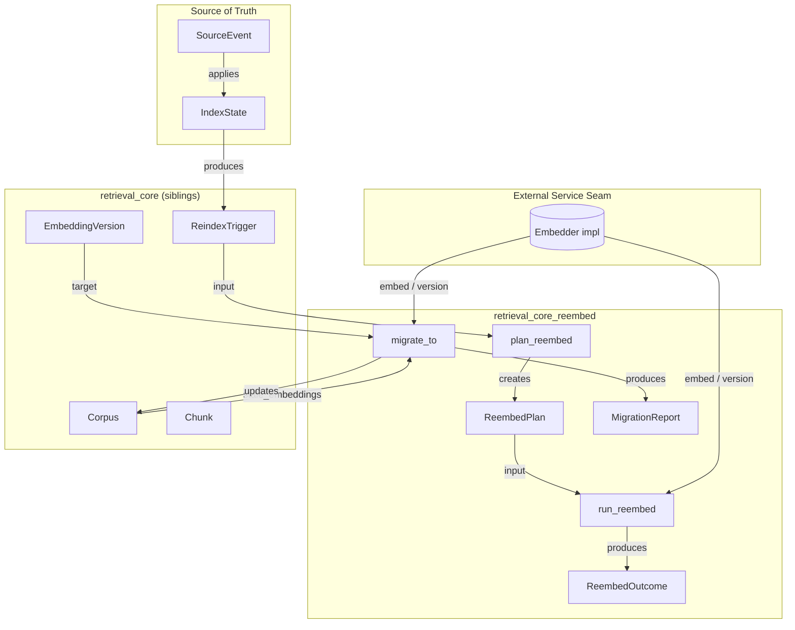
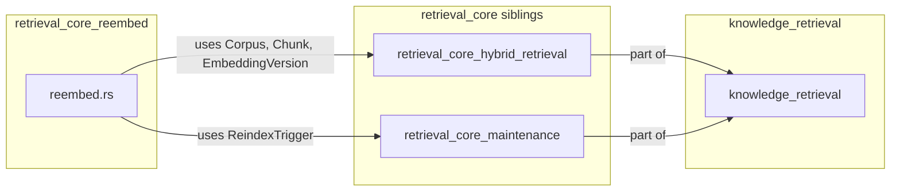
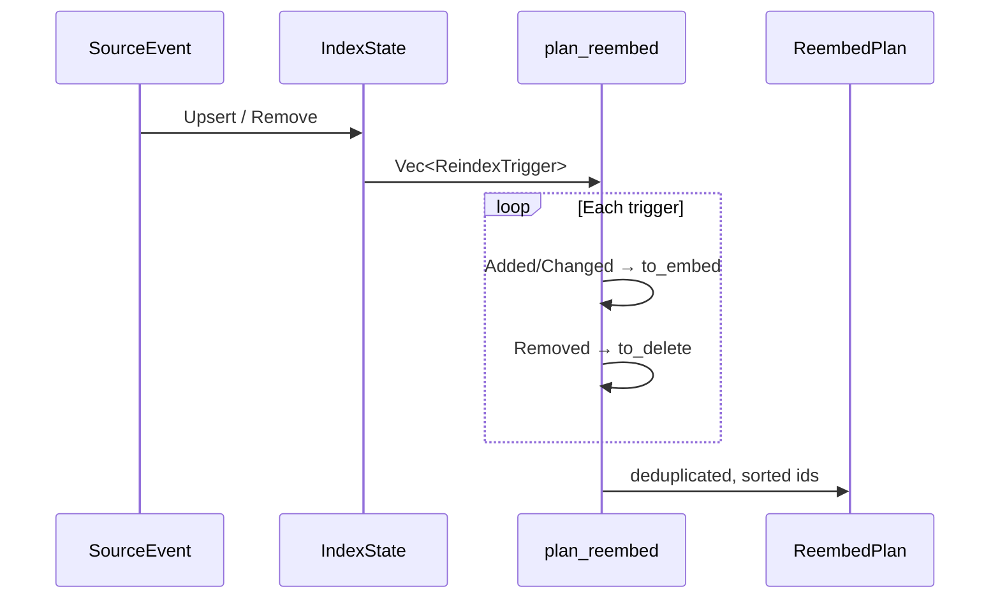
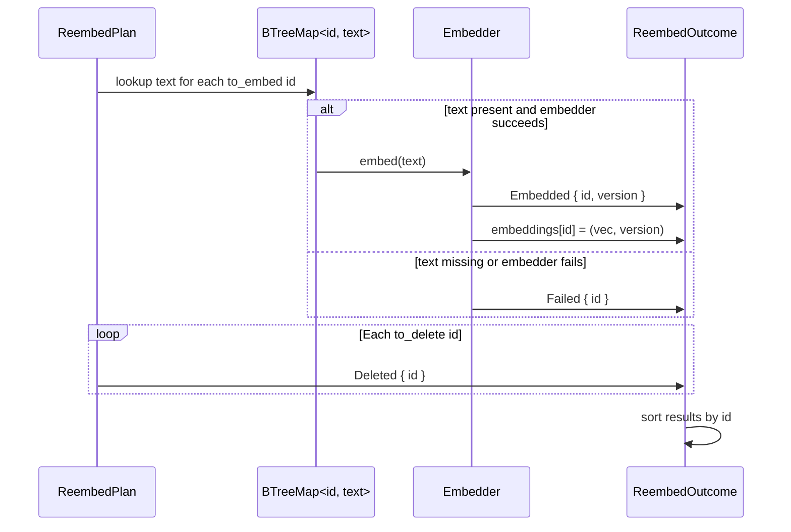
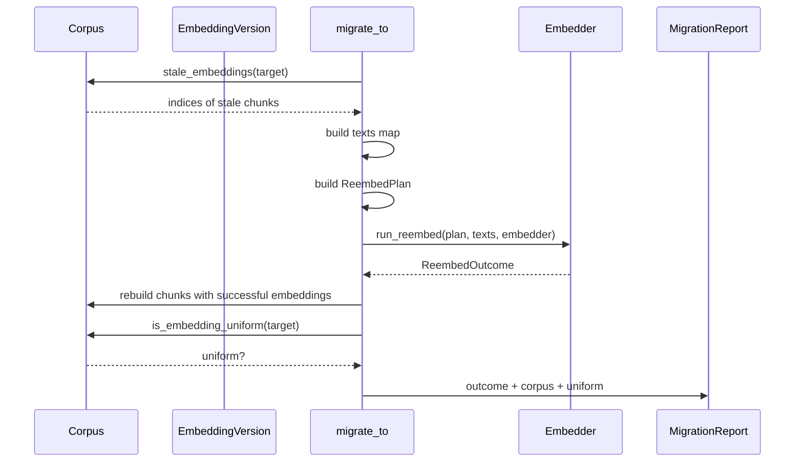
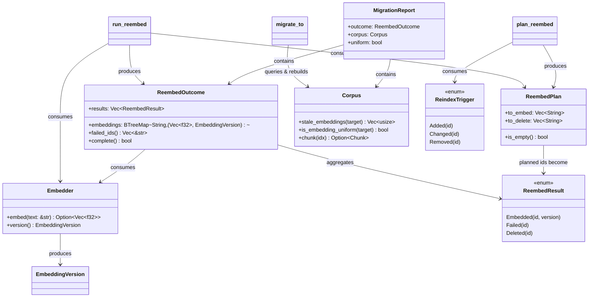
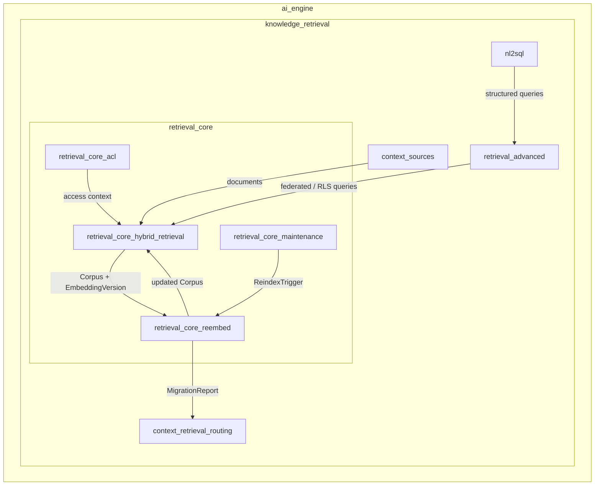

# retrieval_core_reembed

## Brief Introduction

The `retrieval_core_reembed` module implements the **embedding-model lifecycle pipeline** for the retrieval subsystem. Its purpose is to keep a `Corpus` at a single, well-defined [`EmbeddingVersion`](retrieval_core_hybrid_retrieval.md) by re-embedding chunks whenever the platform embedding model changes or source documents are added, changed, or removed.

The module is intentionally deterministic and side-effect-free except for a single [`Embedder`] trait seam. A real deployment plugs in an external embedding service (for example, `services/embed_svc` backed by Ollama `nomic-embed-text`). All planning, failure accounting, and corpus rebuilding logic is implemented in this module so that migrations are **visible** and **never falsely reported as complete**.

This module lives under the [`retrieval_core`](retrieval_core.md) branch of [`knowledge_retrieval`](knowledge_retrieval.md) and works closely with [`retrieval_core_maintenance`](retrieval_core_maintenance.md) (which produces reindex triggers) and [`retrieval_core_hybrid_retrieval`](retrieval_core_hybrid_retrieval.md) (which owns `Corpus`, `Chunk`, and `EmbeddingVersion`).

---

## Core Responsibilities

1. **Plan re-embed work** from a batch of [`ReindexTrigger`](retrieval_core_maintenance.md)s, separating *to-embed* ids from *to-delete* ids.
2. **Run re-embed** against an [`Embedder`], tagging every produced vector with the embedder's version and recording failures explicitly.
3. **Drive full migrations** with `migrate_to`, re-embedding exactly the stale chunks and reporting whether the corpus reached a uniform target version.

---

## Architecture

### Component Roles

| Component | File | Role |
|-----------|------|------|
| `Embedder` | `reembed.rs` | Trait seam for the actual embedding service. Returns `Option<Vec<f32>>` and an `EmbeddingVersion`. |
| `ReembedPlan` | `reembed.rs` | Deterministic worklist: `to_embed` and `to_delete` ids. |
| `ReembedResult` | `reembed.rs` | Per-id result: `Embedded`, `Failed`, or `Deleted`. |
| `ReembedOutcome` | `reembed.rs` | Aggregated embeddings and per-id results; exposes `failed_ids()` and `complete()`. |
| `MigrationReport` | `reembed.rs` | End-to-end result: rebuilt `Corpus`, `ReembedOutcome`, and `uniform` flag. |
| `plan_reembed` | `reembed.rs` | Pure function that turns `ReindexTrigger`s into a `ReembedPlan`. |
| `run_reembed` | `reembed.rs` | Pure function that executes a plan against an `Embedder`. |
| `migrate_to` | `reembed.rs` | Convenience driver for full corpus migration to a target version. |

---

## Dependencies

### Direct Code Dependencies

- [`crate::maintenance::ReindexTrigger`](retrieval_core_maintenance.md) — input events that describe what changed in the source corpus.
- [`crate::Corpus`](retrieval_core_hybrid_retrieval.md) — the indexed document collection that is being migrated.
- [`crate::Chunk`](retrieval_core_hybrid_retrieval.md) — individual document chunks carrying text and optional embeddings.
- [`crate::EmbeddingVersion`](retrieval_core_hybrid_retrieval.md) — version tag stamped on every vector to prevent mixed embedding spaces.

### External Seams

- **Embedder implementation** — typically provided by `services/embed_svc` or a test fake. The module does not know the model architecture; it only requires `embed(&str) -> Option<Vec<f32>>` and `version() -> EmbeddingVersion`.

---

## Data Flow

### Re-embed Planning Flow

### Re-embed Execution Flow

### Full Migration Flow

---

## Component Interactions

---

## Process Flows

### Embedding Model Bump

When the platform embedding model is bumped, an index worker runs `migrate_to`:

1. Identify all chunks whose `embedding_model` is not the target version via `Corpus::stale_embeddings`.
2. Build a `ReembedPlan` containing only those stale ids.
3. Call `run_reembed` with the current chunk texts and the new `Embedder`.
4. Rebuild the corpus, applying only successful re-embeddings.
5. Check `Corpus::is_embedding_uniform(target)`.
6. If `uniform` is false or `outcome.failed_ids()` is non-empty, the migration is incomplete and must be retried.

### Source Change Handling

When source documents change, [`retrieval_core_maintenance`](retrieval_core_maintenance.md) produces `ReindexTrigger`s:

- `Added { id }` and `Changed { id }` → added to `ReembedPlan::to_embed`.
- `Removed { id }` → added to `ReembedPlan::to_delete`.

The ids are deduplicated and sorted so that the sweep is deterministic and testable.

### Failure Handling

A core design principle is **fail-visible** behavior:

- If `Embedder::embed` returns `None`, the id is recorded as `ReembedResult::Failed`.
- If a planned id has no text in the provided map, it is also recorded as `Failed`.
- `ReembedOutcome::complete()` returns `false` if any id failed.
- `MigrationReport::uniform` remains `false` if any stale chunk could not be re-embedded.

This prevents a partially migrated index from being mistaken for a fully migrated one.

---

## How It Fits into the System

`retrieval_core_reembed` is the **lifecycle operator** of the retrieval core. While [`retrieval_core_hybrid_retrieval`](retrieval_core_hybrid_retrieval.md) defines how chunks are scored, reranked, and returned, and [`retrieval_core_maintenance`](retrieval_core_maintenance.md) decides *when* the index needs attention, this module performs the actual work of bringing the index to a consistent embedding version.

---

## Key Design Decisions

1. **Pure / deterministic core** — `plan_reembed`, `run_reembed`, and `migrate_to` are pure functions. The only side effect is the `Embedder` trait call.
2. **Version-tagged vectors** — every embedding is stamped with `EmbeddingVersion` so the corpus can detect mixed-version states.
3. **Fail-visible partial migrations** — failures are recorded and surfaced, never silently skipped.
4. **Sorted, deduplicated ids** — plans and outcomes are deterministic, making tests and retries predictable.
5. **No direct storage / network code** — the module delegates all I/O to the `Embedder` seam and to the `Corpus` abstraction.

---

## References

- [`retrieval_core_hybrid_retrieval`](retrieval_core_hybrid_retrieval.md) — defines `Corpus`, `Chunk`, `EmbeddingVersion`, and the retrieval scoring pipeline.
- [`retrieval_core_maintenance`](retrieval_core_maintenance.md) — produces `ReindexTrigger`s from source events and tracks `IndexState`.
- [`retrieval_core_acl`](retrieval_core_acl.md) — access-control layer that may filter chunks before they reach the embed pipeline.
- [`knowledge_retrieval`](knowledge_retrieval.md) — parent module covering context sources, routing, NL2SQL, and advanced retrieval.
- [`retrieval_advanced`](retrieval_advanced.md) — federation, RLS, and structured query modules that consume a uniform-version corpus.
