# Safety Guardrails: Rails (`ainxt-guardrails`)

## Brief Introduction

The `safety_guardrails_rails` module implements **configurable input/output guardrails** for the AI engine, delivered through the `ainxt-guardrails` crate. It provides a deterministic, scored rail framework that inspects both user prompts and model outputs for safety and quality violations such as jailbreak attempts, toxicity, topic drift, groundedness failures, system-prompt leaks, format violations, and citation mismatches.

A central design principle is **"default off"**: during strangler-fig coexistence with the Python gateway, all rails are disabled unless a deployment explicitly enables them. This avoids double-processing and keeps the mandatory PCI/DSS compliance gate (which lives in `ainxt-runtime`) separate from these optional, additional rails. When enabled, the layer follows a **redact-don't-block** spirit: safety-critical rails (jailbreak, toxicity, system-prompt leak) can hard-block a turn, while quality/faithfulness rails (groundedness, citation) flag and proceed so issues are surfaced rather than silently dropping answers.

The crate is intentionally built with **ML seams**: production deployments can plug in real classifiers or NLI/entailment judges via the `TextClassifier` and `FaithfulnessJudge` traits, while offline/air-gapped deployments can rely on deterministic phrase-table and lexical baselines.

---

## Architecture Overview

The module is organized around three core abstractions:

1. **`Rail` trait** — the unit of inspection. Each rail receives text and optional grounding context, then returns `Pass`, `Flag`, or `Block`.
2. **`GuardrailsConfig`** — the declarative configuration that selects which rails run, in which mode (`Off`, `Audit`, `Enforce`), and with what parameters.
3. **`RailChain`** — the orchestrator that builds an ordered list of rails from config and evaluates them against input or output text.

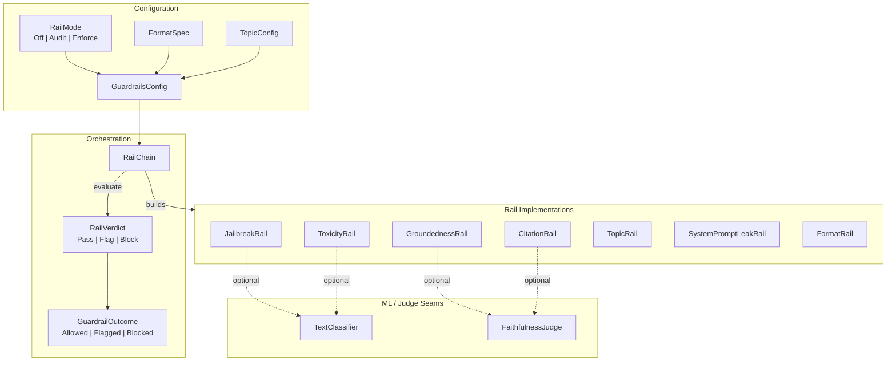

### Rail Modes

Every rail is configured with a `RailMode`:

| Mode | Behavior |
|------|----------|
| `Off` | Rail is not included in the chain. |
| `Audit` | Violations are collected as flags but the turn proceeds. |
| `Enforce` | A `Block` verdict immediately stops the turn with `GuardrailOutcome::Blocked`. |

### Built-in Rails

| Rail | Path | Purpose |
|------|------|---------|
| `JailbreakRail` | Input | Detects instruction override, persona escape, roleplay-to-unrestricted, prompt extraction, and obfuscation cues. |
| `ToxicityRail` | Input / Output | Detects structural threat/self-harm/violence patterns plus a deployment-supplied lexicon. |
| `TopicRail` | Input / Output | Enforces off-limits terms and optional in-scope topic presence. |
| `GroundednessRail` | Output | Checks that the answer is supported by retrieved grounding context. |
| `CitationRail` | Output | Verifies that each inline citation `[n]` actually supports the sentence that cites it. |
| `SystemPromptLeakRail` | Output | Detects the model regurgitating its own system prompt verbatim. |
| `FormatRail` | Output | Validates that the answer conforms to a requested shape (JSON, closed vocabulary, non-empty, max chars). |

---

## Component Relationships

### The `Rail` Trait and Verdicts

All rails implement the `Rail` trait:

```rust
pub trait Rail: Send + Sync {
    fn name(&self) -> &str;
    fn check(&self, text: &str, context: &[String]) -> RailVerdict;
}
```

`RailVerdict` is the atomic result:

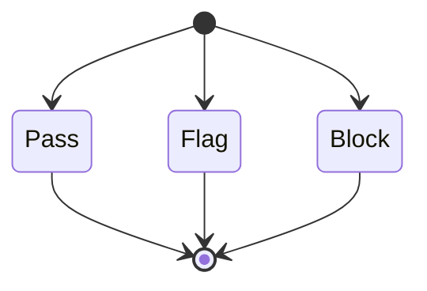

`RailChain::evaluate` maps these verdicts through the configured `RailMode` to produce a `GuardrailOutcome`:

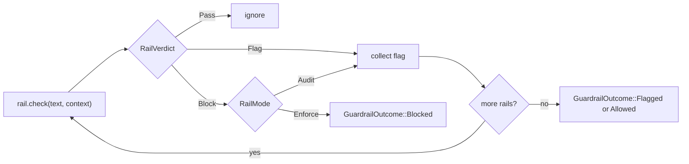

### Configuration-Driven Chain Construction

`RailChain` provides three constructors that mirror how the runtime uses guardrails:

- `RailChain::from_config` — all enabled rails (used when a single chain is desired).
- `RailChain::for_input` — only rails appropriate for user prompts: jailbreak, toxicity, topic.
- `RailChain::for_output` — only rails appropriate for model answers: groundedness, citation, toxicity, topic, system-prompt leak, format.

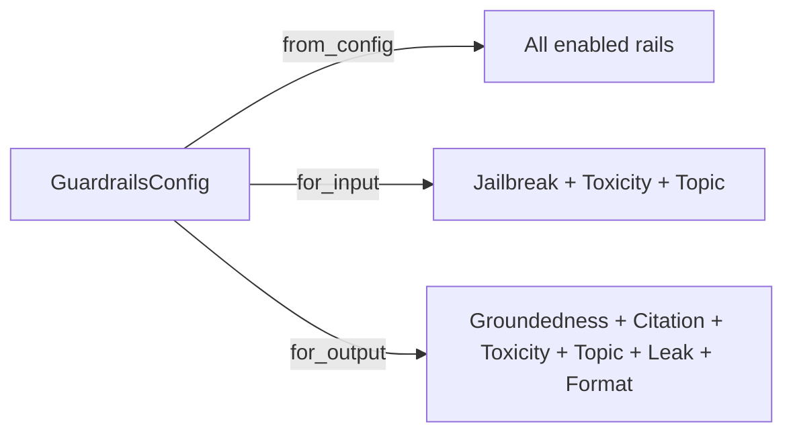

### ML Seams

The deterministic baselines are designed to be **fail-safe floors**: an attached ML model can only make a rail stricter, never weaker.

- **`TextClassifier`** is used by `JailbreakRail` and `ToxicityRail`. The effective score is `max(heuristic_score, classifier_score)`.
- **`FaithfulnessJudge`** is used by `GroundednessRail` and `CitationRail`. When attached, it replaces lexical overlap for the support-ratio gate.

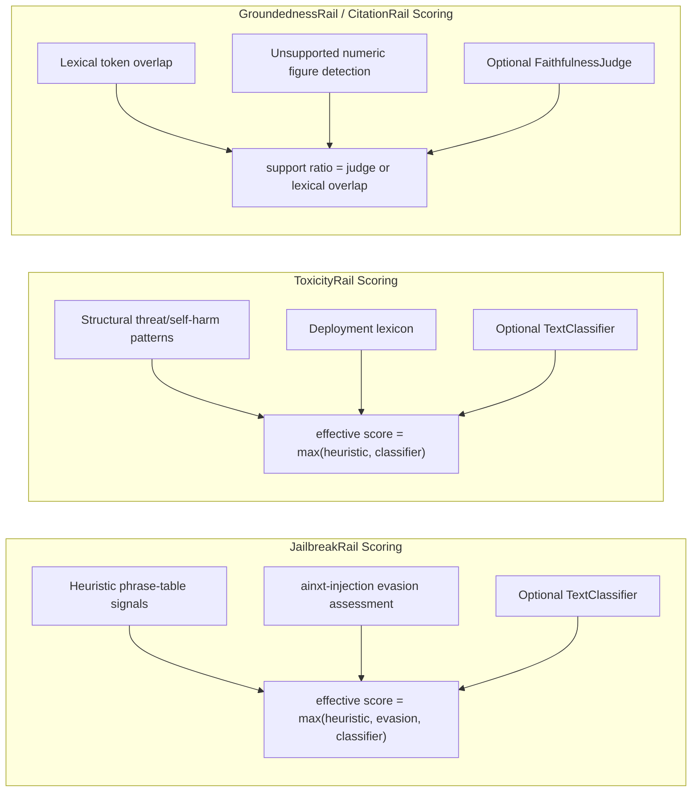

---

## Data Flow

### Input Path: Inspecting the User Prompt

On the input path, the runtime builds `RailChain::for_input` and evaluates the user's prompt. No grounding context is supplied.

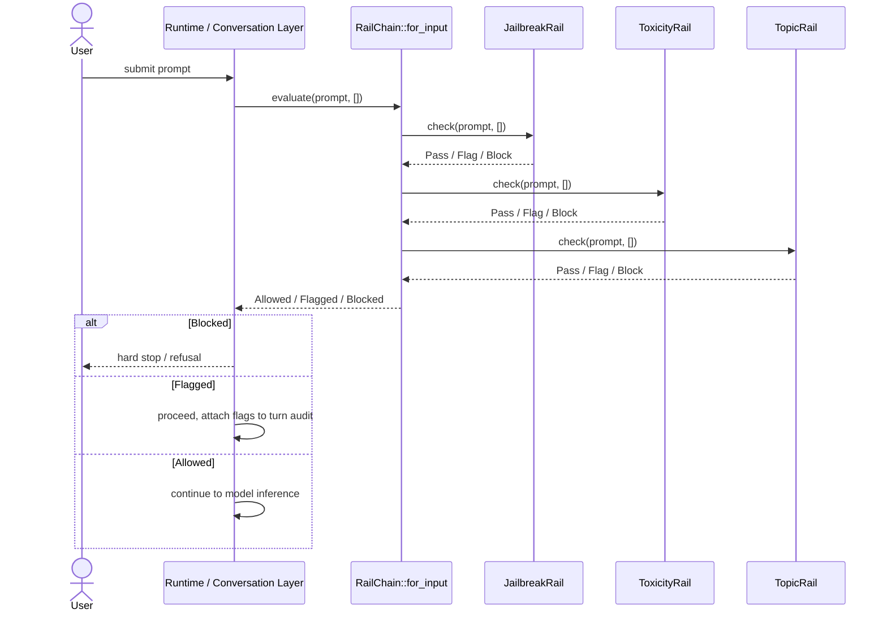

### Output Path: Inspecting the Model Answer

On the output path, the runtime builds `RailChain::for_output` with the retrieved grounding context and the per-turn system prompt. This is the gap where output was previously only compliance-redacted; the rails add toxicity, topic, leak, groundedness, citation, and format checks before the answer reaches the user.

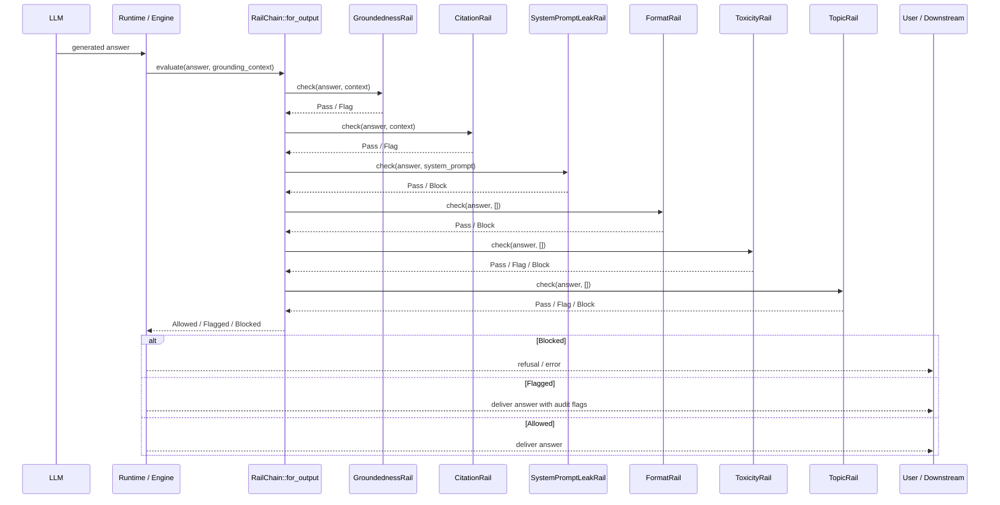

---

## Core Components

### `GuardrailsConfig`

The top-level configuration struct. All rail modes default to `Off`; the whole layer is inactive unless a deployment opts in. It also provides a `recommended()` preset that enables enforcement for safety rails and audit for faithfulness rails.

Key fields:

- `jailbreak`, `groundedness`, `toxicity`, `topic`, `system_prompt_leak`, `format`, `citation` — `RailMode` selectors.
- `groundedness_strict` — enables per-sentence faithfulness and unverifiable-flagging on zero sources.
- `format_spec` — the shape enforced by `FormatRail`.
- `topic_config` — denied/allowed terms for `TopicRail`.
- `toxicity_lexicon` — deployment-supplied harassment/slur terms.

### `RailChain`

The orchestrator. It is cheap to construct per request and exposes:

- `from_config`, `for_input`, `for_output` — constructors.
- `evaluate(text, context)` — runs every rail and returns `Allowed`, `Flagged(Vec<String>)`, or `Blocked(String)`.

### `JailbreakRail`

A scored rail that accumulates weighted signals across categories:

- instruction-override
- persona-escape (e.g., "developer mode", "do anything now")
- roleplay-unrestricted
- prompt-extraction
- obfuscation

It reuses [`ainxt-injection`](safety_guardrails_injection.md)'s evasion assessment for multilingual/compositional-override/homoglyph/base64 detection, avoiding a second English-only substring table.

### `GroundednessRail`

Checks that an answer is supported by grounding context. The deterministic baseline combines:

1. Content-token overlap ratio.
2. Unsupported numeric/date/amount detection (classic hallucination pattern).
3. Optional per-sentence faithfulness when `strict()` is enabled.
4. Optional `unverifiable` flag when no sources are retrieved and `flag_unverifiable()` is enabled.

A production `FaithfulnessJudge` can replace lexical overlap with an NLI/entailment score.

### `CitationRail`

Distinct from `GroundednessRail`: instead of asking "is this claim supported by *any* source?", it asks "does the *specifically cited* source support the sentence that cites it?". It parses inline `[n]` markers, strips them from the claim text, and scores support against the union of the cited sources. It catches wrong-citation and fabricated-citation failures.

### `ToxicityRail`

Ships built-in structural threat/self-harm/violence detection without hardcoding slurs. It accepts a deployment-supplied `toxicity_lexicon` so sensitive wordlists stay out of the OSS tree. An optional `TextClassifier` can raise the detection floor.

### `TopicRail`

Fully config-driven scope enforcement. It can:

- Block or flag `denied_terms` (case-insensitive substring).
- Flag answers that do not mention any `allowed_topics` when that list is non-empty.

### `SystemPromptLeakRail`

Output-side rail that detects the assistant regurgitating its own instructions. It computes the fraction of the system prompt's word n-grams that appear verbatim in the output. Default n-gram size is 5; default block threshold is 15% overlap.

### `FormatRail`

Deterministic companion to constrained/grammar decoding. It validates the answer against a `FormatSpec`:

- `Any` — no-op.
- `NonEmpty` — trimmed text must not be empty.
- `Json { required_keys }` — must parse as JSON and contain required keys.
- `OneOf { values, ignore_case }` — closed-vocabulary label check.
- `MaxChars { limit }` — verbosity/payload-size bound.

---

## Process Flows

### Scored Rail Decision (Jailbreak / Toxicity)

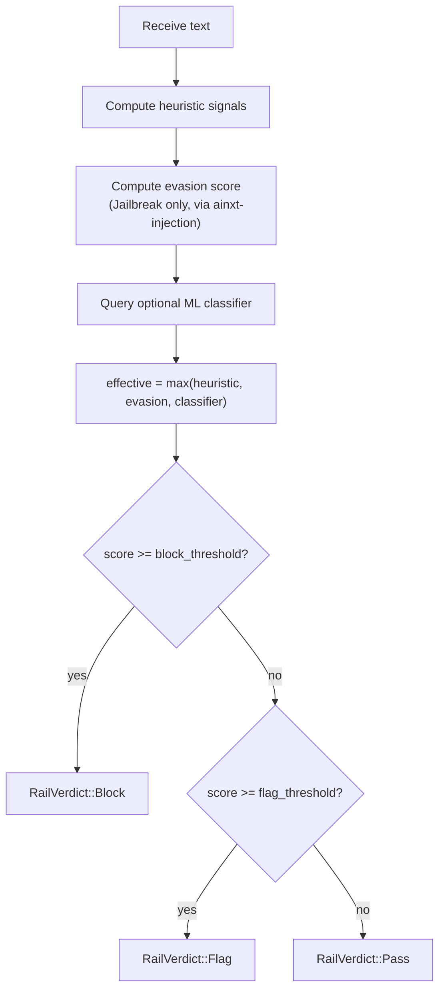

### Groundedness Decision

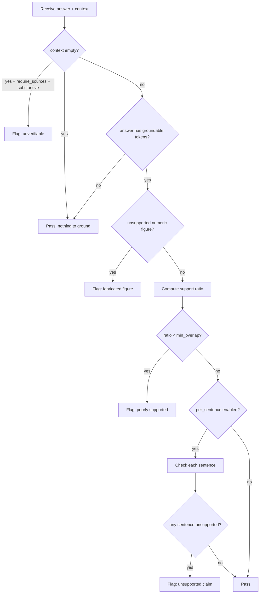

### Citation Faithfulness Decision

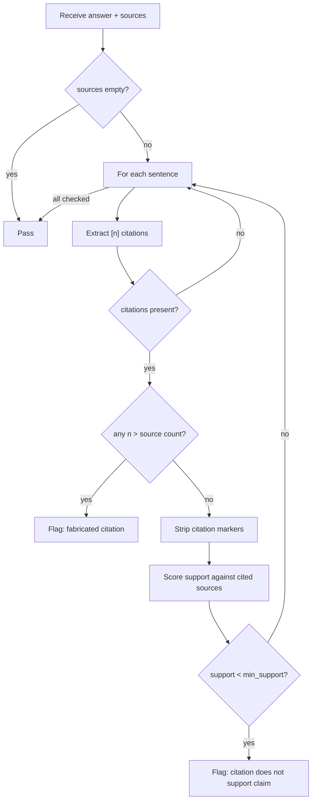

---

## Dependencies and System Fit

### Within `safety_guardrails`

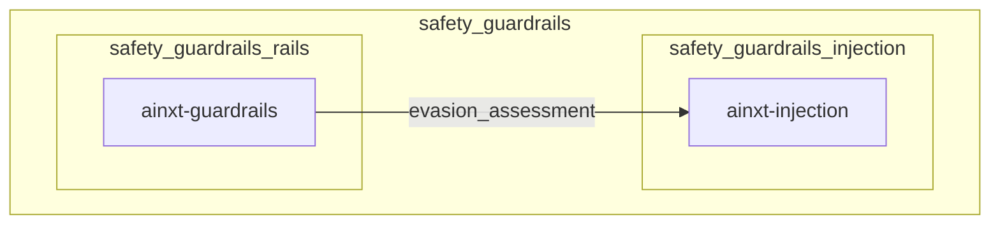

The rails module depends on [`safety_guardrails_injection`](safety_guardrails_injection.md) for evasion-layer detection in `JailbreakRail`. See that module's documentation for details on injection detection, egress scanning, retrieval defense, and quarantine.

### Within `ai_engine`

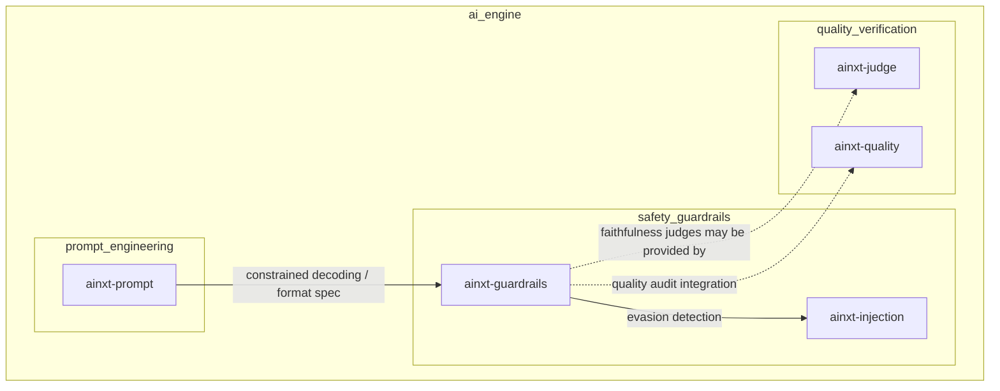

`FormatRail` acts as a runtime companion to the constrained-decoding work in [`prompt_engineering`](prompt_engineering.md). Faithfulness judges may be supplied by the broader judging infrastructure in [`quality_verification`](quality_verification.md).

### Runtime Integration

The rails are consumed by the runtime and conversation layers (e.g., `ainxt-runtime`, `ainxt-convo`, `ainxt-runtimed`) which:

1. Load `GuardrailsConfig` from deployment config.
2. Build `RailChain::for_input` to inspect incoming prompts.
3. Build `RailChain::for_output` with retrieved context and system prompt to inspect model answers.
4. Surface `GuardrailOutcome` to the user and to the audit/event log.

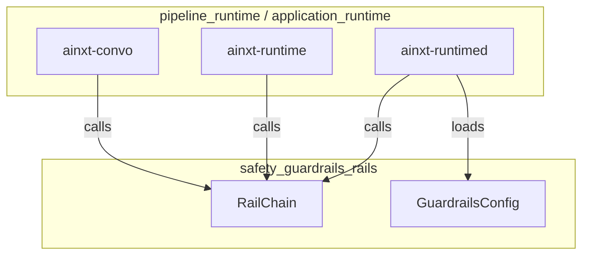

---

## Configuration Examples

### Minimal: all rails off

```toml
[guardrails]
```

### Recommended preset (safety enforce, faithfulness audit)

```toml
[guardrails]
jailbreak = "enforce"
groundedness = "audit"
toxicity = "enforce"
system_prompt_leak = "enforce"
citation = "audit"
```

### Strict groundedness with topic and format enforcement

```toml
[guardrails]
groundedness = "audit"
groundedness_strict = true
topic = "enforce"
format = "enforce"

[guardrails.topic_config]
denied_terms = ["competitor-a", "competitor-b"]
allowed_topics = ["our-product"]
block_denied = true

[guardrails.format_spec]
kind = "json"
required_keys = ["answer", "confidence"]
```

---

## Key Design Decisions

1. **Default off** — avoids double-processing during Python-gateway coexistence; deployment opt-in.
2. **Deterministic floor + ML ceiling** — built-in heuristics always run; optional classifiers/judges can only raise scores, never lower them.
3. **Redact-don't-block for quality rails** — groundedness and citation flag rather than block, so hallucinations are visible in audit logs without silently dropping valid answers.
4. **No slurs in source** — toxicity uses structural patterns; sensitive lexicons come from deployment config.
5. **Reuse over duplication** — jailbreak evasion detection delegates to `ainxt-injection` rather than maintaining a second table.
6. **Input/output separation** — `for_input` and `for_output` ensure rails run only where semantically appropriate.

---

## Related Documentation

- [`safety_guardrails_injection`](safety_guardrails_injection.md) — injection detection, egress scanning, retrieval defense, and quarantine; provides the evasion assessment used by `JailbreakRail`.
- [`prompt_engineering`](prompt_engineering.md) — constrained decoding, structured output, and prompt-layer controls; `FormatRail` is the runtime backstop for format specs.
- [`quality_verification`](quality_verification.md) — judging, quality assessment, and synthesis verification; may supply `FaithfulnessJudge` implementations.
- [`knowledge_retrieval`](knowledge_retrieval.md) — retrieval and context assembly; produces the grounding context consumed by `GroundednessRail` and `CitationRail`.
