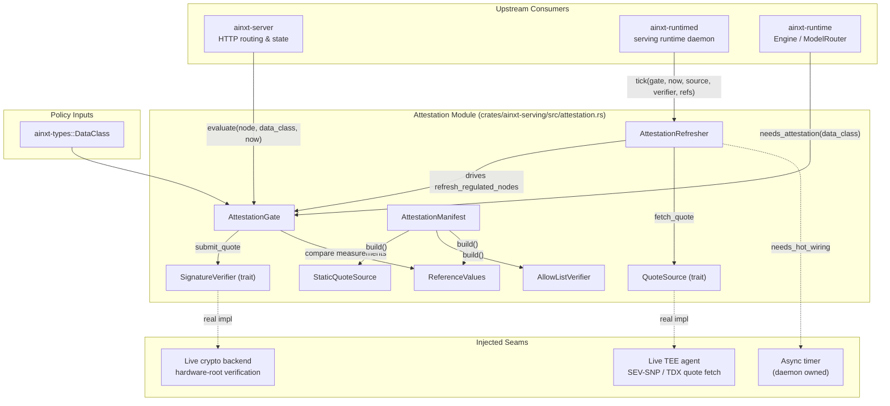
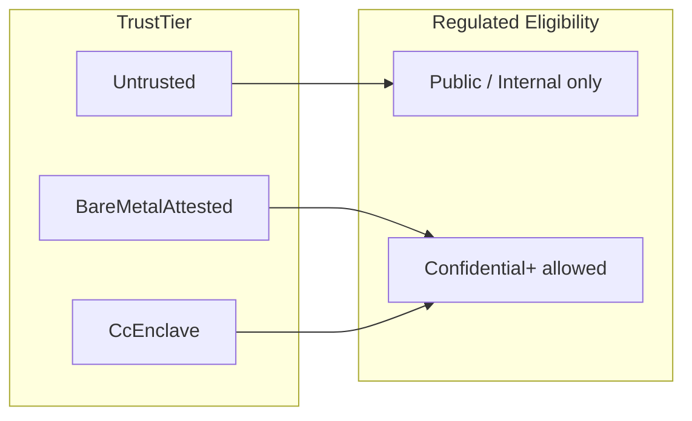
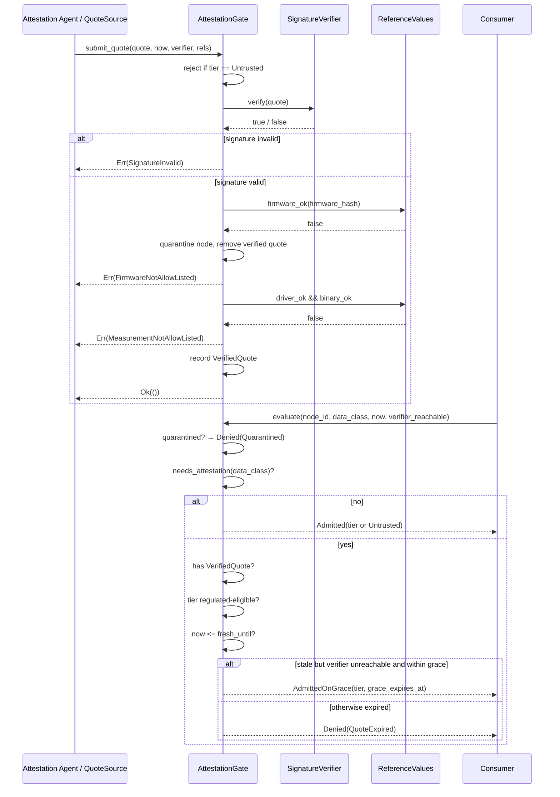
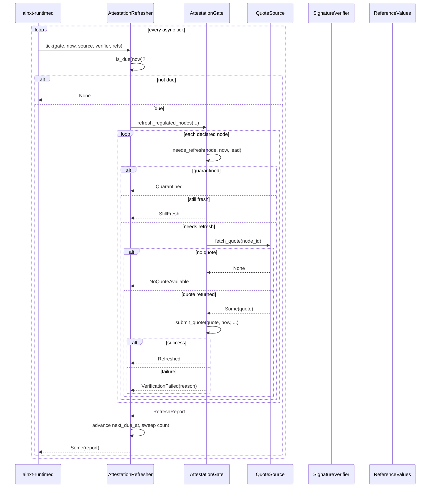
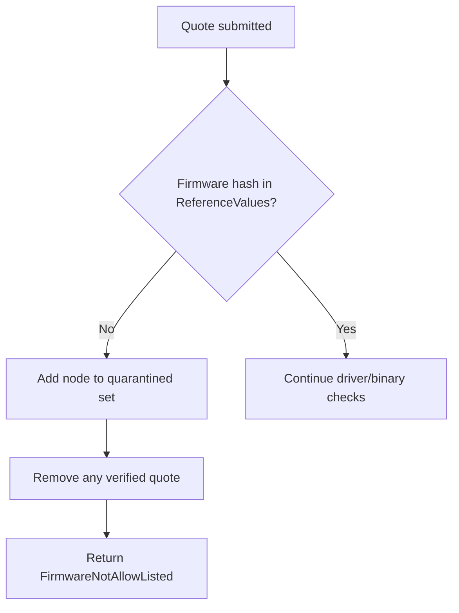
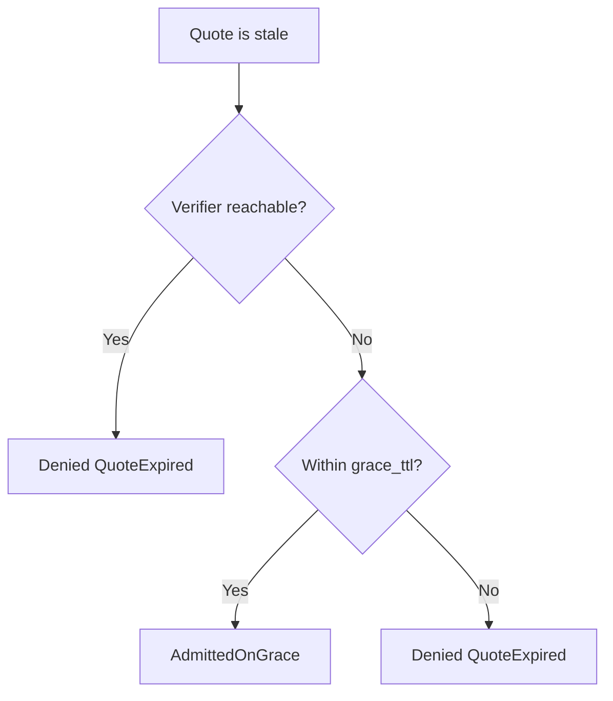

# Attestation Module

The **Attestation** module provides a deterministic, offline-testable node-level hardware attestation gate for the serving infrastructure. It sits underneath the model-router identity gate and decides whether a physical GPU node is trusted enough to receive regulated (confidential or higher) data during inference. The module is intentionally pure: it contains no clock, no crypto library, and no network code. All non-deterministic operations (hardware-root signature verification, live TEE quote acquisition, async timers) are modeled as injected seams so that the admission logic, refresh scheduling, and quarantine behavior can be exhaustively tested without real hardware.

For the relationship between this gate and the rest of serving admission, see [server_serving](server_serving.md). For the identity and workload-credential primitives that complement hardware attestation, see [identity](identity.md). For the data-classification policy that drives admission decisions, see [security_config_identity](security_config_identity.md).

---

## Purpose and Core Functionality

During inference, plaintext prompts, activations, and KV-cache state reside in GPU memory. By default that memory is visible to the hypervisor or operator, so merely loading an in-house model does not eliminate exposure. The attestation gate closes that gap by enforcing that regulated data is only placed on nodes whose measured boot state is:

1. **Signed** by a trusted hardware root (via the [`SignatureVerifier`](attestation.md#signature-verifier) seam).
2. **Allow-listed** against git-native golden reference values for firmware, driver, and serving binary.
3. **Fresh** within a bounded TTL, with a short grace window only when the verifier is unreachable.
4. **Not quarantined** due to a firmware-provenance failure.

The module also provides a periodic refresh driver ([`AttestationRefresher`](attestation.md#attestationrefresher)) that re-attests declared regulated nodes on a cadence, so a fleet does not silently become un-attested after boot.

---

## Architecture Overview



The architecture separates **policy** (what measurements and trust tiers are acceptable), **verification** (signature checking), **quote acquisition** (live TEE interaction), and **scheduling** (when to re-attest). Each boundary is an explicit seam so the core gate logic remains deterministic.

---

## Trust Model and Trust Tiers



| Tier | Description | Regulated eligible? |
|------|-------------|---------------------|
| `Untrusted` | Generic burst/cloud capacity, no attestation. | No |
| `BareMetalAttested` | NPCI-owned physical hardware, measured boot + TPM-backed quote, no hypervisor to trust. | Yes |
| `CcEnclave` | GPU confidential-computing mode with hardware memory encryption and hypervisor isolation. | Yes |

A node claiming `Untrusted` cannot present an attested quote at all; `submit_quote` rejects it with [`SubmitError::UntrustedTierQuote`](attestation.md#errors-and-verdicts).

---

## Core Components

### Measurements and Quote

- [`Measurements`](attestation.md#measurements) — the measured state of a node: `firmware_hash`, `driver_version`, `binary_hash`.
- [`AttestationQuote`](attestation.md#attestationquote) — a signed statement from a node's attestation agent containing `node_id`, `tier`, `measurements`, and a detached `signature`.

### Reference Values

[`ReferenceValues`](attestation.md#referencevalues) holds the git-native golden allow-list of approved firmware hashes, driver versions, and binary hashes. Verification requires **all three** measurements to match. A quote with a valid signature but a non-allow-listed measurement is rejected, which catches authorized-but-outdated downgrades.

### Signature Verifier

[`SignatureVerifier`](attestation.md#signatureverifier) is the seam where real hardware-root crypto is injected. The module ships [`AllowListVerifier`](attestation.md#allowlistverifier), a deterministic reference implementation that accepts a pre-configured set of signatures. It is suitable for tests and for offline deployments that pre-share quotes.

### Attestation Gate

[`AttestationGate`](attestation.md#attestationgate) is the central admission decision engine. It stores:

- the last [`VerifiedQuote`](attestation.md#verifiedquote) per node,
- the set of quarantined nodes,
- the [`AttestationConfig`](attestation.md#attestationconfig) (`quote_ttl`, `grace_ttl`).

It answers `evaluate(node_id, data_class, now, verifier_reachable)` with a [`NodeVerdict`](attestation.md#nodeverdict):

- `Admitted` — fresh quote or non-regulated class.
- `AdmittedOnGrace` — stale quote but verifier is unreachable and still within the bounded grace window.
- `Denied` — with a [`DenyReason`](attestation.md#denyreason) such as `Quarantined`, `UntrustedTier`, `NoValidQuote`, or `QuoteExpired`.

### Attestation Manifest

[`AttestationManifest`](attestation.md#attestationmanifest) is a declarative, serde-deserializable configuration object that replaces hand-written builder calls. It contains the reference-value allow-list, accepted signatures, and pre-shared static quotes. Calling `build()` materializes the three offline seams (`StaticQuoteSource`, `AllowListVerifier`, `ReferenceValues`) that the refresh loop consumes.

### Quote Source

[`QuoteSource`](attestation.md#quotesource) is the live-TEE acquisition seam. A real implementation asks the node's confidential-compute stack for a fresh signed quote. [`StaticQuoteSource`](attestation.md#staticquotesource) is the deterministic offline reference that maps `node_id → AttestationQuote`.

### Refresh Loop and Driver

- [`refresh_regulated_nodes`](attestation.md#refresh_regulated_nodes) performs one sweep over a declared node pool, fetching fresh quotes for nodes that need refresh and driving them through the gate.
- [`RefreshReport`](attestation.md#refreshreport) and [`RefreshOutcome`](attestation.md#refreshoutcome) record what happened to each node on a sweep.
- [`AttestationRefresher`](attestation.md#attestationrefresher) is the stateful periodic driver that owns the declared pool, a [`RefreshConfig`](attestation.md#refreshconfig) cadence, and the next-due cursor. Its `tick(gate, now, ...)` method runs a sweep only when due.

---

## Data Flows

### Quote Submission and Evaluation



### Periodic Refresh Sweep



---

## Process Flows

### Firmware-Provenance Quarantine

An unrecognized firmware hash is treated as a whole-node integrity failure. The node is added to the `quarantined` set, its verified quote is removed, and it is denied for **all** data classes until an operator calls `clear_quarantine` after out-of-band review.



### Grace-TTL Behavior

The gate is fail-closed. A quote past its normal `quote_ttl` is only admitted on grace when the verifier is unreachable **and** the current time is still within `grace_ttl`. Once the grace window expires, the node is denied even if the verifier remains down.



---

## Integration with the System

The attestation module is one submodule of the [serving_infrastructure](serving_infrastructure.md) layer, which is part of the larger [server_serving](server_serving.md) module. It consumes:

- [`DataClass`](security_config_identity.md) from [security_config_identity](security_config_identity.md) to decide which data classes require attestation.
- Configuration from the deployment manifest via [`AttestationManifest`](attestation.md#attestationmanifest).

It is consumed by:

- [`ainxt-server`](server_serving_core.md) HTTP handlers that gate regulated requests.
- [`ainxt-runtimed`](runtime_engine.md) which owns the async timer and live `QuoteSource`/`SignatureVerifier` implementations.
- [`ainxt-runtime`](core_engine.md) `Engine` and `ModelRouter`, which may call `needs_attestation` or `evaluate` before routing a turn to a node.

For the broader identity, delegation, and workload-credential system that works alongside hardware attestation, see [identity](identity.md). For the governance and compliance controls that authorize which models and roles may touch regulated data, see [governance_compliance](governance_compliance.md).

---

## Configuration and Deployment

A deployment that wants to attest a fixed offline fleet can provide an `AttestationManifest` in its git-native config:

```toml
[attestation]
approved_firmware = ["fw-1"]
approved_drivers = ["drv-1"]
approved_binaries = ["bin-1"]
accepted_signatures = ["sig-good"]

[[attestation.quotes]]
node_id = "n1"
tier = "cc-enclave"

[attestation.quotes.measurements]
firmware_hash = "fw-1"
driver_version = "drv-1"
binary_hash = "bin-1"

signature = "sig-good"
```

At startup the loader calls `manifest.build()` to obtain the three seams. A manifest with no quotes and no accepted signatures is inert by construction, equivalent to the shipped default and safe for air-gapped deployments.

---

## Security Properties

| Property | Mechanism |
|----------|-----------|
| **Fail-closed admission** | `evaluate` denies regulated traffic for any stale, missing, or non-eligible quote. |
| **Downgrade protection** | Reference-value allow-listing rejects validly signed but non-approved firmware/driver/binary versions. |
| **Whole-node quarantine** | Unrecognized firmware quarantines the node from all classes, pending manual review. |
| **Bounded staleness** | `quote_ttl` + `grace_ttl` cap how long a stale quote can be used. |
| **Deterministic core** | All non-determinism (crypto, TEE fetch, timer) lives in injected seams. |
| **No auto-quarantine-clear** | A fresh quote does not silently clear quarantine; `clear_quarantine` requires explicit operator action. |

---

## Testing

The module includes an extensive inline test suite covering:

- Fresh attested nodes admitting regulated traffic.
- Unattested nodes serving public/internal but denied regulated.
- Forged-signature rejection.
- Validly signed but downgraded firmware quarantining the whole node.
- Downgraded driver/binary denying regulated without full quarantine.
- Quarantine not auto-cleared by a later good quote.
- Untrusted-tier quote rejection.
- Stale-quote behavior with verifier reachable vs. down.
- Grace-TTL boundaries.
- Re-attestation refreshing the freshness window.

Because the core logic is pure, these tests run without hardware, crypto libraries, or network access.

---

## Related Modules

- [server_serving](server_serving.md) — HTTP server and top-level serving state that uses the attestation gate.
- [serving_infrastructure](serving_infrastructure.md) — parent module covering admission, scheduling, placement, health, caching, and attestation.
- [core_engine](core_engine.md) / [runtime_engine](runtime_engine.md) — the runtime engine and daemon that wire the attestation seams to live infrastructure.
- [identity](identity.md) — identity authority, workload credentials, and delegation that complement hardware attestation.
- [security_config_identity](security_config_identity.md) — `DataClass` and principal types that drive admission decisions.
- [governance_compliance](governance_compliance.md) — governance, compliance, and responsible-AI controls that authorize regulated workloads.
