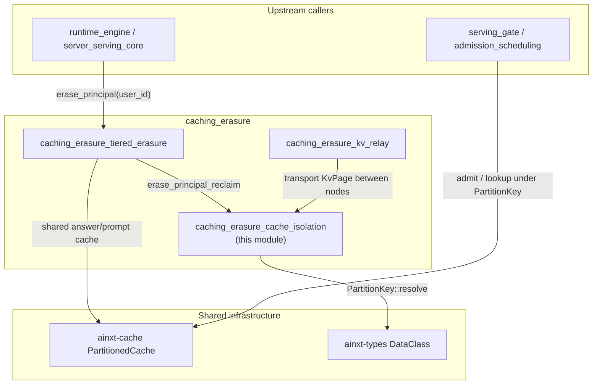
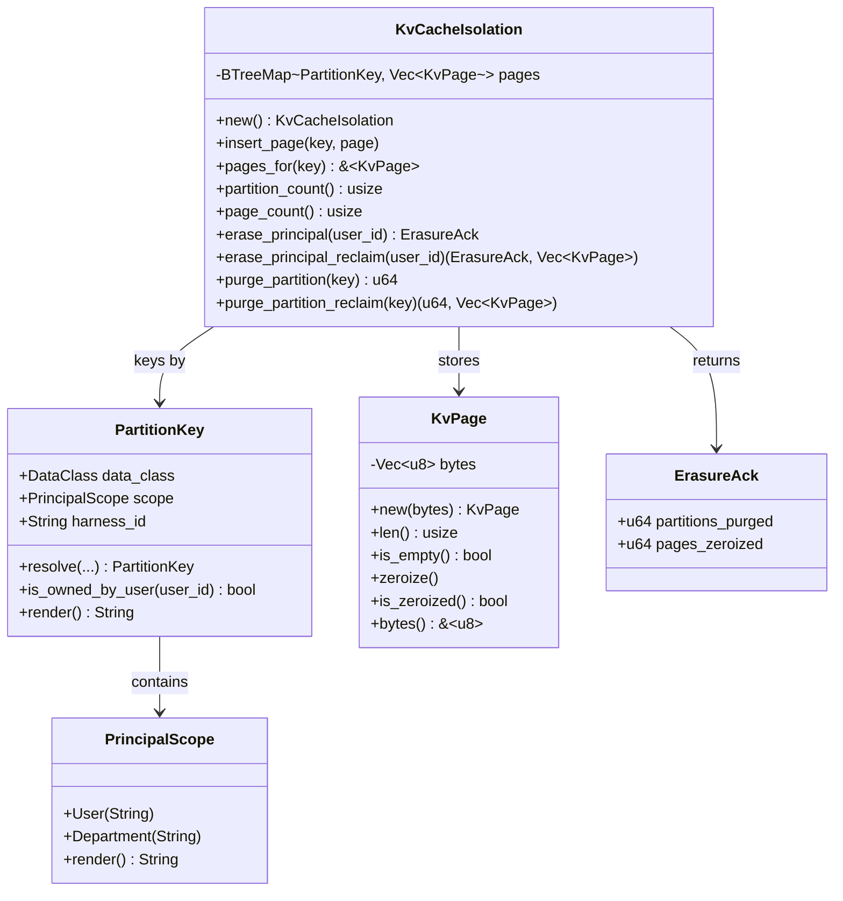
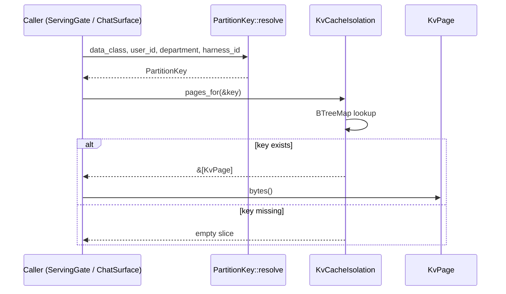
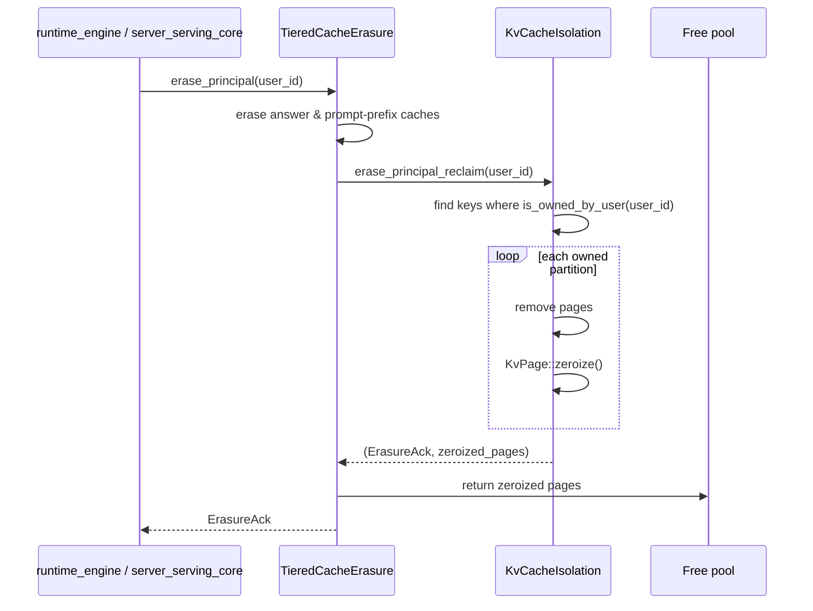
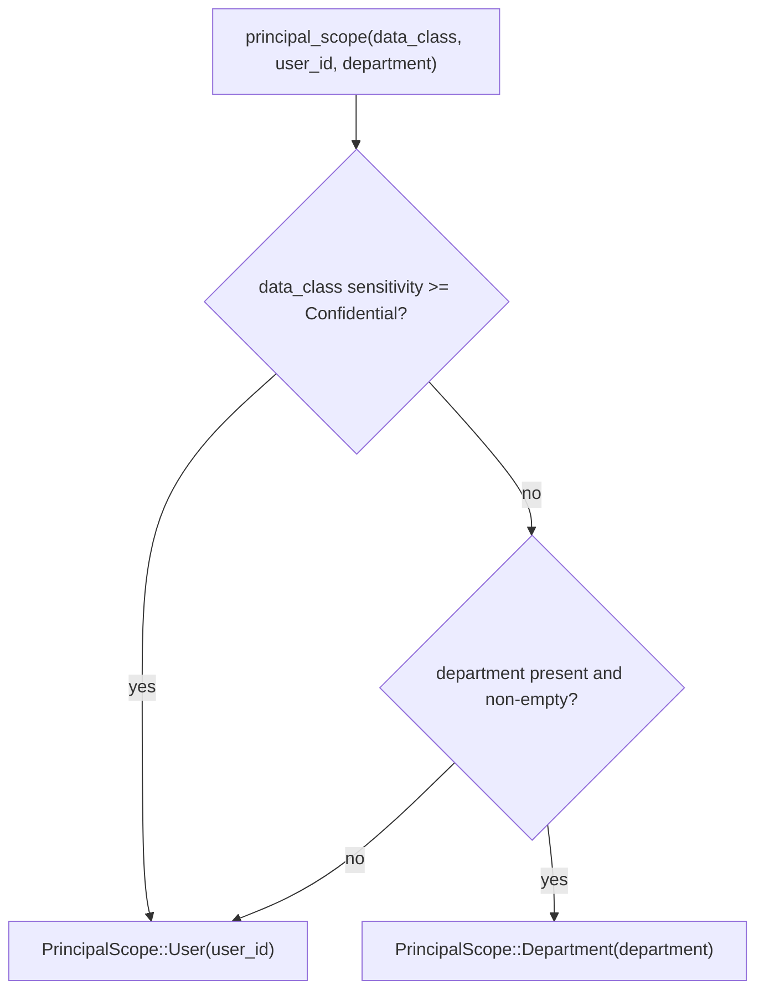

# caching_erasure_cache_isolation

## Brief Introduction

`caching_erasure_cache_isolation` is the lowest-level building block of the serving tier's cache privacy controls. It defines the **partition key** that keeps inference caches separated by principal, data class, and harness, and it implements a **deterministic, in-memory KV-cache model** where every page is strictly scoped to one partition and is **zeroized before reuse**.

The module's job is to make three guarantees that an earlier audit found missing from `ainxt-serving`:

1. **Uniform partition boundary.** The same `{data_class, principal_scope, harness_id}` key is used by the coarse answer cache, the prompt-prefix cache, and the KV cache, so byte-identical prompts from different principals can never share an entry.
2. **Data-class-aware scope granularity.** Sensitive data classes (`confidential`, `regulated-payment`, `pii`) are isolated per-user; less sensitive classes (`internal`, `public`) may share within a department, but an unknown department always falls back to per-user isolation.
3. **Erasure-time zeroization.** On a DPDP right-to-erasure event, every KV page belonging to the principal is overwritten with zeros *before* its slot is returned to the free pool, bounding residue lifetime even if the confidential-computing stack is later compromised.

The implementation is intentionally deterministic: no clock, no RNG, and no real GPU. Tensors are modeled as opaque byte vectors so that the zeroization discipline can be asserted byte-for-byte in unit tests.

---

## Comprehensive Documentation

### 1. Module Position and Responsibilities

`caching_erasure_cache_isolation` sits inside the `caching_erasure` submodule of `serving_infrastructure`, which is part of the larger `server_serving` area under `pipeline_runtime`.

```text
pipeline_runtime
└── server_serving
    └── serving_infrastructure
        └── caching_erasure
            ├── caching_erasure_cache_isolation   <-- this module
            ├── caching_erasure_tiered_erasure
            └── caching_erasure_kv_relay
```

Its siblings handle the orchestration layer:

- [`caching_erasure_tiered_erasure`](caching_erasure_tiered_erasure.md) owns `TieredCacheErasure`, which coordinates erasure across the answer cache, prompt-prefix cache, and KV cache. It holds the shared `Arc<Mutex<PartitionedCache>>` that the served `ChatSurface` actually writes to, and it calls `KvCacheIsolation::erase_principal_reclaim` to collect zeroized KV pages back into the free pool.
- [`caching_erasure_kv_relay`](caching_erasure_kv_relay.md) owns `KvRelay`, which moves KV pages between decode nodes during disaggregated serving. The relay is the transport seam; `cache_isolation` is the residency-and-zeroization seam.

For the broader admission, scheduling, and placement context that decides *when* a request reaches the cache, see [`admission_scheduling`](admission_scheduling.md), [`placement_lifecycle`](placement_lifecycle.md), and [`attestation`](attestation.md).

### 2. Core Concepts

#### 2.1 The Three Cache Tiers

The serving stack keeps three kinds of cached state around inference:

| Tier | What it stores | Typical owner |
|------|----------------|---------------|
| Coarse answer cache | Final response embeddings / answers | [`ainxt-cache`](core_interaction.md) `PartitionedCache` |
| Prompt-prefix cache | Embeddings and token prefixes for common system prompts | `PartitionedCache` |
| KV cache | Raw attention key/value tensors for in-flight and recently completed sequences | `KvCacheIsolation` |

All three must use the **same partition key**. If any tier keys only on content hash or clearance, two principals with the same prompt can produce a hit/miss timing signal that leaks the other's cache residency. This module encodes the canonical key so the tiers cannot disagree.

#### 2.2 `PrincipalScope` — Granularity Rule

```rust
pub enum PrincipalScope {
    User(String),
    Department(String),
}
```

`PrincipalScope` is not a global "per-user" rule. It is derived from the data class:

- `confidential`, `regulated-payment`, `pii` → `User(...)`
- `internal`, `public` with a known department → `Department(...)`
- `internal`, `public` with no department → `User(...)` (fallback, never widens)

The fallback rule is critical: missing metadata must only *narrow* sharing, never broaden it. This closes the SRV-06 leak where two users in different departments at the same clearance shared an `internal`-class entry because the key omitted department.

#### 2.3 `PartitionKey` — The Canonical Boundary

```rust
pub struct PartitionKey {
    pub data_class: DataClass,
    pub scope: PrincipalScope,
    pub harness_id: String,
}
```

`PartitionKey` is `Ord` so it can key a `BTreeMap`. Two keys that differ in any field are structurally distinct; there is no cross-partition read path. The `render()` method produces an opaque string such as `confidential|user:alice|chat` that the answer/prompt-prefix tiers can use directly, ensuring all three tiers agree on the boundary.

`harness_id` separates different workloads (for example, `chat` vs. `sdlc`) so that a shared department cache in one harness does not leak into another.

#### 2.4 `KvPage` — Residue Model

```rust
pub struct KvPage {
    bytes: Vec<u8>,
}
```

A `KvPage` is one fixed-size block of KV-cache memory. The tensor bytes are opaque; what matters is that the page can be:

- `zeroize()` — overwrite every byte with zero, idempotently.
- `is_zeroized()` — assert that every byte is zero.
- `bytes()` — expose a read-only view for tests or spill transport.

Modeling GPU memory as a `Vec<u8>` makes the zeroize-before-free ordering unit-testable without requiring a real GPU.

#### 2.5 `KvCacheIsolation` — Residency + Erasure

```rust
pub struct KvCacheIsolation {
    pages: BTreeMap<PartitionKey, Vec<KvPage>>,
}
```

`KvCacheIsolation` is the in-memory residency tracker. It provides:

- `insert_page(key, page)` — admit a page into exactly one partition.
- `pages_for(key)` — read only the pages for that partition.
- `erase_principal(user_id)` / `erase_principal_reclaim(user_id)` — DPDP right-to-erasure.
- `purge_partition(key)` / `purge_partition_reclaim(key)` — bound page lifetime on session end.

The `_reclaim` variants return the zeroized pages so that `TieredCacheErasure` can hand them back to a real free pool with residue provably removed.

### 3. Architecture



### 4. Component Relationships



### 5. Data Flow — Normal Lookup



### 6. Data Flow — DPDP Erasure



### 7. Process Flow — Scope Resolution



### 8. Key Design Decisions

| Decision | Rationale |
|----------|-----------|
| `BTreeMap` instead of `HashMap` | `PartitionKey` is `Ord`; deterministic ordering makes tests stable and erasure walks predictable. |
| Opaque `Vec<u8>` for tensors | Keeps the module GPU-agnostic and lets unit tests assert byte-level zeroization. |
| `_reclaim` variants | Allow `TieredCacheErasure` to return zeroized pages to a real free pool while keeping the simple `erase_principal` API for callers that only need an ack. |
| Department fallback to per-user | Missing metadata must never widen the sharing boundary; this is the SRV-06 fix. |
| `harness_id` in the key | Prevents cache leakage across different workloads even when the same department is involved. |

### 9. Security Guarantees and Invariants

1. **No cross-partition read.** `pages_for` can only return pages whose `PartitionKey` exactly matches the query.
2. **No content-hash-only key.** The partition key always includes data class, principal scope, and harness; identical prompts from different users do not collide.
3. **Zeroize-before-free.** Every page removed by `erase_principal` or `purge_partition` is overwritten with zeros while still owned by the module.
4. **Department-scoped partitions survive individual erasure.** A single user's DPDP request does not wipe a department-shared cache, because the partition is not owned by that user.
5. **Deterministic behavior.** No clock, RNG, or external state; behavior is reproducible in tests.

### 10. Testing Strategy

The module includes unit tests that cover:

- Scope granularity for each `DataClass`.
- Fallback behavior when department is missing or empty.
- Partition-key collision rules (the SRV-06 scenario).
- Stable and distinguishing `render()` output.
- Byte-level `KvPage::zeroize` correctness.
- `erase_principal` purging only the target user's partitions.
- Department-scoped partitions surviving individual erasure.
- No-op erasure for unknown principals.
- `purge_partition` zeroization on session end.

### 11. Integration with the Rest of the System

- **Data class source:** `DataClass` comes from [`ainxt-types`](security_config_identity.md). The sensitivity ordering is defined there.
- **Answer/prompt-prefix cache:** [`ainxt-cache`](core_interaction.md) `PartitionedCache` uses the rendered `PartitionKey` as its partition token.
- **Tiered erasure orchestration:** [`caching_erasure_tiered_erasure`](caching_erasure_tiered_erasure.md) drives the full erasure cascade and holds the shared answer cache.
- **KV transport:** [`caching_erasure_kv_relay`](caching_erasure_kv_relay.md) moves pages between decode nodes; pages in transit are still `KvPage` values and must be zeroized by the receiving node's isolation layer on eviction.
- **Serving admission:** [`admission_scheduling`](admission_scheduling.md) decides which requests reach the cache; it must tag each request with the same `PartitionKey` fields this module uses.
- **Attestation:** [`attestation`](attestation.md) provides the confidential-computing guarantee that makes residue unreadable *during* residency; zeroization bounds residue lifetime *after* eviction as defense-in-depth.

### 12. When to Modify This Module

Modify `cache_isolation.rs` when:

- A new `DataClass` is added and its cache isolation granularity must be defined.
- The partition key needs an additional dimension (for example, a new workload boundary).
- The zeroization contract changes (for example, moving from byte-zero to a cryptographic wipe).
- A new cache tier needs to adopt the canonical partition key.

Do **not** modify this module for higher-level concerns such as:

- When to trigger erasure — that belongs to [`caching_erasure_tiered_erasure`](caching_erasure_tiered_erasure.md) and the lifecycle/DSAR modules.
- How to route KV pages between nodes — that belongs to [`caching_erasure_kv_relay`](caching_erasure_kv_relay.md).
- How to admit or shed requests — that belongs to [`admission_scheduling`](admission_scheduling.md).
