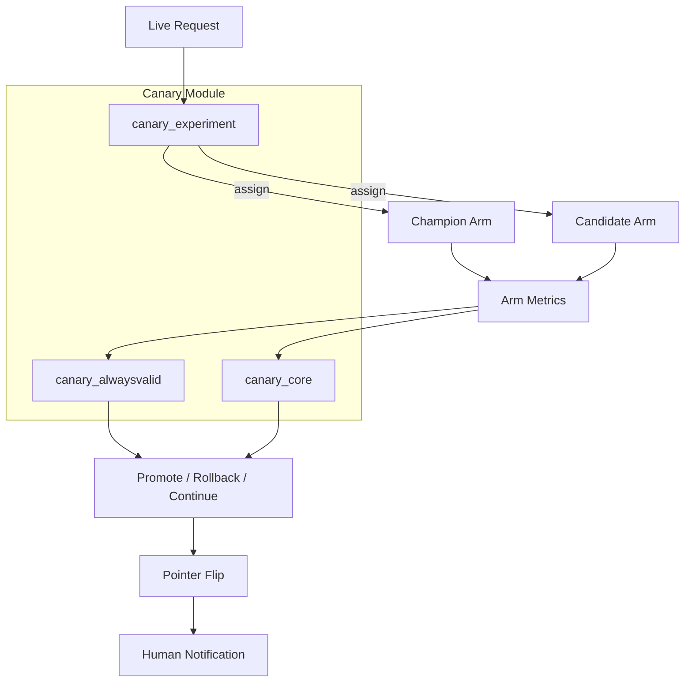
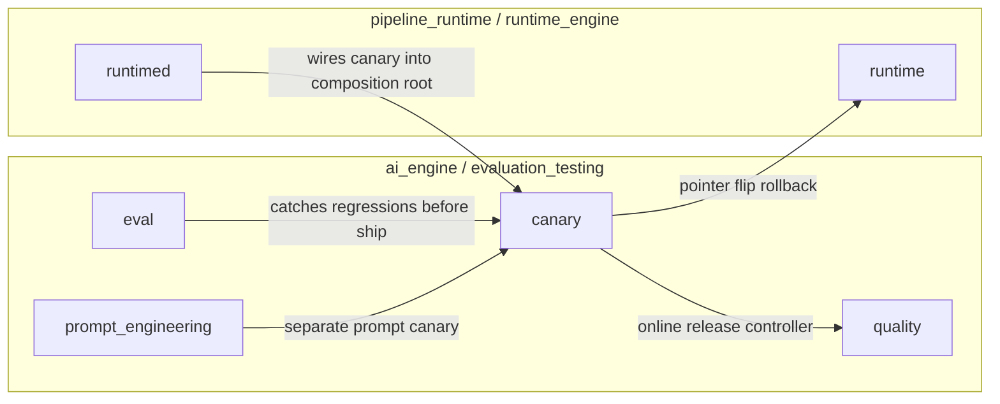
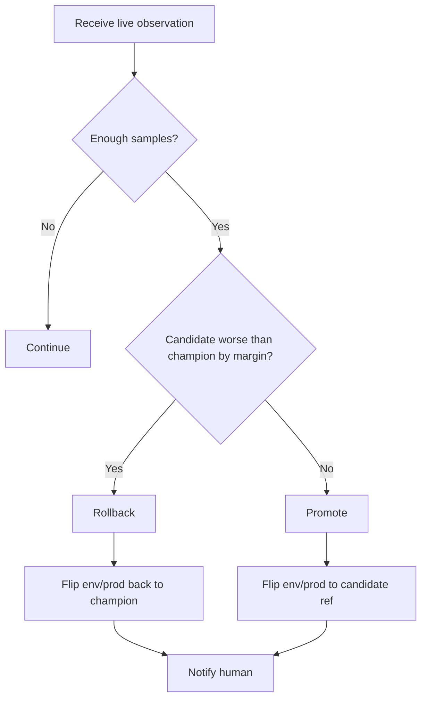

# Canary Module

## Introduction

The `ainxt-canary` crate provides **online canary analysis and automatic rollback** for production deployments of models, prompts, and retrieval configurations. While the [eval](eval.md) gate catches regressions before a change ships, the canary module catches regressions that only appear under live traffic by routing a configurable slice of requests to a **candidate** deployment alongside the established **champion**, accumulating per-arm outcomes, and making a **promote / rollback / continue** decision.

The module is deterministic by construction: arm assignment uses a stable hash of the request key (no RNG), and all decisions are pure functions of accumulated counters. This makes canary runs replayable and exhaustively testable without a live system.

For detailed documentation of each sub-module, see [canary_core](canary_core.md), [canary_alwaysvalid](canary_alwaysvalid.md), and [canary_experiment](canary_experiment.md).

## Purpose

- Detect production regressions early by comparing candidate and champion deployments on real traffic.
- Provide statistically sound decision primitives, including fixed-sample and anytime-valid (confidence-sequence) methods.
- Enable git-ref-pinned traffic splits and instant pointer-flip rollbacks.
- Surface cold-start / underpowered gates loudly so operators never mistake an advisory gate for enforced protection.

## Architecture Overview

The module is organized into three sub-modules:

| Sub-module | Responsibility | Key Abstractions |
|---|---|---|
| [canary_core](canary_core.md) | Basic two-arm canary primitives: configuration, deterministic assignment, fixed-sample decision, and arm metrics. | `Canary`, `CanaryConfig`, `ArmMetrics`, `CanaryDecision`, `Arm` |
| [canary_alwaysvalid](canary_alwaysvalid.md) | Anytime-valid (safe-to-peek) canary using asymptotic confidence sequences and Welford's online variance. | `AlwaysValidCanary`, `AlwaysValidConfig`, `RunningStats`, `AvDecision`, `GateMode` |
| [canary_experiment](canary_experiment.md) | Git-ref-pinned traffic splits, multi-arm A/B assignment, and live pointer-flip promotion/rollback. | `TrafficSplit`, `SplitArm`, `PointerController`, `Notifier`, `drive_pointer` |

## Module Relationships

The canary module sits downstream of the [eval](eval.md) gate in the [evaluation_testing](evaluation_testing.md) area of the [ai_engine](ai_engine.md). The real production wiring happens in the composition root under [pipeline_runtime / runtime_engine](pipeline_runtime.md), where:

- `ainxt_quality::OnlineReleaseController` composes `canary_alwaysvalid::AlwaysValidCanary` with `canary_experiment::{TrafficSplit, drive_pointer}` plus a CUSUM drift watch.
- `ainxt_prompt::canary` provides a separate, independently-wired prompt-deployment canary.

## High-Level Functionality

### canary_core

The [canary_core](canary_core.md) sub-module offers a simple, dependency-free two-arm fixed-sample A/B engine. It is suitable for embedders who want deterministic canary behavior without pulling in the statistical machinery of `canary_alwaysvalid` or the pointer-control traits of `canary_experiment`.

### canary_alwaysvalid

The [canary_alwaysvalid](canary_alwaysvalid.md) sub-module implements an **asymptotic confidence sequence** (AsympCS) for online canary monitoring. Unlike fixed-sample tests, confidence sequences are **time-uniform**: operators can watch the metric continuously and stop the moment the sequence crosses a boundary without inflating the false-positive rate. The module also exposes a loud `GateMode` label that distinguishes between an **advisory** cold-start window and an **enforced** gate, and supports synthetic seeding to narrow the cold-start window.

### canary_experiment

The [canary_experiment](canary_experiment.md) sub-module handles **traffic splitting** and **pointer control**. It supports weighted, git-ref-pinned multi-arm A/B splits with deterministic assignment, and provides traits (`PointerController`, `Notifier`) plus a `drive_pointer` function for instant promotion/rollback. Rollback is prioritized over promotion, and humans are notified rather than paged.

## Decision Flow

## Key Design Decisions

1. **Determinism**: No RNG or clock dependence in assignment or decision logic; all choices are pure functions of accumulated counters.
2. **Safe peeking**: The anytime-valid canary uses confidence sequences so continuous monitoring does not inflate false positives.
3. **Cold-start honesty**: `GateMode::Advisory` loudly labels underpowered gates and discloses synthetic seeding.
4. **Git-ref pinning**: Traffic splits route to pinned git refs, and rollbacks flip the `env/prod` pointer instantly and exactly.
5. **Human notification, not paging**: The experiment controller notifies a human on regression rather than paging one.

## See Also

- [canary_core](canary_core.md)
- [canary_alwaysvalid](canary_alwaysvalid.md)
- [canary_experiment](canary_experiment.md)
- [evaluation_testing](evaluation_testing.md)
- [ai_engine](ai_engine.md)
- [pipeline_runtime](pipeline_runtime.md)
