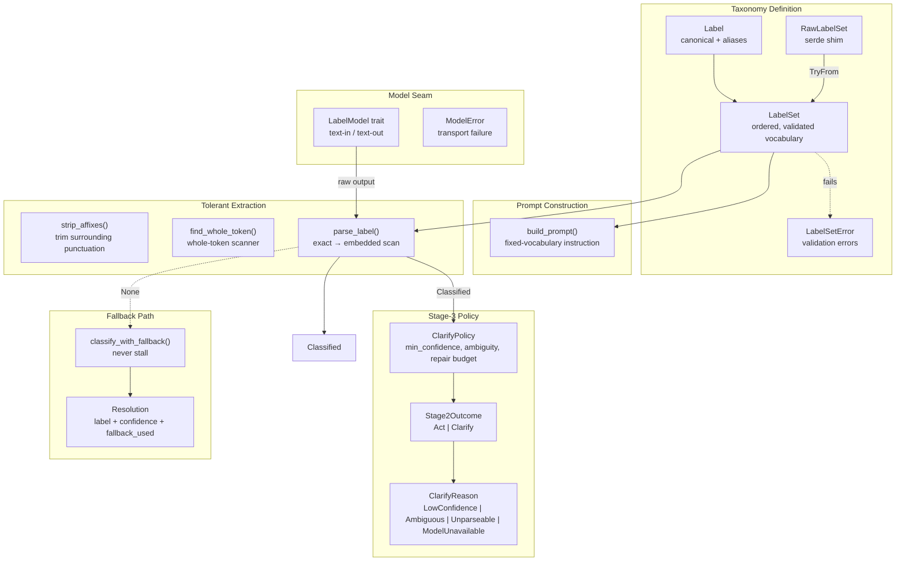
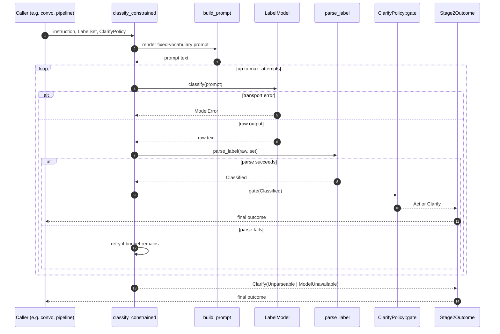
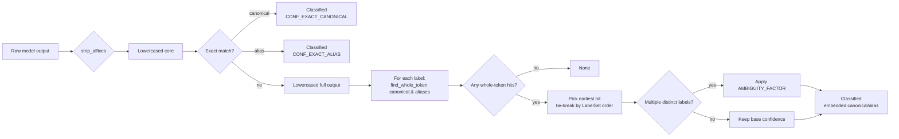
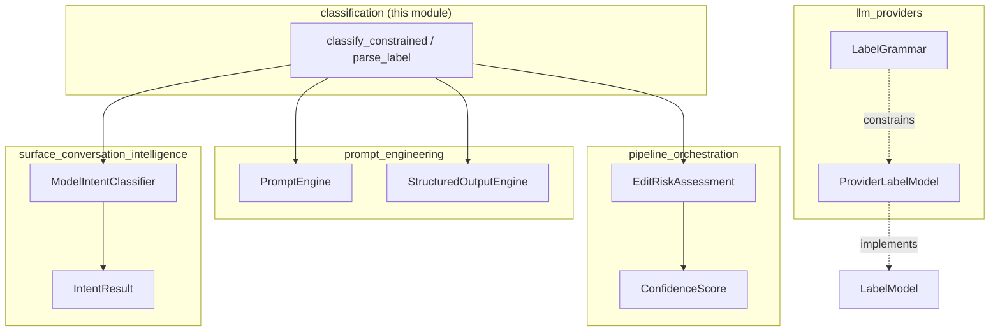
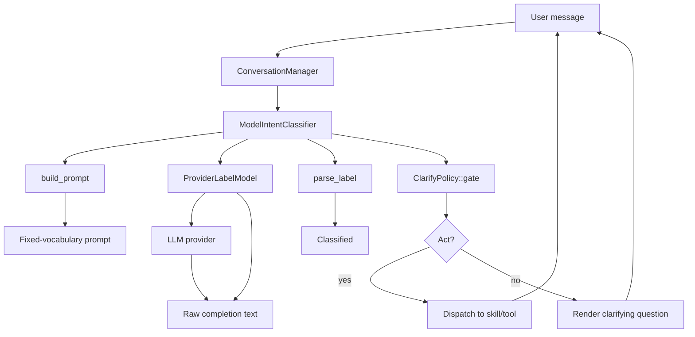
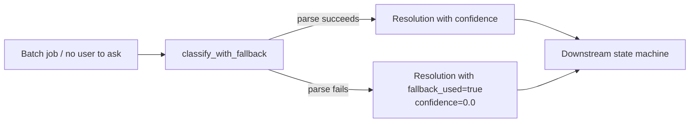

# Classification Module

The **classification module** (`ainxt-classify`) provides a deterministic, model-agnostic label extractor for the AiNxt runtime. It turns raw model output into a resolved canonical label from a fixed vocabulary, with graded confidence and explicit ambiguity detection, so downstream state machines never silently act on a misclassification.

It is the shared primitive behind every fixed-vocabulary decision seam in the system: intent detection, query-complexity tiering, semantic tool selection, and edit-risk classification. The crate deliberately contains no clock, no RNG, no I/O, and no ML runtime — the same `(output, LabelSet)` pair always yields the same result, which makes classification behavior reproducible in tests, forensic replay, and behavioral diffing.

---

## 1. Purpose and Core Functionality

### 1.1 Problem Statement

Weak or self-hosted models do not reliably obey free-form instructions such as "answer with one word." Frontier models support grammar-constrained decoding, but the runtime must behave identically whether or not the transport supports GBNF or JSON-schema enforcement. The classification module solves this by separating two concerns:

1. **Constraint instruction rendering** — `build_prompt` emits a fixed-vocabulary instruction (`Reply with EXACTLY one of: a | b | c`). Where grammar support exists this mirrors the grammar; where it does not, it is the only steering the model receives.
2. **Tolerant parsing** — `parse_label` recovers the intended label from messy prose, and `classify_with_fallback` guarantees the caller always gets *a* label so a state machine never stalls.

### 1.2 Extraction Contract

The parser is intentionally conservative. Every relaxation is graded down in confidence:

| Behavior | Confidence impact |
|----------|-------------------|
| Exact standalone canonical label | `1.0` (`CONF_EXACT_CANONICAL`) |
| Exact standalone alias | `0.9` (`CONF_EXACT_ALIAS`) |
| Canonical label as whole token in prose | `0.75` (`CONF_EMBEDDED_CANONICAL`) |
| Alias as whole token in prose | `0.6` (`CONF_EMBEDDED_ALIAS`) |
| More than one distinct label appears | multiplied by `0.6` (`AMBIGUITY_FACTOR`) |

Key rules:

- **Case-insensitive**: `QA`, `qa`, and `Qa` all resolve to `qa`.
- **Prose/quote/punctuation tolerant**: `The intent is: "QA".` → `qa`.
- **Whole-token only, never substring**: `qa` does **not** match inside `aqua`; `code` does **not** match inside `encode`; `qa_result` does **not** match `qa` because underscore is treated as a word character.
- **First appearance wins**: if several distinct labels appear, the earliest-positioned one is chosen, tie-broken by `LabelSet` declaration order.
- **Ambiguity is surfaced**: a multi-label read still returns a winner but with a lower confidence so the clarify gate can fire.

### 1.3 Public API Surface

| Item | Role |
|------|------|
| `Label` | One allowed outcome: a canonical label plus optional aliases. |
| `LabelSet` | Ordered, validated vocabulary. Guarantees non-empty, unique, trimmed surface forms. |
| `LabelSetError` | Validation failures: empty set, empty canonical/alias, duplicate surface form. |
| `Classified` | Successful parse result: canonical label, confidence, alias flag, ambiguity flag. |
| `Resolution` | Result of `classify_with_fallback`: flattened `Classified` plus `fallback_used`. |
| `ClarifyPolicy` | Stage-3 policy: confidence floor, ambiguity handling, repair budget, fallback-on-failure. |
| `Stage2Outcome` | Full pipeline result: `Act(Classified)` or `Clarify { reason, best }`. |
| `LabelModel` | Object-safe model seam: text-in/text-out classification call. |
| `ModelError` | Transport-level failure from the model seam. |
| `build_prompt` | Render a constrained-decoding instruction for a `LabelSet`. |
| `parse_label` | Extract a label from raw model output. |
| `classify_with_fallback` | Guarantee a label, substituting a fallback on parse failure. |
| `classify_constrained` | Run the full Stage-2 + Stage-3 cascade. |

---

## 2. Architecture

### 2.1 Component Overview



### 2.2 Data Flow



### 2.3 Parsing Pipeline Detail



---

## 3. Component Relationships

### 3.1 Within the Classification Module

- **`LabelSet`** is the central value type. It is constructed from `Label` values and validated so that every canonical form and alias is non-empty and unique case-insensitively. `RawLabelSet` is a private serde shim that forces deserialization through the same validation path.
- **`parse_label`** is the core extraction function. It first tries an exact standalone match (after stripping surrounding punctuation), then falls back to a whole-token scan of the full output. This two-phase design maximizes confidence for clean outputs while remaining tolerant of prose.
- **`classify_with_fallback`** wraps `parse_label` for callers that need a guaranteed label (for example, non-interactive batch classifiers). It is **not** used by the interactive chat path, which prefers `classify_constrained` so it can ask rather than guess.
- **`classify_constrained`** orchestrates the full Stage-2 (model call + parse) and Stage-3 (policy gate) cascade. It owns the bounded repair loop and maps transport errors and unparseable output into typed `ClarifyReason` values.
- **`ClarifyPolicy`** is declarative and serializable. A deployment or Surface Profile can tune the confidence floor, ambiguity behavior, repair budget, and fallback-on-failure semantics without code changes.

### 3.2 Upstream Consumers

The classification module is intentionally low in the dependency graph. It depends only on `serde` and is consumed by higher-level modules:



- **[surface_conversation_intelligence](surface_conversation_intelligence.md)** — `ModelIntentClassifier` uses `LabelSet`, `ClarifyPolicy`, and a `LabelModel` to classify user intent. It maps `Stage2Outcome::Clarify` into `IntentResult::clarify` so the conversation manager can ask a follow-up question instead of dispatching on a low-confidence intent. See [surface_conversation_intelligence.md](surface_conversation_intelligence.md) for the conversation-state-machine integration.
- **[prompt_engineering](prompt_engineering.md)** — `PromptEngine` and `StructuredOutputEngine` rely on constrained decoding and label extraction to choose output formats, complexity tiers, and tool selections. The classification crate supplies the taxonomy and parser; the prompt crate supplies the higher-level prompt assembly. See [prompt_engineering.md](prompt_engineering.md).
- **[pipeline_orchestration](pipeline_orchestration.md)** — `EditRiskAssessment` in the edit pipeline uses classification-style signals (diff class, blast radius, critical-path tags) to assign a risk tier. While it does not call `parse_label` directly, it shares the same design philosophy of deterministic, confidence-graded classification before gating. See [pipeline_orchestration.md](pipeline_orchestration.md).
- **[llm_providers](llm_providers.md)** — `ProviderLabelModel` is the real implementation of the `LabelModel` seam. It can enforce `LabelGrammar` via provider-native constrained decoding where available, and falls back to plain prompting otherwise. The classification crate remains agnostic to which provider or transport is used. See [llm_providers.md](llm_providers.md).

### 3.3 Downstream Dependencies

The classification module has no runtime dependency on other AiNxt crates. It depends only on:

- `std` collections and formatting
- `serde` for config-first taxonomy declaration and outcome serialization

This minimal footprint allows it to be used from the conversation layer, the prompt engine, the pipeline, tests, and standalone tools without dragging in async runtimes, provider clients, or storage backends.

---

## 4. How It Fits into the Overall System

### 4.1 Position in the Module Tree

```
ai_engine
└── prompt_engineering
    ├── prompt_core
    ├── prompt_optimization
    ├── llm_providers
    └── classification  <-- this module
```

The classification module sits under **AI Engine → Prompt Engineering** because its primary role is to make model output safely actionable for control-flow decisions. It is a sibling to the prompt core, prompt optimization, and provider modules, and it is consumed by both the prompt layer and the conversation layer above it.

### 4.2 Design Principles

The module embodies three system-wide principles from the conversation-intelligence architecture:

1. **Deterministic first** — the parser is a pure function; no RNG, no clock, no regex engine.
2. **Model second** — the model supplies understanding, but the runtime owns control flow.
3. **Ask third** — a low-confidence or ambiguous read routes to `Clarify` rather than a silent wrong guess.

### 4.3 Process Flow: Interactive Intent Classification



### 4.4 Process Flow: Non-Interactive Fallback Classification



---

## 5. Configuration and Usage

### 5.1 Declaring a Taxonomy

Taxonomies are config-first and can be loaded from JSON or YAML:

```json
{
  "labels": [
    { "canonical": "chitchat" },
    { "canonical": "qa" },
    { "canonical": "code" },
    { "canonical": "doc_generation", "aliases": ["document", "pdf"] }
  ]
}
```

Validation rules:

- The set must be non-empty.
- Every canonical form and alias must be non-empty after trimming.
- No surface form (canonical or alias) may be duplicated case-insensitively.

### 5.2 Tuning the Clarify Policy

```rust
ClarifyPolicy {
    min_confidence: 0.7,          // floor between embedded-alias (0.6) and embedded-canonical (0.75)
    clarify_on_ambiguous: true,   // always ask when multiple labels appear
    max_attempts: 2,              // one repair retry
    fallback_on_parse_failure: false,
    fallback_label: "qa",
}
```

For chat surfaces that must always answer rather than ask, set `fallback_on_parse_failure: true`. For stricter enterprise flows, raise `min_confidence` or disable the fallback.

### 5.3 Implementing a LabelModel

```rust
impl LabelModel for MyModel {
    fn classify(&self, prompt: &str) -> Result<String, ModelError> {
        // Call the provider under grammar/JSON-schema constraint if supported.
        // Return raw text on success, ModelError on transport failure.
    }
}
```

The seam is object-safe (`&dyn LabelModel`) so a Surface Profile can select the model at runtime.

---

## 6. Testing and Forensic Replay

The module includes an extensive unit-test suite covering:

- Exact, embedded, case-insensitive, and alias matches
- Whole-token boundary correctness (no substring false positives)
- Ambiguity detection and confidence grading
- `LabelSet` validation and serde round-trips
- The full Stage-2 + Stage-3 cascade with a deterministic `ScriptedModel` double
- Repair-loop budget exhaustion and transport-error handling

Because the parser is pure and deterministic, the same sequence of model outputs always yields the same `Stage2Outcome`. This property is what makes the classification seam suitable for forensic replay and behavioral diffing across deployments.

---

## 7. Related Documentation

- [prompt_engineering.md](prompt_engineering.md) — prompt assembly, constrained output, and complexity classification
- [surface_conversation_intelligence.md](surface_conversation_intelligence.md) — intent classification and conversation state machine
- [pipeline_orchestration.md](pipeline_orchestration.md) — edit-risk classification and gating
- [llm_providers.md](llm_providers.md) — provider-specific constrained decoding and `LabelModel` implementations
