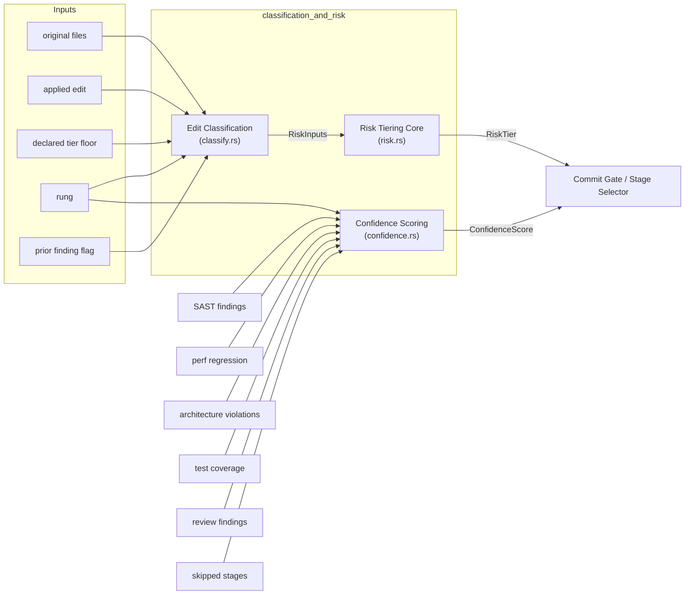
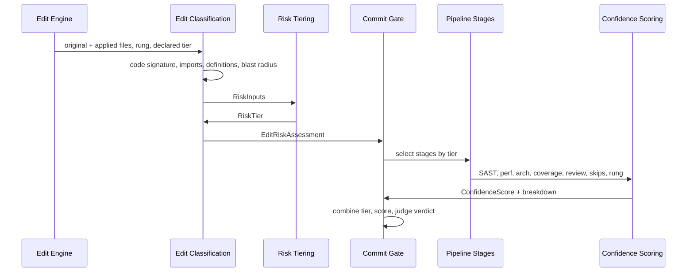

# classification_and_risk

## Purpose

The `classification_and_risk` module is the deterministic, pre-LLM risk brain of the code-review pipeline. Before any expensive stage runs, it inspects a proposed code edit and answers two questions:

1. **How risky is this edit?** — It derives a [`RiskTier`](./classification_and_risk_risk_tiering.md) from the AST-level diff, the symbol-graph blast radius, the edit-engine fidelity ([`Rung`](./edit_semantic.md)), and whether the touched files sit on a payment/settlement critical path.
2. **How much residual risk remains after the deterministic stages pass?** — It computes a [`ConfidenceScore`](./classification_and_risk_confidence_scoring.md) from structured stage outputs (SAST, perf regression, architecture violations, test coverage, review findings, skipped stages, and rung).

The module is intentionally **deterministic and LLM-free** for classification. This removes the possibility of a model "grading its own homework" and guarantees that the tier driving the Commit Gate is computed from the code itself, never trusted from the wire.

## Architecture Overview

### Component Responsibilities

| Sub-module | File | Responsibility |
|------------|------|----------------|
| [Risk Tiering Core](./classification_and_risk_risk_tiering.md) | `risk.rs` | Defines the four [`RiskTier`](./classification_and_risk_risk_tiering.md) levels, the [`DiffClass`](./classification_and_risk_risk_tiering.md) taxonomy, and the deterministic [`classify`](./classification_and_risk_risk_tiering.md) function that maps [`RiskInputs`](./classification_and_risk_risk_tiering.md) to a tier. Enforces escalate-only semantics. |
| [Edit Classification](./classification_and_risk_edit_classification.md) | `classify.rs` | Implements [`classify_edit`](./classification_and_risk_edit_classification.md), which turns a raw edit into an [`EditRiskAssessment`](./classification_and_risk_edit_classification.md). Computes string-aware code signatures, detects signature/API changes, new dependencies, critical-path files, and blast radius via the Context-Fabric symbol graph. |
| [Confidence Scoring](./classification_and_risk_confidence_scoring.md) | `confidence.rs` | Implements [`compute`](./classification_and_risk_confidence_scoring.md), producing an auditable [`ConfidenceScore`](./classification_and_risk_confidence_scoring.md) from all prior stage outputs. Deliberately excludes the Judge verdict from the arithmetic to prevent sycophancy. |

## Key Design Invariants

- **Escalate-only.** A declared tier floor can only raise the graph-derived tier, never lower it. Mid-run re-classification after a self-heal round can only move risk upward.
- **`DocOnly` is proven, never assumed.** An edit is classified as doc-only only when its comment-and-whitespace-stripped code signature is byte-identical before and after. String literals are preserved, so a change inside a URL, SQL fragment, or routing key is never mis-scored as documentation.
- **Critical path is path-driven.** Any file whose path contains `payment`, `settlement`, `ledger`, `compliance`, `clearing`, or `reconcil` forces [`RiskTier::HighRisk`](./classification_and_risk_risk_tiering.md) and therefore human-in-the-loop approval.
- **A skip is a penalty.** The confidence score deducts points for every stage skipped for want of tooling, preventing the cheapest path to a high score from being "run fewer checks."
- **Judge verdict is a gate, not an input.** The LLM review verdict does not inflate the confidence score; it sits on top of it in the Commit Gate.

## Data Flow

## Relationship to the Rest of the System

- **Pipeline orchestration:** This module is a child of [`pipeline_orchestration`](./pipeline_orchestration.md). The [`RiskTier`](./classification_and_risk_risk_tiering.md) returned here drives which stages run and whether human approval is required. See [pipeline_stages_and_tools](./pipeline_stages_and_tools.md) for the stage implementations and [self_healing](./self_healing.md) for mid-run re-classification.
- **Semantic/edit infrastructure:** Edit classification depends on the Context-Fabric symbol graph and the edit-engine [`Rung`](./edit_semantic.md) defined in [`edit_semantic`](./edit_semantic.md).
- **Quality verification:** Confidence scoring consumes [`ReviewFinding`](./quality_verification_judge.md) from the judge subsystem and SAST findings from the pipeline's own SAST stage.
- **Governance:** The critical-path fragments and tier-to-HITL mapping align with the SDLC policy described in `docs/architecture/CODE_REVIEW_PIPELINE.md` §3.

## Sub-module Documentation

- [Risk Tiering Core](./classification_and_risk_risk_tiering.md)
- [Edit Classification](./classification_and_risk_edit_classification.md)
- [Confidence Scoring](./classification_and_risk_confidence_scoring.md)
