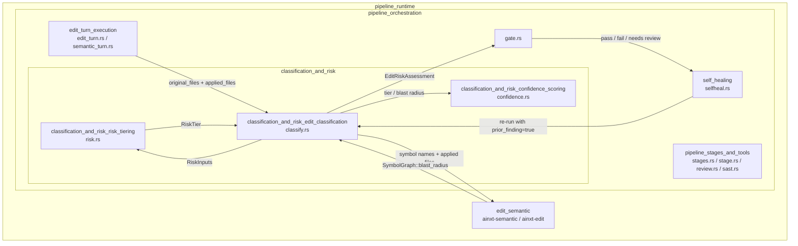
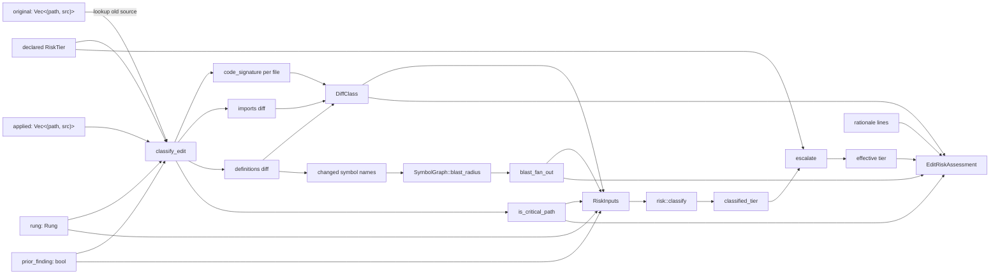
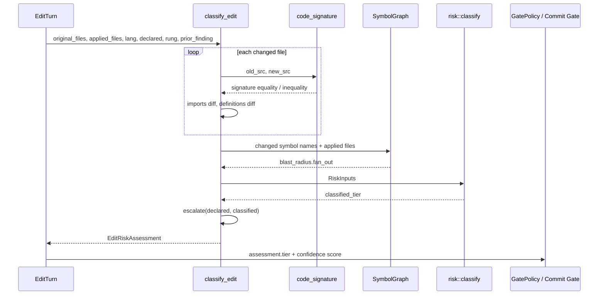
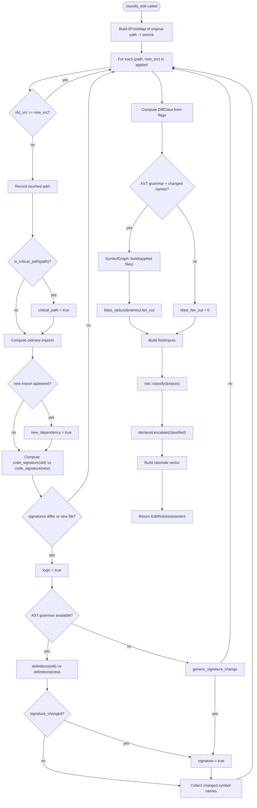
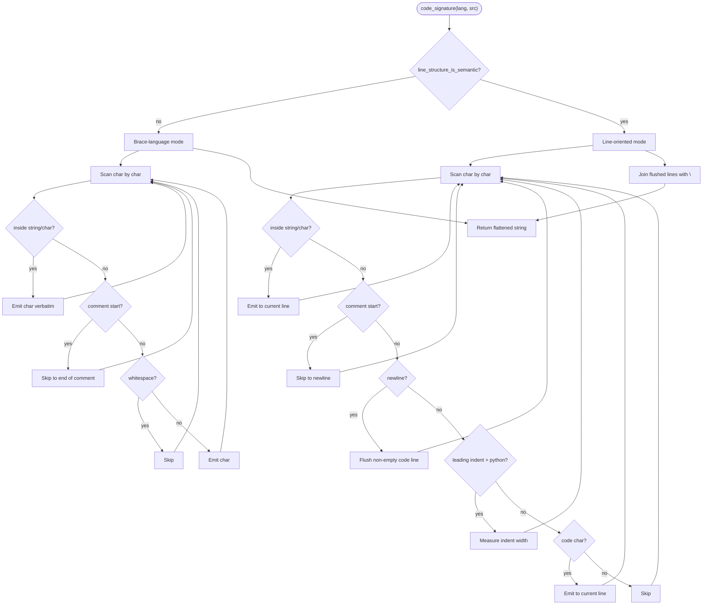

# classification_and_risk_edit_classification

## Brief Introduction

The `classification_and_risk_edit_classification` module is the **pre-stage-1 deterministic edit classifier** of the AI-native code-review pipeline. It lives inside the broader [`classification_and_risk`](classification_and_risk.md) orchestration layer and is responsible for turning a raw code edit — the pre-edit file tree plus the edit engine's applied file set — into an auditable [`EditRiskAssessment`](classification_and_risk_edit_classification.md#editriskassessment). That assessment feeds the Commit Gate, the confidence scorer, and the self-healing loop.

The classifier is intentionally **pure, deterministic, and I/O-free**: it uses only AST-aware diffing, the Context-Fabric symbol graph, and a small set of hard-coded heuristics. No LLM is invoked, no network call is made, and no trust is placed in the caller's declared tier. Its output is a [`RiskTier`](classification_and_risk_risk_tiering.md#risktier) together with the machine-readable and human-readable evidence that justifies it.

Two invariants govern the design:

1. **Escalate-only against the declared floor.** A caller may declare a floor tier (for example, an SDLC profile that pins every change to at least `Moderate`), but classification can only raise it. A client that under-declares a settlement-path edit as `Local` is still forced to `HighRisk`.
2. **`DocOnly` is proven, never assumed.** A change is classified as documentation-only only when its comment-and-whitespace-stripped **code signature** is byte-identical before and after. String literals are preserved verbatim, so a change inside a URL, SQL fragment, or routing key is never mistaken for a comment edit.

---

## Module Purpose and Core Functionality

### What the module does

`classify.rs` answers one question: **"How risky is this edit, before any stage runs?"** It does so by:

1. Comparing each file in the applied edit set against the original tree.
2. Stripping comments and non-semantic whitespace using a string-aware [`code_signature`](classification_and_risk_edit_classification.md#codesignature) function.
3. Detecting whether the edit changes executable logic, a public signature/API, or introduces a new dependency.
4. Computing the direct one-hop fan-out (blast radius) of changed symbols via the [`SymbolGraph`](edit_semantic.md#symbolgraph) from the semantic layer.
5. Checking whether any touched file sits on a payment/settlement critical path.
6. Delegating the final tier computation to [`crate::risk::classify`](classification_and_risk_risk_tiering.md#classify), then folding in the caller's declared floor with the escalate-only combinator.

The result is an [`EditRiskAssessment`](classification_and_risk_edit_classification.md#editriskassessment) that the rest of the pipeline can act on without re-deriving these signals.

### Core components

| Component | Type | Responsibility |
|-----------|------|----------------|
| [`EditRiskAssessment`](classification_and_risk_edit_classification.md#editriskassessment) | `struct` | The serializable, auditable output of classification: effective tier, declared floor, classified tier, diff class, blast radius, critical-path flag, and rationale. |
| [`classify_edit`](classification_and_risk_edit_classification.md#classify_edit) | `fn` | The main entry point. Derives [`RiskInputs`](classification_and_risk_risk_tiering.md#riskinputs) from the raw edit and produces an [`EditRiskAssessment`](classification_and_risk_edit_classification.md#editriskassessment). |
| [`code_signature`](classification_and_risk_edit_classification.md#codesignature) | `fn` | A string-aware, language-sensitive signature of executable source semantics. Used to prove or disprove `DocOnly`. |
| [`is_critical_path`](classification_and_risk_edit_classification.md#iscriticalpath) | `fn` | Returns `true` when a file path contains a payment/settlement/ledger/compliance/clearing/reconciliation fragment. |

### Supporting helpers

The module also contains several private helpers that are important for maintainers:

- `sem_lang` — maps the pipeline's [`Language`](pipeline_orchestration.md#language) enum to the semantic layer's grammar set. Returns `None` for languages without tree-sitter support, causing the classifier to fall back to string-based heuristics.
- `line_structure_is_semantic` / `indentation_is_semantic` — flags languages where newlines or indentation carry executable meaning (Python, JavaScript, TypeScript, Go).
- `imports` — best-effort, line-based extraction of new dependency targets.
- `definitions` / `signature_changed` / `changed_symbols` — AST-based detection of touched symbols and signature/API changes.
- `header` — extracts the declaration portion of a definition, separating API changes from body-only changes.
- `generic_signature_change` — a conservative fallback heuristic for languages without an AST grammar.

---

## Architecture and Component Relationships

### Position in the system



### Internal data flow



### Component interaction diagram



---

## How It Fits into the Overall System

### Relationship to sibling modules

- **[`classification_and_risk_risk_tiering`](classification_and_risk_risk_tiering.md)** (`risk.rs`) owns the policy that maps [`RiskInputs`](classification_and_risk_risk_tiering.md#riskinputs) to a [`RiskTier`](classification_and_risk_risk_tiering.md#risktier). `classify.rs` is the *sensor* that produces those inputs; `risk.rs` is the *actuator* that turns them into a tier. This module never duplicates tiering logic — it delegates to `risk::classify`.
- **[`classification_and_risk_confidence_scoring`](classification_and_risk_confidence_scoring.md)** (`confidence.rs`) consumes the blast radius and rung information produced here to compute a confidence score. Coverage overlap is a confidence term, not a tiering term, so `classify.rs` passes `coverage_overlap: 1.0` to `risk::classify` and leaves coverage to the confidence scorer.
- **[`edit_turn_execution`](edit_turn_execution.md)** (`edit_turn.rs`) calls `classify_edit` before stage 1 and stores the resulting [`EditRiskAssessment`](classification_and_risk_edit_classification.md#editriskassessment) inside [`ClassifiedEditResponse`](edit_turn_execution.md#classifiededitresponse).
- **[`edit_semantic`](edit_semantic.md)** (`ainxt-semantic`) provides the [`SymbolGraph`](edit_semantic.md#symbolgraph), [`SourceFile`](edit_semantic.md#sourcefile), [`list_definitions`](edit_semantic.md#listdefinitions), and [`Rung`](edit_semantic.md#rung) abstractions used to compute blast radius and to map languages.
- **[`pipeline_stages_and_tools`](pipeline_stages_and_tools.md)** runs the actual SAST, review, and architecture stages. When a prior round trips a finding, the self-heal loop re-invokes `classify_edit` with `prior_finding=true`, which forces `HighRisk`.

### Relationship to the Commit Gate

The Commit Gate ([`gate.rs`](pipeline_orchestration.md#gatepolicy)) uses the effective tier from [`EditRiskAssessment`](classification_and_risk_edit_classification.md#editriskassessment) to decide:

- Whether a Phase-A failure is a hard block.
- Whether an independent Judge panel is mandatory.
- Whether the trivial auto-approve floor applies.

Because the tier is derived deterministically from the code itself, the gate does not need to trust the caller's declared tier. The `declared_tier` field is retained only for audit and escalation logging.

### Relationship to the self-healing loop

[`selfheal.rs`](self_healing.md) can re-run an edit after remediation. On re-entry, it sets `prior_finding=true`, which forces the tier to `HighRisk` regardless of the diff class. This prevents a previously-flagged edit from silently dropping back to a lower tier.

---

## Detailed Process Flows

### Edit classification process



### Code signature construction



---

## Key Design Decisions

### Why classification is pre-stage-1

Running classification before any stage means the tier that drives the Commit Gate is computed from the code itself, not from anything the caller or the wire asserts. This is the foundation of the pipeline's "trust-but-verify" posture toward edit requests.

### Why `DocOnly` requires a string-aware signature

A naive comment-stripper that treats `//` anywhere as a comment would misclassify a change to `"http://a"` → `"http://b"` as doc-only. The [`code_signature`](classification_and_risk_edit_classification.md#codesignature) function preserves string and character literals verbatim, so changes inside literals always change the signature and degrade upward to a real logic change.

### Why line-oriented mode exists

In Python, indentation selects block structure. In JavaScript/TypeScript/Go, newline placement can insert or suppress implicit semicolons. For these languages, the signature keeps line boundaries (and, for Python, indentation width). A pure re-indent or a joined/split line therefore changes the signature, preventing a logic change from being mis-proven as `DocOnly`.

### Why blast radius uses one-hop fan-out

The tiering policy treats `blast_fan_out >= 20` as `HighRisk` and `>= 5` as `Moderate`. One-hop fan-out is a cheap, deterministic proxy for blast radius that does not require whole-program reachability analysis. It is computed from the post-edit symbol graph so that newly introduced callers are included.

### Why the escalate-only combinator matters

The `declared.escalate(classified)` operation guarantees that the effective tier is never lower than either the graph-derived tier or the caller's declared floor. This lets SDLC profiles and compliance workflows set a floor without the classifier being able to silently downgrade a high-risk edit.

---

## Data Types and Public API

### `EditRiskAssessment`

```rust
pub struct EditRiskAssessment {
    pub tier: RiskTier,
    pub declared_tier: RiskTier,
    pub classified_tier: RiskTier,
    pub diff_class: DiffClass,
    pub files_touched: usize,
    pub blast_fan_out: usize,
    pub critical_path: bool,
    pub trivial_auto_approve_eligible: bool,
    pub rationale: Vec<String>,
}
```

- `tier` — the effective tier used by the Commit Gate.
- `declared_tier` — the floor declared by the caller.
- `classified_tier` — the tier produced by graph-derived signals alone.
- `diff_class` — one of `DocOnly`, `LocalLogic`, `SignatureApi`, `NewDependency`.
- `files_touched` — number of files whose content actually changed.
- `blast_fan_out` — direct one-hop fan-out of changed symbols.
- `critical_path` — true if any touched file is on a payment/settlement path.
- `trivial_auto_approve_eligible` — true only when `tier == RiskTier::Trivial`.
- `rationale` — human-readable evidence lines.

### `classify_edit`

```rust
pub fn classify_edit(
    original: &[(String, String)],
    applied: &[(String, String)],
    lang: Language,
    declared: RiskTier,
    rung: ainxt_semantic::ladder::Rung,
    prior_finding: bool,
) -> EditRiskAssessment
```

The main entry point. `original` is the pre-edit tree; `applied` is the edit engine's output. `lang` is the capability language of the edit. `declared` is the caller's floor tier. `rung` is the lowest-fidelity edit-engine rung used. `prior_finding` is the self-heal escalator.

### `code_signature`

```rust
pub(crate) fn code_signature(lang: Language, src: &str) -> String
```

Returns a normalized signature of the executable semantics of `src`. Comments and non-semantic whitespace are removed; string/char literals are preserved. For line-semantic languages, line boundaries (and Python indentation) are retained.

### `is_critical_path`

```rust
pub fn is_critical_path(path: &str) -> bool
```

Returns `true` when `path` contains any of the fragments in `CRITICAL_PATH_FRAGMENTS`: `payment`, `settlement`, `ledger`, `compliance`, `clearing`, `reconcil`. The check is case-insensitive.

---

## Configuration and Constants

### `CRITICAL_PATH_FRAGMENTS`

```rust
pub const CRITICAL_PATH_FRAGMENTS: &[&str] = &[
    "payment",
    "settlement",
    "ledger",
    "compliance",
    "clearing",
    "reconcil",
];
```

This list is aligned with `CODE_REVIEW_PIPELINE.md` §3 and covers surfaces with double-payment or settlement blast radius. Any edit touching a path matching these fragments is forced to `HighRisk`.

---

## Testing Strategy

The module's unit tests cover the invariants directly:

- **Comment-only edits** are classified `DocOnly` and can reach `Trivial` when the declared floor allows.
- **String-literal changes** are never `DocOnly`, even when the literal contains `//`.
- **Signature/API changes** are `SignatureApi` and tiered at least `Moderate`.
- **New dependencies** are `NewDependency` and tiered at least `Moderate`.
- **Under-declared settlement edits** are forced to `HighRisk` regardless of the declared floor.
- **Declared floors are never lowered**, even for doc-only edits.
- **Multi-file edits** are at least `Moderate`.
- **Text-patch rungs** bump `Local` edits to `Moderate`.
- **Unchanged files** contribute no signal.
- **Python signature changes** are detected without an AST grammar fallback.

These tests are embedded in the source file under `#[cfg(test)]` and run with the standard Rust test harness.

---

## References

- [`classification_and_risk`](classification_and_risk.md) — parent module overview.
- [`classification_and_risk_risk_tiering`](classification_and_risk_risk_tiering.md) — tiering policy and `RiskInputs`.
- [`classification_and_risk_confidence_scoring`](classification_and_risk_confidence_scoring.md) — confidence scoring that consumes blast radius and rung.
- [`edit_turn_execution`](edit_turn_execution.md) — the edit-turn driver that invokes this classifier.
- [`edit_semantic`](edit_semantic.md) — symbol graph, source-file model, and language definitions.
- [`self_healing`](self_healing.md) — re-runs classification with `prior_finding=true` after remediation.
- [`pipeline_orchestration`](pipeline_orchestration.md) — broader pipeline orchestration context.
