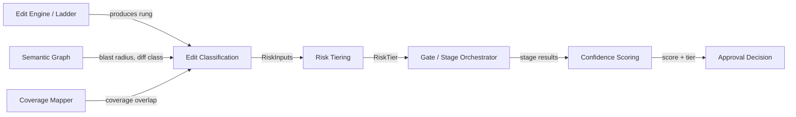
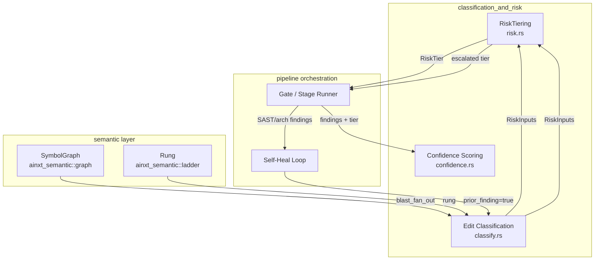
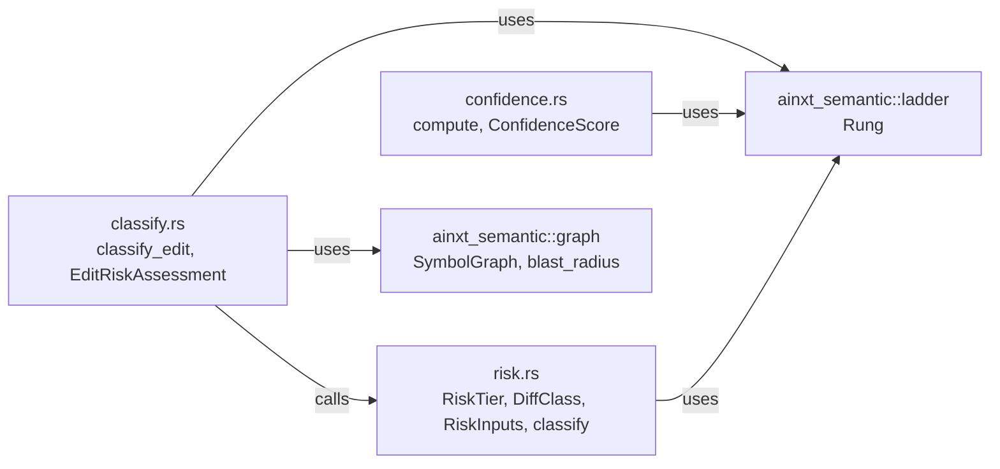
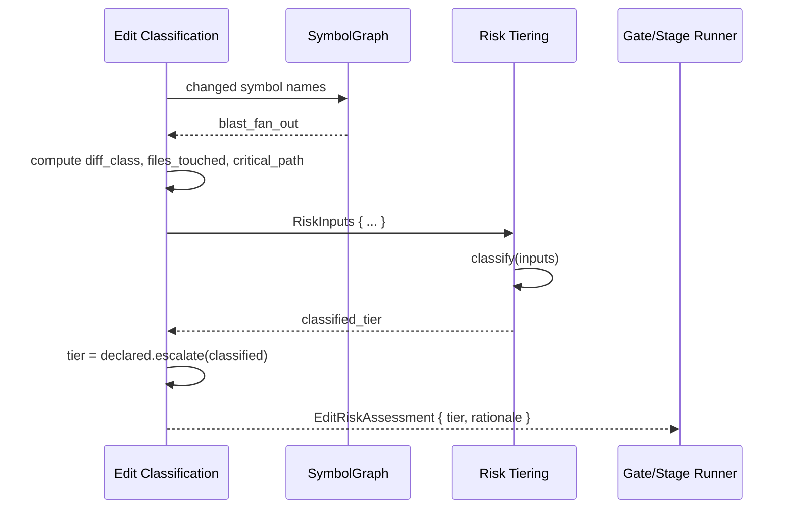
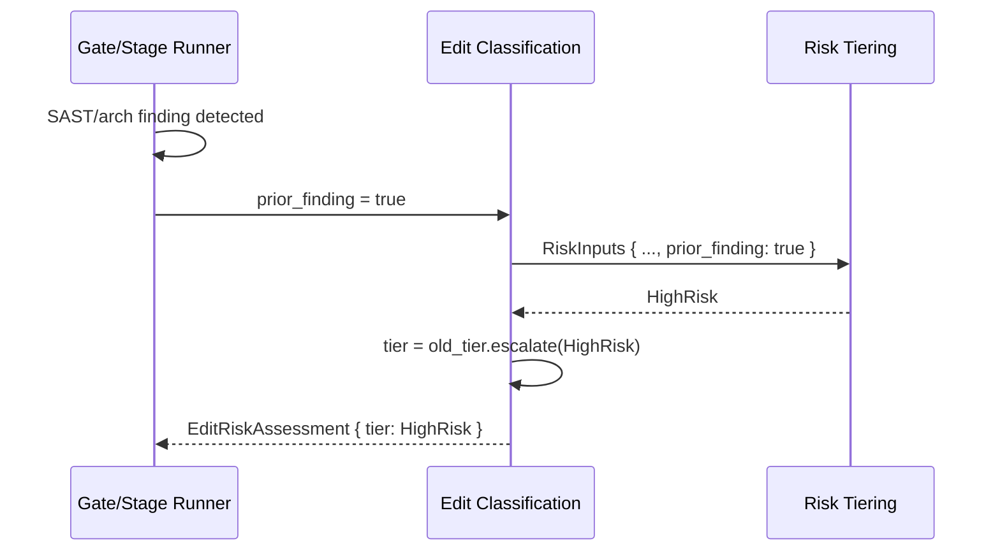
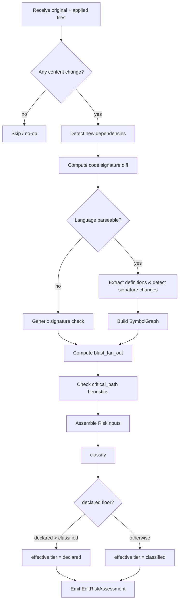

# Classification and Risk: Risk Tiering

## Brief Introduction

The `classification_and_risk_risk_tiering` module is the deterministic risk-classification engine for the autonomous code-review pipeline. It sits at the boundary between raw code edits and the gated stage orchestration, translating graph-derived signals—AST-diff class, blast radius, touched files, critical-path tags, edit-engine fidelity, and prior findings—into one of four ordered [`RiskTier`](#risktier) values.

The tier returned by this module decides how many review stages run, whether a human-in-the-loop (HITL) approval is mandatory, and how the rest of the pipeline treats the change. It is intentionally **non-LLM**: the decision is a fast, auditable, and reproducible function of inputs produced by the semantic graph layer and the edit engine.

This module is part of the larger [`classification_and_risk`](classification_and_risk.md) subsystem, alongside [`classification_and_risk_edit_classification`](classification_and_risk_edit_classification.md) and [`classification_and_risk_confidence_scoring`](classification_and_risk_confidence_scoring.md).

---

## Core Concepts

### RiskTier

`RiskTier` is a four-level ordered enum:

| Tier | Meaning | Typical Gate Behavior |
|------|---------|----------------------|
| `Trivial` | Doc/comment/formatting only; no executable semantics. | Compile-sanity + lint; may auto-approve. |
| `Local` | Single function/file, no signature/API change, small blast radius, non-critical. | Lightweight stage set. |
| `Moderate` | Multi-file, signature change, shared module, new dependency, or low-fidelity edit. | Expanded stage set, higher scrutiny. |
| `HighRisk` | Critical-path, cross-service blast radius, public-API break, or any SAST/architecture finding. | Full gate + mandatory human approval. |

The enum derives `PartialOrd`/`Ord`, so tiers compose naturally with `max()` and the [`escalate`](#escalation-semantics) combinator.

### DiffClass

`DiffClass` captures the executable-semantics weight of an edit:

- `DocOnly` — comments, docs, formatting.
- `LocalLogic` — logic change inside a function.
- `SignatureApi` — signature or public-API change.
- `NewDependency` — a new external dependency introduced.

This value is produced by [`classify_edit`](classification_and_risk_edit_classification.md) in the sibling edit-classification module and fed into [`RiskInputs`](#riskinputs).

### RiskInputs

`RiskInputs` is the complete, deterministic input bundle:

| Field | Source | Role in classification |
|-------|--------|------------------------|
| `diff_class` | AST diff analysis | Semantic weight of the change. |
| `blast_fan_out` | Symbol graph (`SymbolGraph::blast_radius`) | Direct 1-hop caller count; measures blast radius. |
| `files_touched` | Edit application | Number of files with actual content changes. |
| `critical_path` | Path heuristics (`is_critical_path`) | True for payment/settlement/ledger/compliance modules. |
| `coverage_overlap` | Test-coverage mapping | Reserved for confidence scoring; not used by tiering. |
| `rung` | Edit engine / ladder | Lowest-fidelity rung used (`Lsp` → `Ast` → `StructuredPatch` → `TextPatch`). |
| `prior_finding` | Previous self-heal round | Escalator: a prior SAST/arch finding forces `HighRisk`. |

### classify

`classify(&RiskInputs) -> RiskTier` applies a fixed decision tree:

1. **Non-negotiable escalators** — if `critical_path` or `prior_finding` is true, return `HighRisk`.
2. **Large blast radius** — if `blast_fan_out >= 20`, return `HighRisk`.
3. **Trivial floor** — if `diff_class == DocOnly`, `files_touched <= 1`, and `blast_fan_out == 0`, return `Trivial`.
4. **Moderate triggers** — if `files_touched > 1`, `diff_class` is `SignatureApi` or `NewDependency`, `rung == TextPatch`, or `blast_fan_out >= 5`, return `Moderate`.
5. **Default** — `Local`.

The function is pure, deterministic, and has no external dependencies, making it ideal for unit testing and audit logging.

---

## Architecture

### Position in the Pipeline



The risk-tiering module consumes the normalized `RiskInputs` produced by edit classification and emits a `RiskTier` that the gate uses to select stages and set autonomy bounds.

### Component Relationships



### Dependency Graph



---

## Data Flow

### Initial Classification Flow



### Re-classification During Self-Heal



Re-classification is **escalate-only**: a later round can raise the tier but never lower it. This prevents the system from self-grading its way out of scrutiny.

---

## Key Design Invariants

### Escalation-Only Re-classification

The [`RiskTier::escalate`](#escalation-semantics) combinator returns `self.max(other)`. Within a single pipeline run, if a self-heal round touches a critical-path module or trips a SAST finding, the tier can only move upward. De-escalation is forbidden by design to avoid anti-sycophancy failures.

### Tier 3 Forces Human Approval

`RiskTier::HighRisk.forces_hitl()` returns `true`. Even if the downstream confidence score is 100, a `HighRisk` change requires human approval (autonomy reduced to `assisted`).

### Deterministic, No LLM

The tier decision does not call an LLM. It is a function of pre-computed graph signals. This keeps latency low, cost predictable, and decisions reproducible.

---

## API Reference

### Types

#### `RiskTier`

```rust
pub enum RiskTier {
    Trivial,
    Local,
    Moderate,
    HighRisk,
}
```

Methods:

- `forces_hitl(self) -> bool` — true only for `HighRisk`.
- `escalate(self, other: RiskTier) -> RiskTier` — returns the higher tier.

#### `DiffClass`

```rust
pub enum DiffClass {
    DocOnly,
    LocalLogic,
    SignatureApi,
    NewDependency,
}
```

#### `RiskInputs`

```rust
pub struct RiskInputs {
    pub diff_class: DiffClass,
    pub blast_fan_out: usize,
    pub files_touched: usize,
    pub critical_path: bool,
    pub coverage_overlap: f64,
    pub rung: Rung,
    pub prior_finding: bool,
}
```

### Functions

#### `classify`

```rust
pub fn classify(inp: &RiskInputs) -> RiskTier
```

Deterministic decision tree mapping `RiskInputs` to a `RiskTier`. See [Core Concepts](#classify-1) for the rules.

---

## Integration with Related Modules

- **[`classification_and_risk_edit_classification`](classification_and_risk_edit_classification.md)** — produces `RiskInputs` and calls `classify`. It owns the AST-diff logic, critical-path heuristics, and blast-radius computation.
- **[`classification_and_risk_confidence_scoring`](classification_and_risk_confidence_scoring.md)** — consumes the final tier plus stage outputs to compute a confidence score. It uses `coverage_overlap` and `rung`, which are present in `RiskInputs` but evaluated separately.
- **[`edit_semantic`](edit_semantic.md)** — provides `SymbolGraph` for blast-radius calculation and the `Rung` enum describing edit-engine fidelity.
- **[`pipeline_orchestration`](pipeline_orchestration.md)** — uses the tier to choose which stages run and whether HITL is required.

---

## Process Flow: From Edit to Tier



---

## Testing Strategy

The module includes unit tests covering every rule boundary:

- Doc-only local edits → `Trivial`
- Plain local logic → `Local`
- Signature/API changes → `Moderate`
- Multi-file changes → `Moderate`
- Critical-path tag → `HighRisk` even for tiny doc edits
- Prior finding → `HighRisk`
- Large blast radius (`>= 20`) → `HighRisk`
- `TextPatch` rung → `Moderate`
- `escalate` never decreases

These tests are deterministic and require no external services, matching the module's design philosophy.

---

## Operational Considerations

- **Latency:** `classify` is O(1) over the input struct; all expensive work (graph building, diffing) happens upstream in edit classification.
- **Cost:** No LLM call is made for tiering.
- **Auditability:** The sibling `classify_edit` function records a human-readable `rationale` vector that includes the raw signals and any escalation.
- **Extensibility:** Adding a new tier would require updating the ordered enum, the decision tree, and downstream gate logic. Adding new signals is localized to `RiskInputs` and the classification rules.
