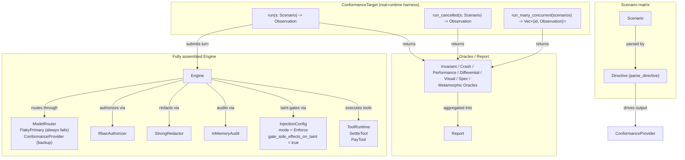
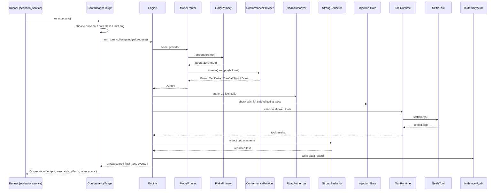
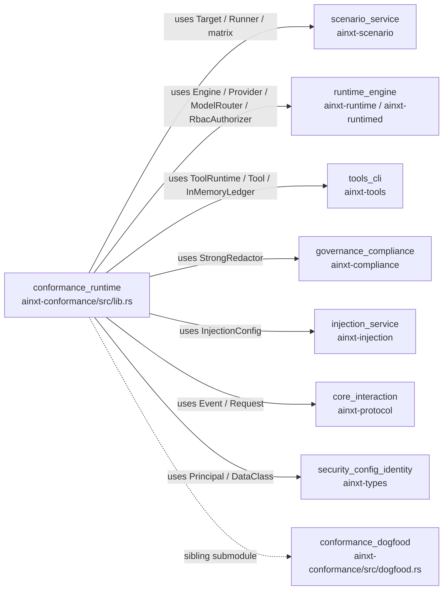

# conformance_runtime

## Brief Introduction

`conformance_runtime` is the **Definition-of-Done (DoD) harness** for the ainxt system. It executes the full generated scenario matrix — 1,000+ adversarial and functional scenarios — against the **fully assembled real runtime**, not against mocks or isolated components. Its purpose is to close the verification gap between unit-tested components and the integrated pipeline: it proves that invariants such as compliance redaction, RBAC authorization, provider failover, idempotent side-effect execution, injection taint-gating, and cooperative cancellation still hold when all subsystems are wired together.

The module lives in `crates/ainxt-conformance/src/lib.rs` and is the runtime-facing half of the broader [`conformance`](conformance_dogfood.md) evaluation family. The other half, [`conformance_dogfood`](conformance_dogfood.md), focuses on dog-food evaluation of the runtime itself against a stored corpus.

---

## Core Responsibilities

1. **Real-runtime scenario execution**  
   Map each [`Scenario`](scenario_service.md) from the generated matrix into a real turn of the [`Engine`](runtime_engine.md) and capture the resulting [`Observation`](scenario_service.md).

2. **Adversarial provider topology**  
   Register a primary provider that always fails, forcing every scenario to exercise provider failover to the deterministic conformance backup provider.

3. **Deterministic directive-driven responses**  
   The backup provider interprets scenario directives (PAN splits, secrets, emails, duplicate settlements, malformed JSON, injection attempts, plain echoes) and emits the exact event stream needed to stress a specific invariant.

4. **Side-effect auditing**  
   `SettleTool` records every settlement that actually executes, enabling oracles to detect double-execution or unauthorized execution.

5. **Cancellation and concurrency coverage**  
   Expose `run_cancelled` and `run_many_concurrent` to verify cooperative cancellation and session isolation under real concurrent engine use.

---

## Architecture

---

## Component Reference

### `FlakyPrimary`

A [`Provider`](runtime_engine.md) implementation that is **always retryable-failing**. It is registered as the router's primary so that every conformance turn is forced through the failover path to `ConformanceProvider`.

| Aspect | Detail |
|--------|--------|
| `id()` | `"flaky-primary"` |
| `eligible()` | `true` for all `DataClass` |
| `stream()` | Emits a single `Event::Error("503 service unavailable")` |

This component is intentionally not exported; it is an internal test fixture.

---

### `ConformanceProvider`

The deterministic backup provider. It parses the scenario directive embedded in the prompt (via [`ainxt_scenario::matrix::parse_directive`](scenario_service.md)) and returns an event stream that exercises the invariant under test.

| Directive | Behavior | Invariant tested |
|-----------|----------|------------------|
| `EmitPanSplit(pan)` | Streams the PAN in small chunks, split across delta boundaries | Streaming-aware redaction must not leak a PAN at a chunk boundary |
| `EmitSecret(secret)` | Emits `api_key=<secret>` | Secret redaction |
| `EmitEmail(email)` | Emits `contact: <email>` | PII redaction |
| `DupSettle(key)` | Emits two `settle` tool calls with the same key | Idempotency / no double execution |
| `Malformed` | Emits malformed JSON for the structured `pay` tool | Structured-tool JSON validation must reject |
| `InjectionSettle` | Emits a `settle` tool call on a tainted turn | Injection taint-gate must block side effects |
| `Emit(text)` | Echoes arbitrary text | Round-trip correctness |

Second-round markers (`invalid arguments`, `blocked:`, `[tool settle result:`) are also recognized so the provider can simulate recovery paths after tool validation or gating.

---

### `SettleTool`

A side-effecting [`Tool`](tools_cli.md) that records every execution in a shared `Arc<Mutex<Vec<String>>>`.

| Property | Value |
|----------|-------|
| `name()` | `"settle"` |
| `effect_class()` | `EffectClass::SideEffecting` |
| `idempotency_key()` | The raw args string |
| `execute()` | Appends args to `executed` and returns `settled:{args}` |

Used by oracles to verify that settlements happen exactly once and only when authorized.

---

### `PayTool`

A structured side-effecting [`Tool`](tools_cli.md) with a JSON schema requiring `"account": String`. It is used to verify that the runtime rejects malformed tool-call JSON before execution.

| Property | Value |
|----------|-------|
| `name()` | `"pay"` |
| `effect_class()` | `EffectClass::SideEffecting` |
| `schema()` | Object with one required string field `account` |
| `execute()` | Returns `"paid"` |

---

### `ConformanceTarget`

Implements [`Target`](scenario_service.md) from the scenario harness. It owns a fully assembled [`Engine`](runtime_engine.md) and a Tokio runtime, and maps each scenario into a real turn.

#### Construction (`new()`)

1. Creates `SettleTool` with a shared execution log.
2. Builds a `ToolRuntime` backed by `InMemoryLedger` and `ManualReconciler`.
3. Builds a `ModelRouter` with `FlakyPrimary` registered first and `ConformanceProvider` second.
4. Configures `InjectionConfig` with `mode: Enforce` and `gate_side_effects_on_taint: true`.
5. Builds an `Engine` with `StrongRedactor`, `RbacAuthorizer`, `InMemoryAudit`, the router, tools, no retry, and the injection config.

#### `run(&self, scenario: &Scenario) -> Observation`

- Clears the settlement log.
- Selects a principal:
  - `Category::RbacDeny` → `Principal::user("blocked", &[])` (no capabilities).
  - All others → `Principal::user("u", &["chat.send", "tool.settle", "tool.pay"])`.
- Selects `DataClass::Confidential` for `DataClassLeak` and `ComplianceRedaction` scenarios, otherwise `DataClass::Public`.
- Marks the request as `untrusted_tainted = true` for `Category::Injection`.
- Runs `engine.run_turn_collect(...)` on a current-thread runtime.
- Surfaces terminal `Event::Error` messages into the observation's `error` field so crash oracles can detect fatal failures.

#### `run_cancelled(&self, scenario: &Scenario) -> Observation`

- Creates a pre-cancelled `CancelToken`.
- Runs `engine.run_turn_cancellable(...)` and collects events.
- Verifies that cancellation aborts the turn before any side effect executes.

#### `run_many_concurrent(&self, scenarios: &[Scenario]) -> Vec<(String, Observation)>`

- Spawns each scenario as a separate Tokio task on a multi-thread runtime.
- Each task uses the same `Engine` but distinct session identity and input.
- Verifies that parallel sessions do not bleed state.

---

## Data Flow

---

## Dependency Graph

---

## How It Fits into the System

`conformance_runtime` sits at the top of the test pyramid for the ainxt runtime:

- **Unit tests** prove individual crates work in isolation.
- **Scenario service** ([`scenario_service`](scenario_service.md)) proves the oracles and matrix generation work.
- **Conformance runtime** proves the **assembled pipeline** holds its invariants when all real subsystems are wired together.
- **Dogfood conformance** ([`conformance_dogfood`](conformance_dogfood.md)) reuses the same runtime-under-evaluation pattern against a stored corpus.

The harness is deterministic, requires no network, and uses no real keys (mock providers and in-memory ledgers). It is intended to run in CI as the final gate before a release candidate is accepted.

---

## Entry Points

| Function | Purpose |
|----------|---------|
| `run_matrix()` | Runs the full generated matrix (`ainxt_scenario::matrix::matrix_suite()`) and returns a [`Report`](scenario_service.md). |
| `run_pairwise_matrix()` | Runs the pairwise-generated corpus (`pairwise_matrix_suite()`) and returns a [`Report`](scenario_service.md). |
| `ConformanceTarget::new()` | Construct a fresh fully-assembled conformance runtime. |
| `ConformanceTarget::run(...)` | Run a single scenario through the real runtime. |
| `ConformanceTarget::run_cancelled(...)` | Run a scenario with a pre-cancelled token. |
| `ConformanceTarget::run_many_concurrent(...)` | Run many scenarios concurrently against one engine. |

---

## Invariants Verified

| Invariant | Mechanism |
|-----------|-----------|
| **No PAN leakage** | `EmitPanSplit` streams PAN across delta boundaries; `StrongRedactor` must redact. |
| **No secret leakage** | `EmitSecret` embeds an API key; output redaction must mask it. |
| **No PII leakage** | `EmitEmail` embeds an email; output redaction must mask it. |
| **Provider failover** | `FlakyPrimary` fails every turn; `ConformanceProvider` must serve as backup. |
| **Idempotent side effects** | `DupSettle` requests the same settlement twice; ledger must deduplicate. |
| **Structured tool validation** | `Malformed` JSON is rejected before `PayTool` executes. |
| **Injection taint-gating** | `InjectionSettle` on a tainted turn must be blocked. |
| **RBAC denial** | `RbacDeny` scenarios use a principal without `chat.send`; turn must be refused. |
| **Cooperative cancellation** | Pre-cancelled token must abort before side effects. |
| **Session isolation** | Concurrent tasks on the same engine must not observe each other's state. |

---

## Related Documentation

- [`conformance_dogfood`](conformance_dogfood.md) — stored-corpus dog-food evaluation of the runtime.
- [`scenario_service`](scenario_service.md) — scenario definitions, oracles, matrix generation, and the `Runner` harness.
- [`runtime_engine`](runtime_engine.md) — the `Engine`, `ModelRouter`, `RbacAuthorizer`, and cancellation semantics.
- [`tools_cli`](tools_cli.md) — `ToolRuntime`, `Tool`, `InMemoryLedger`, and structured tool schemas.
- [`governance_compliance`](governance_compliance.md) — `StrongRedactor` and compliance redaction.
- [`injection_service`](injection_service.md) — injection detection and taint-gating configuration.
- [`core_interaction`](core_interaction.md) — `Event`, `Request`, and protocol envelopes.
- [`security_config_identity`](security_config_identity.md) — `Principal` and `DataClass`.
