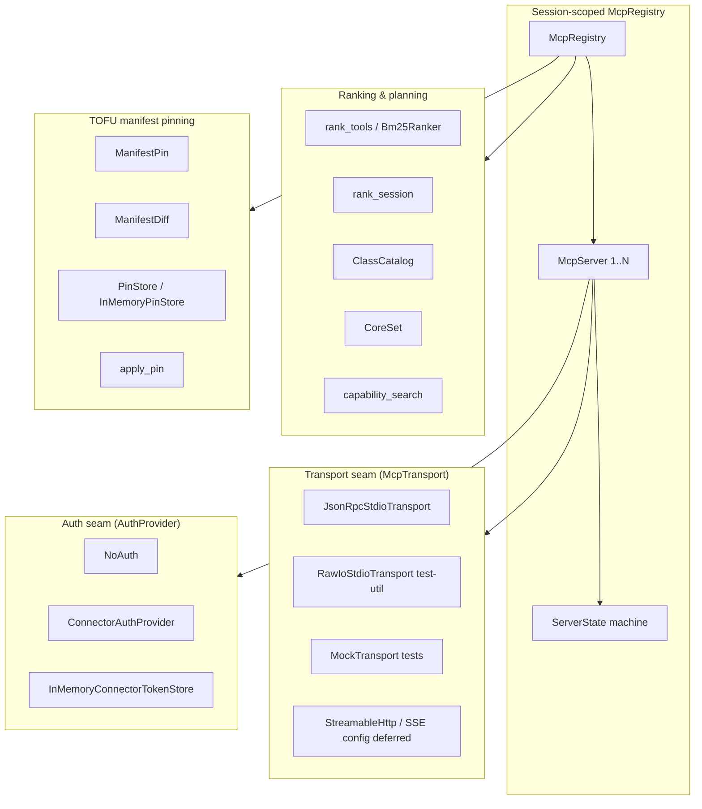
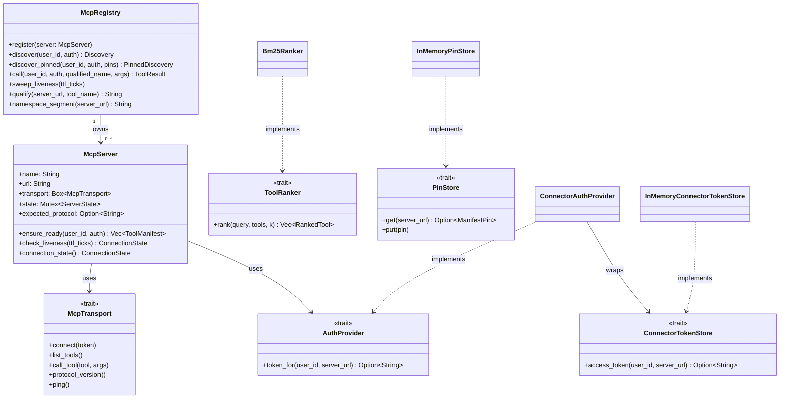
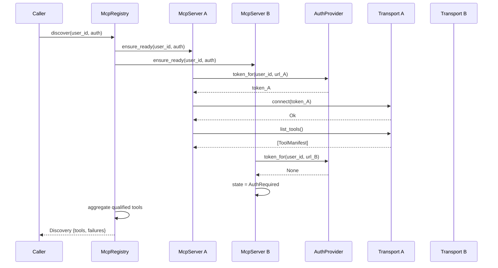
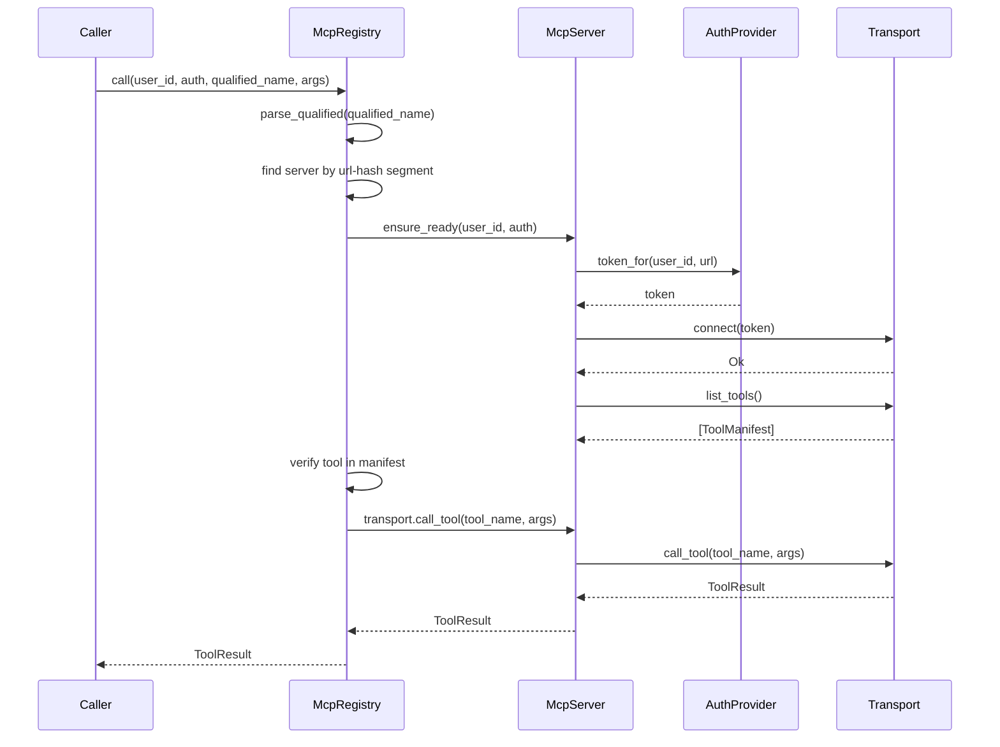
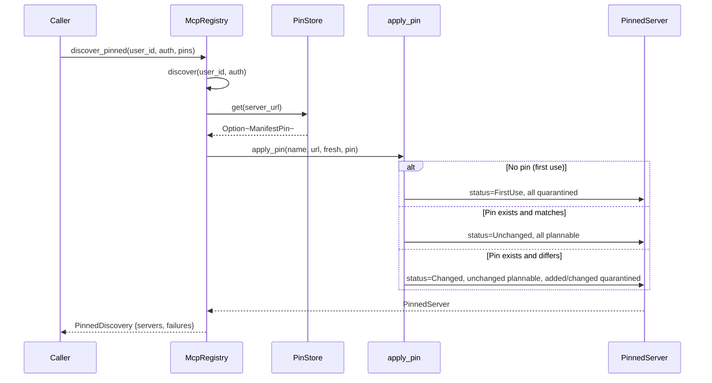
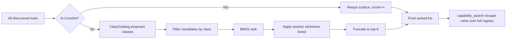
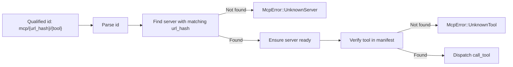

# connectors_mcp — MCP Runtime Core

## Brief Introduction

`connectors_mcp` is the **Model Context Protocol (MCP) runtime core** of the platform. It turns a set of untrusted third-party MCP servers into a **ranked, namespace-qualified, trust-on-first-use (TOFU) pinned tool set** for a single session. The crate is intentionally **transport-agnostic**: the wire is a pluggable seam (`McpTransport`), while the real logic — lazy connection, parallel discovery, per-user/server auth resolution, BM25-based ranking, namespace-qualified routing, and manifest pinning — lives here and is fully tested.

This module sits inside the [`connectors`](connectors.md) subsystem, alongside [`connectors_runtime`](connectors_runtime.md) and [`connectors_http`](connectors_http.md). Once an MCP tool is discovered and approved, it flows through the same dispatch path as a native tool, honoring the platform's OBO policy, idempotency ledger, and egress DLP guards (see [`tools_cli`](tools_cli.md)).

---

## Module Purpose and Core Functionality

The MCP runtime solves five problems that arise when an AI agent talks to external MCP servers:

1. **Lazy, cached connections** — A server is not connected at registration time. The first `discover` or `call` triggers exactly one handshake per session; the manifest is cached afterward.
2. **Parallel discovery with soft degradation** — `McpRegistry::discover` fans out across all registered servers concurrently. A server that is `Unreachable` or `AuthRequired` is skipped, its failure recorded, and the turn proceeds with whatever subset connected.
3. **Per-`(user, server_url)` auth** — Token resolution is keyed on the server **URL** (the trust boundary), never its display name. A missing token surfaces `AuthRequired` before any tool is exposed, never as a mid-call failure.
4. **Retrieval-based ranking at scale** — `rank_tools` scores candidates with BM25 over `name + description` so the most relevant tools sort first instead of dumping hundreds of schemas into the model context.
5. **Namespace-qualified routing and TOFU manifest pinning** — Tools are namespaced under `mcp/{server_url_hash}/{tool}`. A pinned manifest is diffed on reconnect; added, changed, or first-use tools are quarantined pending human re-approval, preventing silent manifest mutation from steering the planner.

---

## Architecture Overview



The architecture is layered around a session-scoped `McpRegistry`. Each registered `McpServer` owns a transport, an auth seam, and a lazy state machine. The registry orchestrates discovery, ranking, and routing, while the pinning subsystem guards the manifest boundary.

---

## Component Relationships



### Key structs and enums

| Component | Responsibility |
|-----------|----------------|
| `McpRegistry` | Session-scoped registry of servers; discovery, routing, ranking. |
| `McpServer` | One MCP server with lazy connection state and cached manifest. |
| `McpTransport` | Wire seam: connect, list tools, call tool, protocol version, ping. |
| `JsonRpcStdioTransport` | Real stdio child-process transport speaking JSON-RPC 2.0 line framing. |
| `RawIoStdioTransport` | Test-util transport over any `Read + Write` pair. |
| `AuthProvider` / `ConnectorAuthProvider` | Resolve per-`(user, url)` tokens from the connector-token store. |
| `ToolManifest` | Untrusted server-declared tool metadata: name, description, schema, data class. |
| `QualifiedTool` | A tool after aggregation, carrying its collision-free qualified id and owning URL. |
| `RankedTool` | A tool paired with a BM25 relevance score. |
| `rank_tools` / `Bm25Ranker` | BM25 ranking over `name + description`. |
| `rank_session` / `CoreSet` / `ClassCatalog` | Session-aware selection: core set, stickiness, class planning, escape valve. |
| `ManifestPin` / `ManifestDiff` / `apply_pin` | TOFU content-hash pinning and reconnect diffing. |
| `PinStore` / `InMemoryPinStore` | Durable seam for approved manifest pins. |
| `PinnedDiscovery` / `PinnedServer` / `QuarantinedTool` | Outcome of a pinned discovery sweep. |

---

## Data Flow

### Discovery flow (unpinned)



### Tool call flow



### TOFU manifest pinning flow



---

## Process Flows

### Connection state machine

```mermaid
stateDiagram-v2
    [*] --> Unconnected
    Unconnected --> Connecting : ensure_ready / discover / call
    Connecting --> Ready : connect OK, protocol OK, list_tools OK
    Connecting --> AuthRequired : McpError&#58;&#58;AuthRequired
    Connecting --> Unreachable : network/transport failure
    Connecting --> CapabilityMismatch : protocol mismatch
    Ready --> Unconnected : check_liveness fails or TTL exceeded
```



### Ranking and session selection



### Namespace-qualified routing



---

## Security Model

The MCP runtime treats every MCP server as **untrusted third-party surface**:

- **Trust boundary is the URL**, not the display name. Namespacing, auth, and pinning all key on `server_url`. Two servers sharing a display name (e.g., prod/staging both named "jira") get disjoint namespaces and independent tokens.
- **AuthRequired is a terminal state**, not a mid-call failure. A server without a token is hidden from the planner until a step-up consent is recorded.
- **TOFU manifest pinning** prevents silent mutation. A reconnect that adds, removes, or changes a tool (including a reworded description, which is model-facing instruction text and therefore an injection vector) produces a `ManifestDiff`. Added and changed tools are quarantined; unchanged tools remain plannable.
- **Conservative default data class** is `Confidential`. A server that omits `declared_data_class` cannot under-classify its tools.
- **Protocol version check** happens immediately after `connect`, before any tool is trusted.
- **Per-session liveness sweep** tears down stale connections so the next turn reconnects lazily rather than silently using a dead cached manifest.

---

## Dependencies and Integration Points

### Upstream dependencies

| Dependency | Module doc | Usage |
|------------|------------|-------|
| `ainxt-types::DataClass` | [`core_infrastructure`](core_infrastructure.md) | Data-sensitivity classification for tool manifests. |
| `ainxt-connector` token store discipline | [`connectors_runtime`](connectors_runtime.md) | `ConnectorAuthProvider` reuses the encrypted-at-rest connector-token store via `ConnectorTokenStore`. |
| `sha2` | external | SHA-256 for namespace segments and manifest content hashes. |
| `serde` / `serde_json` | external | Serialization of configs, manifests, and JSON-RPC messages. |

### Downstream consumers

| Consumer | Module doc | Usage |
|----------|------------|-------|
| `ainxt-tools` | [`tools_cli`](tools_cli.md) | MCP tools, once discovered, flow through the same OBO dispatch path as native tools. |
| `ainxt-runtimed` | [`runtime_engine`](runtime_engine.md) | `McpConfig`, `McpServerConfigEntry`, and `McpAdminHandle` wire MCP servers into runtime surfaces. |
| `ainxt-server` | [`server_serving`](server_serving.md) | `McpApproveRequest`, `ClearQuarantineRequest`, and admin handles expose pinning/approval to operators. |

### Sibling connector modules

- [`connectors_runtime`](connectors_runtime.md) — Core connector runtime, audit, egress filtering, and registry.
- [`connectors_http`](connectors_http.md) — HTTP-based connectors (Jira, GitLab, generic HTTP gateway).

---

## Configuration

`McpTransportConfig` is the serializable vocabulary for declaring how to reach a server. It is versioned and stored in the git-native control repo (ADR-026).

```rust
pub enum McpTransportConfig {
    Stdio { command, args, env },
    StreamableHttp { url, headers },
    Sse { url, headers },
}
```

- `Stdio` spawns a real child process via `JsonRpcStdioTransport::spawn`.
- `StreamableHttp` and `Sse` are real config variants; their live clients are deliberately deferred and fail closed with a structured error if spawned.

The `server_url()` method derives a stable identity for auth and namespace purposes:
- For `Stdio`: `stdio://{command} {args...}`
- For HTTP/SSE: the configured URL

---

## Testing Strategy

The crate is heavily self-tested with deterministic in-memory transports:

- `MockTransport` records connect counts, last token, and can simulate `AuthRequired` or `Unreachable`.
- `RawIoStdioTransport` tests the JSON-RPC framing over real `Read + Write` pairs without process spawning.
- `tests/r16_stdio_transport.rs` (referenced in code) proves the production child-process path end-to-end.
- Tests cover lazy connection, parallel aggregation, namespace collision avoidance, BM25 ranking, auth keying by URL, malformed-id rejection, and the full TOFU pin/approve/diff/quarantine lifecycle.

---

## References

- [`connectors`](connectors.md) — Parent module grouping all connector subsystems.
- [`connectors_runtime`](connectors_runtime.md) — Core connector runtime and audit.
- [`connectors_http`](connectors_http.md) — HTTP connector implementations.
- [`tools_cli`](tools_cli.md) — Tool dispatch, OBO policy, idempotency, and egress DLP.
- [`runtime_engine`](runtime_engine.md) — Runtime engine that wires MCP surfaces into serving.
- [`server_serving`](server_serving.md) — Server surfaces and admin endpoints for MCP approval.
- [`core_infrastructure`](core_infrastructure.md) — Shared types including `DataClass`.
