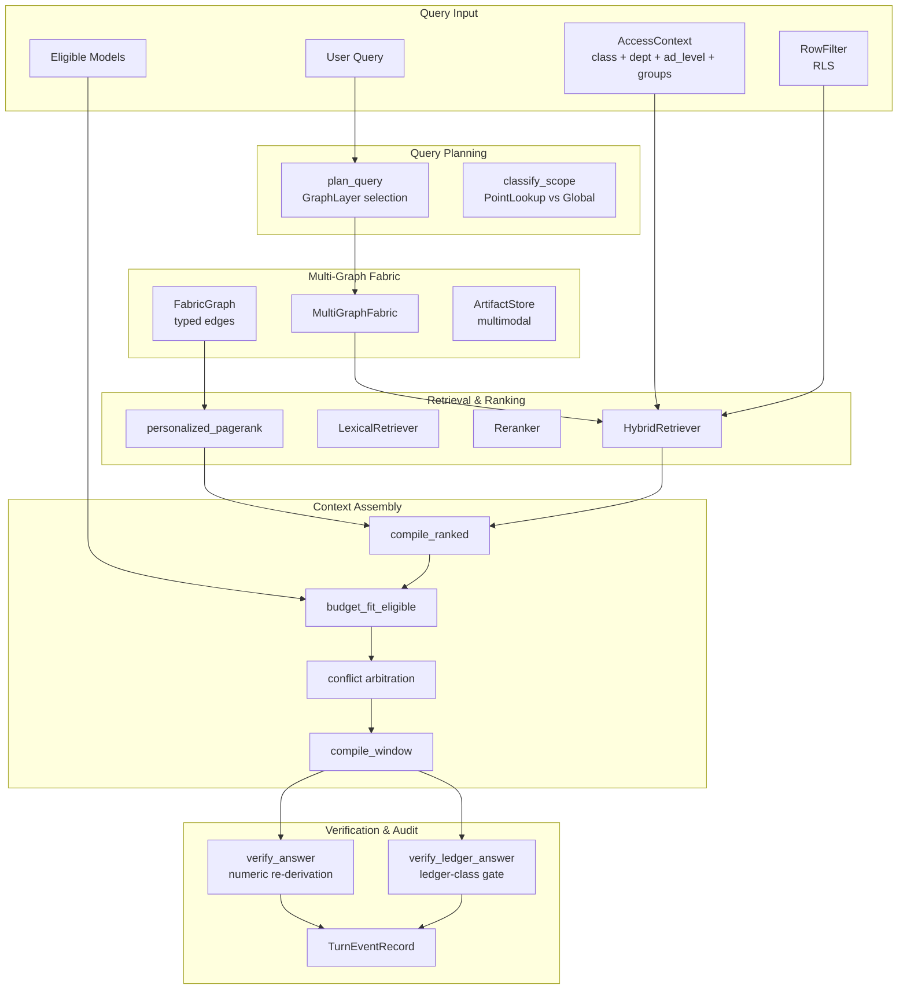
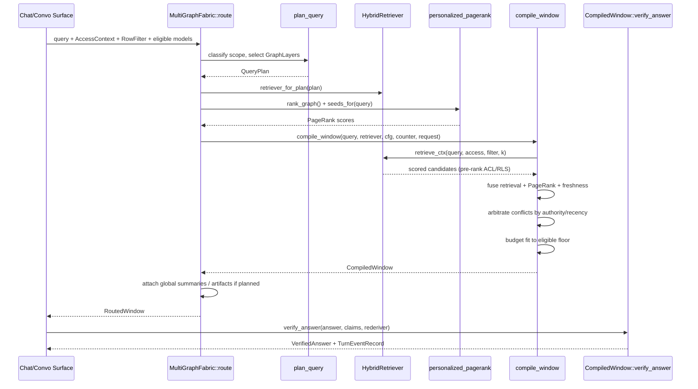
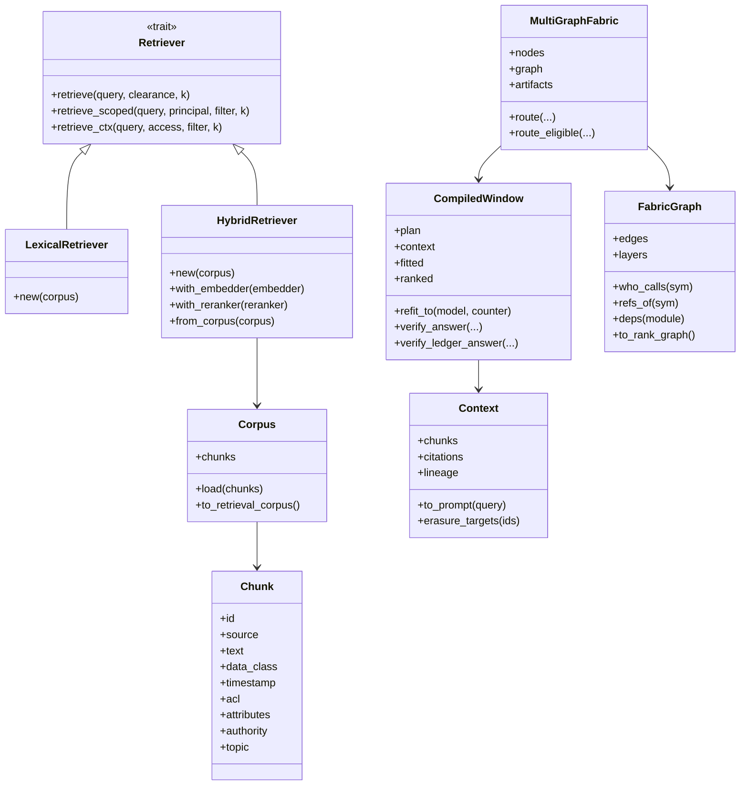

# Context Retrieval & Routing

## Purpose

The **Context Retrieval & Routing** module is the *Context Fabric* of the system: it turns a user query into a secured, grounded, citable, and auditable context window that downstream model calls can safely consume. It sits in the `knowledge_retrieval` subsystem and is responsible for:

1. **Retrieving** relevant knowledge chunks from a corpus while enforcing clearance, node-level RBAC, and row-level security **before** ranking.
2. **Routing** retrieval across a multi-layer fabric graph (code, docs, runtime, structured, federated, multimodal, etc.) based on a deterministic query plan.
3. **Ranking** candidates with a fused lexical + dense + cross-graph personalized PageRank score, plus freshness and authority signals.
4. **Assembling** a token-budget-fitted context window with citations and full lineage (every included, dropped, or superseded node is accounted for).
5. **Verifying** numeric answers via server-side re-derivation and producing a single event-log record for audit.

The module is designed around a single seam — the `Retriever` trait — so the lexical placeholder used in tests can be swapped for the production hybrid engine without changing any caller code.

## Architecture Overview

### Key Design Principles

- **Pre-rank security**: Data-class, node-ACL (department, seniority, groups), and RLS row-filters are applied *before* scoring, fusion, reranking, and fitting. A node the caller may not see never enters the candidate set — its existence never leaks.
- **Same seam, different engines**: The `Retriever` trait abstracts both the in-memory `LexicalRetriever` and the production `HybridRetriever` (BM25 + dense HNSW → RRF → rerank).
- **Determinism**: No RNG, no wall-clock, no hash-map iteration order. Results are reproducible for audit and testing.
- **Accountability**: Every retrieved node is recorded in `LineageNode` with `Included`, `DroppedByBudget`, or `SupersededByConflict` outcome.
- **Two-phase budget fit**: The window is first fit to the narrowest eligible model floor, then re-fit on model-confirm and every failover without silent truncation.

## Sub-Modules

The module is split into three sub-modules:

| Sub-module | File | Responsibility |
|------------|------|----------------|
| [Context Retrieval & Routing Core](context_retrieval_routing_core.md) | `src/lib.rs` | `Retriever` trait, `Corpus`, `Chunk`, `Context`, `HybridRetriever`, `LexicalRetriever`, `CompiledWindow`, assembly, verification, and event-log record. |
| [Context Retrieval & Routing Optimizer](context_retrieval_routing_optimizer.md) | `src/optimizer.rs` | Query planning (`plan_query`, `classify_scope`), cross-graph personalized PageRank, typed `FabricGraph`, named fabric queries, and community detection/summarization. |
| [Context Retrieval & Routing Router](context_retrieval_routing_router.md) | `src/route.rs` | Served routing layer: `MultiGraphFabric`, `FabricNode`, `RoutedWindow`, plan-routed retrieval, global-summary/multimodal tiers, and two-phase model fit. |

> **Cross-reference guide**: The retrieval seam, corpus model, context assembly, and verification gates are documented in [Context Retrieval & Routing Core](context_retrieval_routing_core.md); the query planner, cross-graph ranker, and community layer are documented in [Context Retrieval & Routing Optimizer](context_retrieval_routing_optimizer.md); the served multi-graph fabric, routed window, and two-phase fit are documented in [Context Retrieval & Routing Router](context_retrieval_routing_router.md).

## Data Flow

## Integration with the Rest of the System

- **Upstream callers**: `ainxt-convo`, `ainxt-chat`, and `ainxt-runtimed` drive `compile_window` / `MultiGraphFabric::route` on the served path.
- **Retrieval engine**: Delegates heavy lifting to `ainxt-retrieval` (`Corpus::hybrid`, `hybrid_ctx_rls`, `budget_fit_eligible`, `EligibleModel`, `TokenCounter`, `Reranker`). See [retrieval_core](retrieval_core.md) and [retrieval_advanced](retrieval_advanced.md).
- **Security / ACL / RLS**: Re-exports `AccessContext`, `NodeAcl`, `RowFilter`, `RlsSession`, `RlsPolicy` from `ainxt-retrieval`. See [security_config](security_config.md).
- **Numeric verification**: Re-exports and uses `ainxt-synthesis` re-derivation gates (`numeric_gate`, `LedgerAnswerGate`, `Rederiver`). See [quality_verification](quality_verification.md).
- **Prompt injection defense**: Uses `ainxt_injection::wrap_untrusted` to fence retrieved context as untrusted data. See [safety_guardrails](safety_guardrails.md).
- **Multimodal artifacts**: Routes artifact models through `crate::artifact::route_model` to ensure regulated data never reaches a cloud vision model. See [context_sources](context_sources.md).
- **Event log**: `TurnEventRecord` is the payload handed to `ainxt_eventlog`. See [core_interaction](core_interaction.md).

## Security Model

| Control | Where enforced | Guarantee |
|---------|---------------|-----------|
| Data-class clearance | `Retriever::retrieve` / `retrieve_ctx` | Above-clearance chunks are filtered pre-rank. |
| Node ACL (dept / seniority / groups) | `HybridRetriever::retrieve_ctx` → `ainxt_retrieval::Corpus::hybrid_ctx_rls` | Unauthorized nodes never scored. |
| RLS row-filter | `compile_rls` / `compile_window` → `retrieve_scoped` / `retrieve_ctx` | Rows outside caller scope never scored. |
| Conflict arbitration | `arbitrate_conflicts` | Contradictory claims are resolved by authority/recency; losers recorded as superseded. |
| Ledger numeric gate | `CompiledWindow::verify_ledger_answer` | Server-side re-derivation blocks mismatched figures for ledger-class sources. |
| Artifact model routing | `RoutedWindow::eligible_artifacts` | Regulated artifacts are never sent to cloud models. |

## Mermaid: Component Relationships

## See Also

- [context_sources](context_sources.md) — artifact and source extraction that feeds the fabric.
- [retrieval_core](retrieval_core.md) — the underlying retrieval engine (BM25, dense, rerank).
- [retrieval_advanced](retrieval_advanced.md) — federation, RLS, and structured retrieval.
- [quality_verification](quality_verification.md) — numeric re-derivation and answer verification.
- [safety_guardrails](safety_guardrails.md) — prompt injection and guardrail defenses.
- [core_interaction](core_interaction.md) — event log and session infrastructure.
