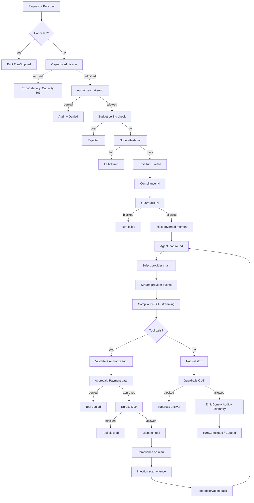
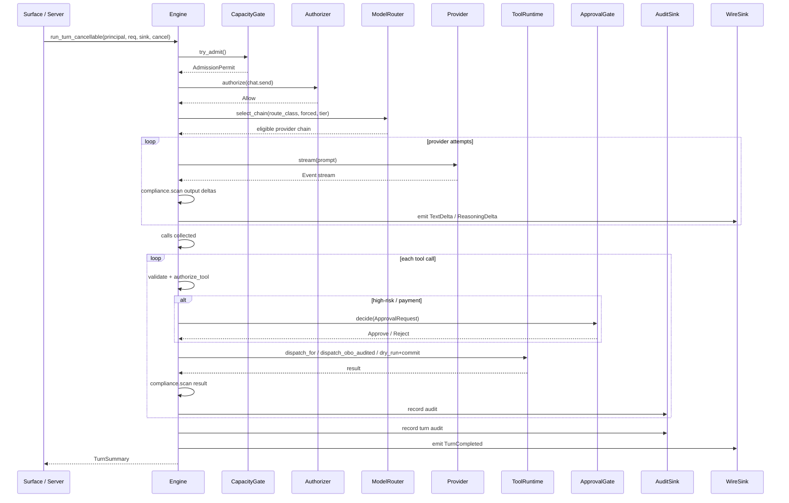

# core_engine — AiNxt Runtime Core

The `core_engine` module is implemented by the `ainxt-runtime` crate. It is the
**canonical turn pipeline** for the AiNxt system: it takes an authenticated
principal and a [`Request`](core_infrastructure.md), routes it through mandatory
compliance / authorization / audit gates, selects an eligible model, streams the
provider response, dispatches any tool calls, and returns a
[`TurnSummary`](#turn-summary) together with a stream of protocol events.

This module is intentionally the **lowest-level composition root** of the served
AI path. Higher-level surfaces such as chat, workforce, and program execution
build on top of it by either driving `Engine` directly or implementing the
[`TurnHandler`](#turnhandler-seam) trait.

---

## What this module does

| Responsibility | Description |
| -------------- | ----------- |
| **Mandatory gates** | Compliance, authorization, and audit are **required constructor arguments** of [`Engine`](#engine). There is no code path that builds an engine without them. |
| **Data-class routing** | The [`ModelRouter`](#model-router) excludes providers that are not eligible for the request's data class. This gate is **non-overridable** — even a forced provider must pass it. |
| **Governance-aware selection** | Outsourcing register (FI-03), model-risk / quality circuit-breaker (FI-07), steerability eligibility, and auto-routable sets are applied before ranking. |
| **Streaming execution** | Provider events are consumed, compliance-scanned, and forwarded to the caller's sink as they arrive. |
| **Agent loop** | Tool calls are validated, authorized, approved when risky, egress-scanned, and dispatched; results are fed back into the prompt for the next round. |
| **Safety layers** | Guardrails (input + output), prompt-injection defense, egress DLP, and payment-boundary approval are integrated as optional but fail-closed seams. |
| **Observability** | Every turn produces one audit record, one telemetry record, and — when configured — a stream of typed wire envelopes. |

---

## Architecture

```mermaid
flowchart TB
    subgraph core_engine["core_engine (ainxt-runtime)"]
        E["Engine"]
        MR["ModelRouter"]
        CG["compliance::ComplianceGate"]
        AZ["authz::Authorizer"]
        AD["audit::AuditSink"]
        PR["provider::Provider"]
        AP["approval::ApprovalGate"]
        BG["budget::BudgetStore"]
        CP["capacity::CapacityGate"]
        CX["complexity::ComplexityClassifier"]
        NA["serving::NodeAttestor"]
        MEM["memory::MemoryReader"]
        WS["wire::WireSink"]
        TL["telemetry::TelemetrySink"]
    end

    E -->|uses| MR
    E -->|uses| CG
    E -->|uses| AZ
    E -->|uses| AD
    E -->|streams from| PR
    E -->|consults| AP
    E -->|consults| BG
    E -->|admits via| CP
    E -->|derives tier via| CX
    E -->|attests via| NA
    E -->|reads memory via| MEM
    E -->|emits typed events to| WS
    E -->|records metrics to| TL

    runtime_configuration["runtime_configuration"] -.configures.-> E
    surfaces["surfaces"] -.implements TurnHandler.-> E
    server_serving["server_serving"] -.drives.-> E
    serving_infrastructure["serving_infrastructure"] -.provides NodeAttestor.-> NA
    memory_management["memory_management"] -.provides MemoryReader.-> MEM
    safety_guardrails["safety_guardrails"] -.provides GuardrailsConfig / InjectionConfig.-> E
    prompt_engineering["prompt_engineering"] -.provides complexity / prompt-cache.-> E
    tools_cli["tools_cli"] -.provides ToolRuntime / OBO policy.-> E
```



### Engine

[`Engine`](crates/ainxt-runtime/src/lib.rs::Engine) is the central struct. It is
built with the three mandatory gates and a [`ModelRouter`](#model-router), then
extended through a fluent `with_*` API:

- `with_tools` / `with_shared_tools` — attach a [`ToolRuntime`](tools_cli.md) for the agent loop.
- `with_obo` — enable the audited three-layer On-Behalf-Of tool dispatch gate (R14).
- `with_guardrails` / `with_system_prompt` — opt into input/output guardrails.
- `with_injection` / `with_injection_scanner` — enable prompt-injection defense.
- `with_egress_policy` — configure outbound DLP.
- `with_approval` / `with_payment_boundary_resolver` — human / policy approval for high-risk and payment-boundary actions.
- `with_budget_store` — per-principal spend ceiling.
- `with_capacity_gate` — bounded-inflight admission (503 when saturated).
- `with_complexity_classifier` — derive model tier from the request.
- `with_node_attestor` — fail-closed node attestation before provider dispatch.
- `with_memory` / `with_memory_task_resolver` — inject governed Context-Fabric memory.
- `with_wire_sink` / `with_control_plane_sha` — emit typed §4/§6 wire envelopes.
- `with_telemetry` / `with_pricing` — cost and outcome attribution.

The engine exposes:

- `run_turn` / `run_turn_cancellable` — the full streaming turn pipeline.
- `run_turn_collect` — convenience helper that collects the event stream.
- `compliance`, `router`, `authorize_short_circuit`, `audit_short_circuit` —
  escape hatches for surfaces that answer without a full engine round while still
  using the same gates and audit trail.

### Model Router

[`ModelRouter`](crates/ainxt-runtime/src/lib.rs::ModelRouter) selects providers
from a registered set. Selection is performed in three layers:

1. **Non-overridable admission** — data-class eligibility, FI-03 outsourcing
   register, FI-07 model-risk/quality, and steerability.
2. **Tier filtering** — a hard `pinned_tier` excludes off-tier providers; an
   unpinned turn uses the [`ComplexityClassifier`](#complexity-classifier) as a
   soft preference.
3. **Ranking** — `select_chain_graded` scores survivors by quality, cost, and
   latency using [`RouteMetrics`](#route-metrics) and [`RankWeights`](#rank-weights).

Key router types:

| Type | Purpose |
| ---- | ------- |
| `OutsourcingGuard` | FI-03 gate over a shared `OutsourcingRegister`. |
| `QualityGuard` | FI-07 gate with live quality circuit-breaker and due-diligence config. |
| `RouteMetrics` | Per-provider quality/cost/latency signal for graded ranking. |
| `RankWeights` | Policy weights that combine the three metrics into a score. |
| `RouteError` | `NoEligible(data_class)` or `ForcedNotEligible(id, data_class)`. |

### Mandatory gates

| Gate | Trait | Default implementation | Invariant |
| ---- | ----- | ---------------------- | --------- |
| Compliance | `ComplianceGate` | `RedactAndProceed` | Redact-and-proceed on input, tool args, tool results, and output. |
| Authorization | `Authorizer` | `RbacAuthorizer` | Capability-based; `authorize_tool` enforces declared grant ∧ connector scope ∧ resource ABAC. |
| Audit | `AuditSink` | `InMemoryAudit` | Every turn writes at least one `AuditRecord`. |

### Supporting seams

| Seam | Trait / Struct | Role |
| ---- | -------------- | ---- |
| Provider | `provider::Provider` | Normalized event-enum seam every vendor adapter implements. |
| Approval | `approval::ApprovalGate` | Human / policy decision for high-risk and payment-boundary tools. |
| Budget | `budget::BudgetStore` | Pre-turn spend ceiling check. |
| Capacity | `capacity::CapacityGate` | Bounded-inflight admission; default `InflightGate`. |
| Complexity | `complexity::ComplexityClassifier` | Derives `Tier` from request; default `TierFromRequest`, optional `HeuristicComplexityClassifier`. |
| Error classification | `error::ErrorClassifier` | Retryable vs terminal provider errors. |
| Node attestation | `serving::NodeAttestor` | Fail-closed pre-dispatch trust check; `ServingGateAttestor` adapts `ainxt_serving::gate::ServingGate`. |
| Memory | `memory::MemoryReader` | Reads governed memory under caller identity; `SharedMemoryStore` adapts `ainxt_memory::InMemoryStore`. |
| Wire | `wire::WireSink` | Emits typed `EventEnvelope` / `WireEvent` stream. |
| Telemetry | `TelemetrySink` | One `TurnMetrics` record per turn. |

---

## Turn pipeline

The following diagram shows the end-to-end flow inside
`Engine::run_turn_cancellable`.



### Pipeline steps

1. **Pre-flight checks** — cancellation, capacity admission, `chat.send`
   authorization, budget ceiling, and node attestation run before any provider is
   contacted.
2. **Compliance IN** — the user input is scanned and redacted before it reaches
   the model.
3. **Guardrails IN** — optional input rails (jailbreak, injection, topic) may
   block or flag the turn.
4. **Memory injection** — if a `MemoryReader` is attached, governed memory hits
   are read under the caller's identity, compliance-scanned, and prepended to the
   prompt. Lineage is recorded for forensic replay.
5. **Provider round** — the router selects an eligible chain. The engine retries
   the same provider on retryable errors, then fails over. Streaming deltas are
   compliance-scanned with a carry buffer so secrets split across chunks are
   redacted whole.
6. **Tool dispatch** — each tool call is validated, authorized via
   `authorize_tool`, checked against approval / payment / egress / injection
   gates, and dispatched. Side-effecting and payment-boundary tools require
   explicit human approval; `ApproveForSession` and policy-auto decisions cannot
   clear a payment action.
7. **Result processing** — tool results are compliance-scanned, injection-scanned
   and fenced, and fed back into the prompt. The tri-signal data-class classifier
   may raise the route class for subsequent rounds.
8. **Loop control** — the loop runs until the model emits no tool calls, the
   iteration cap is hit, or the `StuckDetector` diagnoses a cycle/no-progress.
   Only a natural stop is reported as `Complete`; capped turns are reported as
   `Capped`.
9. **Guardrails OUT** — if output rails are configured, the full answer is
   buffered and evaluated before streaming.
10. **Termination** — `Event::Done`, mandatory audit record, telemetry record,
    and a typed `TurnCompleted` / `TurnStopped` / `TurnFailed` wire event.

---

## Key data types

### Turn outcome

```rust
pub struct TurnOutcome {
    pub events: Vec<Event>,
    pub final_text: String,
    pub redactions: usize,
    pub provider: String,
}
```

`TurnOutcome` is the collected result of `run_turn_collect`. The streaming path
instead returns a [`TurnSummary`](#turn-summary) and sends events to the caller's
sink.

### Turn summary

```rust
pub struct TurnSummary {
    pub final_text: String,
    pub redactions: usize,
    pub provider: String,
    pub format: Option<String>,          // pdf | docx | pptx | xlsx
    pub document_json: Option<String>,   // artifact Document IR as JSON
    pub action: Option<String>,          // email | summarize | translate | save
}
```

`TurnSummary` carries the final text plus optional signals for artifact
generation and content-action terminals. The string payloads avoid a dependency
on higher-level crates such as `ainxt-artifact` and `ainxt-convo`.

### Turn error

```rust
pub enum TurnError {
    Denied(String),
    Routing(RouteError),
    Capacity(String),
    Internal(String),
}
```

`Capacity` is produced when the bounded-inflight admission gate refuses a turn
before it starts.

### Route metrics & weights

```rust
pub struct RouteMetrics {
    pub quality_score: u32, // higher is better
    pub cost: u64,          // lower is better
    pub latency: u64,       // lower is better
}

pub struct RankWeights {
    pub quality: i64,
    pub cost: i64,
    pub latency: i64,
}
```

The score is `quality*weight - cost*weight - latency*weight`. Defaults favor
quality, then cost, then latency.

---

## Component interactions



---

## Dependencies on other modules

| Module | How it relates to core_engine |
| ------ | ----------------------------- |
| [runtime_configuration](runtime_configuration.md) | The daemon's `LoadedConfig` / `ServingConfig` builds the engine, wires the provider set, and installs capacity / memory / attestation / pricing seams. |
| [surfaces](surfaces.md) | `ChatSurface`, `FabricGroundedChatSurface`, `WorkforceTurnSurface`, etc. implement `TurnHandler` and drive `Engine` through the session spine. |
| [program_governance_and_execution](program_governance_and_execution.md) | `ProgramRuntime` and `ServedProgramGovernance` orchestrate multi-step program runs over the engine turn pipeline. |
| [server_serving](server_serving.md) | The HTTP server owns the `AppState` that holds the shared `Engine` and routes `/v1/chat`, harness, and admin requests to it. |
| [serving_infrastructure](serving_infrastructure.md) | Provides `ServingGate`, attestation, placement, health, and admission controllers consumed via `ServingGateAttestor` and capacity seams. |
| [memory_management](memory_management.md) | Supplies `InMemoryStore`, durable memory backends, and the Context-Fabric read path used by `SharedMemoryStore`. |
| [safety_guardrails](safety_guardrails.md) | `GuardrailsConfig`, `RailChain`, and `InjectionConfig` feed the input/output rails and prompt-injection defense. |
| [prompt_engineering](prompt_engineering.md) | Complexity classifiers, prompt cache, and steerability eligibility are configured here and handed to the engine. |
| [tools_cli](tools_cli.md) | `ToolRuntime`, OBO policy / sink, exactly-once ledger, and tool schema validation live in this area. |
| [core_infrastructure](core_infrastructure.md) | Foundational types: `Principal`, `DataClass`, `Tier`, `Request`, `Event`, `EventEnvelope`, telemetry, and protocol errors. |
| [ai_engine](ai_engine.md) | Quality verification, judge panels, and synthesis feed the live quality scoreboard that the router consumes via `live_quality_metrics`. |
| [governance_compliance](governance_compliance.md) | Outsourcing register, model-risk records, responsible-AI gates, and identity/attestation policies inform router eligibility and node attestation. |

---

## Extension points

All safety-critical behavior is exposed through trait seams, so production
deployments can plug in real implementations without changing the engine:

- Replace `RedactAndProceed` with an enterprise PCI/DSS compliance detector.
- Replace `RbacAuthorizer` with AD-RBAC.
- Replace `InMemoryAudit` with a tamper-evident, chain-hashed audit sink.
- Add real HTTP provider adapters behind `Provider`.
- Add a Redis-backed `BudgetStore` or `CapacityGate`.
- Add an ML-based `ComplexityClassifier` or `InjectionScanner`.
- Add a human-in-the-loop `ApprovalGate` for production risky tools.

---

## Operational notes

- **Fail-closed by default**: missing optional gates (approval, injection,
  attestation) disable functionality rather than bypass safety. For example, a
  high-risk tool with no approval gate is refused.
- **Non-overridable routing**: a provider forced by `Request::forced_provider` or
  a Role's `allowed_providers` still must pass data-class, outsourcing, quality,
  and steerability admission.
- **Capacity 503**: the default `InflightGate` ceiling is generous
  (`DEFAULT_MAX_INFLIGHT = 4096`). Production deployments should size it to the
  fleet's proven concurrent-turn capacity or use a distributed limiter.
- **Loop verification**: only a round with no tool calls is `Complete`. Turns
  stopped by the iteration cap or stuck detector are truthfully reported as
  `Capped` on the wire.
- **Cost attribution**: usage is tallied per provider so a failover turn is
  billed at each provider's own rate, and failed attempts are discarded.

---

## See also

- [runtime_configuration](runtime_configuration.md)
- [surfaces](surfaces.md)
- [program_governance_and_execution](program_governance_and_execution.md)
- [server_serving](server_serving.md)
- [serving_infrastructure](serving_infrastructure.md)
- [memory_management](memory_management.md)
- [safety_guardrails](safety_guardrails.md)
- [prompt_engineering](prompt_engineering.md)
- [tools_cli](tools_cli.md)
- [core_infrastructure](core_infrastructure.md)
- [ai_engine](ai_engine.md)
- [governance_compliance](governance_compliance.md)
