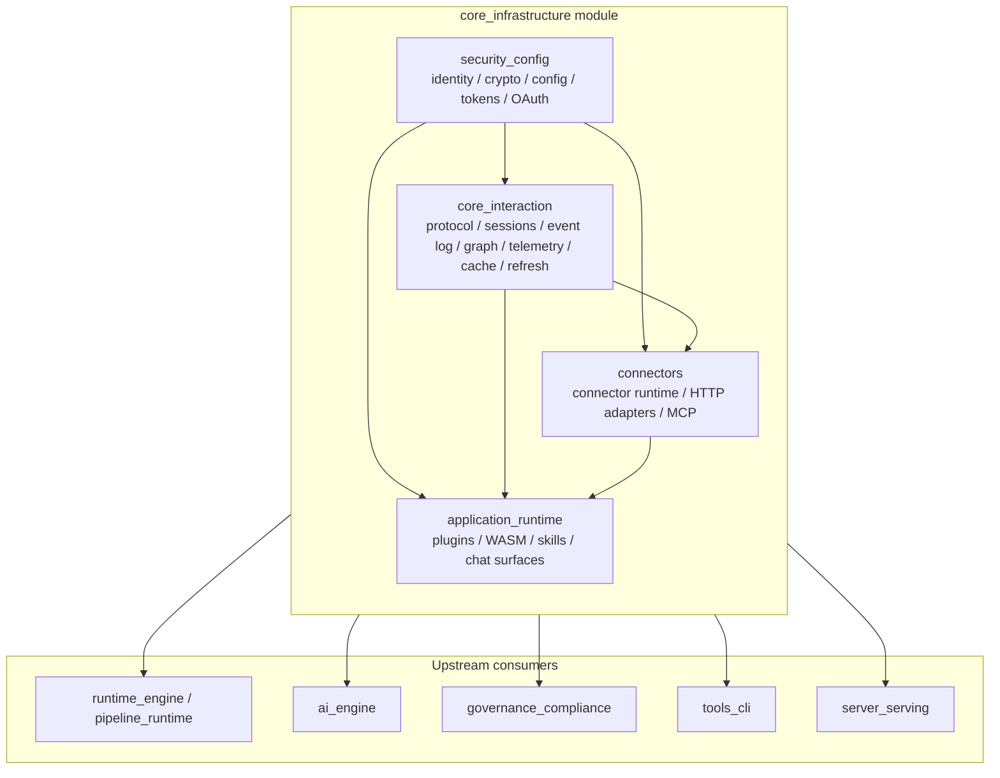
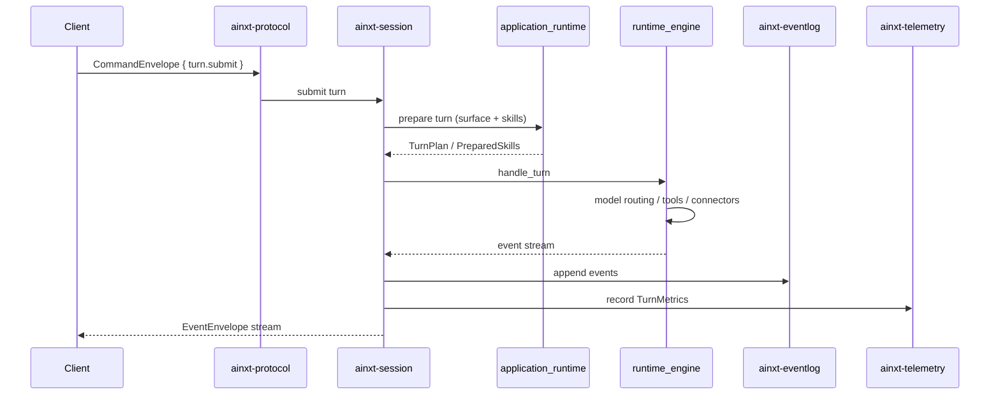

# `core_infrastructure` Module

## Purpose

`core_infrastructure` is the shared foundation of the AiNxt platform. It contains the deterministic, I/O-light building blocks that every higher-level module depends on:

- **Identity, configuration, and cryptography** — who is calling, what the runtime is allowed to do, and which algorithms/secrets are permitted.
- **Core interaction** — the wire contract, session actor model, durable event log, knowledge graph, telemetry, cache, and token-refresh coordination.
- **Connectors** — the outbound gateway to external systems, with mandatory admission control, egress DLP, and tamper-evident audit.
- **Application runtime** — capability-confined plugins (WASM/native), skill execution, and conversation surfaces.

The module is intentionally seam-based: production implementations plug in real transports, stores, and crypto backends, while tests use in-memory or deterministic substitutes. All heavy concerns — model inference, retrieval, governance, serving — live in sibling modules and consume the primitives exposed here.

## Architecture

### Submodule responsibilities

| Submodule | Key crates | Responsibility |
|-----------|------------|----------------|
| `security_config` | `ainxt-types`, `ainxt-config`, `ainxt-cryptoagility`, `ainxt-token`, `ainxt-oauth` | Identity (`Principal`), data classification, crypto-agility policy, encrypted token vault, OAuth/PKCE, and layered runtime configuration. |
| `core_interaction` | `ainxt-protocol`, `ainxt-session`, `ainxt-eventlog`, `ainxt-graph`, `ainxt-telemetry`, `ainxt-cache`, `ainxt-refresh` | Versioned wire contract, per-session actor routing, tamper-evident event log, RBAC knowledge graph, observability, partitioned response cache, and distributed token-refresh locking. |
| `connectors` | `ainxt-connector`, `ainxt-connector-http`, `ainxt-mcp` | Mandatory connector admission, egress DLP, HTTP adapter gateway, OAuth lifecycle, and MCP server discovery/ranking/pinning. |
| `application_runtime` | `ainxt-plugin`, `ainxt-wasm`, `ainxt-skill`, `ainxt-surface`, `ainxt-chat`, `ainxt-convo` | Capability-confined plugin hosting, WASM sandboxing, skill execution, surface binding, and end-to-end conversation management. |

### Turn data flow

## Core components

- **`Principal`** (`ainxt-types`) — the identity atom carried through sessions, audit, telemetry, and graph queries.
- **`RuntimeConfig` / `GatesConfig`** (`ainxt-config`) — layered, fail-closed runtime policy.
- **`GovernedHasher` / `AlgorithmRegistry`** (`ainxt-cryptoagility`) — crypto-agility policy resolution.
- **`TokenVault` / `AeadCodec`** (`ainxt-token`) — encrypted, identity-bound secret storage.
- **`OAuthProvider`** (`ainxt-oauth`) — PKCE-bound OAuth initiation and callback validation.
- **`CommandEnvelope` / `EventEnvelope`** (`ainxt-protocol`) — versioned client↔runtime wire contract.
- **`SessionManager`** (`ainxt-session`) — bounded, per-session actor routing with resume and cancellation.
- **`JsonlEventLog`** (`ainxt-eventlog`) — append-only, hash-chained, tamper-evident event persistence.
- **`Graph`** (`ainxt-graph`) — traversal-time RBAC knowledge graph.
- **`TelemetrySink`** / `TurnMetrics` (`ainxt-telemetry`) — pluggable observability and integer cost attribution.
- **`ResponseCache`** / `PartitionedCache` (`ainxt-cache`) — exact, normalized, and semantic response caching with partition isolation.
- **`RefreshCoordinator`** (`ainxt-refresh`) — distributed double-checked locking for OAuth token refresh.
- **`ConnectorRuntime`** (`ainxt-connector`) — mandatory policy spine for all outbound connector calls.
- **`PluginHost` / `WasmPluginHost` / `WasmSandbox`** (`ainxt-plugin`, `ainxt-wasm`) — capability-confined plugin execution.
- **`SkillRuntime` / `SkillRegistry`** (`ainxt-skill`) — versioned skill catalog and execution dispatch.
- **`SurfaceBinding` / `ChatSurface` / `ConversationManager`** (`ainxt-surface`, `ainxt-chat`, `ainxt-convo`) — declarative surface binding and conversation orchestration.

## References to core component documentation

- [`core_interaction.md`](core_interaction.md) — protocol, sessions, event log, graph, telemetry, cache, refresh.
- [`security_config.md`](security_config.md) — identity, crypto-agility, token vault, OAuth, runtime config.
- [`connectors.md`](connectors.md) — connector runtime, HTTP connectors, MCP runtime.
- [`application_runtime.md`](application_runtime.md) — plugins, WASM sandbox, skills, surfaces, conversation.