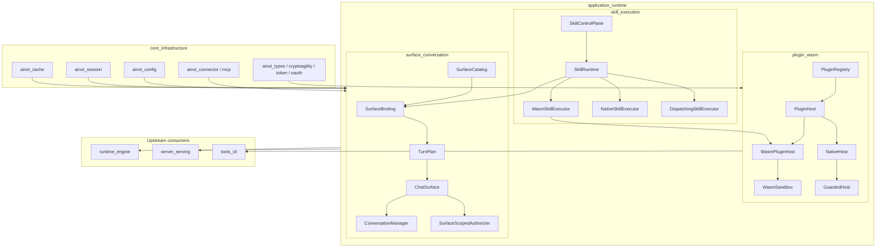
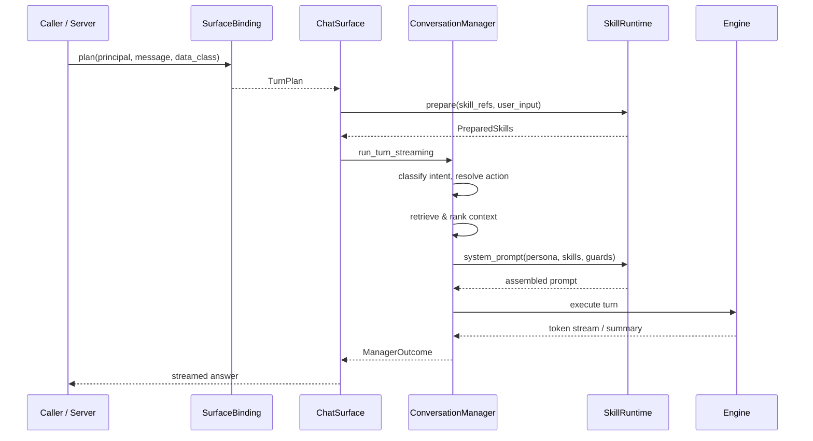

# application_runtime Module

## Purpose

The `application_runtime` module is the **executable application layer** of the AiNxt platform. It turns the lower-level building blocks provided by `core_infrastructure` — identity, configuration, connectors, sessions, caching, and telemetry — into concrete, user-facing runtime capabilities:

- **Capability-confined plugins** via WebAssembly and native hosts.
- **Skill execution** for behavioral and computed augmentation of conversation turns.
- **Conversation surfaces** that bind declarative profiles to end-to-end chat and command handling.

The module is responsible for loading untrusted or semi-trusted extensions safely, preparing the prompts and context that drive a turn, and exposing the assembled chat surface to the runtime engine and server layers.

---

## Architecture Overview

### Turn assembly data flow

---

## Sub-modules

| Sub-module | Crates | Responsibility | Documentation |
|------------|--------|----------------|---------------|
| `plugin_wasm` | `ainxt-plugin`, `ainxt-wasm` | Load, verify, and invoke capability-confined plugins inside a WebAssembly sandbox or a guarded native host. | [plugin_wasm.md](plugin_wasm.md) |
| `skill_execution` | `ainxt-skill` | Git-native skill catalog, hot-reload, relevance selection, and pluggable skill executors (native, WASM, OS process). | [skill_execution.md](skill_execution.md) |
| `surface_conversation` | `ainxt-surface`, `ainxt-chat`, `ainxt-convo` | Bind surface profiles to executable turn plans and run the end-to-end conversation surface. | [surface_conversation.md](surface_conversation.md) |

### Deeper sub-module references

- **plugin_wasm**
  - [plugin_wasm_plugin.md](plugin_wasm_plugin.md) — `PluginHost`, `PluginRegistry`, `NativeHost`, `GuardedHost`, supply-chain verification.
  - [plugin_wasm_sandbox.md](plugin_wasm_sandbox.md) — `WasmSandbox`, `WasmPluginHost`, fuel/epoch limits, scoped host imports.

- **skill_execution**
  - [skill_execution_control_plane.md](skill_execution_control_plane.md) — `SkillControlPlane`, `ControlLock`, git-native loader.
  - [skill_execution_runtime.md](skill_execution_runtime.md) — `SkillRuntime`, `SkillRegistry`, prompt assembly.
  - [skill_execution_executors.md](skill_execution_executors.md) — `WasmSkillExecutor`, `NativeSkillExecutor`, `DispatchingSkillExecutor`, `NativeProcessSkillExecutor`.

- **surface_conversation**
  - [surface_conversation_binding.md](surface_conversation_binding.md) — `SurfaceBinding`, `TurnPlan`, `SurfaceCatalog`, artifact generation.
  - [surface_conversation_chat.md](surface_conversation_chat.md) — `ChatSurface`, `SurfaceScopedAuthorizer`, tiered caching.
  - [surface_conversation_intelligence.md](surface_conversation_intelligence.md) — `ConversationManager`, intent classifiers, command pipelines, answer verification.

---

## Core Components

Key types that define the module's seams:

- **`PluginHost`** — unified invocation trait for native and WASM plugins.
- **`WasmPluginHost` / `WasmSandbox`** — real WebAssembly sandbox with fuel, memory, output, and wall-clock limits.
- **`NativeHost` / `GuardedHost`** — in-process plugin host with wall-clock timeout decoration.
- **`PluginRegistry`** — registry-mediated, depth-bounded peer calls between plugins.
- **`SkillRuntime` / `SkillRegistry`** — versioned skill catalog and prompt/context assembly.
- **`SkillControlPlane`** — git-native loader with `control.lock` verification.
- **`SurfaceBinding`** — binds a `SurfaceProfile` and `SkillRuntime` to a concrete `TurnPlan`.
- **`TurnPlan`** — the resolved inputs needed for one turn.
- **`ChatSurface`** — assembled end-to-end chat surface implementing the turn handler contract.
- **`ConversationManager`** — session memory, intent cascade, retrieval, and answer composition.
- **`SurfaceScopedAuthorizer`** — narrows tool/connector authorization to the surface's declared capability set.

---

## Integration with the Rest of the System

- **Parent module**: [`core_infrastructure`](core_infrastructure.md) provides sessions, caching, connectors, identity, and configuration.
- **Consumers**:
  - [`runtime_engine`](../pipeline_runtime/runtime_engine.md) executes the turns produced by the conversation surface.
  - [`server_serving`](../pipeline_runtime/server_serving.md) exposes the chat surface over HTTP and wires runtime configuration.
  - [`tools_cli`](../tools_cli/tools_cli.md) invokes plugins through the same `PluginHost` seam.
- **Peers**:
  - [`security_config`](security_config.md) supplies cryptographic primitives for plugin supply-chain verification.
  - [`prompt_engineering`](../ai_engine/prompt_engineering.md) provides layered prompt assembly consumed by the skill and conversation layers.
  - [`knowledge_retrieval`](../ai_engine/knowledge_retrieval.md) supplies grounded retrieval and citation assembly.
  - [`safety_guardrails`](../ai_engine/safety_guardrails.md) provides output-side rails and injection defense.

---

## Key Design Principles

1. **Fail-closed loading** — malformed manifests, missing locks, or hash mismatches prevent load; the caller keeps the last-known-good state.
2. **Least-privilege capabilities** — effective authority is always `requested ∩ granted`; ungranted imports fail at instantiation.
3. **Hard isolation** — untrusted code runs in a WebAssembly sandbox with deterministic resource ceilings, or inside a guarded native host.
4. **Atomic hot-reload** — skill and plugin catalogs can be reloaded without interrupting in-flight turns.
5. **Declarative-to-executable binding** — surface profiles are resolved into concrete `TurnPlan`s with admission, data-class ceilings, and capability intersection enforced before execution.
6. **Audit-and-proceed** — document and artifact generation records compliance findings but does not silently redact rendered output.

---

## Related Documentation

- [plugin_wasm.md](plugin_wasm.md)
- [skill_execution.md](skill_execution.md)
- [surface_conversation.md](surface_conversation.md)
- [core_infrastructure.md](core_infrastructure.md)
- [runtime_engine.md](../pipeline_runtime/runtime_engine.md)