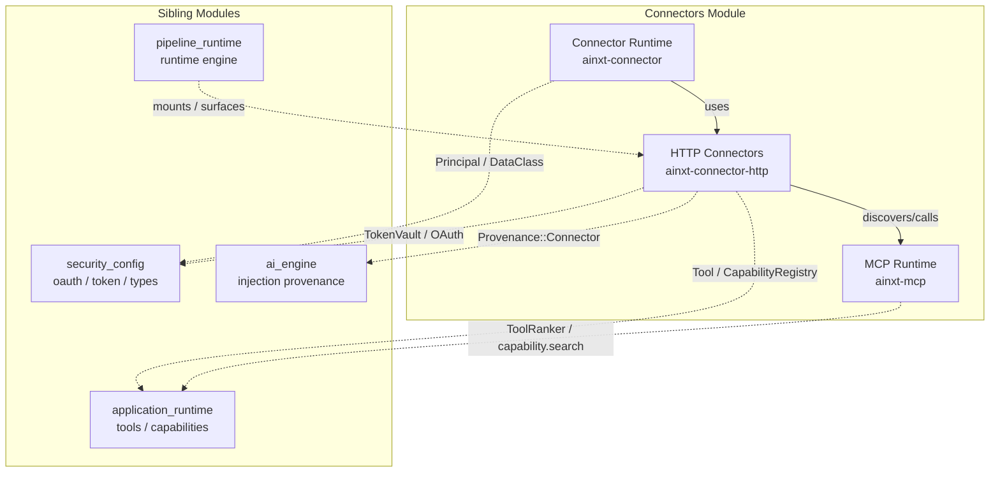
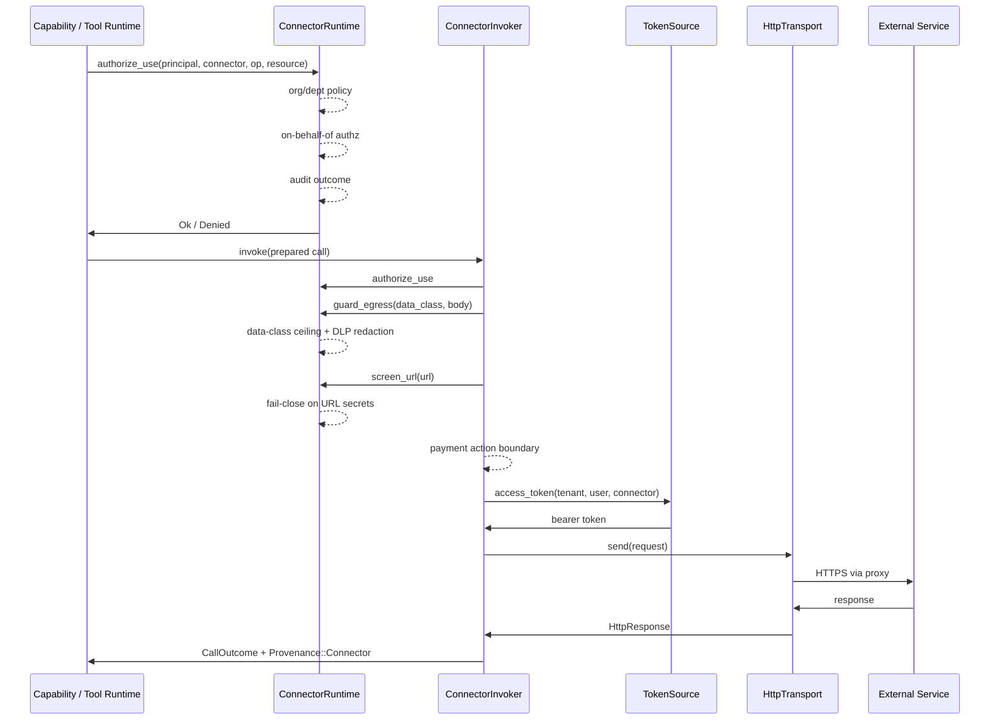
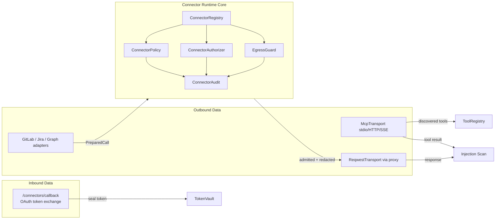

# Connectors Module

The **connectors** module is the system's outbound gateway to external services. It lets the runtime act on behalf of an authenticated user against third-party systems such as GitLab, Jira, Microsoft Graph, and arbitrary MCP (Model Context Protocol) servers, while enforcing a consistent, fail-closed safety model on every call.

The module is deliberately split into three layers:

1. **Connector Runtime** — the policy spine that every outbound action must pass through.
2. **HTTP Connectors** — concrete adapters and an air-gap-aware HTTP transport that sit on top of the runtime.
3. **MCP Runtime** — transport-agnostic discovery, ranking, routing, and trust-on-first-use pinning for MCP servers.

All three layers share the same design principles: mandatory admission control, least-privilege defaults, egress data-loss prevention, tamper-evident audit, and soft-degradation when an external system is unreachable.

## Architecture Overview

The connectors module sits in `core_infrastructure` and is consumed by both the **pipeline/runtime** layer (which mounts connector surfaces and dispatches capabilities) and the **AI engine** (which tags connector ingress as untrusted and fences it). It delegates identity, token storage, and cryptographic concerns to [security_config](security_config.md), and plugs discovered capabilities into the unified tool registry described in [application_runtime](application_runtime.md).

## Connector Call Flow

Every outbound connector call follows a single, non-bypassable pipeline:

Key invariants:

- **Admission runs first.** A denied call never touches the network.
- **Egress control runs on every call.** Regulated/PII data is blocked by the data-class ceiling; write bodies and URLs are scanned for secrets/PANs.
- **Tokens are resolved after egress scanning.** The bearer token is never exposed to the DLP scanner.
- **Ingress is untrusted.** All connector responses carry `Provenance::Connector` and are fenced by the injection stage.

## Sub-modules

| Sub-module | Crate | Responsibility | Documentation |
|------------|-------|----------------|---------------|
| Connector Runtime | `ainxt-connector` | Mandatory policy spine: registry, org/dept policy, OBO authz, egress DLP, tamper-evident audit | [connectors_runtime.md](connectors_runtime.md) |
| HTTP Connectors | `ainxt-connector-http` | HTTP transport, OAuth lifecycle, concrete adapters (GitLab/Jira/Graph), tool-capability bridge | [connectors_http.md](connectors_http.md) |
| MCP Runtime | `ainxt-mcp` | Lazy discovery, parallel aggregation, BM25 ranking, URL-namespaced routing, TOFU manifest pinning | [connectors_mcp.md](connectors_mcp.md) |

> Each sub-module documentation file above was generated from the corresponding crate source and contains component-level details, data structures, and process flows. Cross-references use the final file names `connectors_runtime.md`, `connectors_http.md`, and `connectors_mcp.md`.

## Integration with the Rest of the System

### Security and Identity ([security_config](security_config.md))

- `Principal`, `Role`, `DataClass`, and department scoping come from `ainxt-types`.
- OAuth provider configuration, PKCE state, and token exchange live in `ainxt-oauth`.
- Encrypted, tenant-scoped token storage is provided by `ainxt-token`.
- Refresh-under-lock is coordinated by `ainxt-refresh`.

### AI Engine ([ai_engine](../ai_engine/ai_engine.md))

- `Provenance::Connector` from `ainxt-injection` marks connector ingress as untrusted.
- The injection/detection stage fences connector data before it reaches prompt context.

### Application Runtime ([application_runtime](application_runtime.md))

- `ConnectorCapability` adapts connector operations into the same `Tool`/`CapabilityRegistry` used by native functions, WASM plugins, and MCP-discovered tools.
- `McpRegistry` feeds discovered tools into the planner via `capability.search` and the core tool set.

### Pipeline / Runtime ([pipeline_runtime](../pipeline_runtime/pipeline_runtime.md))

- `ainxt-runtimed` mounts connector gateway routes (`/connectors`, `/connectors/{id}/authorize`, `/connectors/callback`, `DELETE /connectors/{id}`).
- The runtime engine dispatches connector capabilities through `ToolRuntime::dispatch_for` / `dispatch_obo`.

## Data Flow Diagram

## Fail-Closed Guarantees

| Threat | Mitigation | Location |
|--------|------------|----------|
| Unauthorized connector use | Org/dept policy + capability-based OBO authz | `ConnectorRuntime::authorize_use` |
| Regulated data egress | Data-class ceiling per connector definition | `ConnectorRuntime::guard_egress` |
| Secrets/PANs in bodies | DLP redaction (PANs, credentials, PEM keys, markers) | `MarkerEgressGuard` |
| Secrets/PANs in URLs | URL fail-close screening | `ConnectorRuntime::screen_url` |
| Tampered audit logs | SHA-256 hash chain over every admission/egress event | `HashChainedConnectorAudit` |
| Payment-initiation via connector | Settlement-perimeter deny-list + graduated tripwire remediation | `ConnectorInvoker::invoke_in` |
| Untrusted connector data | `Provenance::Connector` + injection fencing | `CallOutcome::provenance` |
| Silent MCP manifest mutation | TOFU content-hash pin + reconnect diff | `McpRegistry::discover_pinned` |
| MCP namespace collision | URL-derived namespace segment | `McpRegistry::qualify` |

## See Also

- [connectors_runtime.md](connectors_runtime.md) — policy spine and safety seams
- [connectors_http.md](connectors_http.md) — HTTP adapters, transport, and OAuth lifecycle
- [connectors_mcp.md](connectors_mcp.md) — MCP discovery, ranking, routing, and pinning
- [security_config.md](security_config.md) — identity, OAuth, token storage, and data classification
- [ai_engine.md](../ai_engine/ai_engine.md) — injection provenance and guardrails
- [application_runtime.md](application_runtime.md) — tool registry and capability dispatch
- [pipeline_runtime.md](../pipeline_runtime/pipeline_runtime.md) — runtime engine and server surfaces
