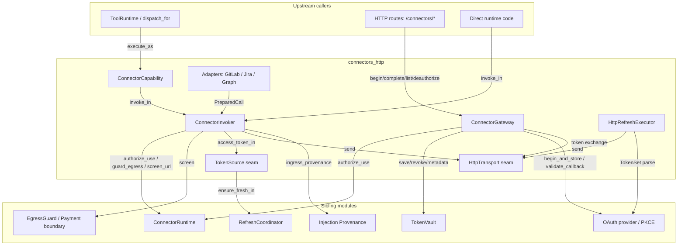
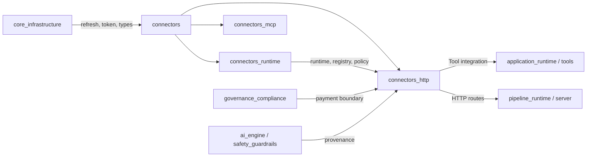
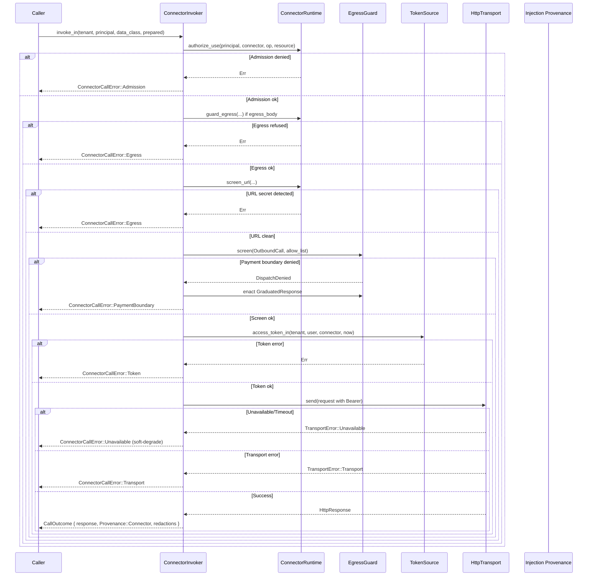
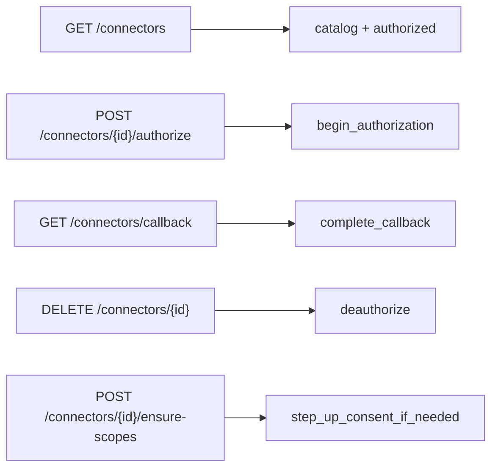
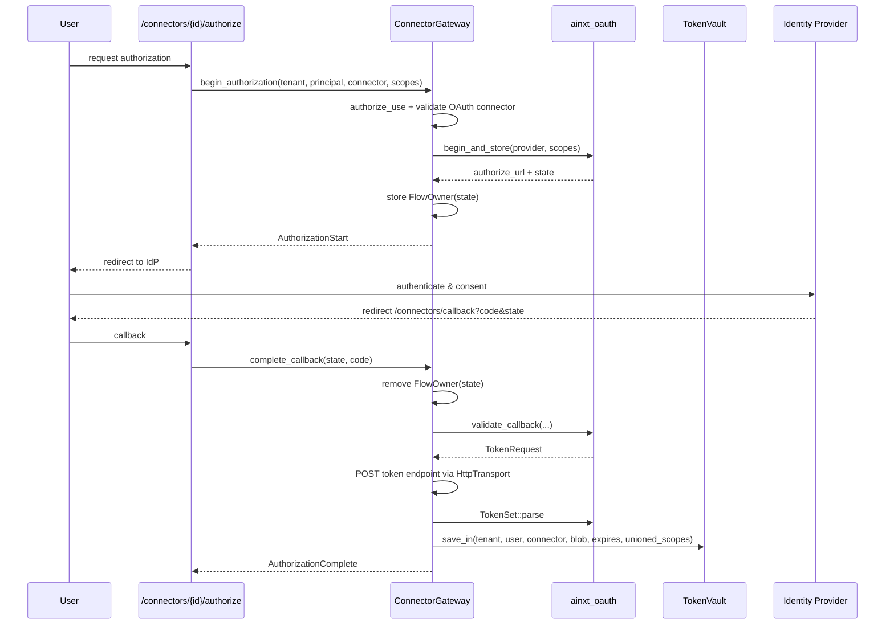
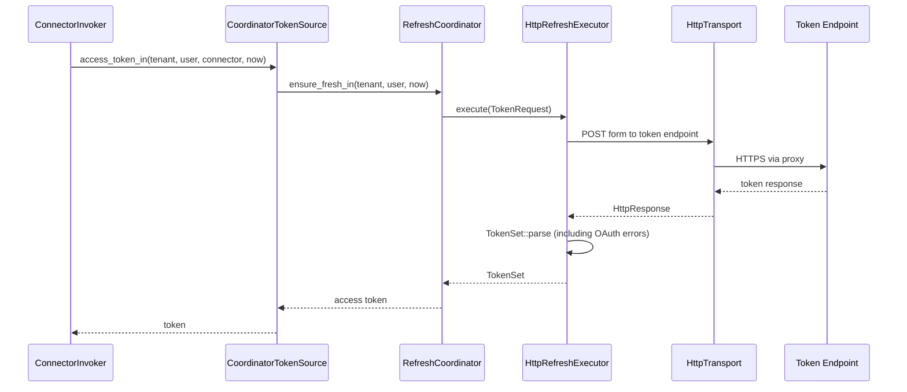

# connectors_http — HTTP Connector Adapters & Air-Gap Transport

The `connectors_http` module (`ainxt-connector-http`) is the **wire-side implementation of the connector subsystem**. It takes the policy, authorization, audit, and egress seams defined by the connector runtime and turns them into concrete outbound HTTP calls to third-party SaaS APIs such as GitLab, Jira, and Microsoft Graph.

Every connector call flows through a single, enforced pipeline: **admission → egress control → payment-boundary screening → token resolution → HTTP dispatch → untrusted-response tagging**. The module is designed for air-gap deployments: the production transport routes through a forward proxy, and network unavailability is treated as a **soft-degrade** rather than a turn-ending failure.

This module does not duplicate connector policy, token storage, OAuth protocol logic, or payment-boundary rules. It composes those concerns from sibling modules and adds the HTTP-specific adapters, transport seam, and gateway surface that HTTP routes mount onto.

---

## 1. Purpose & Scope

`connectors_http` is responsible for:

1. **HTTP request/response modeling** — a small, testable `HttpRequest`/`HttpResponse` abstraction independent of any HTTP client library.
2. **Transport seam** — a swappable `HttpTransport` trait with an in-memory `StubTransport` for tests and a `ReqwestTransport` (feature-gated) for production that honors forward-proxy configuration.
3. **Token-source seam** — resolving bearer tokens for `(tenant, user, connector)` via static tokens or the distributed refresh coordinator.
4. **Identity-bound tenant scoping** — `VerifiedTenant` and `BoundPrincipal` ensure the tenant axis is bound to an authenticated identity claim, not a free request parameter.
5. **The single invoker pipeline** — `ConnectorInvoker::invoke_in` enforces admission, egress DLP, URL screening, payment-boundary screening, token injection, dispatch, and provenance tagging on every call.
6. **SaaS adapters** — pure request builders + response parsers for GitLab, Jira, and Microsoft Graph.
7. **OAuth gateway surface** — `ConnectorGateway` exposes begin-authorization, callback, list-authorized, and deauthorize operations that web/desktop routes mount onto.
8. **Tool-registry integration** — `ConnectorCapability` exposes a connector operation as a first-class `Tool` in the unified capability registry.

Out of scope (handled by referenced modules):

- Connector policy, registry, and admission runtime → [`connectors_runtime`](connectors_runtime.md)
- OAuth protocol state machine and PKCE → [`security_config`](security_config.md) (OAuth/token crates)
- Encrypted token storage and tenant-scoped vault → [`security_config`](security_config.md) (`ainxt-token`)
- Distributed token refresh locking → [`core_infrastructure`](core_infrastructure.md) (`ainxt-refresh`)
- Payment action boundary rules and graduated remediation → [`governance_compliance/payments`](../governance_compliance/payments.md) (`ainxt-payments`)
- Injection provenance and taint scanning → [`ai_engine/safety_guardrails`](../ai_engine/safety_guardrails.md) (`ainxt-injection`)
- MCP-style connector discovery → [`connectors_mcp`](connectors_mcp.md)

---

## 2. Architecture

### 2.1 High-level component diagram

### 2.2 Module placement in the system

---

## 3. Core Components

### 3.1 HTTP model

| Type | Purpose |
|------|---------|
| `HttpMethod` | Enumerates GET/POST/PUT/PATCH/DELETE. |
| `HttpRequest` | Outbound HTTP request built by adapters **without auth**. Headers, URL, and body are plain data so adapters are pure and unit-testable. |
| `HttpResponse` | Status, headers, and body with helpers for success checks, string conversion, and JSON parsing. |

Adapters never attach `Authorization`; the invoker injects the bearer token **after** egress control so the token is never exposed to DLP scanners.

### 3.2 Transport seam

| Type | Purpose |
|------|---------|
| `HttpTransport` | Sync trait: `send(&HttpRequest) -> Result<HttpResponse, TransportError>`. |
| `TransportError` | `Unavailable` (air-gap soft-degrade), `Timeout`, or `Transport`. |
| `ProxyConfig` | Optional forward-proxy URL; resolves from `LLM_PROXY_URL` then `HTTPS_PROXY`. |
| `StubTransport` | In-memory test transport that records sent requests and returns queued responses/errors. |
| `ReqwestTransport` | Production blocking reqwest client (feature `reqwest-transport`). Maps connect/timeout failures to `Unavailable`. |
| `air_gap_transport` | Factory used by the reserved daemon to hot-wire the real transport while keeping the default build dependency-light. |

### 3.3 Token source seam

| Type | Purpose |
|------|---------|
| `TokenSource` | Resolves a bearer token for `(tenant, user, connector, now_unix)`. |
| `StaticTokenSource` | Fixed token for tests or single-tenant API-token connectors. |
| `CoordinatorTokenSource` | Bridges to `RefreshCoordinator` for OAuth token refresh under distributed lock. |

The tenant-scoped `access_token_in` is the multi-tenant entrypoint; the legacy `access_token` resolves in `DEFAULT_TENANT`.

### 3.4 Identity-bound tenant binding

| Type | Purpose |
|------|---------|
| `VerifiedTenant` | Proof that a tenant id came from a verified identity claim (JWT `tid`/`tenant`). Only the authenticator layer mints it. |
| `BoundPrincipal` | Pairs a `Principal` with its verified tenant, closing the confused-deputy gap where a caller could pair `principal=alice` with `tenant=tenant-b`. |

Single-tenant deployments use `BoundPrincipal::single_tenant`, which binds the `DEFAULT_TENANT` sentinel.

### 3.5 The call pipeline

| Type | Purpose |
|------|---------|
| `PreparedCall` | A connector call described by an adapter but not yet admitted or dispatched. Contains connector id, operation, resource, `HttpRequest`, and an `egress_body` flag. |
| `CallOutcome` | Successful dispatch result: `HttpResponse`, `Provenance::Connector`, and egress-redaction count. |
| `ConnectorCallError` | Structured failure: `Admission`, `Egress`, `PaymentBoundary`, `Token`, `Unavailable` (soft-degrade), or `Transport`. |
| `ConnectorInvoker` | The single path every call takes. Holds `ConnectorRuntime`, transport, token source, egress guard, and tripwire remediator. |

The invoker pipeline (`invoke_in`) executes these steps in order:

### 3.6 Adapters

Adapters are pure request builders and response parsers. They hold no tokens and perform no I/O.

| Adapter | Connector id | Operations |
|---------|--------------|------------|
| `GitLab` | `gitlab` | `get_project`, `get_file`, `post_mr_note` |
| `Jira` | `jira` | `get_issue`, `add_comment` |
| `Graph` | `graph` | `get_me`, `list_messages`, `send_mail` |

Each operation returns a `PreparedCall` with the appropriate `op` (`read`/`write`) and `egress_body` flag. URL path/query segments are percent-encoded via `enc`/`form_urlencode`.

### 3.7 OAuth gateway surface

`ConnectorGateway` is the renderer-agnostic surface for connector authorization lifecycle:

Key behaviors:

- Tokens are sealed into `TokenVault` and never returned to the client.
- `state` is single-use and bound to `(tenant, user, connector)` in memory.
- Callback validates CSRF/PKCE via the OAuth module, exchanges code for tokens over the air-gap-aware transport, and persists the grant.
- Incremental consent unions newly granted scopes with existing stored scopes rather than overwriting them.
- `authorized` and `deauthorize` enforce owner-or-admin checks.

### 3.8 Capability adapter

`ConnectorCapability` implements `Tool` so connector operations register into the **single unified capability registry** alongside native functions, MCP tools, and WASM plugins.

Important design points:

- **No baked principal.** The `PrincipalResolver` is invoked fresh on every `execute_as` call because the same `Arc<ConnectorCapability>` is shared process-wide and dispatched concurrently by many users.
- `execute` (identity-less) fails closed; callers must use `dispatch_for`/`dispatch_obo` so `execute_as` receives a per-request `caller`.
- `tool_provenance()` returns `Provenance::Connector`, ensuring the engine's injection scan treats the result as untrusted external data.
- Side-effecting operations get an idempotency key; read/pure/payment-initiating operations do not.
- High-risk operations can force a two-phase approval gate via `with_risk_tier`.

---

## 4. Data Flow

### 4.1 Outbound call (USE path)

```mermaid
flowchart LR
    A[Adapter builds PreparedCall] --> B[ConnectorInvoker.invoke_in]
    B --> C[Admission: OBO + dept/org policy]
    C --> D[Egress: data-class ceiling + DLP redaction]
    D --> E[URL screening for secrets]
    E --> F[Payment boundary screening]
    F --> G[Token resolution]
    G --> H[Authorization header injection]
    H --> I[HTTP dispatch]
    I --> J[Tag response as Provenance::Connector]
```

### 4.2 OAuth authorization lifecycle

### 4.3 Token refresh flow

---

## 5. Security & Safety Seams

### 5.1 Admission

Every call first runs `ConnectorRuntime::authorize_use`. A denied call never touches the network. This covers:

- On-behalf-of capability scope checks (`connector.<id>`).
- Department/org policy rules.
- Operation-level authorization (`read`, `write`, `authorize`).

See [`connectors_runtime`](connectors_runtime.md) for details.

### 5.2 Egress control

- **Data-class ceiling:** every call is checked against the connector's declared maximum egress class. Regulated data cannot leave.
- **DLP redaction:** write bodies are scanned and redacted before dispatch.
- **URL screening:** read paths carry no body, but URLs may embed secrets; detected secrets cause a fail-closed egress refusal.

### 5.3 Payment action boundary

Before any bytes leave, the outbound call is screened by `EgressGuard`:

- Settlement-perimeter destinations are un-allow-listable and denied.
- Resource keys or payloads that signal payment initiation are denied.
- A `PaymentInitiation` denial triggers the **graduated response**: abort the turn, quarantine the capability, revoke the acting identity, and raise an incident.

The remediator is swappable via `with_tripwire_remediation`; the default `RecordingRemediation` makes actions observable in OSS builds.

See [`governance_compliance/payments`](../governance_compliance/payments.md) for payment-boundary design.

### 5.4 Untrusted ingress

All successful responses are tagged `Provenance::Connector`. The runtime's injection stage fences and scans connector data as a potential indirect-injection surface. The `ConnectorCapability` adapter preserves this tag via `tool_provenance()`.

See [`ai_engine/safety_guardrails`](../ai_engine/safety_guardrails.md) for injection handling.

### 5.5 Air-gap behavior

- Production transport honors `LLM_PROXY_URL` / `HTTPS_PROXY`.
- Connect/timeout failures map to `ConnectorCallError::Unavailable`, which is a **soft-degrade**; the turn continues without the connector feature rather than crashing.
- The default build uses `StubTransport`/offline transport; the real reqwest transport is feature-gated.

---

## 6. Multi-Tenancy

`connectors_http` is multi-tenant-aware throughout:

- `TokenSource::access_token_in` resolves on `(tenant, user, connector)`.
- `ConnectorGateway` seals tokens and lists authorizations per tenant.
- `BoundPrincipal` + `VerifiedTenant` bind the tenant to the authenticated identity.
- `ConnectorCapability` is constructed with a tenant and resolves principals per dispatch.

A token minted for one tenant is never reachable from another tenant's USE path.

---

## 7. Testing Strategy

The module is designed for exhaustive offline testing:

- **Adapters:** pure URL/body builders tested without I/O.
- **StubTransport:** records requests and queues responses/errors to test admission, egress, token, dispatch, and soft-degrade paths.
- **Deterministic clocks:** injected via `with_clock` for token-expiry tests.
- **Recording remediator:** verifies the §4.6 graduated response emits quarantine/revoke/incident actions.
- **Reqwest transport tests:** build the real client against localhost and verify proxy wiring + connect-failure soft-degrade mapping.

---

## 8. Integration Points

| Caller | Entrypoint | Notes |
|--------|------------|-------|
| `ainxt-server` HTTP routes | `ConnectorGateway` | `/connectors`, `/connectors/{id}/authorize`, `/connectors/callback`, `/connectors/{id}` |
| `ainxt-runtimed` composition | `ConnectorInvoker::new`, `air_gap_transport` | Reserved daemon hot-wires the real transport. |
| `ainxt_tools::ToolRuntime` | `ConnectorCapability::execute_as` | Unified capability registry dispatch. |
| `ainxt_refresh` | `CoordinatorTokenSource` | Distributed token refresh under lock. |
| `ainxt_oauth` | `HttpRefreshExecutor` | OAuth token exchange over HTTP. |

---

## 9. Related Documentation

- [`connectors_runtime`](connectors_runtime.md) — connector registry, policy, admission, audit, and egress runtime.
- [`connectors_mcp`](connectors_mcp.md) — MCP-style connector discovery and transport.
- [`security_config`](security_config.md) — token vault, OAuth, and identity primitives.
- [`governance_compliance/payments`](../governance_compliance/payments.md) — payment action boundary and graduated remediation.
- [`ai_engine/safety_guardrails`](../ai_engine/safety_guardrails.md) — injection detection, provenance tagging, and quarantine.
- [`core_infrastructure`](core_infrastructure.md) — refresh coordination, types, and shared infrastructure.
