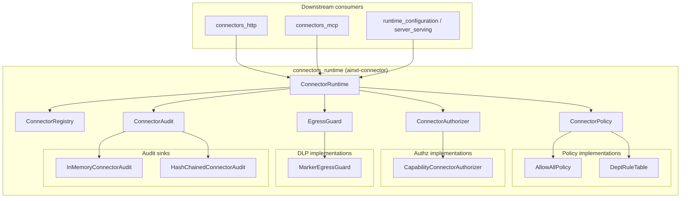
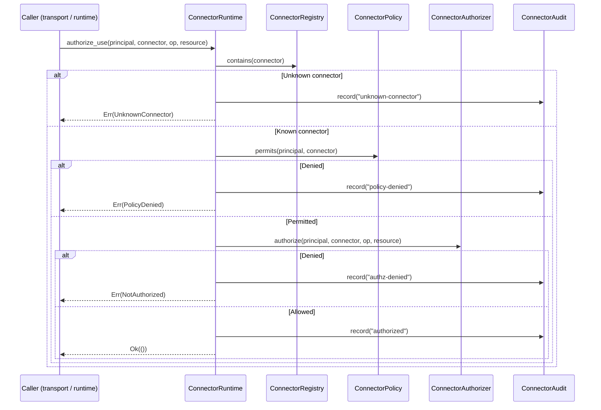
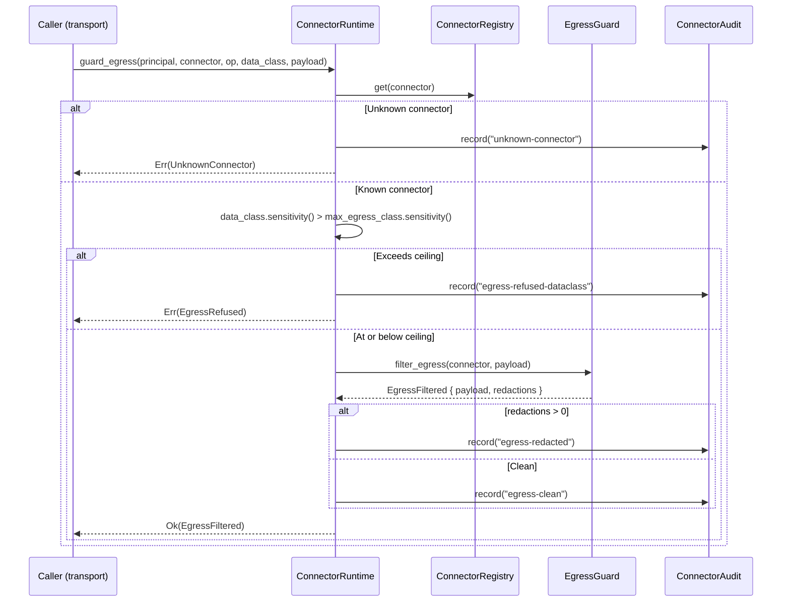
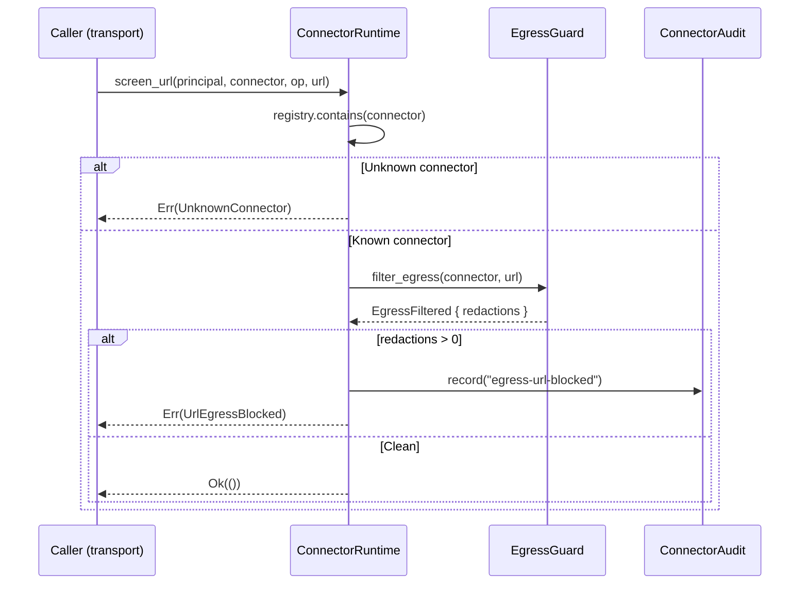
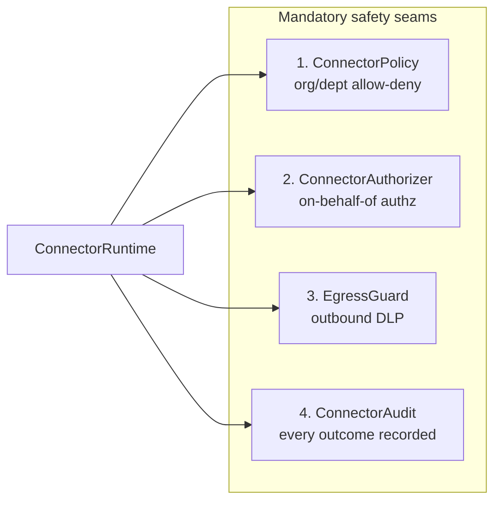
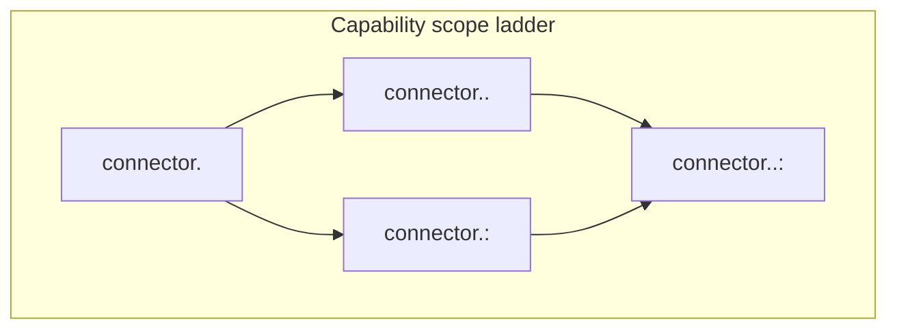
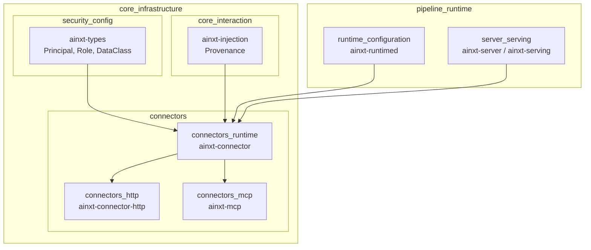

# connectors_runtime

The **connectors_runtime** module (`ainxt-connector`) is the policy spine that governs every outbound interaction between the AiNxt runtime and external systems (e.g., GitLab, Jira, Microsoft Graph). A connector lets the runtime act **on behalf of a user**, so the module enforces a fail-closed admission pipeline before any call is authorized and before any bytes leave the perimeter.

The runtime is intentionally built as a *spine*: it defines the safety-critical seams that every concrete transport (HTTP, MCP, etc.) must inherit. Higher-level modules such as [`connectors_http`](connectors_http.md) and [`connectors_mcp`](connectors_mcp.md) plug their transports into this runtime, which guarantees that policy, authorization, egress DLP, and audit run for every connector action.

## Core responsibilities

- **Connector catalog** — maintain a registry of declarative connector definitions (`ConnectorDef`) loaded from configuration.
- **Org/dept policy enforcement** — decide whether a principal's department may use a connector at all (`ConnectorPolicy`, `DeptRuleTable`).
- **On-behalf-of authorization** — decide whether a principal may perform a specific operation on a specific resource through a connector (`ConnectorAuthorizer`, `CapabilityConnectorAuthorizer`).
- **Egress data-loss prevention** — scan and redact outbound payloads for PANs, credential tokens, secrets, and private keys before they leave the perimeter (`EgressGuard`, `MarkerEgressGuard`).
- **Data-class ceiling enforcement** — hard-refuse to send regulated or PII data to connectors whose declared `max_egress_class` is too low.
- **URL secret screening** — fail-close on secrets or PANs embedded in request URLs, which cannot be safely redacted mid-flight.
- **Tamper-evident audit** — record every admission and egress outcome in a hash-chained audit log (`ConnectorAudit`, `HashChainedConnectorAudit`).
- **Ingress provenance tagging** — mark connector responses as untrusted so downstream injection defenses can fence them.

## Architecture overview



`ConnectorRuntime` is the composition root. Its constructor requires all four safety seams, so a runtime cannot be built without policy, on-behalf-of authorization, egress DLP, and audit. The `with_oss_defaults` helper supplies the OSS floor (`CapabilityConnectorAuthorizer`, `MarkerEgressGuard`, `HashChainedConnectorAudit`) while still requiring the caller to provide the org/dept policy.

## Component catalog

| Component | Role |
|-----------|------|
| `ConnectorId` | Stable, type-safe identifier for a connector (e.g., `"gitlab"`, `"jira"`). |
| `AuthKind` | Authentication mode: `OAuth2AuthCode`, `ApiToken`, or `None`. |
| `ConnectorDef` | Declarative, secret-free connector catalog entry: id, display name, auth kind, scopes, egress ceiling, base URL. |
| `ConnectorRegistry` | Sorted catalog of `ConnectorDef` entries. |
| `ConnectorPolicy` | Trait for org/dept allow-deny decisions. |
| `AllowAllPolicy` | Dev/OSS pass-through policy; explicitly opt-in. |
| `DeptRuleTable` | Least-privilege department allow-list with admin bypass and global-allow rules. |
| `ConnectorAuthorizer` | Trait for fine-grained, on-behalf-of authorization. |
| `CapabilityConnectorAuthorizer` | Capability-based OBO authorizer with a scope ladder (connector → op → resource). |
| `EgressGuard` | Trait for outbound DLP redaction. |
| `MarkerEgressGuard` | OSS default DLP: PANs, credential prefixes, secret markers, Bearer tokens, PEM private keys. |
| `EgressFiltered` | Result of a DLP scan: redacted payload + redaction count. |
| `ConnectorAudit` | Trait for recording admission/egress events. |
| `InMemoryConnectorAudit` | Shared in-memory sink for tests and dev. |
| `HashChainedConnectorAudit` | Tamper-evident SHA-256 hash-chain sink. |
| `ChainedAuditEntry` | One link in the hash chain. |
| `ConnectorAuditEvent` | Event payload: actor, connector, op, resource-present flag, outcome. |
| `ConnectorError` | Fail-closed error enum for admission and egress failures. |
| `ConnectorRuntime` | The policy spine that composes the registry and four seams. |

## Admission and egress flows

### Authorizing connector use



`authorize_use` is the gate every caller must pass before obtaining tokens or issuing a request. It runs in strict order: registration check → org/dept policy → on-behalf-of authz. Every outcome is audited.

### Guarding outbound egress



`guard_egress` runs after `authorize_use` and before the transport dispatches bytes. The data-class ceiling is enforced by `ConnectorRuntime` itself; no `EgressGuard` implementation can weaken it. The DLP seam redacts-and-proceeds on the body.

### URL secret screening



`screen_url` covers the case where secrets or PANs are embedded in request paths or query parameters. Because URLs cannot be safely redacted mid-flight, detection is fail-closed: any redaction candidate blocks the call.

## Security model

The module is designed around four mandatory safety seams. They are required constructor arguments of `ConnectorRuntime`, so there is no way to build a connector runtime without them.



### 1. Org/dept policy (`ConnectorPolicy`)

- `DeptRuleTable` is least-privilege by default (`default_permit = false`).
- Admins (`Role::Admin`) bypass department checks.
- Global allow rules (`*` connector) support platform teams.
- `dept_policy_from_env` parses `connector:dept` pairs from an environment variable; an unset or empty variable still yields a default-deny table, never `AllowAllPolicy`.

### 2. On-behalf-of authorization (`ConnectorAuthorizer`)

`CapabilityConnectorAuthorizer` uses a capability ladder to defend against confused-deputy attacks:



Any matching capability grants access. Error messages never echo the requested resource value.

### 3. Egress DLP (`EgressGuard`)

`MarkerEgressGuard` provides the OSS deterministic floor. It redacts:

- Contiguous digit runs of 12 or more digits (unformatted PAN/secret numbers).
- Separator-formatted 13–19 digit groups that pass the Luhn checksum (real card numbers).
- Credential tokens with unambiguous provider prefixes (`glpat-`, `ghp_`, `AKIA`, `xoxb-`, etc.).
- Secret assignment markers and their values (`SECRET=...`, `PASSWORD=...`, `Bearer ...`).
- Private-key PEM blocks (`-----BEGIN ... PRIVATE KEY-----` through `-----END ... PRIVATE KEY-----`).

The guard avoids over-redaction: certificate PEM blocks, short tokens, and credential prefixes embedded inside ordinary words are left intact.

### 4. Audit (`ConnectorAudit`)

`HashChainedConnectorAudit` implements a SHA-256 hash chain over canonical event encodings. Each link binds its event to the previous hash, so silent mutation, reordering, or insertion is detectable via `verify`. The `head` hash is the tamper-evidence anchor that an external witness can publish. `ConnectorRuntime` exposes `audit_head` and `audit_verify` so callers can inspect and verify the chain through the trait object.

## Integration with the broader system



- [`connectors_http`](connectors_http.md) (`ainxt-connector-http`) implements concrete HTTP transports (Reqwest, stub) and plugs them into `ConnectorRuntime`.
- [`connectors_mcp`](connectors_mcp.md) (`ainxt-mcp`) implements Model Context Protocol servers and tool discovery; connector invocations flow through the same runtime.
- [`security_config`](security_config.md) (`ainxt-types`) supplies `Principal`, `Role`, and `DataClass`, which the policy and DLP seams reason about.
- [`core_interaction`](core_interaction.md) (`ainxt-injection`) supplies `Provenance`; `ConnectorRuntime::ingress_provenance` returns `Provenance::Connector` so downstream injection defenses can treat connector data as untrusted.
- [`runtime_configuration`](../pipeline_runtime/runtime_configuration.md) / [`server_serving`](../pipeline_runtime/server_serving.md) (`ainxt-runtimed`, `ainxt-server`) compose the runtime into the served daemon. The `with_oss_defaults` constructor is the recommended served entrypoint because it guarantees the tamper-evident audit floor and requires only the org/dept policy.

## Configuration and usage

### Building a runtime with OSS defaults

```rust
use ainxt_connector::{ConnectorRuntime, ConnectorRegistry, dept_policy_from_env};

let registry = ConnectorRegistry::new();
// ... register ConnectorDef entries ...

let policy = Box::new(dept_policy_from_env("AINXT_CONNECTOR_DEPT_RULES"));
let runtime = ConnectorRuntime::with_oss_defaults(registry, policy);
```

This is the recommended served-daemon path. It wires:

- `CapabilityConnectorAuthorizer` for on-behalf-of authz.
- `MarkerEgressGuard` for the OSS DLP floor.
- `HashChainedConnectorAudit` for tamper-evident audit.
- The caller-supplied org/dept policy.

### Building a runtime with custom seams

```rust
use ainxt_connector::ConnectorRuntime;

let runtime = ConnectorRuntime::new(
    registry,
    Box::new(my_policy),
    Box::new(my_authorizer),
    Box::new(my_egress_guard),
    Box::new(my_audit_sink),
);
```

All four seams are mandatory. This path is appropriate when a deployment needs an enterprise DLP engine, a WORM audit backend, or a custom authorization model.

### Authorizing and egressing a request

```rust
// 1. Admit the connector use.
runtime.authorize_use(&principal, &connector_id, "read", Some("repo/x"))?;

// 2. Screen the URL for secrets.
runtime.screen_url(&principal, &connector_id, "read", &url)?;

// 3. Guard the outbound payload.
let filtered = runtime.guard_egress(
    &principal,
    &connector_id,
    "read",
    DataClass::Internal,
    &payload,
)?;

// 4. Dispatch filtered.payload through the concrete transport.
// 5. Tag the response as untrusted.
let provenance = runtime.ingress_provenance();
```

## Failure modes

| Error | Cause | Audited outcome |
|-------|-------|-----------------|
| `UnknownConnector` | Connector id not in `ConnectorRegistry`. | `unknown-connector` |
| `PolicyDenied` | Org/dept policy refused the principal. | `policy-denied` |
| `NotAuthorized` | Principal lacks the required capability. | `authz-denied` |
| `EgressRefused` | Request data class exceeds connector ceiling. | `egress-refused-dataclass` |
| `UrlEgressBlocked` | Secret/PAN detected in URL. | `egress-url-blocked` |

All failure paths are fail-closed and audited. Error `Display` messages intentionally omit resource values and secret content.

## Testing and observability

- `InMemoryConnectorAudit` is a cheap-to-clone, shared sink for unit and integration tests; tests can inspect recorded events after invoking the runtime.
- `HashChainedConnectorAudit::verify_chain` lets tests and operators validate chain integrity.
- `ConnectorRuntime::audit_head` returns `Some(hash)` only when a tamper-evident sink is wired, making the audit mode observable from outside the runtime.
- The crate's tests cover default-deny policy, capability ladder, data-class ceiling, DLP redaction of formatted PANs, URL blocking, and tamper detection.
