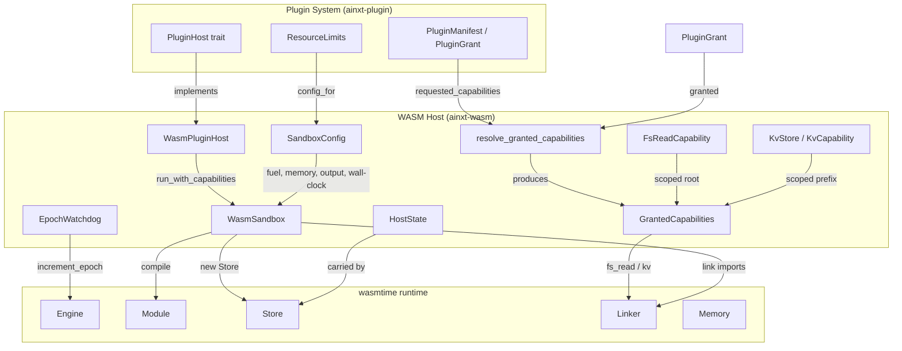
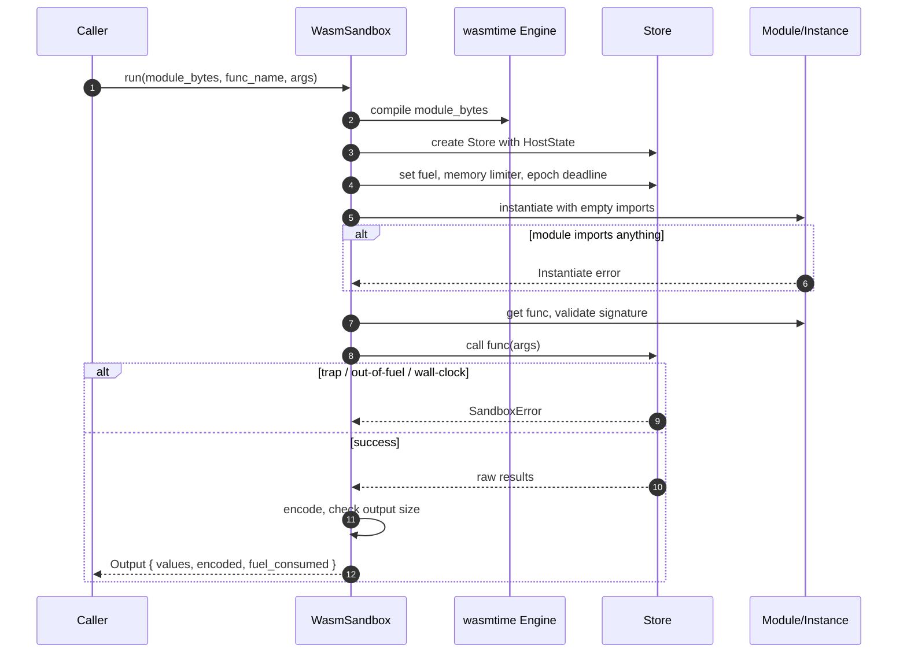
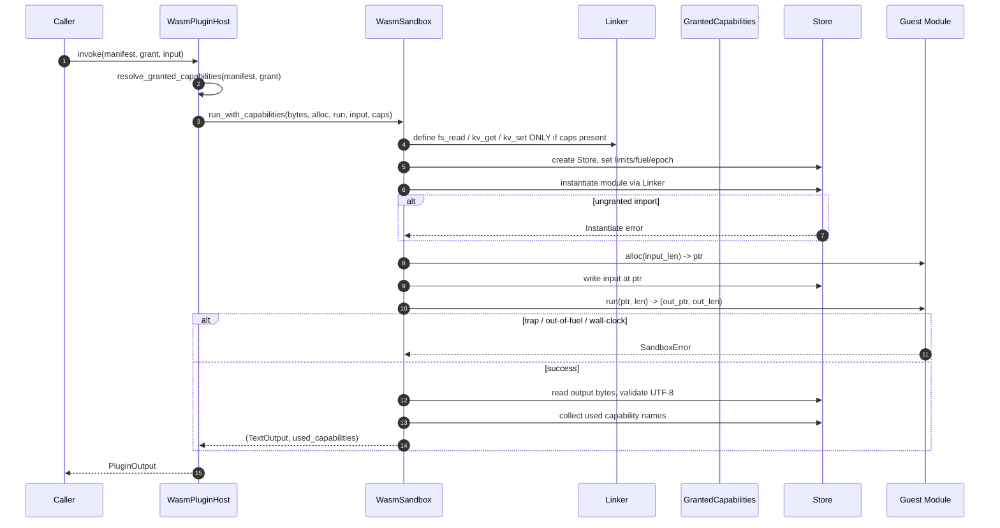
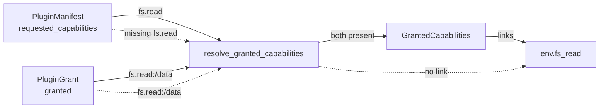
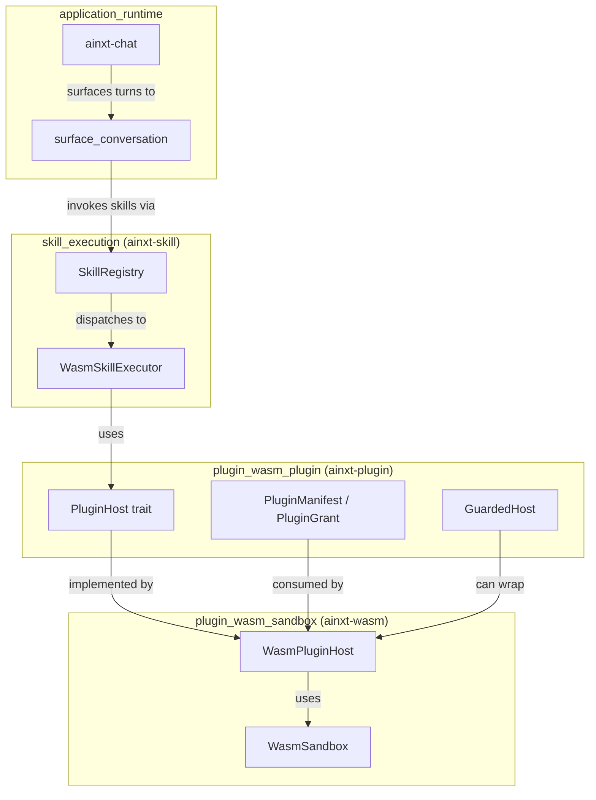
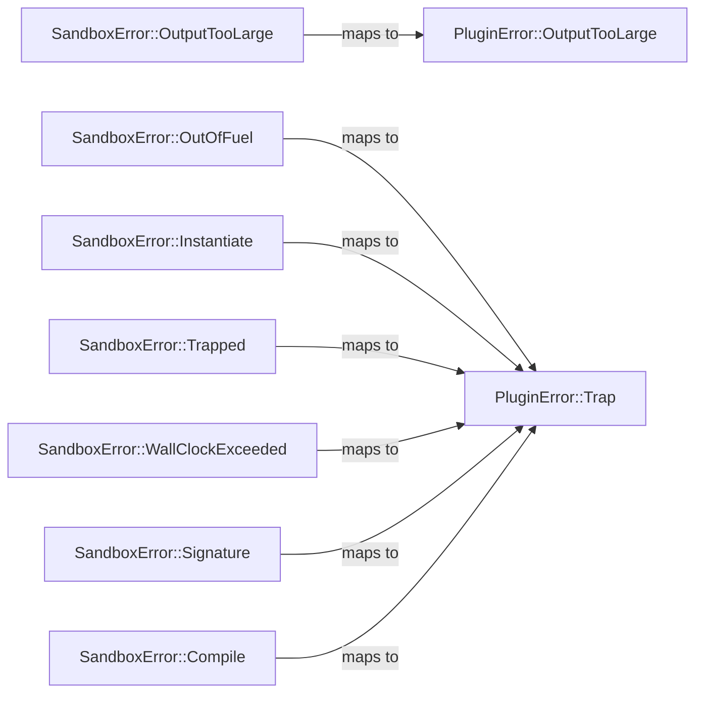

# plugin_wasm_sandbox

## Brief Introduction

The `plugin_wasm_sandbox` module (`crates/ainxt-wasm`) provides a **capability-confined WebAssembly sandbox** for executing untrusted third-party and machine-generated plugins. It is the hard-isolation runtime backing the platform's plugin execution model, ensuring that guest code cannot access ambient authority such as the filesystem, network, clock, or unbounded host resources.

The sandbox is built on two core invariants:

1. **Zero ambient authority** — A plugin module is instantiated against an empty import set by default. If it imports anything not explicitly granted, instantiation fails before any guest code runs.
2. **Hard resource ceilings enforced by the runtime** — Every invocation receives bounded fuel (instruction budget), bounded linear memory, bounded output size, and an optional real wall-clock deadline enforced via epoch-based interruption. Guest traps, infinite loops, and resource exhaustion are isolated faults that never bring down the host.

`WasmPluginHost` implements the [`ainxt_plugin::PluginHost`](plugin_wasm_plugin.md) trait, making the WASM sandbox a drop-in replacement for the in-process `NativeHost` used with trusted first-party plugins. This lets the rest of the system treat plugin invocation uniformly while routing untrusted code through real hardware isolation.

---

## Core Responsibilities

| Responsibility | Description |
|----------------|-------------|
| **Module compilation & instantiation** | Compiles WASM or WAT bytes and instantiates modules with a controlled, capability-scoped import linker. |
| **Resource bounding** | Enforces per-call limits on fuel, memory, output size, and wall-clock time. |
| **Capability-based host imports** | Links only the host functions that were both requested by the plugin manifest and granted by policy (e.g. scoped filesystem reads, scoped KV access). |
| **Text ABI support** | Supports a guest-side linear-memory ABI (`alloc` / `run`) for passing UTF-8 input and retrieving UTF-8 output. |
| **PluginHost integration** | Bridges the low-level sandbox into the `ainxt_plugin` registry/invocation contract so skills and surfaces can invoke WASM plugins transparently. |
| **Audit telemetry** | Reports which granted capabilities were actually exercised during a call, enabling honest least-privilege audit. |

---

## Architecture

The module is organized into layers that move from low-level WASM execution primitives up to the plugin-system integration seam.

### Key architectural decisions

- **One `Engine`, many `Store`s.** A single `wasmtime::Engine` is reused across calls for efficiency, but each invocation creates a fresh `Store` with its own fuel budget and memory limiter. This provides call isolation and ensures a trap in one call does not poison the sandbox.
- **No `unsafe` in this crate.** All host state lives in owned `HostState` carried by the `Store`; the resource limiter is plain safe Rust.
- **Engine-agnostic public value type.** The `Value` enum exposes only `i32`, `i64`, `f32`, and `f64`, avoiding leakage of `wasmtime::Val` into the plugin contract.
- **Capability imports are opt-in and scoped.** Host functions are only linked when both the manifest requests the capability bare form (`fs.read`, `kv`) and the grant supplies a parameterized instance (`fs.read:/data`, `kv:tenant-a:`).

---

## Core Components

### `SandboxConfig`

Hard resource ceilings applied to every plugin invocation. These are enforced by the wasmtime runtime, not by guest cooperation.

| Field | Purpose |
|-------|---------|
| `fuel: u64` | Instruction budget; exhaustion produces `SandboxError::OutOfFuel`. |
| `max_memory_bytes: usize` | Linear memory cap; declared minimums above it fail instantiation, and `memory.grow` past it returns `-1`. |
| `max_output_bytes: usize` | Cap on encoded return values; oversize results produce `SandboxError::OutputTooLarge`. |
| `max_wall_clock_ms: Option<u64>` | Real wall-clock ceiling enforced via wasmtime epoch interruption; independent of fuel. |

`SandboxConfig::conservative()` provides a default of 10M fuel, 16 MiB memory, 1 MiB output, and a 5s wall-clock ceiling.

### `WasmSandbox`

The reusable sandbox. It exposes three main invocation paths:

- `run(module_bytes, func_name, args)` — numeric-only ABI; zero ambient authority.
- `run_with_input(module_bytes, alloc_name, func_name, input)` — text ABI using guest-owned linear memory; zero ambient authority.
- `run_with_capabilities(..., caps)` — text ABI with a `Linker` carrying only the granted capabilities.

All paths share the same resource ceilings, trap isolation, and wall-clock watchdog behavior.

### `Value`

An engine-agnostic scalar used for call arguments and results. Supports only `I32`, `I64`, `F32`, and `F64`. Unsupported wasmtime result types (references, `v128`, etc.) surface as `SandboxError::UnsupportedResult` rather than being silently coerced.

### `SandboxError`

A recoverable error taxonomy covering every failure mode a guest can trigger:

- `EngineInit`, `Compile`, `Instantiate`, `FuncNotFound`, `Signature`
- `OutOfFuel`, `Trapped`, `OutputTooLarge`, `UnsupportedResult`
- `WallClockExceeded` — distinct from `OutOfFuel`; raised by epoch interruption even when the guest is blocked inside a granted host function.
- `Internal`

None of these errors represent host compromise or crash; the same `WasmSandbox` remains usable after any of them.

### `EpochWatchdog`

Implements the real wall-clock ceiling (§3.5). A background thread waits for the configured duration and then calls `engine.increment_epoch()` once. The guest's `Store` has an epoch deadline of `1`, so the next epoch checkpoint (every loop back-edge and host-function return) traps the guest. The watchdog is explicitly disarmed after a successful call so a late `increment_epoch()` can never affect a future invocation.

### Capability types

- **`FsReadCapability`** — Scoped filesystem read rooted at a canonicalized directory. Resolves guest paths against the root, refusing absolute paths, `..` traversal, and symlinks that escape the root.
- **`KvStore`** — Shared in-memory key-value backing store.
- **`KvCapability`** — A handle scoped to a key prefix; only keys starting with the prefix are accessible.
- **`GrantedCapabilities`** — The per-call set of effective capabilities. Unset fields mean the corresponding host function is never linked.

### `WasmPluginHost`

The `PluginHost` implementation that bridges `ainxt-wasm` into the plugin system. It:

1. Looks up the plugin's WASM bytes by `manifest.id`.
2. Maps `ResourceLimits` to a `SandboxConfig`.
3. Resolves `requested_capabilities ∩ granted` into concrete `GrantedCapabilities`.
4. Invokes `run_with_capabilities` and translates `SandboxError` into `PluginError`.
5. Returns `PluginOutput` with the guest text and the list of capabilities actually exercised.

---

## Data Flow

### Numeric-only invocation (`run`)

### Text-ABI invocation with capabilities (`run_with_capabilities`)

---

## Capability Resolution

Capabilities follow a requested∩granted discipline identical to [`NativeHost`](plugin_wasm_plugin.md). Grant strings use a `capability:param` convention:

| Grant string | Requires manifest request | Effective host import |
|--------------|---------------------------|----------------------|
| `fs.read:/data` | `fs.read` | `env.fs_read` scoped to `/data` |
| `kv:tenant-a:` | `kv` | `env.kv_get` / `env.kv_set` scoped to keys prefixed `tenant-a:` |

A capability that is only granted but not requested, or only requested but not granted, results in the host function not being linked. The guest importing it then fails to instantiate, which is the deny-by-construction behavior.

---

## Host Function ABI

When granted, the following host functions are linked into the `env` module:

### `env.fs_read(path_ptr, path_len, out_ptr, out_cap) -> i32`

Reads a file under the scoped root. Returns the number of bytes written, or a negative error code:

| Code | Meaning |
|------|---------|
| `HOST_ERR_DENIED (-1)` | Capability not granted (unreachable in practice because the function is not linked). |
| `HOST_ERR_NOT_FOUND (-2)` | File does not exist. |
| `HOST_ERR_OUT_OF_SCOPE (-3)` | Path escapes the scoped root. |
| `HOST_ERR_BUFFER_TOO_SMALL (-4)` | Guest output buffer cannot hold the result. |
| `HOST_ERR_BAD_UTF8 (-5)` | Guest-supplied path is not valid UTF-8. |

### `env.kv_get(key_ptr, key_len, out_ptr, out_cap) -> i32`

Reads a value from the scoped KV store. Error codes match `fs_read` semantics.

### `env.kv_set(key_ptr, key_len, val_ptr, val_len) -> i32`

Writes a value to the scoped KV store. Returns `0` on success or a negative error code.

---

## Module Relationships

For details on the plugin registry, manifest signing, and `GuardedHost` decorator, see [plugin_wasm_plugin.md](plugin_wasm_plugin.md). For how WASM skills are executed within the skill runtime, see [skill_execution.md](skill_execution.md). For the chat/surface layer that ultimately invokes plugins, see [surface_conversation.md](surface_conversation.md).

---

## Security Properties

| Property | Mechanism |
|----------|-----------|
| **No ambient authority** | Modules instantiate against an empty import set unless capabilities are explicitly granted. |
| **Deny-by-construction** | Ungranted imports cause `SandboxError::Instantiate` before guest code runs. |
| **Compute bounding** | Fuel consumption is enabled; infinite loops trap as `OutOfFuel`. |
| **Memory bounding** | `StoreLimits` caps guest linear memory. |
| **Output bounding** | Encoded results are checked against `max_output_bytes`. |
| **Wall-clock bounding** | Epoch interruption enforces `max_wall_clock_ms` without guest cooperation. |
| **Capability scoping** | `FsReadCapability` and `KvCapability` enforce host-side path/prefix boundaries. |
| **Call isolation** | Each invocation uses a fresh `Store`/`Instance`; state does not leak between calls. |
| **Host survival** | All guest traps are caught and returned as typed errors; the host process is unaffected. |

---

## Error Mapping to Plugin System

`to_plugin_error` translates sandbox failures into the `PluginError` taxonomy so callers of the `PluginHost` trait see uniform errors regardless of whether the backing host is `NativeHost` or `WasmPluginHost`.

`PluginError::NotFound` is raised by `WasmPluginHost` itself when the plugin id has not been registered.

---

## Testing Strategy

The crate's tests exercise both the low-level sandbox and the `PluginHost` integration:

- **Numeric ABI correctness** — addition, multiplication, encoding, fuel consumption.
- **Resource limits** — infinite loops stop via fuel, memory growth past cap returns `-1`, declared memory above cap fails instantiation, oversized output is rejected.
- **Zero ambient authority** — ungranted imports and imported memory fail to instantiate.
- **Trap isolation** — `unreachable`, division by zero, and other traps are caught; the same sandbox remains usable.
- **Capability integration** — pure plugins run with no capabilities; requested-but-ungranted and granted-but-unrequested capabilities are denied; granted `fs.read` and `kv` capabilities work and are scoped.
- **Composition** — `WasmPluginHost` can be wrapped by `GuardedHost` unchanged.

---

## See Also

- [plugin_wasm_plugin.md](plugin_wasm_plugin.md) — Plugin registry, manifest, grants, `NativeHost`, and `GuardedHost`.
- [skill_execution.md](skill_execution.md) — How skills are dispatched and how `WasmSkillExecutor` uses the plugin host.
- [surface_conversation.md](surface_conversation.md) — Chat surfaces and conversation managers that invoke skills.
- [application_runtime.md](application_runtime.md) — Broader runtime context for plugins, skills, and surfaces.
