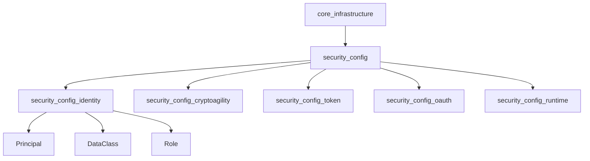
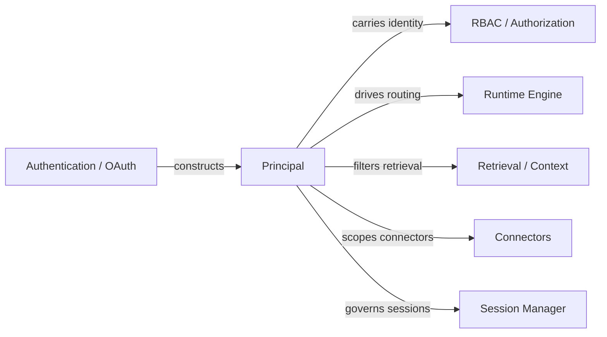
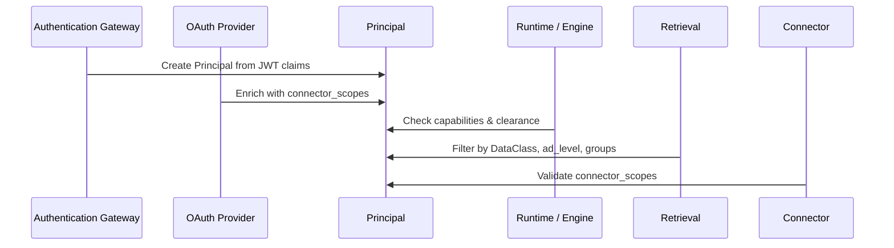
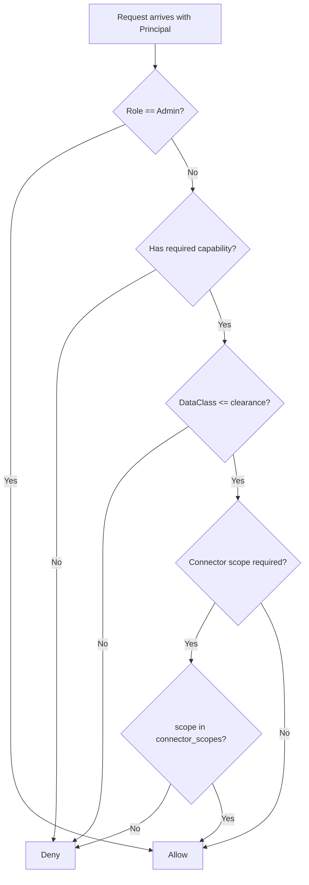
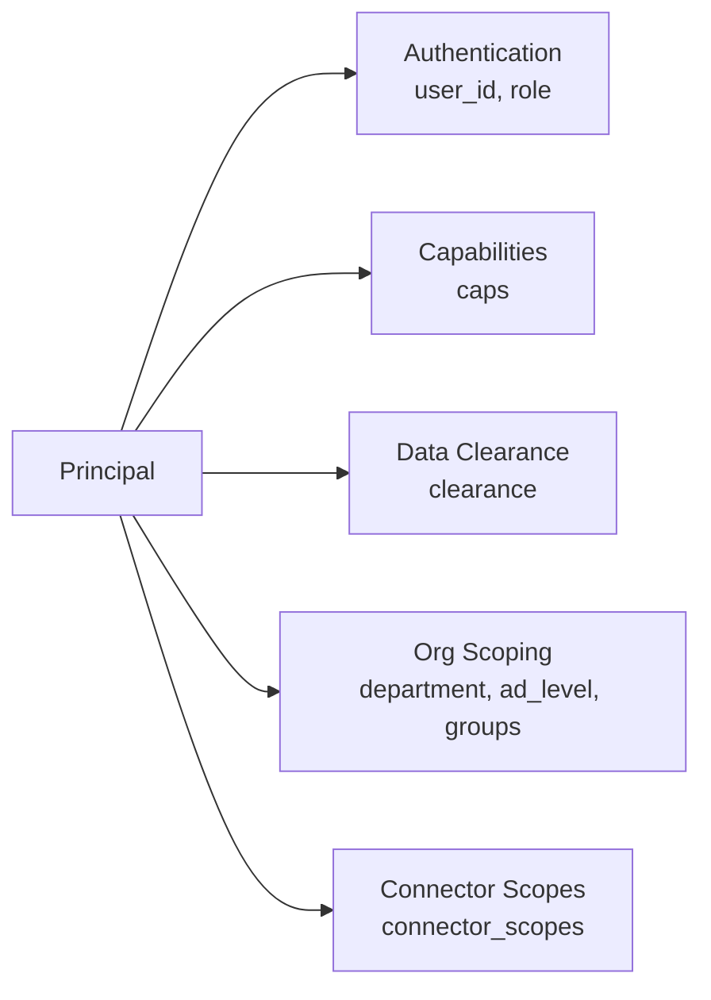
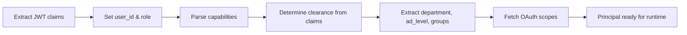
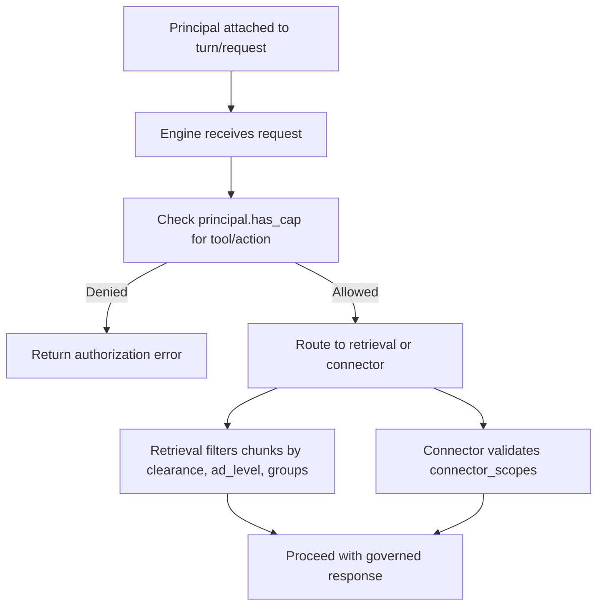

# security_config_identity

## Brief Introduction

The `security_config_identity` module defines the core identity primitive used across the AiNxt runtime: the `Principal` type. Representing an authenticated caller, `Principal` encapsulates not only authentication attributes (user ID, role) but also authorization context including capability-based permissions, data classification clearance, organizational attributes, and OAuth/connector scopes. It serves as the foundational identity token that downstream security, retrieval, connector, and runtime modules use to make authorization and routing decisions.

This module is a leaf of the [security_config](security_config.md) subsystem under [core_infrastructure](core_infrastructure.md). It intentionally stays small and dependency-light so that almost every other crate can import the identity representation without pulling in heavier security machinery.

---

## Core Components

### `Principal`

Located in `crates/ainxt-types/src/lib.rs`, `Principal` is the canonical representation of an authenticated user or service identity within the system.

#### Fields

| Field | Type | Purpose |
|-------|------|---------|
| `user_id` | `String` | Unique identifier for the caller. |
| `role` | `Role` | `User` or `Admin`; `Admin` implies all capabilities. |
| `caps` | `Vec<String>` | Capability-based permissions granted to the principal. |
| `clearance` | `DataClass` | Maximum data sensitivity class the principal may read. |
| `department` | `Option<String>` | AD department / org unit for organizational scoping. |
| `ad_level` | `Option<u8>` | AD seniority level (0 = most senior exec, 6 = junior). |
| `groups` | `Vec<String>` | AD group / role memberships for group-based RBAC. |
| `connector_scopes` | `Vec<String>` | OAuth/connector scopes the user's own credential covers. |

#### Key Behaviors

- **Capability checking**: `has_cap()` returns true if the principal has the `Admin` role or possesses the named capability.
- **Fail-closed defaults**: Optional fields (`department`, `ad_level`, `groups`, `connector_scopes`) default to empty/None via serde, ensuring older principals or missing claims result in denial rather than accidental access.
- **Builder methods**: `with_clearance`, `with_department`, `with_ad_level`, `with_groups`, and `with_connector_scopes` allow fluent construction.
- **Convenience constructors**: `Principal::user()` and `Principal::admin()` cover the two most common creation paths.

#### Supporting Types

- `DataClass`: Defines sensitivity tiers (`Public`, `Internal`, `Confidential`, `RegulatedPayment`, `Pii`). Regulated and PII data must remain in-house per ADR-012.
- `Role`: `User` or `Admin`.
- `Tier`: Model complexity tier used elsewhere in routing decisions.

---

## Architecture

### Module Hierarchy

### System Position

---

## Dependencies

### Upstream

- `serde` — serialization and deserialization of identity attributes.

### Downstream Consumers

Modules that consume `Principal` include, but are not limited to:

- [security_config_cryptoagility](security_config_cryptoagility.md) — uses identity context for algorithm governance decisions.
- [security_config_token](security_config_token.md) — token vault operations are scoped to principals.
- [security_config_oauth](security_config_oauth.md) — OAuth flows produce principals enriched with `connector_scopes`.
- [security_config_runtime](security_config_runtime.md) — runtime configuration applies limits based on principal attributes.
- [core_interaction](core_interaction.md) — sessions and turns carry the principal through the interaction lifecycle.
- [governance_compliance_identity](../governance_compliance/identity.md) — advanced identity, attestation, delegation, and workload credentials build upon `Principal`.
- [pipeline_runtime_runtime_engine](../pipeline_runtime/runtime_engine.md) — the engine uses `Principal` for RBAC, outsourcing guard, and admission decisions.
- [ai_engine_knowledge_retrieval](../ai_engine/knowledge_retrieval.md) — retrieval ACLs filter by principal clearance, `ad_level`, and `groups`.

---

## Data Flow

### Principal Construction and Usage

---

## Component Interactions

### Authorization Decision Flow

The following diagram illustrates how a single `Principal` is evaluated against multiple independent policy axes. Any axis can deny access; all required axes must allow it.

### Principal Attribute Axes

---

## Process Flows

### Creating a Principal

### Runtime Enforcement

---

## Integration Notes

- The `Principal` type is intentionally additive. Fields such as `ad_level`, `groups`, and `connector_scopes` were introduced with serde defaults so that previously serialized principals continue to deserialize safely.
- `clearance` directly maps to `DataClass` and is used by retrieval and context modules to enforce ADR-012: regulated and PII data must stay in-house.
- `connector_scopes` implements OBO layer 2 per ADR-003 §1.6: a harness cannot grant connector capabilities beyond what the user's own credential authorizes.
- For more sophisticated identity concepts such as delegation chains, agent workload credentials, attestation quotes, kill switches, and transparency logs, see [governance_compliance_identity](../governance_compliance/identity.md).
