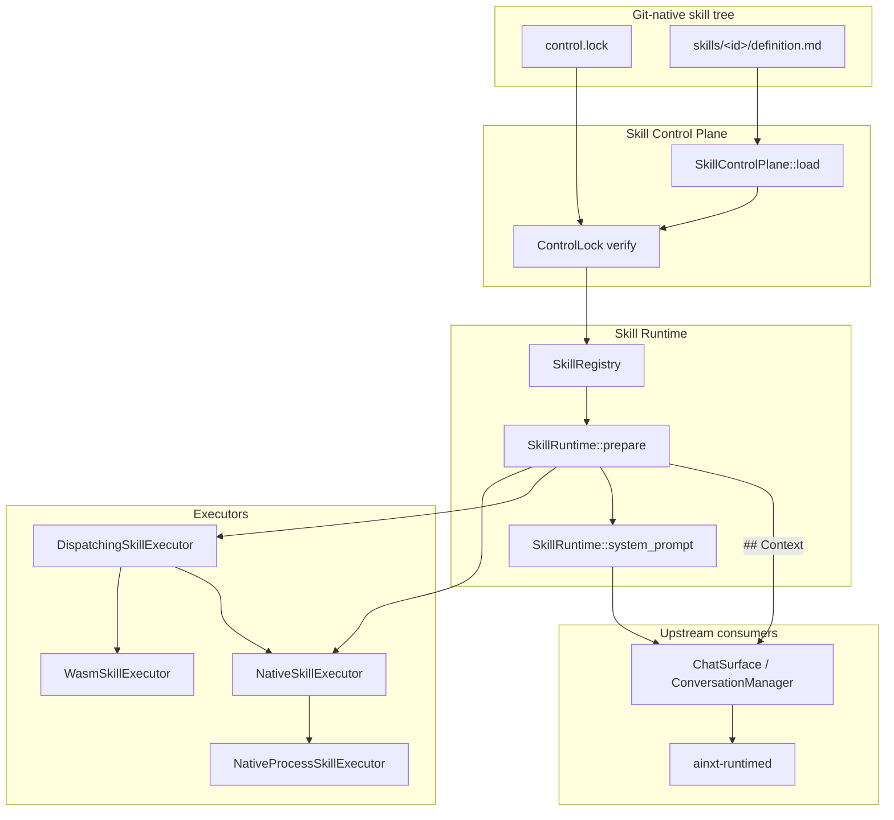
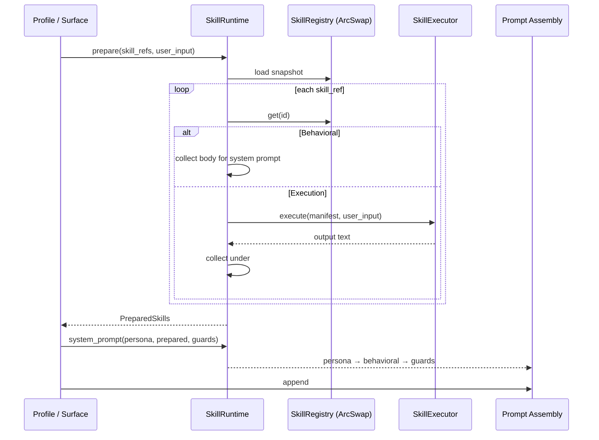
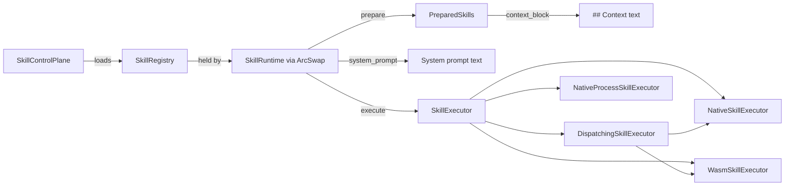

# Skill Execution Module

## Introduction

The `skill_execution` module (crate `ainxt-skill`) is the runtime responsible for loading, selecting, and injecting **skills** into a conversation turn. A skill is a reusable unit of augmentation that shapes how the AI responds: either as a behavioral procedure injected into the system prompt, or as an execution snippet whose computed output is injected into the turn's `## Context` block.

This module sits inside the `application_runtime` layer of the system. It is consumed by higher-level surfaces such as the chat/conversation runtime and the served runtime daemon. Skills are loaded from a git-native filesystem tree (`skills/<id>/definition.md` + `control.lock`) rather than being compiled into the binary or stored in a database, enabling deployments to add or modify skills without recompiling.

## Purpose

- Provide a versioned, content-addressed skill catalog (`SkillRegistry`) that can be hot-reloaded from disk.
- Resolve a profile's skill references for a single turn, filtering by relevance to the user's input.
- Run execution skills safely through pluggable executors: trusted native handlers, sandboxed WebAssembly, or isolated OS processes.
- Assemble the system prompt in the canonical order: **persona → behavioral skills → guard prompts**, with execution output placed in `## Context`.

## Architecture Overview

### Data Flow for a Single Turn

## Sub-modules

The module is organized into three sub-modules:

| Sub-module | File(s) | Responsibility | Documentation |
|------------|---------|----------------|---------------|
| Control Plane | `control.rs` | Git-native loader, `control.lock` verification, hot-reload support | [skill_execution_control_plane](skill_execution_control_plane.md) |
| Runtime | `lib.rs` | Manifest model, registry, relevance selection, prompt assembly | [skill_execution_runtime](skill_execution_runtime.md) |
| Executors | `lib.rs`, `native_process.rs` | Pluggable skill executors: native, WASM, dispatching, OS process | [skill_execution_executors](skill_execution_executors.md) |

## Relationship to Other Modules

- **`plugin_wasm`**: The `WasmSkillExecutor` delegates guest isolation to [`ainxt_wasm::WasmSandbox`](plugin_wasm.md). See the executors sub-module for details.
- **`surface_conversation`**: `ChatSurface` and `ConversationManager` call `SkillRuntime::prepare` and `SkillRuntime::system_prompt` to assemble a turn. See [surface_conversation](surface_conversation.md).
- **`core_infrastructure`**: The runtime daemon (`ainxt-runtimed`) wires `SkillControlPlane` behind the `[server] skill_dir` configuration and exposes hot-reload. See [core_infrastructure](core_infrastructure.md).
- **`ai_engine`**: Behavioral skills are injected into the system prompt alongside guardrails and persona configuration managed by the prompt engineering modules. See [ai_engine](../ai_engine/ai_engine.md).

## Key Design Decisions

1. **Fail-closed loading**: Any malformed `definition.md`, missing `control.lock`, hash mismatch, or duplicate skill id causes `SkillControlPlane::load` to return an error. The caller must keep the last-known-good registry.
2. **Atomic hot-reload**: `SkillRuntime` holds the registry behind an `ArcSwap`. `reload` swaps the registry atomically; in-flight turns are pinned to the snapshot they loaded at the start of `prepare`.
3. **Additive relevance selection**: Skills without a `description` remain unconditionally relevant, preserving existing behavior. Described skills are filtered by simple keyword overlap.
4. **Executor seam**: The runtime does not run code itself. Execution skills are dispatched through a `SkillExecutor` trait implemented by native, WASM, dispatching, and OS-process executors.
5. **Built-in floor**: `SkillRuntime::with_builtins` ships a set of compiled-in skills (citation discipline, RCA, test generation, etc.) so production profiles resolve out of the box. File-declared skills with matching ids override built-ins.

## Mermaid: Component Interaction

## See Also

- [Skill Execution Control Plane](skill_execution_control_plane.md) — git-native loader and `control.lock` verification.
- [Skill Execution Runtime](skill_execution_runtime.md) — registry, relevance selection, and prompt assembly.
- [Skill Execution Executors](skill_execution_executors.md) — native, WASM, dispatching, and OS-process executors.
