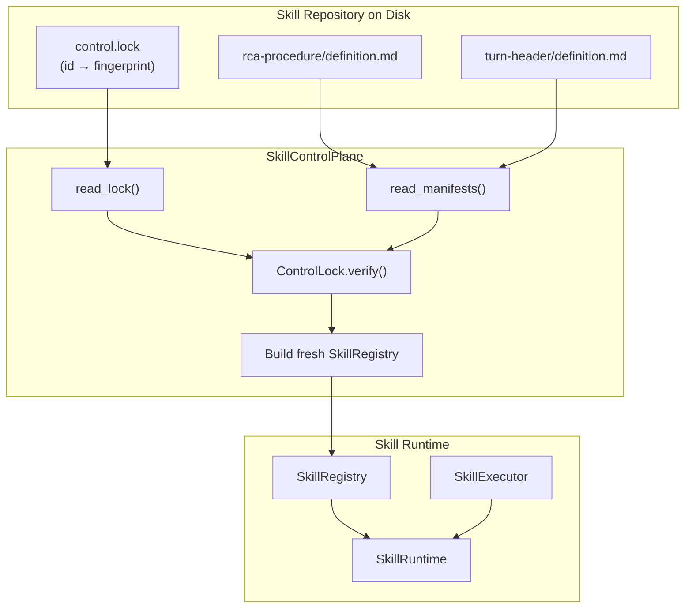
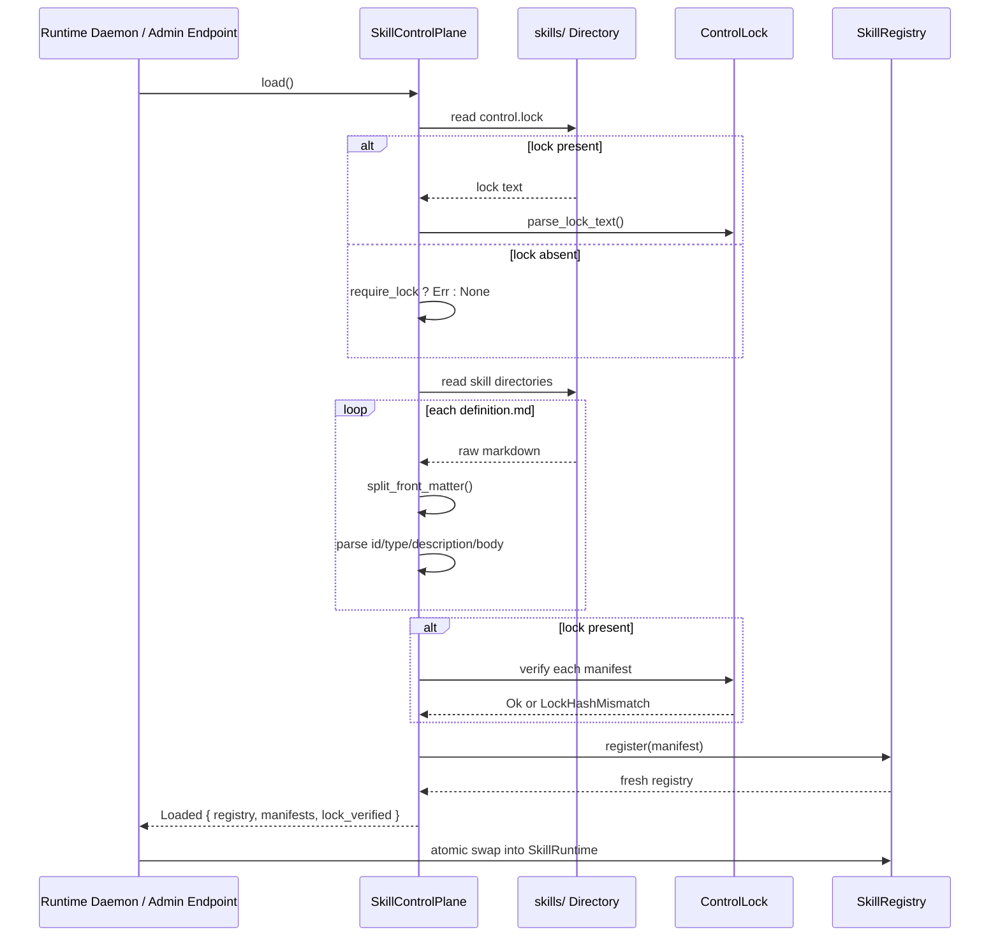
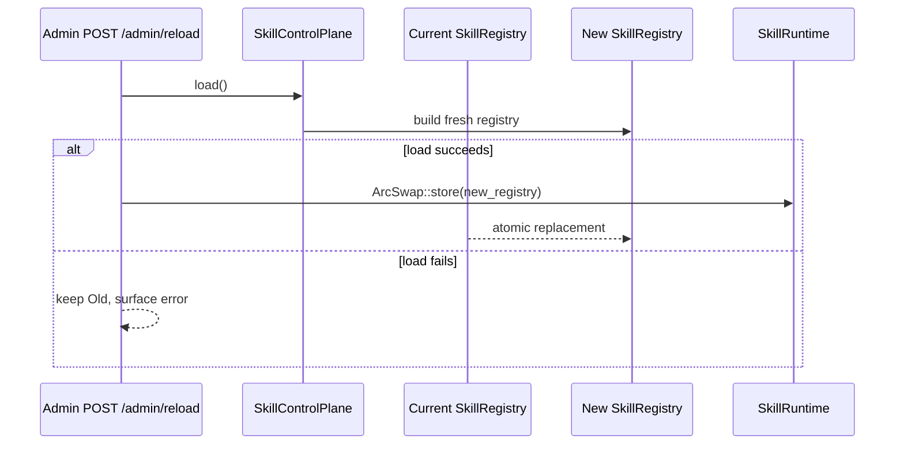
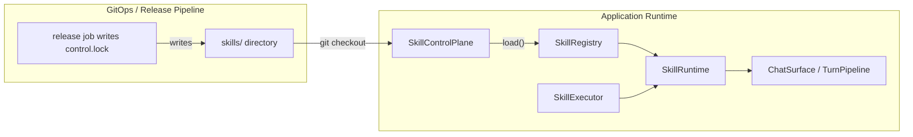

# Skill Execution Control Plane

The **Skill Execution Control Plane** is the git-native loader for the application's skill registry. It mirrors the loader pattern established by the prompt control plane, allowing skills to be declared as versioned files on disk rather than compiled-in Rust constants or database rows. The control plane reads skill manifests from a `skills/` directory, verifies them against a content-addressed `control.lock`, and produces a fresh [`SkillRegistry`](skill_execution_runtime.md) that can be hot-reloaded into a running [`SkillRuntime`](skill_execution_runtime.md).

This module closes the deployment gap identified in ADR-026: before it existed, the only way to populate a served `SkillRuntime` was through the eight compiled-in builtin manifests. The control plane enables operators to add, edit, or override skills by committing files to a git repository, with tamper detection enforced at runtime by `control.lock`.

---

## Core Responsibilities

1. **Filesystem-based skill discovery** — Read skill manifests from a `skills/<skill-id>/definition.md` layout.
2. **Content-addressed integrity** — Compute and verify 128-bit fingerprints for every loaded manifest against `control.lock`.
3. **Fail-closed loading** — Reject malformed manifests, duplicate ids, missing locks, or lock mismatches rather than falling back to partial state.
4. **Hot-reload support** — Build a fresh registry on every load so callers can atomically swap it into an existing `SkillRuntime` without restarting.
5. **Builtin floor + file override** — Layer file-declared skills over compiled-in builtins; a file skill with the same id overrides the builtin.

---

## Architecture



The control plane is intentionally thin: it owns no long-lived state beyond a `PathBuf` to the skill root. Each call to `SkillControlPlane::load` performs a complete, deterministic read of the directory, verifies every manifest, and returns a new `SkillRegistry`. The caller (typically `ainxt-runtimed` or `ainxt-server`) is responsible for atomically swapping the registry into the live `SkillRuntime`.

---

## Component Reference

### `SkillControlPlane`

The main loader. Constructed with a root directory path and a `require_lock` flag (default `true`).

| Method | Purpose |
|--------|---------|
| `new(root)` | Create a loader for the given skill directory. |
| `allow_unlocked()` | Set `require_lock = false` for bootstrapping a new control plane. |
| `load()` | Full load: read lock, read manifests, verify, build fresh registry. |
| `read_only()` | Read manifests without lock verification or registry construction. |

### `ControlLock`

A plain-text content-address lock stored at `skills/control.lock`. Each line is `<id>\t<fingerprint>`. The fingerprint covers every manifest field (`id`, `type`, `description`, `body`) NUL-separated, so tampering with any field is detected.

| Method | Purpose |
|--------|---------|
| `of(manifests)` | Compute a lock from a set of loaded manifests. |
| `verify(manifest)` | Check a manifest against the pinned fingerprint. |
| `parse_lock_text(s)` | Parse the `control.lock` file format. |

### `Loaded`

The successful result of `SkillControlPlane::load`.

| Field | Purpose |
|-------|---------|
| `registry` | The freshly built `SkillRegistry`. |
| `manifests` | The parsed manifests, sorted deterministically by id. |
| `lock_verified` | True if a `control.lock` was present and all manifests verified. |

### Helper Functions

| Function | Purpose |
|----------|---------|
| `merged_registry_from_dir(root)` | Build a registry with builtins as floor and file skills layered on top. |
| `skill_runtime_from_dir(root, wasm)` | Construct a complete `SkillRuntime` from disk, optionally with WASM dispatch. |
| `write_lock(root, lock)` | Serialize a `ControlLock` to disk for release jobs. |

---

## Skill Manifest Layout

Each skill lives in its own directory with a single `definition.md` file:

```text
skills/
├─ control.lock
├─ rca-procedure/
│   └─ definition.md
└─ turn-header/
    └─ definition.md
```

The `definition.md` format is intentionally minimal and dependency-free:

```text
---
id: rca-procedure
type: behavioral
description: Root-cause-analysis procedure for a production incident.
---
Follow the Root-Cause-Analysis procedure: ...
```

- Front matter is a `key: value` block delimited by `---` lines.
- Supported fields: `id`, `type` (`behavioral` or `execution`), `description`.
- Everything after the closing `---` is the skill body, mapped directly to [`SkillManifest::body`](skill_execution_runtime.md).

For details on how behavioral and execution skills differ, see [skill_execution_runtime.md](skill_execution_runtime.md).

---

## Data Flow



---

## Hot-Reload Flow



The existing `SkillExecutor` (native, WASM, or dispatching) is never disturbed by a reload. Only the registry is swapped, which is held behind an `ArcSwap` in `SkillRuntime`. This design is shared with the prompt control plane; see [prompt_core.md](../ai_engine/prompt_core.md) for the analogous pattern.

---

## Error Handling

`LoadError` is fail-closed: any error aborts the entire load and the caller must not swap the registry.

| Variant | Cause | Behavior |
|---------|-------|----------|
| `Io` | Filesystem read failure. | Abort load. |
| `Parse` | Malformed front matter or lock file. | Abort load. |
| `MissingLock` | No `control.lock` when `require_lock = true`. | Abort load. |
| `UnlockedSkill` | Skill id not present in lock. | Abort load. |
| `LockHashMismatch` | Manifest fingerprint differs from lock. | Abort load. |
| `DuplicateId` | Two directories declare the same id. | Abort load. |

---

## Integration with the Skill Runtime

The control plane does not execute skills. It only produces the registry of manifests. Execution is handled by the [`SkillExecutor`](skill_execution_executors.md) implementations:

- [`NativeSkillExecutor`](skill_execution_executors.md) for trusted, compiled-in handlers.
- [`WasmSkillExecutor`](skill_execution_executors.md) for sandboxed WASM modules.
- [`DispatchingSkillExecutor`](skill_execution_executors.md) to route execution skills to WASM first and fall back to native.

`skill_runtime_from_dir` wires the loaded registry together with an executor, producing a complete `SkillRuntime` ready to serve turns. For the registry and runtime lifecycle, see [skill_execution_runtime.md](skill_execution_runtime.md).

---

## System Context



The skill control plane sits at the boundary between version-controlled configuration and the live application runtime. It is typically invoked by `ainxt-runtimed` at startup (via the `[server] skill_dir` configuration key) and by `ainxt-server` admin reload endpoints. The loaded skills are consumed by chat surfaces and turn pipelines; see [surface_conversation.md](surface_conversation.md) and [runtime_engine.md](../pipeline_runtime/runtime_engine.md).

---

## Dependencies

| Dependency | Module | Purpose |
|------------|--------|---------|
| `SkillRegistry` | [skill_execution_runtime.md](skill_execution_runtime.md) | Stores loaded skill manifests. |
| `SkillRuntime` | [skill_execution_runtime.md](skill_execution_runtime.md) | Holds the registry and executor. |
| `SkillManifest` | [skill_execution_runtime.md](skill_execution_runtime.md) | In-memory representation of a skill. |
| `SkillType` | [skill_execution_runtime.md](skill_execution_runtime.md) | Behavioral vs execution classification. |
| `SkillExecutor` | [skill_execution_executors.md](skill_execution_executors.md) | Trait for running skills. |
| `NativeSkillExecutor` | [skill_execution_executors.md](skill_execution_executors.md) | Native handler executor. |
| `WasmSkillExecutor` | [skill_execution_executors.md](skill_execution_executors.md) | Sandboxed WASM executor. |
| `DispatchingSkillExecutor` | [skill_execution_executors.md](skill_execution_executors.md) | Routes to WASM then native. |
| `ControlPlane` (prompt) | [prompt_core.md](../ai_engine/prompt_core.md) | Pattern this module mirrors. |
| `WasmSandbox` | [plugin_wasm.md](plugin_wasm.md) | Underlying WASM sandbox when WASM dispatch is used. |

---

## Configuration

The control plane is configured by pointing it at a directory:

```rust
// Production posture: control.lock required.
let cp = SkillControlPlane::new("/etc/ainxt/skills");
let loaded = cp.load()?;
```

```rust
// Bootstrapping posture: allow a missing control.lock.
let cp = SkillControlPlane::new("/etc/ainxt/skills").allow_unlocked();
let loaded = cp.load()?;
```

To construct a full runtime:

```rust
let (runtime, loaded) = skill_runtime_from_dir("/etc/ainxt/skills", None)?;
```

For WASM dispatch:

```rust
let wasm = WasmSkillExecutor::new(...)?;
let (runtime, loaded) = skill_runtime_from_dir("/etc/ainxt/skills", Some(wasm))?;
```

---

## Security and Governance

- **Fail-closed integrity**: A swapped or drifted skill body fails before it can reach a served turn.
- **Content-addressed lock**: The lock covers all manifest fields, not just the body.
- **No runtime mutation**: The loader never mutates a live registry; it always builds a fresh one.
- **Git-native**: Branch protection, signed tags, CODEOWNERS, and merge-blocking CI are enforced by the git host and CI pipeline, not this Rust unit. The loader consumes their output.

For broader governance concerns such as admission gates, harnesses, and approval workflows, see [governance_compliance.md](../governance_compliance/governance_compliance.md).

---

## Testing

The module includes unit tests covering:

- Loading skills from files into the registry.
- Hot-reload picking up changed bodies.
- Tampered bodies failing closed against `control.lock`.
- Missing `control.lock` being a hard error in production posture.
- Malformed front matter, unknown fields, and invalid types being rejected.
- Duplicate ids across directories failing closed.
- `read_only` bypassing lock requirements.

These tests use a lightweight temporary directory helper to avoid adding a `tempfile` dependency.

---

## See Also

- [skill_execution_runtime.md](skill_execution_runtime.md) — `SkillRuntime`, `SkillRegistry`, `SkillManifest`.
- [skill_execution_executors.md](skill_execution_executors.md) — `SkillExecutor` and its implementations.
- [prompt_core.md](../ai_engine/prompt_core.md) — The prompt control plane pattern this module mirrors.
- [plugin_wasm.md](plugin_wasm.md) — WASM sandbox used by `WasmSkillExecutor`.
- [surface_conversation.md](surface_conversation.md) — Chat surfaces that consume loaded skills.
- [runtime_engine.md](../pipeline_runtime/runtime_engine.md) — The runtime engine that hosts the skill runtime.
