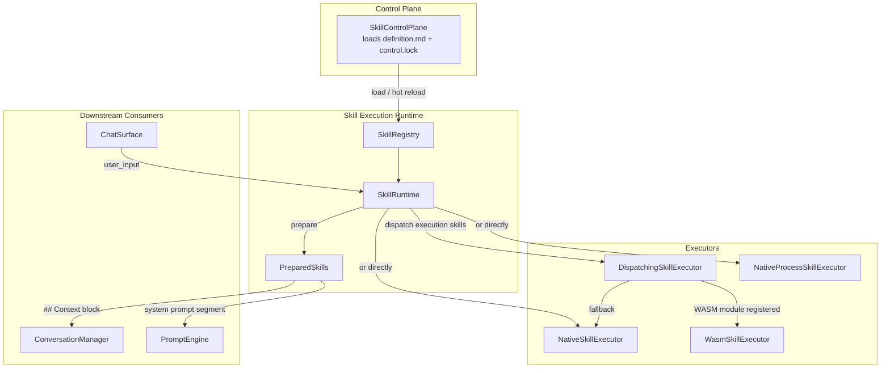
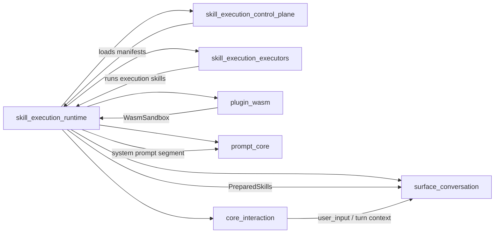
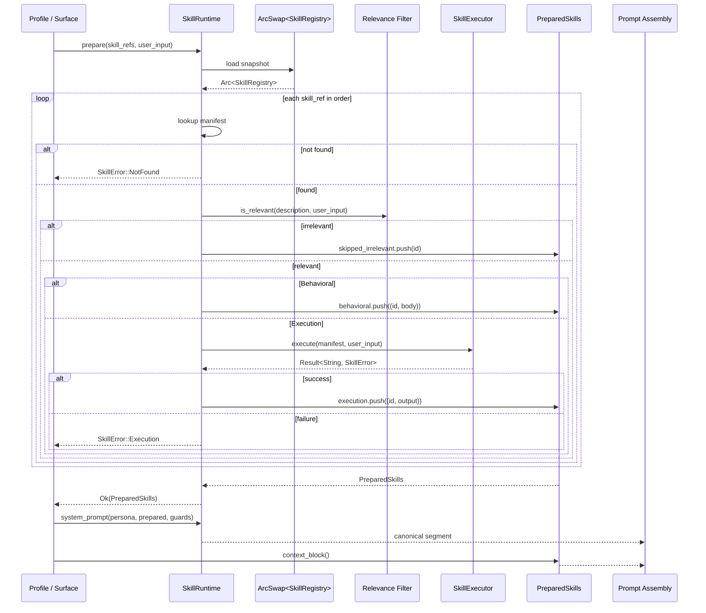
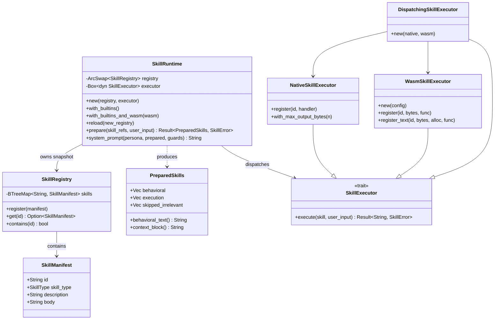
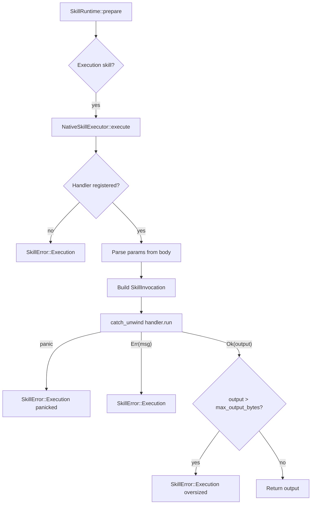
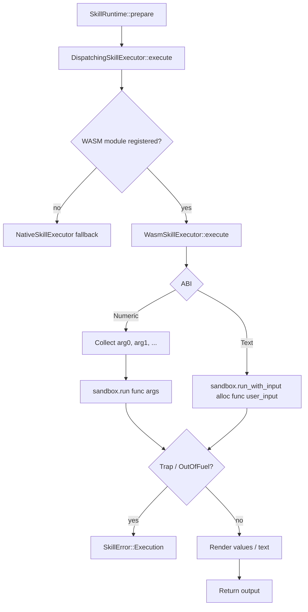
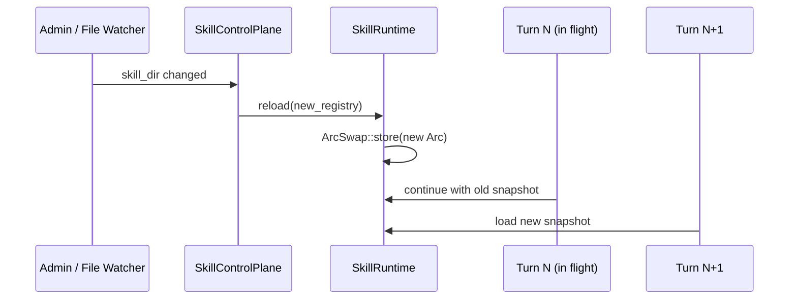

# Skill Execution Runtime

The **Skill Execution Runtime** (`ainxt-skill`) resolves a profile's skill references into the two injection payloads used during prompt assembly: behavioral instructions that shape the system prompt, and execution outputs that ground the turn in a `## Context` block. It is the central coordinator of the [skill_execution](skill_execution.md) subsystem, sitting between the [skill_execution_control_plane](skill_execution_control_plane.md) that loads skill manifests and the [skill_execution_executors](skill_execution_executors.md) that actually run code.

A skill is either:

- **Behavioral** — a plain-text SOP or domain procedure injected into the system prompt with full instructional authority.
- **Execution** — code that runs before the model call and whose output is injected into `## Context` as computed/live grounding data.

The runtime owns the registry of available skills, performs relevance-based selection against the user's turn, dispatches execution skills to a [`SkillExecutor`](skill_execution_executors.md), and assembles the canonical system-prompt segment. It never runs code itself; execution is always delegated to a pluggable executor seam.

---

## Core Responsibilities

| Responsibility | Description |
| -------------- | ----------- |
| **Skill catalog** | Maintain an in-memory [`SkillRegistry`] of [`SkillManifest`] entries, usually loaded from the git-native control plane. |
| **Hot reload** | Publish a new registry atomically via [`SkillRuntime::reload`] so subsequent turns see new skills without rebuilding the daemon. |
| **Relevance selection** | Filter described skills by keyword overlap with the user's input; undescribed skills remain unconditionally relevant for backward compatibility. |
| **Execution dispatch** | Run execution skills through a [`SkillExecutor`] and capture their text output. |
| **Prompt assembly** | Produce [`PreparedSkills`] and the canonical `persona → behavioral skills → guard prompts` system prompt segment. |
| **Fail-closed safety** | Unknown skill refs, unregistered execution handlers, panics, oversized output, and sandbox violations all surface as [`SkillError`] rather than silent truncation or empty context. |

---

## Core Components

### `SkillManifest`

A skill's resolved front-matter. In production this is the parsed body of a git-native `definition.md` (see [skill_execution_control_plane](skill_execution_control_plane.md)); in the runtime it is the struct the rest of the system reasons about.

```rust
pub struct SkillManifest {
    pub id: String,
    pub skill_type: SkillType,
    pub description: String,
    pub body: String,
}
```

- `id` — stable reference used by profiles.
- `skill_type` — `Behavioral` (SOP text) or `Execution` (code).
- `description` — short relevance-selection metadata; empty means "always relevant."
- `body` — for behavioral skills, the SOP text; for execution skills, the runner instruction/template.

### `SkillType`

```rust
pub enum SkillType {
    Behavioral,
    Execution,
}
```

The two kinds are injected at different points of context assembly, as enforced by [`SkillRuntime::system_prompt`].

### `SkillRegistry`

An in-memory `BTreeMap<String, SkillManifest>` projection of the control-plane catalog. It supports registration, lookup, and enumeration. The runtime wraps it in an `ArcSwap` for lock-free hot reload.

### `SkillRuntime`

The main coordinator. It holds:

- `registry: ArcSwap<SkillRegistry>` — lock-free, reloadable skill catalog.
- `executor: Box<dyn SkillExecutor>` — the seam where execution skills actually run.

Key methods:

- `new(registry, executor)` — construct a runtime.
- `with_builtins()` — production default pre-populated with compiled-in skills over a native executor.
- `with_builtins_and_wasm(wasm)` — production wiring that dispatches to a WASM sandbox when a module is registered, native handlers otherwise.
- `reload(new_registry)` — atomically publish a new registry.
- `prepare(skill_refs, user_input)` — resolve refs into [`PreparedSkills`], filtering by relevance and running execution skills.
- `system_prompt(persona, prepared, guard_prompts)` — assemble the canonical system-prompt segment.

### `PreparedSkills`

The per-turn output of [`SkillRuntime::prepare`]:

```rust
pub struct PreparedSkills {
    pub behavioral: Vec<(String, String)>,
    pub execution: Vec<(String, String)>,
    pub skipped_irrelevant: Vec<String>,
}
```

- `behavioral` — `(id, body)` pairs injected into the system prompt.
- `execution` — `(id, output)` pairs rendered under `### <id>` inside the `## Context` block.
- `skipped_irrelevant` — refs that were registered but filtered out by relevance selection, kept for observability.

Helper methods:

- `behavioral_text()` — joined SOP bodies.
- `context_block()` — formatted `## Context` block, or empty string if no execution outputs exist.

### `SkillError`

```rust
pub enum SkillError {
    NotFound(String),
    Execution { skill: String, message: String },
}
```

All failure modes are explicit. A missing ref is always a hard error; execution failures carry the skill id and a descriptive message.

---

## Architecture



The runtime is intentionally thin: it orchestrates *where* skill output goes, while the executor seam decides *how* code runs. This separation lets the same runtime host native handlers, OS subprocesses, or WASM sandboxes without changing prompt assembly.

---

## Dependencies



- **[skill_execution_control_plane](skill_execution_control_plane.md)** — loads skill manifests from the git-native control plane (`definition.md` + `control.lock`).
- **[skill_execution_executors](skill_execution_executors.md)** — implements the `SkillExecutor` seam, including native handlers and OS subprocess execution.
- **[plugin_wasm](plugin_wasm.md)** — provides `WasmSandbox`, the capability-confined host used by `WasmSkillExecutor`.
- **[surface_conversation](surface_conversation.md)** — consumes `PreparedSkills` via `ChatSurface` and `ConversationManager` to build the final turn.
- **[prompt_core](../ai_engine/prompt_core.md)** — receives the canonical system-prompt segment and layers it with persona, guard prompts, and retrieval context.
- **[core_interaction](core_interaction.md)** — supplies session/turn context (user input, history) that drives skill selection.

---

## Data Flow



A single `prepare` call loads one registry snapshot at the start. This **in-flight-turn-pinning** guarantees that a concurrent hot reload cannot split one turn's resolution across two registry versions.

---

## Component Interaction



---

## Execution Skill Process Flow

### Native Execution



Native execution is deterministic: the `SkillInvocation` contains only `skill_id`, `user_input`, `manifest_body`, and parsed `params`. There is no clock, RNG, or ambient I/O, making output replayable for forensic reproducibility.

### Sandboxed (WASM) Execution



The WASM executor runs inside [`ainxt_wasm::WasmSandbox`](plugin_wasm.md) with zero ambient authority (empty import set), fuel metering, memory bounds, and output ceilings. Two ABIs are supported:

- **Numeric** — `argN` params in, numeric values out.
- **Text** — user-turn text passed through guest linear memory, UTF-8 text out.

---

## Prompt Assembly Order


[`SkillRuntime::system_prompt`] enforces the canonical order for the system-prompt segment: **persona → behavioral skills → guard prompts**. The caller then appends the `## Context` block (execution skills + retrieval), conversation history, and the current user turn. This ordering is fixed so that behavioral SOPs have full instructional authority while execution output remains grounded context.

---

## Built-in Skills

`SkillRuntime::with_builtins` ships a production-ready runtime pre-populated with compiled-in skills. These are trusted, deterministic, and always available:

| ID | Type | Purpose |
| -- | ---- | ------- |
| `citation-discipline` | Behavioral | Mandates citing every factual claim to a retrieved source. |
| `turn-header` | Execution | Renders a deterministic header from the user's turn via `TemplateSkill`. |
| `rca-procedure` | Behavioral | Root-cause-analysis SOP for incidents. |
| `test-gen-procedure` | Behavioral | Test-generation SOP covering happy path, boundaries, invalid input, concurrency, and adversarial cases. |
| `architecture-review` | Behavioral | Design-review SOP focused on failure modes and scaling. |
| `compliance-review` | Behavioral | PCI/DSS + secrets compliance-review SOP. |
| `settlement-investigation` | Behavioral | NPCI settlement-batch investigation SOP. |
| `release-notes` | Behavioral | Release-notes drafting SOP. |

Only `turn-header` runs code; the rest are behavioral SOPs injected into the system prompt.

---

## Relevance-Based Selection

`SkillRuntime::prepare` filters described skills using a simple, deterministic, offline-safe heuristic:

1. If `description` is empty or contains no significant words (alphanumeric runs longer than 3 characters), the skill is **always relevant**.
2. Otherwise, the skill is relevant if the lowercased `user_input` contains at least one significant word from the description as a substring.

This keeps every existing undescribed profile/skill config byte-identical while allowing described skills to be selected only when the turn's topic matches. Irrelevant execution skills are **never dispatched**, avoiding unnecessary side effects or cost.

---

## Hot Reload

The runtime uses `arc_swap::ArcSwap<SkillRegistry>` so that [`SkillRuntime::reload`] publishes a new registry with a single atomic pointer swap. This satisfies ADR-026 §6.2:

- Calls to `prepare` that start **after** the reload see the new registry.
- Calls already in flight keep the snapshot they loaded at the start.
- No caller that owns the same `SkillRuntime` needs to be rebuilt.



---

## Error Handling Philosophy

The runtime is designed to **fail closed**:

- Unknown skill reference → `SkillError::NotFound`.
- Execution skill with no registered handler/module → `SkillError::Execution`.
- Native handler panics → caught and reported as `SkillError::Execution`.
- Output exceeds ceiling → `SkillError::Execution`.
- WASM guest traps or exhausts fuel → `SkillError::Execution`.
- WASM module imports ungranted host functions → instantiation fails, reported as `SkillError::Execution`.

No failure silently produces empty context or truncated output.

---

## Integration with the Wider System

The Skill Execution Runtime is one layer of the [application_runtime](application_runtime.md) stack. It is typically owned by a `ChatSurface` or `Engine` in [runtime_engine](../pipeline_runtime/runtime_engine.md) and configured from the git-native control plane loaded by [skill_execution_control_plane](skill_execution_control_plane.md). Execution skills may call out through [connectors](connectors.md) or read from [knowledge_retrieval](../ai_engine/knowledge_retrieval.md) only when the chosen executor explicitly grants those capabilities; the runtime itself provides no ambient authority.

For details on how skills are loaded and versioned, see [skill_execution_control_plane](skill_execution_control_plane.md). For details on the executor implementations, see [skill_execution_executors](skill_execution_executors.md). For the WASM sandbox that powers `WasmSkillExecutor`, see [plugin_wasm](plugin_wasm.md).
