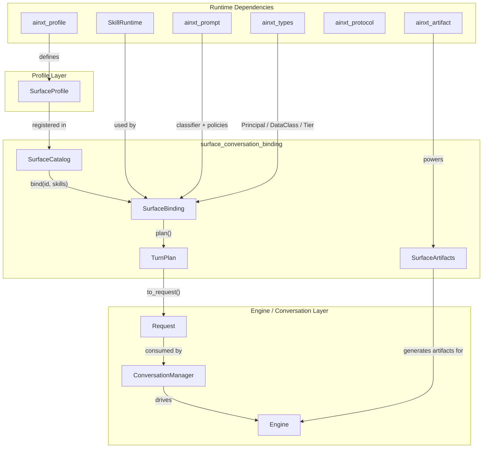
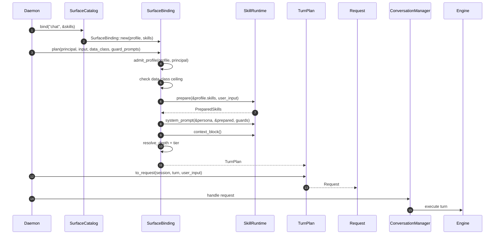
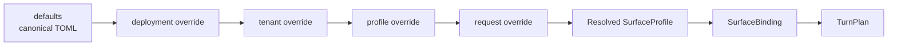
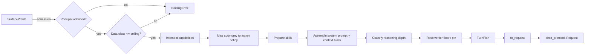
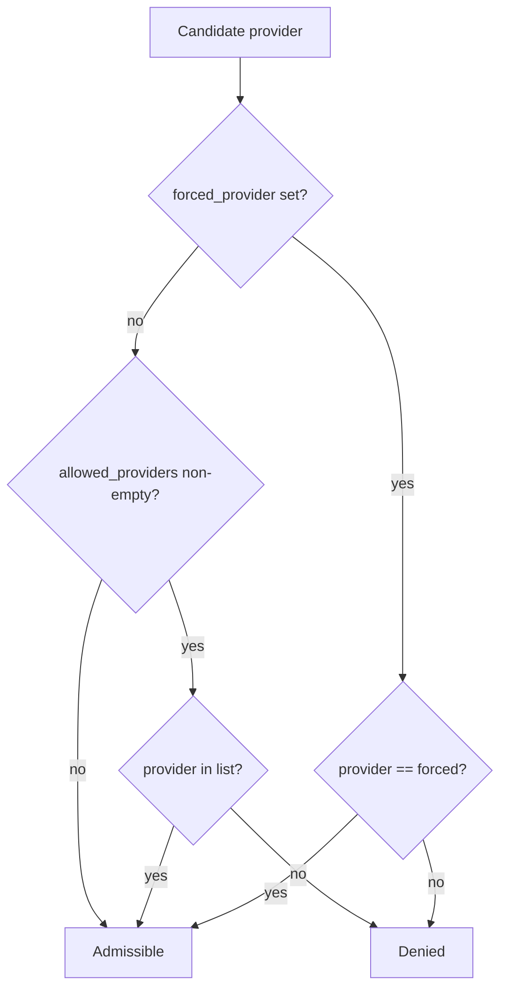
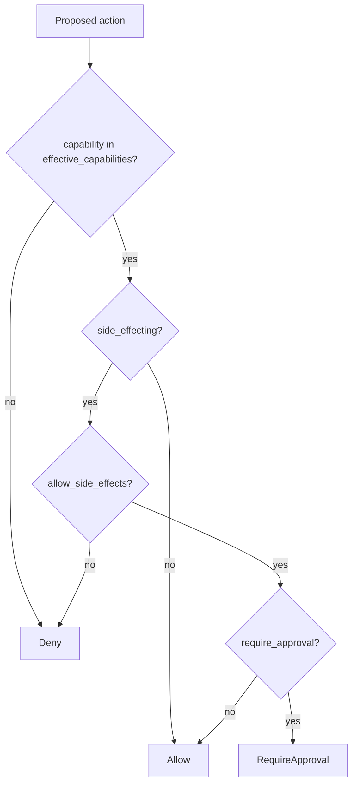
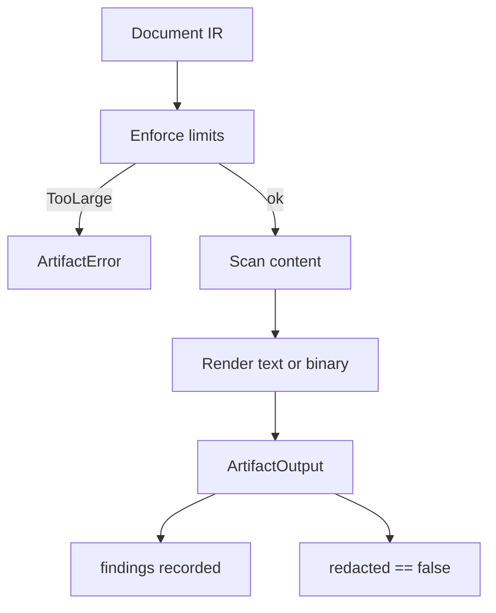

# surface_conversation_binding

The **surface_conversation_binding** module (implemented in `crates/ainxt-surface`) is the bridge between *declarative* surface profiles and the *runtime* engine. A [`SurfaceProfile`](surface_conversation_intelligence.md) describes how a surface should behave (persona, capabilities, autonomy, model policy, retrieval scope); this module turns that profile, plus a calling [`Principal`](security_config.md) and a user turn, into a concrete [`TurnPlan`](surface_conversation_binding.md#turnplan) that the engine can execute.

In other words, it is the **profile → runtime binding** layer: it validates that the principal may use the surface, enforces data-class ceilings, intersects capabilities, resolves reasoning depth and routing tier, assembles the system prompt and context block, and produces an [`ainxt_protocol::Request`](core_interaction.md) ready for the conversation and engine layers.

The module also owns the [`SurfaceCatalog`](surface_conversation_binding.md#surfacecatalog) registry of resolved profiles and the [`SurfaceArtifacts`](surface_conversation_binding.md#surfaceartifacts) shared document-generation runtime, making the entire profile → binding → artifact path a testable library surface rather than hardcoded daemon logic.

---

## Core Components

### `SurfaceBinding` & `TurnPlan`

[`SurfaceBinding`](surface_conversation_binding.md#surfacebinding) is the central type. It is constructed from a `SurfaceProfile` reference and a `SkillRuntime` reference, then used to plan individual turns.

[`TurnPlan`](surface_conversation_binding.md#turnplan) is the output: a fully-resolved, engine-consumable description of one turn. It carries:

| Field | Purpose |
|-------|---------|
| `system_prompt` | Persona → behavioral skills → guard prompts, assembled by the skill runtime. |
| `context_block` | The `## Context` block produced by execution skills. |
| `effective_capabilities` | Profile-offered capabilities intersected with the principal's RBAC. |
| `connectors` | Connector ids the surface declares it may use. |
| `reasoning_depth` / `tier` / `default_tier` / `pinned_tier` | Resolved routing policy (depth vs. floor vs. hard pin). |
| `numeric` / `format` | Prompt-policy preferences mapped to engine types. |
| `forced_provider` / `allowed_providers` | Surface-level provider pin or allow-list. |
| `data_class` / `max_data_class` | The turn's data class and the surface ceiling. |
| `allow_side_effects` / `require_approval` | Autonomy-derived action policy. |
| `retrieval` / `department_scope` | Context-assembly scope controls. |
| `history_budget_tokens` / `condenser` | Conversation-history budget controls. |

The binding pipeline applies policies in a strict, fail-closed order:

1. **Admission** — principal role, required capabilities, department scope, and AD seniority ceiling.
2. **Data-class ceiling** — the turn's data class must not exceed the surface's `max_data_class`.
3. **Capability intersection** — only capabilities both offered by the surface and held by the principal survive.
4. **Autonomy mapping** — read-only/suggest surfaces deny side effects; act-with-approval routes them through HITL; autonomous surfaces allow them (still RBAC'd).
5. **Prompt assembly** — system prompt, behavioral skills, guard prompts, and execution-skill context block.
6. **Reasoning & tier resolution** — classify the query (when `Auto`), apply the surface's tier floor, and honor hard tier pins.
7. **Retrieval scope** — carry the scope and department filter into the plan.

### `SurfaceCatalog`

[`SurfaceCatalog`](surface_conversation_binding.md#surfacecatalog) is the daemon-consumable registry of resolved `SurfaceProfile`s. It ships with four canonical surfaces embedded at compile time:

- `chat`
- `code`
- `sdlc`
- `buddy`

It supports layered overrides following the `defaults → deployment → tenant → profile → request` chain (ADR-004). The catalog can be built with deployment and tenant overrides, and it provides a single `bind(id, skills)` call that returns a `SurfaceBinding` ready to plan turns.

### `SurfaceArtifacts`

[`SurfaceArtifacts`](surface_conversation_binding.md#surfaceartifacts) is the surface layer's single, shared document-generation runtime. It wraps `ainxt_artifact::ArtifactRuntime` with the built-in Markdown and plain-text renderers plus an injected content scanner (enterprise PCI engine in production; `LuhnEntropyScanner` as the OSS default). It is `Send + Sync` so one instance backs all worker threads.

Key properties:

- **Audit-and-proceed**: compliance findings are recorded on the audit trail, but the artifact is emitted intact (`redacted == false`).
- **Binary skill renderer seam**: docx/pptx/pdf/xlsx renderers can be registered via `register()`.
- **Resource limits**: per-generation caps on block count and total bytes prevent hostile documents from exhausting workers.

---

## Architecture

### Component Interaction

### Layered Profile Resolution

The catalog applies `defaults → deployment → tenant` at load time. The `profile` and `request` layers are applied per-turn via `SurfaceProfile::with_request_layer`, with the safety invariant that a request layer can only *narrow* the profile, never widen it.

---

## Data Flow: From Profile to Engine Request

---

## Provider Policy Enforcement

`TurnPlan` exposes a pure predicate `is_provider_admissible` that is also used by the daemon at boot time to narrow the router's provider chain before any turn exists. The precedence is:

1. If `forced_provider` is set, only that provider is admissible.
2. Else if `allowed_providers` is non-empty, only listed providers are admissible.
3. Else any provider is permitted.

This is *additive* to the engine's non-overridable data-class exclusion gate. See [`surface_conversation_binding` provider flow](surface_conversation_binding.md#provider-policy-enforcement).

---

## Tool / Connector Authorization

`TurnPlan::authorize_tool` is the single source of truth for whether a proposed tool or connector action may run. It composes two orthogonal controls:

1. **Capability scope** — the capability must be in `effective_capabilities`.
2. **Autonomy** — side-effecting actions are denied on read-only surfaces, require approval on act-with-approval surfaces, and are allowed on autonomous surfaces.

Connectors are authorized by calling `authorize_tool` with the `connector.<id>` capability. The surface must also *declare* the connector via `offers_connector`.

---

## Artifact Generation Flow

`SurfaceArtifacts::generate` is the live output path for all surface-generated documents. It enforces limits, runs the injected scanner, renders the artifact, and returns the output with any findings attached. Compliance is always audit-and-proceed.

---

## Error Handling

The module is fail-closed. [`BindingError`](surface_conversation_binding.md#bindingerror) enumerates the refusal reasons:

- `RoleTooLow` — principal's role is below the surface floor.
- `MissingCap` — principal lacks a required capability.
- `DataClassExceeded` — turn data class exceeds the surface ceiling.
- `DepartmentRequired` — surface is department-scoped but the principal has no department.
- `SeniorityRequired` — principal's AD level exceeds the surface ceiling or is missing.
- `Skill` — a referenced skill failed to prepare.
- `RequestOverride` — a per-request override attempted to widen the profile.

All errors are returned as `Result::Err`; the module never fabricates defaults or silently downgrade permissions.

---

## Integration with the System

The `surface_conversation_binding` module sits at the boundary between the declarative surface configuration layer and the runtime execution layer:

- **Upstream**: consumes [`SurfaceProfile`](surface_conversation_intelligence.md) definitions from [`ainxt_profile`](security_config.md) and canonical profile TOMLs.
- **Downstream**: produces [`ainxt_protocol::Request`](core_interaction.md) objects consumed by [`ConversationManager`](surface_conversation_intelligence.md) and the [`Engine`](../pipeline_runtime/runtime_engine.md).
- **Side**: uses [`SkillRuntime`](skill_execution.md) to prepare skills and assemble prompts, and [`SurfaceArtifacts`](../ai_engine/answer_artifact.md) to render documents.

It is a sibling to:

- [`surface_conversation_chat`](surface_conversation_chat.md) — the chat-specific surface implementation.
- [`surface_conversation_intelligence`](surface_conversation_intelligence.md) — conversation management, intent classification, and command pipelines.

And it depends on:

- [`security_config`](security_config.md) — `Principal`, `Role`, `DataClass`, `Tier`.
- [`skill_execution`](skill_execution.md) — `SkillRuntime`, `SkillRegistry`, skill executors.
- [`prompt_engineering`](../ai_engine/prompt_engineering.md) — complexity classifiers, numeric/format policies, reasoning depth.
- [`core_interaction`](core_interaction.md) — `Request`, session/turn protocol.
- [`answer_artifact`](../ai_engine/answer_artifact.md) — `ArtifactRuntime`, renderers, content scanners.

---

## Testing Strategy

The crate's tests are organized around the gaps they close:

- **Admission**: role floor, required caps, department scope, AD seniority ceiling.
- **Data-class ceiling**: refusal above `max_data_class`.
- **Capability intersection**: effective capabilities are the intersection of surface offer and principal holdings.
- **Autonomy mapping**: read-only / act-with-approval / autonomous surfaces produce correct `allow_side_effects` and `require_approval`.
- **Reasoning & tier**: `Auto` classification, fixed depth, tier floor, hard tier pin.
- **Provider policy**: `forced_provider`, `allowed_providers`, and `admissible_providers`.
- **Request mapping**: `to_request` carries tier, provider, data class, system prompt, context block, and raw user turn.
- **Per-request override**: narrowing-only semantics, refusal of widening attempts.
- **Artifact wiring**: `SurfaceArtifacts` is `Send + Sync`, injected scanners run, binary renderers plug in, limits are enforced.

---

## Key Design Decisions

1. **Fail-closed by default**: every policy check refuses rather than permits when in doubt.
2. **Single source of truth**: `TurnPlan::is_provider_admissible` is shared between plan-time and daemon boot-time router construction, eliminating duplicated logic.
3. **Request layer is narrowing-only**: runtime config overrides cannot escalate RBAC, capabilities, autonomy, connectors, retrieval, data-class ceiling, or provider allow-list.
4. **Audit-and-proceed for artifacts**: compliance findings ride along; content is never redacted inside the artifact to avoid corrupting tables or code blocks.
5. **Compile-time canonical profiles**: the four built-in surfaces are embedded as TOML so the daemon has no filesystem dependency for base profiles.
