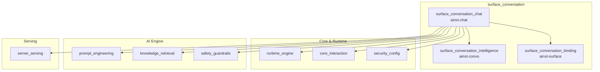
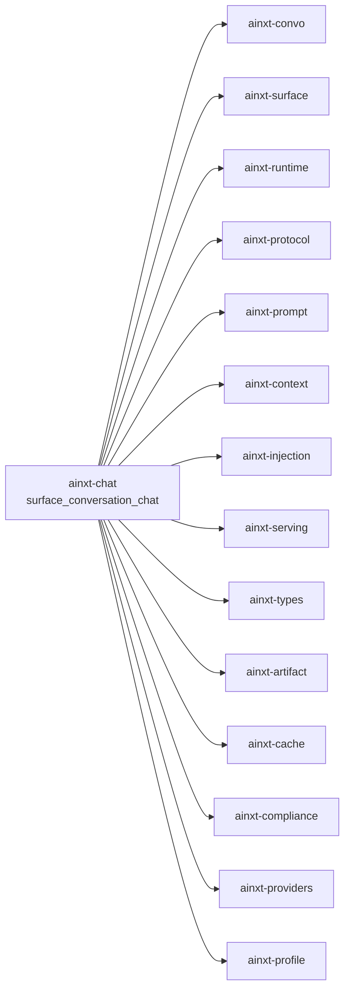
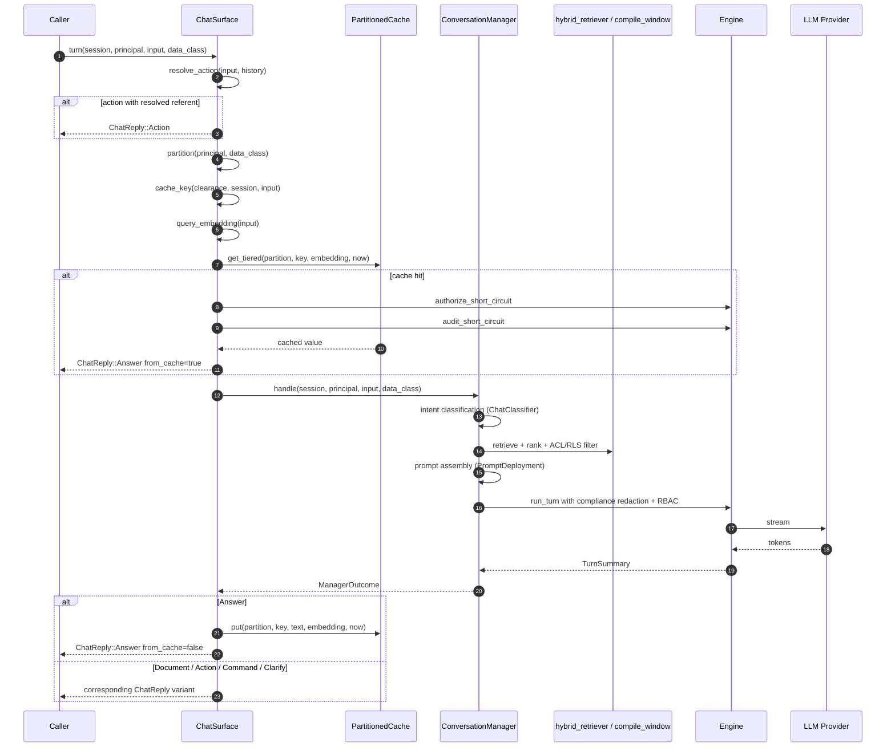
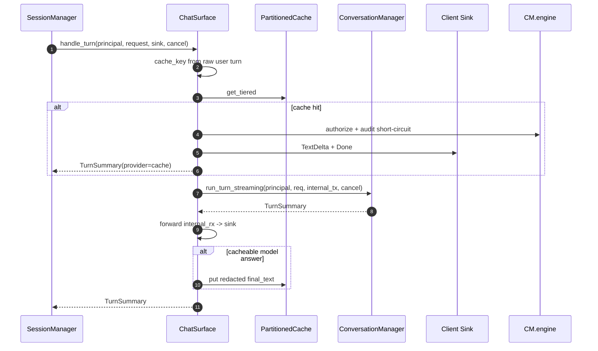
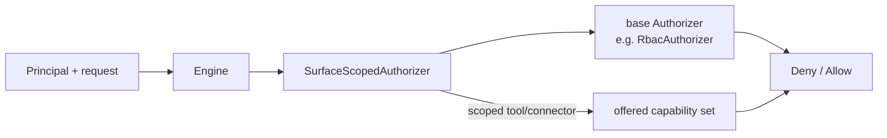
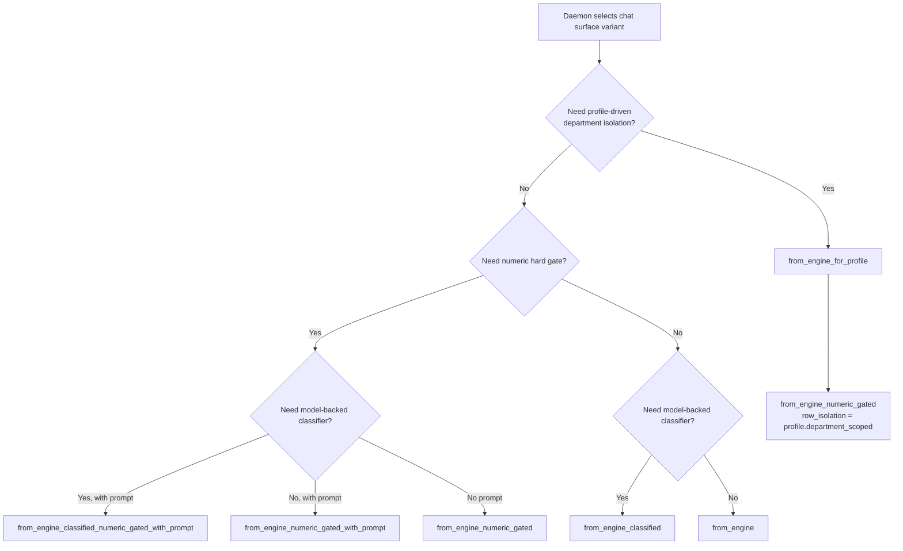

# surface_conversation_chat

## Brief Introduction

The `surface_conversation_chat` module (crate `ainxt-chat`) is the **served Chat surface** of the system: it assembles the end-to-end conversation flow into a single, integration-tested component that the runtime's session spine can serve. While sibling modules own the individual pieces—conversation intelligence, surface binding, retrieval, prompt engineering, safety guardrails, and the execution engine—`ainxt-chat` wires them together and adds the cross-cutting concerns that only make sense at the surface boundary: **scoping-safe response caching**, **surface-scoped capability authorization**, **intent-classifier selection**, **guardrail/injection configuration**, and **streaming turn handling**.

The module exposes two primary artifacts:

- `ChatSurface` — the assembled chat surface, usable both as a direct `turn()` API and as a `TurnHandler` for the served runtime.
- `SurfaceScopedAuthorizer` — an `Authorizer` wrapper that narrows a principal's tool/connector capabilities to the surface's declared capability set, preventing a chat surface from dispatching tools it never declared.

`ainxt-chat` is intentionally an **integration layer** rather than a feature-broad module. Its value is proving that the independently developed crates cooperate correctly under real multi-turn chat: grounding, citation, referent resolution, streaming redaction, RBAC denial, cache hits, and cache scoping.

---

## Architecture

### Module Position

`surface_conversation_chat` sits at the bottom of the `surface_conversation` subtree, alongside `surface_conversation_intelligence` (`ainxt-convo`) and `surface_conversation_binding` (`ainxt-surface`). It consumes the conversation manager from `surface_conversation_intelligence`, the surface profile/binding concepts from `surface_conversation_binding`, and delegates all heavy lifting to the engine, retrieval, prompt, guardrail, and caching modules.

### Core Components

| Component | Responsibility |
|-----------|---------------|
| `ChatSurface` | Assembles and serves one chat surface: retriever, conversation manager, cache, classifier, verifier, guardrails, injection scanner, session store. |
| `SurfaceScopedAuthorizer` | Wraps a base `Authorizer` and refuses tool/connector capabilities not offered by the surface's profile. |
| `ChatClassifier` | Local enum that unifies heuristic and model-backed intent classifiers so `ChatSurface` stays monomorphic. |
| `ChatReply` | The reply ADT: `Answer`, `Document`, `Action`, `Command`, or `Clarify`. |

---

## Dependencies

`ainxt-chat` is a high-level integration crate. It depends on the following modules (see their dedicated docs for internals):

- **[surface_conversation_intelligence](surface_conversation_intelligence.md)** — `ConversationManager`, intent classification (`HeuristicClassifier`, `ModelIntentClassifier`), command pipelines, message/session abstractions, `AnswerVerifier`, and guardrails attachment.
- **[surface_conversation_binding](surface_conversation_binding.md)** — `SurfaceProfile`, `SurfaceBinding`, and the declarative surface catalog that determines department scoping and offered capabilities.
- **[runtime_engine](../pipeline_runtime/runtime_engine.md)** — `Engine`, `TurnHandler`, `TurnSummary`, `CancelToken`, `RbacAuthorizer`, `ModelRouter`, and the `authz::Authorizer` trait.
- **[core_interaction](core_interaction.md)** — `Request`, `Event`, session/turn identifiers, and the protocol envelope.
- **[prompt_engineering](../ai_engine/prompt_engineering.md)** — `PromptDeployment`, layered prompt service, model family selection, and forensic sinks.
- **[knowledge_retrieval](../ai_engine/knowledge_retrieval.md)** — `Corpus`, `Chunk`, `compile_window`, `hybrid_retriever`, `RankGraph`, `OptimizerConfig`, and `EligibleModel`.
- **[safety_guardrails](../ai_engine/safety_guardrails.md)** — `InjectionConfig`, `InjectionScanner`, `GuardrailsConfig`, and the retrieved-content injection defense.
- **[server_serving](../pipeline_runtime/server_serving.md)** — `PartitionKey`, cache isolation, and the erasure infrastructure that purges the shared answer cache.
- **[security_config](security_config.md)** — `Principal`, `DataClass`, and clearance/department attributes that drive cache partitioning and retrieval isolation.
- **[answer_artifact](../ai_engine/answer_artifact.md)** — `Document` IR produced by doc-gen turns.

---

## Data Flow

A single chat turn flows through `ChatSurface` in three phases: **pre-processing**, **execution**, and **post-processing/cache**.

### Streaming Turn Handler

When used as a `TurnHandler` (the served path), the same flow is adapted to the runtime's streaming contract:

---

## Component Interactions

### `ChatSurface` ↔ `ConversationManager`

`ChatSurface` does not implement conversation logic itself. It builds a `ConversationManager<ChatClassifier>` with all production seams enabled:

- `with_retriever` — production hybrid retriever over the surface's `Corpus`.
- `with_context_window` — `compile_window` with real eligible-model list from the router.
- `with_context_graph` — `RankGraph` built from corpus chunk co-source relationships.
- `with_prompt_service` — layered `PromptDeployment` (default or daemon-injected).
- `with_answer_format` — `ainxt-answer` composition with citations.
- `with_injection` — retrieved-content injection scanning on by default.
- `with_row_isolation` — department RLS row-filter when the profile declares department scoping.
- `with_verifier` — numeric re-derivation hard gate for ledger/payments surfaces.
- `with_command_registry`, `with_guardrails`, `with_injection_scanner`, `with_session_store` — daemon opt-in seams.

See [surface_conversation_intelligence](surface_conversation_intelligence.md) for the manager's internal pipeline.

### `ChatSurface` ↔ `PartitionedCache`

The cache is a shared `Arc<Mutex<PartitionedCache>>` so that the same instance is read by turn handling and purged by the server's erasure organ. Key design points:

- **Partition key** = `{data_class, principal_scope, harness_id}`.
- **Principal scope** = per-user for confidential+, per-department for internal/public.
- **Entry key** = `{clearance.sensitivity(), session, normalized(input)}`.
- **Semantic tier** = optional `Embedder`; exact/normalized lookup always runs first.
- **Cacheable ceiling** = `cacheable_max` (default `DataClass::Internal`); more sensitive classes never cache.

See [server_serving](../pipeline_runtime/server_serving.md) for cache isolation and erasure integration.

### `SurfaceScopedAuthorizer` ↔ `Engine`

The engine calls `Authorizer::authorize` before every tool/connector dispatch. `SurfaceScopedAuthorizer` wraps the base authorizer (typically `RbacAuthorizer`) and narrows only `tool.*` / `connector.*` capabilities to the surface's offered set. It can only deny, never grant; non-tool capabilities defer to the base authorizer unchanged.

---

## Process Flows

### Constructor Selection

`ChatSurface` provides a family of constructors so the composition daemon can pick the right trade-off for the deployment:

### Referent Resolution

Before caching or model invocation, `ChatSurface::turn` checks whether the input is a content-consuming action ("summarize the above and email it"). If `resolve_action` returns an explicit or referent `ContentSource`, the surface returns `ChatReply::Action` immediately, excluding the instruction verb from the content. This prevents actions from being cached and ensures the content is the prior answer, not the user's instruction.

See [surface_conversation_intelligence](surface_conversation_intelligence.md) for `resolve_action` semantics.

### Cache Hit Authorization

A cache hit is not a bypass. The surface still:

1. Calls `engine.authorize_short_circuit(principal, session, turn)` to enforce `chat.send` and any live RBAC revocation.
2. Calls `engine.audit_short_circuit(..., "chat-cache", 0)` so auditors can see the turn was served from cache.

This closes the risk that a department peer or revoked principal is served a stale cached answer.

---

## Security & Compliance Notes

- **Scoping-safe cache**: The cache key encodes caller clearance and data class; different clearances never share cached answers. Tenant/department dimensions are folded into the partition key by the enterprise layer.
- **Surface capability narrowing**: `SurfaceScopedAuthorizer` ensures a chat surface cannot dispatch tools or connectors outside its declared profile, even for an otherwise privileged principal.
- **Retrieved-content injection scanning**: Enabled by default in `assemble_with_prompt` via `InjectionConfig::recommended()`, so poisoned KB chunks or connector content cannot silently trigger side-effecting tools.
- **Numeric re-derivation gate**: Ledger/payments surfaces opt into `AnswerVerifier::numeric_gate_only()` so unattributable figures are blocked and escalated.
- **Erasure-ready cache**: `answer_cache_handle()` returns a clone of the shared `Arc` so the server's `TieredCacheErasure` purges the exact cache instance that served turns wrote into.

---

## Integration Testing

The crate's tests are intentionally end-to-end: they drive a real multi-turn chat through the assembled stack and assert cross-cutting behaviors. Representative test categories include:

- Context-fabric wiring: `served_window` resolves real router eligible IDs; `build_rank_graph` connects same-source chunks; `ChatSurface::new` wires a non-empty graph.
- Cache scoping: different clearances/principals do not share entries.
- RBAC denial: unauthorized callers are refused even on cache hits.
- Referent resolution: action turns resolve the prior answer, not the instruction.
- Streaming redaction: PII is redacted before the final answer is cached.

---

## Related Documentation

- [surface_conversation_intelligence](surface_conversation_intelligence.md) — conversation manager, intent classification, command pipelines, answer verification.
- [surface_conversation_binding](surface_conversation_binding.md) — surface profiles, binding, catalog, and artifact rendering.
- [runtime_engine](../pipeline_runtime/runtime_engine.md) — engine, turn handler, RBAC, model routing.
- [prompt_engineering](../ai_engine/prompt_engineering.md) — prompt service, registry, model families.
- [knowledge_retrieval](../ai_engine/knowledge_retrieval.md) — corpus, retrieval, ranking, context window.
- [safety_guardrails](../ai_engine/safety_guardrails.md) — injection scanning and output guardrails.
- [server_serving](../pipeline_runtime/server_serving.md) — cache isolation, erasure, and serving infrastructure.
- [security_config](security_config.md) — principal, data class, clearance.
- [answer_artifact](../ai_engine/answer_artifact.md) — answer and document rendering.
