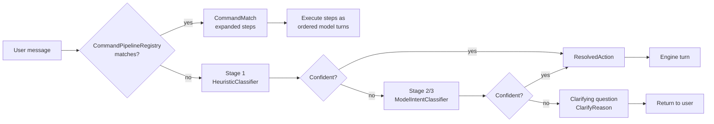
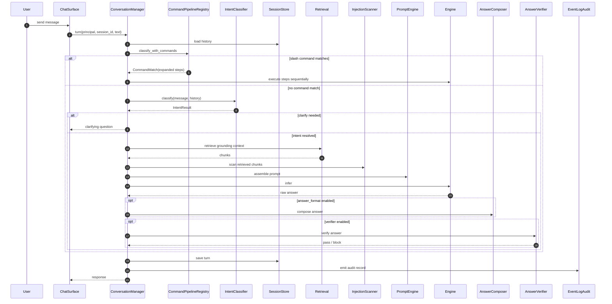
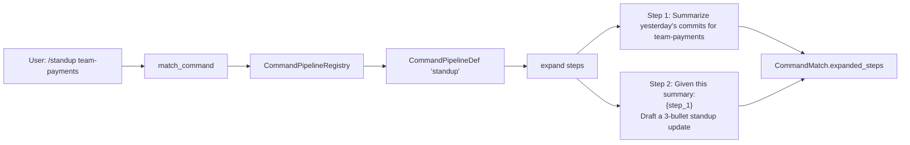
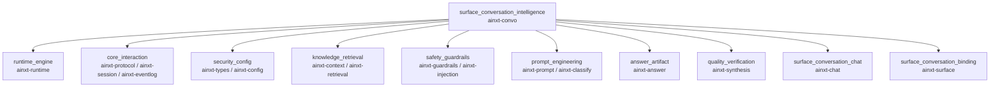

# surface_conversation_intelligence

## Brief Introduction

The `surface_conversation_intelligence` module is the conversation-intelligence layer of the platform — the "chat-done-right" brain that sits above the core inference [`Engine`](../pipeline_runtime/runtime_engine.md). It is implemented primarily in the `ainxt-convo` crate and is responsible for turning a raw user message into a safe, grounded, auditable turn.

Its responsibilities include:

- **Session management** — storing and retrieving conversation history (`InMemorySessions`, `PersistentSessions`).
- **Intent classification** — resolving what the user wants through a cascade of deterministic heuristics (`HeuristicClassifier`) and optional model-backed classifiers (`ModelIntentClassifier`, `LexicalLabelModel`).
- **Referent / content resolution** — ensuring that a user instruction such as "generate this as a PDF" resolves the *content* from conversation context, rather than producing a PDF that literally contains the instruction.
- **Command pipelines** — expanding git-native slash-command macros (`/standup`, `/incident-report`) into ordered, parameterized prompt sequences (`CommandPipelineRegistry`, `CommandPipelineDef`, `CommandStep`, `CommandMatch`).
- **Grounding, guardrails, and verification** — integrating retrieval, prompt-injection defense, output-side groundedness rails, answer verification (`AnswerVerifier`), and the served prompt service (`PromptDeployment`).
- **Audit** — emitting structured audit records through `EventLogAudit`.

The module is intentionally model-agnostic: the classifier is a trait seam, and enterprise features (guardrails, injection scanning, verifier, prompt service, command pipelines) are opt-in and default-off so that existing behavior is preserved unless a deployment explicitly enables them.

---

## Module Scope & Boundaries

`surface_conversation_intelligence` lives under [`application_runtime`](application_runtime.md) → [`surface_conversation`](surface_conversation.md), alongside:

- [`surface_conversation_chat`](surface_conversation_chat.md) — the chat surface (`ainxt-chat`).
- [`surface_conversation_binding`](surface_conversation_binding.md) — surface artifacts and bindings (`ainxt-surface`).

It consumes capabilities from many sibling modules but does not implement:

- Low-level model routing or inference — delegated to [`runtime_engine`](../pipeline_runtime/runtime_engine.md).
- Retrieval indexing or embedding — delegated to [`knowledge_retrieval`](../ai_engine/knowledge_retrieval.md) (`ainxt-context`, `ainxt-retrieval`).
- Guardrail model implementations — delegated to [`safety_guardrails`](../ai_engine/safety_guardrails.md) (`ainxt-guardrails`, `ainxt-injection`).
- Prompt assembly and served prompt layers — delegated to [`prompt_engineering`](../ai_engine/prompt_engineering.md) (`ainxt-prompt`).
- Answer composition — delegated to [`answer_artifact`](../ai_engine/answer_artifact.md) (`ainxt-answer`).
- Answer verification / redervation — delegated to [`quality_verification`](../ai_engine/quality_verification.md) (`ainxt-synthesis`).

---

## Architecture

### High-level component diagram

```mermaid
flowchart TB
    subgraph surface_conversation_intelligence["surface_conversation_intelligence (ainxt-convo)"]
        CM[ConversationManager]
        HC[HeuristicClassifier]
        MIC[ModelIntentClassifier]
        LLM[LexicalLabelModel]
        IM[InMemorySessions]
        PS[PersistentSessions]
        ELA[EventLogAudit]
        AV[AnswerVerifier]
        PD[PromptDeployment]
        CPR[CommandPipelineRegistry]
        CPD[CommandPipelineDef / CommandStep]
    end

    subgraph chat_surface["surface_conversation_chat (ainxt-chat)"]
        CS[ChatSurface]
        SSA[SurfaceScopedAuthorizer]
    end

    subgraph runtime["runtime_engine (ainxt-runtime)"]
        ENG[Engine]
        MR[ModelRouter]
        RBAC[RbacAuthorizer]
    end

    subgraph retrieval["knowledge_retrieval"]
        CTX[ainxt-context]
        RET[ainxt-retrieval]
    end

    subgraph safety["safety_guardrails"]
        GRD[ainxt-guardrails]
        INJ[ainxt-injection]
    end

    subgraph prompt["prompt_engineering"]
        PMT[ainxt-prompt]
        PSVC[PromptService]
    end

    subgraph answer["answer_artifact"]
        ANS[ainxt-answer]
    end

    subgraph verify["quality_verification"]
        SYN[ainxt-synthesis]
    end

    CS -->|user message + principal| CM
    SSA -->|authorization| CM
    CM -->|store/retrieve| IM
    CM -->|store/retrieve| PS
    CM -->|classify| HC
    CM -->|classify| MIC
    MIC -->|label model| LLM
    CM -->|slash commands| CPR
    CPR -->|definitions| CPD
    CM -->|grounding| CTX
    CM -->|retrieval| RET
    CM -->|guardrails| GRD
    CM -->|injection scan| INJ
    CM -->|prompt assembly| PMT
    CM -->|served prompts| PD
    PD -->|forensic sink| PSVC
    CM -->|answer composition| ANS
    CM -->|verify answer| AV
    AV -->|rederive| SYN
    CM -->|infer| ENG
    ENG -->|route| MR
    ENG -->|authorize| RBAC
    CM -->|audit| ELA
```

### Classifier cascade

---

## Core Components

### `ConversationManager`

The central orchestrator. It owns:

- An [`Engine`](../pipeline_runtime/runtime_engine.md) for inference.
- A `SessionStore` (either `InMemorySessions` or `PersistentSessions`).
- An `IntentClassifier` implementation.
- Optional retrieval, guardrails, injection scanning, prompt engine, rewriter, answer formatting, context optimizer, prompt service, answer verifier, and command registry.

Key design points:

- Every optional enterprise seam defaults to `None` or empty, preserving prior behavior.
- `row_isolation` enforces department-level RLS pre-rank when enabled.
- `strict_grounding` enables per-sentence faithfulness checks.
- `command_registry` is consulted on every served turn via `classify_with_commands`.

### Intent classification

#### `HeuristicClassifier`

Deterministic Stage-1 classifier. Uses keyword + anaphora heuristics. Never emits `ClarifyReason`; its signals are considered known.

#### `ModelIntentClassifier<M: LabelModel>`

Model-backed classifier for weak/OSS models. Uses constrained decoding when `grammar_constrained` is true. Carries:

- `ModelCaps` — grammar constraint and native tool-calling capability flags.
- `ClarifyPolicy` — when to ask a clarifying question instead of acting.
- `LabelSet` for intents and formats.

#### `LexicalLabelModel`

A simple lexical label model usable with `ModelIntentClassifier` for testing or deterministic fallback.

#### `IntentResult`

Output of classification:

- `intent` — resolved intent.
- `confidence` — classifier confidence.
- `clarify` — `Some(ClarifyReason)` when the classifier is not confident enough to act.

### Session stores

#### `Message`

A single conversation turn:

- `id` — stable, addressable id (used for referent resolution).
- `role` — `User` or `Assistant`.
- `text` — message content.

#### `InMemorySessions`

In-memory `Mutex<HashMap<session_id, Vec<Message>>>`. Suitable for tests and single-node deployments.

#### `PersistentSessions<L: EventLog>`

Durable session store backed by an `EventLog`. Provides crash-recoverable conversation history.

### Command pipelines

Implemented in `command_pipeline.rs`.

#### `CommandPipelineDef`

A named, reusable, git-native slash-command macro (ADR-026). Contains:

- `name` — slash trigger (matched case-insensitively).
- `description` — human-readable description.
- `steps` — ordered `Vec<CommandStep>`.

#### `CommandStep`

A prompt template supporting two placeholders:

- `{args}` — raw text after the slash trigger.
- `{step_N}` — expanded text of the Nth prior step (1-indexed, prior-only, no cycles possible).

#### `CommandPipelineRegistry`

In-memory catalog of registered command pipelines. Mirrors the posture of `ainxt_skill::SkillRegistry`: the git-file→struct parse is a control-plane concern; this crate owns the resolved manifest and runtime lookup.

#### `CommandMatch`

Result of `match_command`: the matched definition name and fully expanded steps, ready to be driven through model turns in order.

### Verification & prompt service

#### `AnswerVerifier`

Answer-path verification gate. Contains:

- `VerificationPolicy` — faithfulness, conflict, and numeric verification rules.
- `Box<dyn Rederiver>` — a redervation implementation such as `NoRederiver` or `ChainRederiver`.

When enabled, an answer that fails verification is blocked and escalated.

#### `NoRederiver`

Null-object rederivation implementation.

#### `ChainRederiver`

Chains a primary and secondary `Rederiver` together.

#### `PromptDeployment`

Layered prompt-service deployment configuration. Holds:

- `Registry`, `Deployment`, `ModelFamily`, `layer_ids`, `control_sha`.
- `budget_tokens` and `NumericPolicy`.
- A forensic `PromptEventSink`.

This connects the conversation layer to the served prompt engine (`ainxt-prompt` `PromptService`).

### Audit

#### `EventLogAudit<L: EventLog>`

Wraps an `EventLog` and emits structured audit records for conversation turns.

---

## Data Flow: A Single Turn

---

## Component Interactions

### ConversationManager ↔ IntentClassifier

`ConversationManager` is generic over `C: IntentClassifier`. The default constructor uses `HeuristicClassifier`; deployments can swap in `ModelIntentClassifier` for model-backed resolution. The manager always calls `classify_with_commands` so that registered slash commands are evaluated before the general intent cascade.

### ConversationManager ↔ SessionStore

The session store trait is implemented by `InMemorySessions` and `PersistentSessions`. The manager loads history, appends the current turn, and persists the assistant response. `Message.id` enables referent resolution (e.g., "summarize message #3").

### ConversationManager ↔ Retrieval

When `optimizer` or `window` is configured, the manager routes grounding through `ainxt_context::compile` or `ainxt_context::compile_window`. The latter applies pre-rank RBAC and RLS row-filtering based on the caller's `AccessContext`.

### ConversationManager ↔ Guardrails / Injection

- `guardrails` enables output-side groundedness rails from [`safety_guardrails`](../ai_engine/safety_guardrails.md).
- `injection` + `injection_scanner` scans retrieved chunks for indirect prompt injection.
- `strict_grounding` upgrades the rail to per-sentence faithfulness.

### ConversationManager ↔ Prompt Engine / PromptDeployment

- `prompt` enables the flat `PromptEngine` from [`prompt_engineering`](../ai_engine/prompt_engineering.md).
- `prompt_service` enables the served, layered prompt service with forensic recording.

### ConversationManager ↔ AnswerVerifier

When `verifier` is set, the manager blocks answers that fail faithfulness, conflict, or numeric verification. The verifier uses a `Rederiver` from [`quality_verification`](../ai_engine/quality_verification.md) (`ainxt-synthesis`).

---

## Process Flows

### Slash-command expansion

Expansion rules:

1. `{args}` is replaced with the raw text after the slash trigger.
2. `{step_N}` is replaced with the already-expanded text of the Nth prior step.
3. References are prior-only, so expansion is a single left-to-right pass with no cycles.
4. The multi-turn execution loop that feeds each step's model output into the next step is a live-wiring concern outside this module.

### Referent resolution

The module fixes the "generate this as a PDF" bug by treating the user message as an *instruction* and resolving the *content* from conversation context. The resolution order (per `CONVERSATION_INTELLIGENCE.md`) includes:

1. Explicit artifact/message id references.
2. Anaphora ("this", "that", "the above").
3. Implicit context from recent turns.

### Classification cascade

1. **Command pipelines** — if the message starts with a registered `/name`, expand and execute.
2. **Stage 1 heuristics** — deterministic keyword/anaphora classification.
3. **Stage 2/3 model** — constrained-decoding classifier; may ask a clarifying question.

---

## Dependencies

### Direct crate dependencies

| Crate | Module | Purpose |
|-------|--------|---------|
| `ainxt-runtime` | [`runtime_engine`](../pipeline_runtime/runtime_engine.md) | Inference engine, routing, RBAC, audit sink |
| `ainxt-protocol` | [`core_interaction`](core_interaction.md) | Events, requests, session protocol |
| `ainxt-session` | [`core_interaction`](core_interaction.md) | Session management primitives |
| `ainxt-eventlog` | [`core_interaction`](core_interaction.md) | Event log for audit and persistence |
| `ainxt-types` | [`security_config`](security_config.md) | `Principal`, `Tier`, `DataClass` |
| `ainxt-config` | [`security_config`](security_config.md) | Runtime/provider/model configuration |
| `ainxt-context` | [`knowledge_retrieval`](../ai_engine/knowledge_retrieval.md) | Context assembly, optimization, fabric window |
| `ainxt-retrieval` | [`knowledge_retrieval`](../ai_engine/knowledge_retrieval.md) | Retrieval and token counting |
| `ainxt-guardrails` | [`safety_guardrails`](../ai_engine/safety_guardrails.md) | Output-side groundedness rails |
| `ainxt-injection` | [`safety_guardrails`](../ai_engine/safety_guardrails.md) | Prompt-injection scanning |
| `ainxt-prompt` | [`prompt_engineering`](../ai_engine/prompt_engineering.md) | Prompt engine, registry, service |
| `ainxt-answer` | [`answer_artifact`](../ai_engine/answer_artifact.md) | Answer composition and citation rendering |
| `ainxt-synthesis` | [`quality_verification`](../ai_engine/quality_verification.md) | Answer verification and redervation |
| `ainxt-classify` | [`prompt_engineering`](../ai_engine/prompt_engineering.md) | Constrained classification labels |
| `ainxt-chat` | [`surface_conversation_chat`](surface_conversation_chat.md) | Chat surface integration |
| `ainxt-surface` | [`surface_conversation_binding`](surface_conversation_binding.md) | Surface bindings and artifacts |

### Dependency diagram

---

## How It Fits Into the System

`surface_conversation_intelligence` is the bridge between the user-facing chat surface and the rest of the platform:

- It receives messages from [`surface_conversation_chat`](surface_conversation_chat.md).
- It authorizes and resolves intent using [`security_config`](security_config.md) principals.
- It grounds turns using [`knowledge_retrieval`](../ai_engine/knowledge_retrieval.md).
- It protects turns using [`safety_guardrails`](../ai_engine/safety_guardrails.md).
- It assembles prompts using [`prompt_engineering`](../ai_engine/prompt_engineering.md).
- It verifies answers using [`quality_verification`](../ai_engine/quality_verification.md).
- It composes final answers using [`answer_artifact`](../ai_engine/answer_artifact.md).
- It executes inference through [`runtime_engine`](../pipeline_runtime/runtime_engine.md).
- It persists and audits through [`core_interaction`](core_interaction.md) event logs.

By keeping every advanced feature opt-in and default-off, the module acts as a stable integration seam: new surfaces can adopt conversation intelligence incrementally without changing the core runtime.

---

## Configuration & Extension Points

- **Intent classifier** — implement `IntentClassifier` and pass to `ConversationManager`.
- **Label model** — implement `LabelModel` for `ModelIntentClassifier`; `LexicalLabelModel` is provided for simple cases.
- **Session store** — implement `SessionStore` or use `InMemorySessions` / `PersistentSessions`.
- **Command pipelines** — populate a `CommandPipelineRegistry` and attach it via `with_command_registry`.
- **Rederiver** — provide a `Rederiver` for `AnswerVerifier`; `NoRederiver` and `ChainRederiver` are built-in.
- **Prompt service** — configure a `PromptDeployment` to use layered, served, forensically-recorded prompts.

---

## See Also

- [`surface_conversation.md`](surface_conversation.md) — parent module overview
- [`surface_conversation_chat.md`](surface_conversation_chat.md) — chat surface
- [`surface_conversation_binding.md`](surface_conversation_binding.md) — surface bindings and artifacts
- [`runtime_engine.md`](../pipeline_runtime/runtime_engine.md) — inference engine
- [`knowledge_retrieval.md`](../ai_engine/knowledge_retrieval.md) — retrieval and context fabric
- [`safety_guardrails.md`](../ai_engine/safety_guardrails.md) — guardrails and injection defense
- [`prompt_engineering.md`](../ai_engine/prompt_engineering.md) — prompt engine and classification
- [`quality_verification.md`](../ai_engine/quality_verification.md) — answer verification
- [`answer_artifact.md`](../ai_engine/answer_artifact.md) — answer composition
- [`core_interaction.md`](core_interaction.md) — protocol, session, event log
- [`security_config.md`](security_config.md) — principals and configuration
