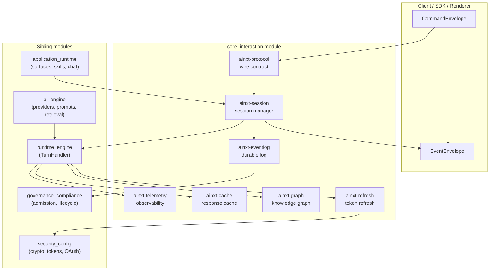
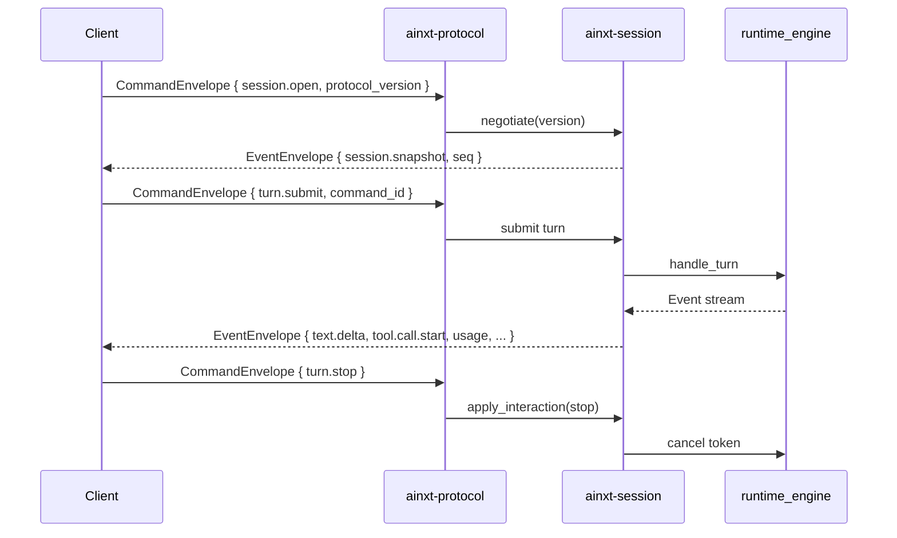
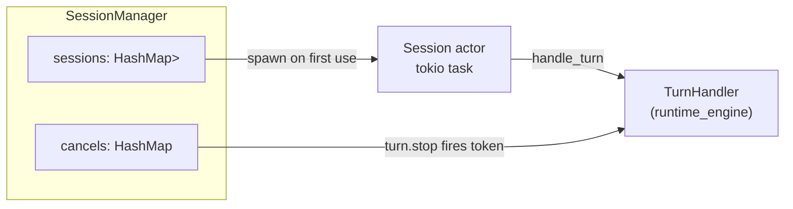
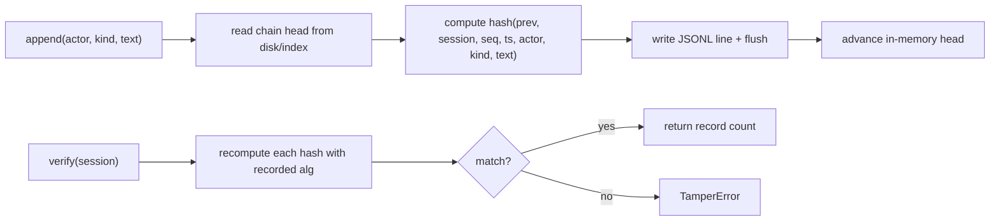
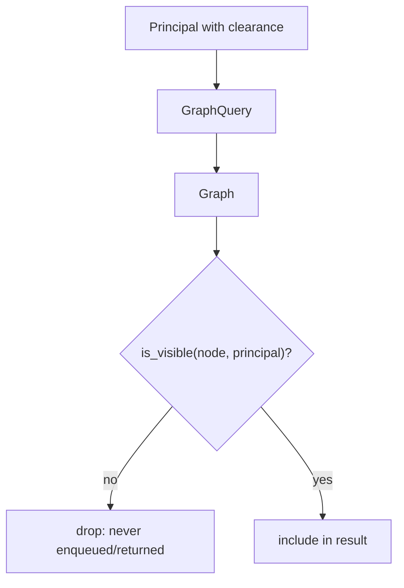
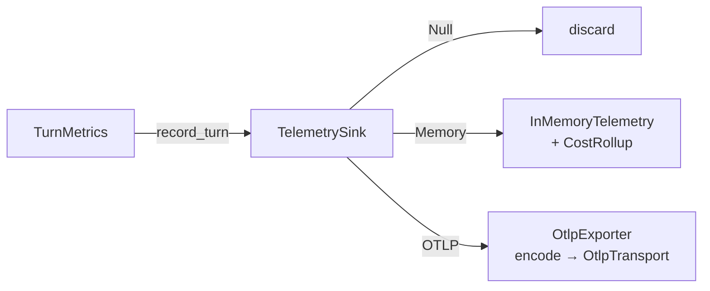
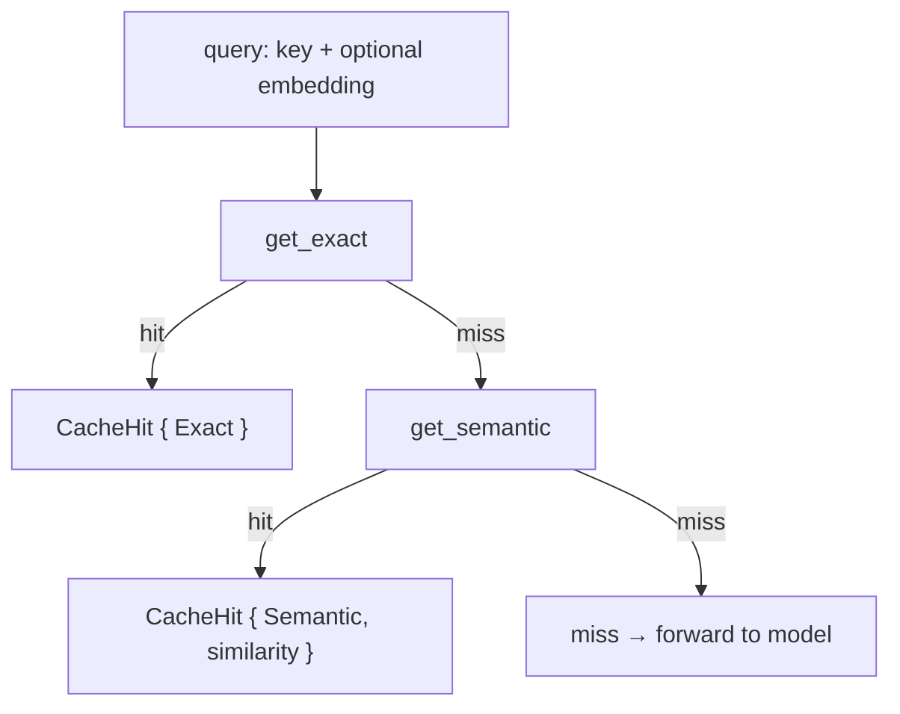
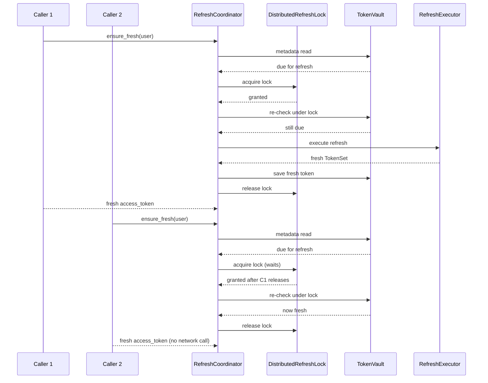
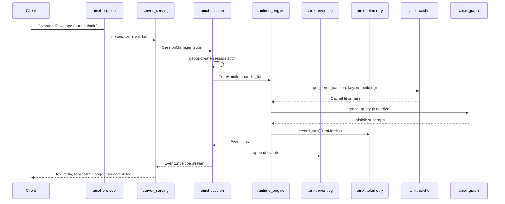
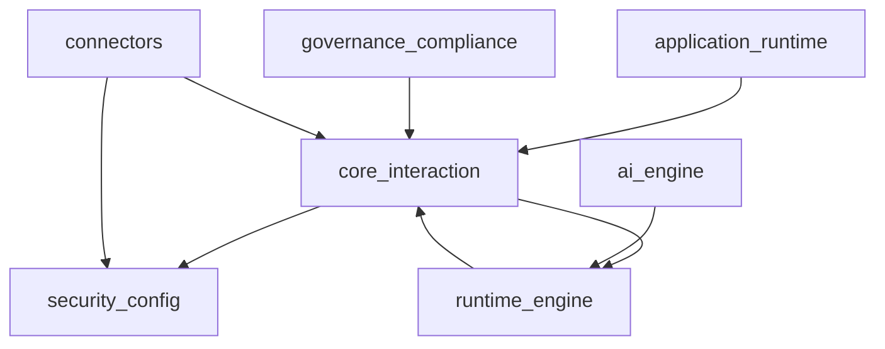

# core_interaction Module

## Overview

The `core_interaction` module is the central nervous system of the AiNxt platform. It defines the contract between clients and the runtime, manages the lifecycle and concurrency of collaborative sessions, persists every state change in a tamper-evident log, and provides the supporting infrastructure for caching, telemetry, and secure graph traversal. Every other module in the system ultimately communicates through the primitives defined here.

This module is intentionally I/O-light and deterministic. It owns the **protocol contract**, **session actor model**, **event log**, **knowledge graph**, **telemetry seam**, **response cache**, and **token refresh coordination**. Heavier concerns—model inference, retrieval, connectors, plugins, governance, and serving—live in sibling modules and plug into the seams exposed by this module.

## Purpose

- Provide a versioned, forward-compatible wire contract (`ainxt-protocol`) for all client↔runtime communication.
- Route turns through per-session actors that enforce serial execution within a session and concurrent execution across sessions (`ainxt-session`).
- Guarantee durable, append-only, hash-chained, tamper-evident event persistence (`ainxt-eventlog`).
- Maintain a unified code+docs knowledge graph with RBAC enforced at traversal time (`ainxt-graph`).
- Emit per-turn observability and exact-integer cost attribution (`ainxt-telemetry`).
- Serve cached responses across isolated partitions with exact, normalized, and semantic lookup tiers (`ainxt-cache`).
- Coordinate OAuth token refreshes under a distributed lock to collapse thundering herds (`ainxt-refresh`).

## Architecture

### Design principles

1. **Protocol-first**: `ainxt-protocol` is a pure-types crate with no I/O. Clients link it without pulling the engine, and the wire contract is versioned with an additive-only, must-ignore, N-2 compatibility window.
2. **Actor-per-session**: `ainxt-session` spawns one bounded actor per session. Turns execute serially within a session, preventing interleaved mutation, while many sessions run concurrently.
3. **Durable by default**: `ainxt-eventlog` persists every event as an append-only JSONL file with a hash chain. Replay, resume, and audit all read the same log.
4. **Security at traversal time**: `ainxt-graph` never returns, counts, or bridges through a node the caller is not cleared to see. This prevents existence leaks via path counts or reachability.
5. **Seam-based observability**: `ainxt-telemetry` exposes a `TelemetrySink` trait. Production plugs in OTLP; tests use in-memory or null sinks.
6. **Partition-isolated caching**: `ainxt-cache` keeps independent `ResponseCache` instances per partition so byte-identical prompts under different trust scopes never share an entry.
7. **Distributed refresh coordination**: `ainxt-refresh` uses double-checked locking over a shared `LockKv` to ensure at most one token refresh per `(tenant, user, connector)` even under heavy concurrency.

## Component responsibilities

### `ainxt-protocol` — the wire contract

`ainxt-protocol` defines the normative message shapes every renderer and SDK depends on. It has two layers:

- **Wire contract**: `CommandEnvelope` (client → runtime) and `EventEnvelope` (runtime → client). These carry ordering (`seq`), idempotency (`command_id`), resume cursors, and a typed body.
- **Legacy in-proc pair**: `Request`/`Event`, retained for crates not yet migrated onto the wire contract. The deprecation is machine-readable via `deprecation_notice`.

Key capabilities:

| Capability | Types |
|------------|-------|
| Version negotiation | `ProtocolVersion`, `Negotiation`, `is_compatible`, `negotiate` |
| Command vocabulary | `Command`, `CommandEnvelope`, `TurnInput`, `TurnOverrides`, `ApprovalRespond` |
| Event vocabulary | `WireEvent`, `EventEnvelope`, `ResultBlock`, `ArtifactVerification` |
| Session tree | `SessionTree`, `TurnNode`, `Participant` |
| Error taxonomy | `ProtocolError`, `ErrorCategory` |
| Budget gate | `BudgetOutcome`, `budget_gate` |
| Resume/replay | `replay_tail`, `has_seq_gap`, `is_cancel_command` |

The protocol enforces several load-bearing invariants:

- Only `turn.stop` can cancel a running turn; transport disconnect is **not** a cancel.
- A `payment_boundary != none` action requires an explicit human `approve`; policy auto-decisions and `approve_for_session` are refused.
- Unknown command/event types and unknown body fields are ignored (must-ignore rule), so old clients keep working against newer runtimes.

### `ainxt-session` — the concurrency spine

`ainxt-session` sits above the `Engine`/`TurnHandler` and routes turns to per-session actors. Its responsibilities:

- **Bounded submission**: `SessionManager::submit` returns `TurnTicket` immediately or `SubmitError::Backpressure` (mapped to HTTP 503) if the inbox is full or the global session cap is reached.
- **Serial per session, concurrent across sessions**: each session actor processes turns one at a time using `tokio::mpsc` channels.
- **Idle reaping**: an actor with no turn for `idle_ttl_ms` removes itself, bounding live memory.
- **Hard turn timeout**: a hung turn is aborted after `turn_timeout_ms` so it cannot pin a session slot forever.
- **Resume**: `SessionManager::resume` rebuilds/attaches the session actor, sends a `session.snapshot`, and replays every event with `seq > from_event` from the event log.
- **Tree interactions**: `apply_interaction` implements `turn.branch`, `turn.edit`, `turn.stop`, and `turn.steer` over the durable linear event log via `ainxt-replay`.

Core types:

- `SessionConfig` — global cap, inbox capacity, idle TTL, turn timeout.
- `SessionManager` — get-or-create actor routing, resume, and interaction ops.
- `TurnTicket` — cancel handle and turn completion future.
- `SnapshotState` / `ResumeOutcome` — resume contract.
- `InteractionOutcome` / `InteractionError` — tree-op results.

### `ainxt-eventlog` — durable, tamper-evident persistence

`ainxt-eventlog` provides an append-only, hash-chained event log. Every session is a JSONL file; each record commits to its predecessor, so tampering, reordering, or deletion breaks the chain.

Key capabilities:

- `EventLog::append` — single-writer, crash-safe (`O_APPEND` + `flush`), monotonic `seq`.
- `EventLog::verify` — recompute the chain and locate the first tamper.
- `EventLog::replay` — unverified tail replay after a cursor.
- `EventLog::replay_verified` — verify first, then replay, so a tampered log is never served.
- `JsonlEventLog::sessions` — enumerate all sessions for compliance sweeps.

Crypto-agility:

- `ChainHasher` is a pluggable hash seam. `Sha256Hasher` is the default.
- `GovernedChainHasher` resolves the hash primitive from `ainxt_cryptoagility::GovernedHasher` at a governance tick, so a PQC transition is a policy edit, not a code change.
- Each record stores its `hash_alg`, so mixed-algorithm chains still verify.

Planner durability:

- `ProgramEventSink` implements `ainxt_planner::supervisor::EventSink` on top of the hash-chained log, giving long-horizon programs durable, restart-safe state.

### `ainxt-graph` — traversal-time RBAC knowledge graph

`ainxt-graph` stores a unified code+docs graph where nodes carry a `DataClass` and edges carry a relation label. The single hard requirement is **RBAC enforced at traversal time**, not as a post-filter.

Why traversal-time:

- A post-filter leaks the existence of hidden nodes through path counts, stepping-stones, and reachability answers.
- In `ainxt-graph`, an above-clearance node is never enqueued, counted, bridged through, or returned.

Surfaces:

- `Graph::neighbors` — visible outgoing neighbours.
- `Graph::traversal` — bounded BFS over the visible subgraph.
- `Graph::shortest_path` — fewest-hops path over visible nodes only.
- `Graph::query_by_kind` / `Graph::query_by_rel` — filtered projections.
- `graph_query` — the single RBAC-scoped wire entrypoint used by `POST /graph`.
- `Graph::from_documents` / `from_documents` — populate a live graph from source documents, minting namespace nodes at the least-sensitive contained document class.

Construction integrity:

- `add_edge` rejects dangling edges.
- `add_node` rejects duplicate ids to prevent silent clearance downgrades.
- All collections are `BTreeMap`/`BTreeSet` for deterministic order.

### `ainxt-telemetry` — observability and cost attribution

`ainxt-telemetry` emits one `TurnMetrics` record per turn to a pluggable `TelemetrySink`. Cost is tracked in integer micro-currency units to avoid floating-point drift in chargeback ledgers.

Sinks:

- `NullTelemetry` — no-op default.
- `InMemoryTelemetry` — dev/test collection with `cost_rollup()`.
- `OtlpExporter` — OTLP/HTTP log export over a pluggable `OtlpTransport`.

Cost attribution:

- `CostRollup` aggregates totals plus per-actor (chargeback) and per-provider (FinOps) buckets.
- `PriceTable` maps provider id → `ModelPrice` and computes `cost_micros` with integer math.

Dispatch metrics:

- `DispatchMetrics` captures peak concurrency and total dispatched tool calls, sampled alongside turn records.

### `ainxt-cache` — response cache

`ainxt-cache` provides three lookup tiers, cheapest first:

1. **Exact** — verbatim normalized key match.
2. **Normalized** — case-folded, whitespace-collapsed key.
3. **Semantic** — cosine similarity of precomputed embeddings.

It is deterministic and clock-free: TTL uses a caller-supplied logical tick via the `Clock` seam. LRU eviction and TTL expiry keep memory bounded and answers fresh.

Partition isolation:

- `PartitionedCache` keeps a fully independent `ResponseCache` per `Partition`. Byte-identical prompts under different partitions never share an entry, eliminating cross-tenant timing signals.
- `erase_scope` drops every partition matching a predicate for DPDP/right-to-erasure workflows.

Embedder seam:

- `Embedder` accepts precomputed embeddings so the cache stays pure.
- `HashEmbedder` is a deterministic, dependency-free bag-of-tokens embedder for offline tests.

### `ainxt-refresh` — OAuth token refresh coordinator

`ainxt-refresh` prevents thundering-herd token refreshes. When many concurrent requests discover the same stale access token, exactly one network refresh is performed per `(tenant, user, connector)`.

The protocol is distributed double-checked locking:

1. Cheap check: if the token is not due, return it.
2. Acquire a per-`(tenant, user, connector)` distributed lock.
3. Re-check under the lock; if a peer refreshed while waiting, use their token.
4. Otherwise perform exactly one refresh, persist it, release the lock.

Seams:

- `RefreshLock` — `InMemoryRefreshLock` for tests/dev; `DistributedRefreshLock` over `LockKv` for production.
- `LockKv` / `RedisLockKv` — models Redis `SET NX PX` + `INCR` fence + Lua compare-and-delete.
- `MonoClock` — `SystemMonoClock` for production, `ManualClock` for deterministic tests.
- `RefreshExecutor` — the connector transport that performs the actual refresh POST.

Key types:

- `RefreshCoordinator` — the main entrypoint; `served_default` wires the real distributed lock.
- `RefreshPolicy` — proactive refresh skew (default 120s before expiry).
- `RefreshError` — typed failures including `LockTimeout`, `NotRefreshable`, and `NoToken`.

## Data flow: a single turn

## Interaction with sibling modules

| Sibling module | How it uses core_interaction |
|----------------|------------------------------|
| `runtime_engine` | Implements `TurnHandler` and consumes `CancelToken`; emits `TurnMetrics`; queries `Graph` and `ResponseCache`. |
| `security_config` | Supplies `Principal`, `DataClass`, crypto-agility (`GovernedHasher`), `TokenVault`, and OAuth types used by `ainxt-graph`, `ainxt-eventlog`, and `ainxt-refresh`. |
| `application_runtime` | Surfaces (`ainxt-surface`, `ainxt-chat`, `ainxt-convo`) build `Request`s and command envelopes; skills and plugins execute inside turns handled by the session manager. |
| `ai_engine` | Providers, prompts, retrieval, and guardrails run within the engine turn; their outputs become `WireEvent`s. |
| `governance_compliance` | Reads the event log for audit, incident response, lifecycle erasure, and admission harnesses. |
| `connectors` | Connector transports implement `RefreshExecutor`; connector calls may refresh tokens via `ainxt-refresh`. |

## Mermaid: module dependency graph

## Configuration and operational notes

- `SessionConfig` values are clamped to safe minimums at runtime; call `validate()` at config-load for fail-fast errors.
- `JsonlEventLog` uses `O_APPEND` + `flush` for crash safety. Verify chains before audit replay with `replay_verified`.
- `GovernedChainHasher::try_new` is fail-closed: if the crypto-agility policy has no usable hash primitive, no hasher is produced.
- `ResponseCache` requires the caller to encode every trust/authz dimension into the key or partition; the cache never widens visibility.
- `RefreshCoordinator::served_default` wires the real distributed lock (`DistributedRefreshLock` over `SharedLockKv`). Binding a live Redis is a composition step behind the `LockKv` seam.
- `TelemetryConfig.sink` defaults to `Null`; select `Memory` for tests or `Otlp` for production observability.

## Testing strategy

Each crate in this module is designed for deterministic, offline unit tests:

- `ainxt-protocol`: round-trip tests for every command/event variant, negotiation window tests, must-ignore tests, payment-boundary validation.
- `ainxt-session`: backpressure, idle reaping, resume tail replay, turn cancellation, panic isolation.
- `ainxt-eventlog`: tamper detection, mixed-algorithm verification, replay cursors.
- `ainxt-graph`: clearance-gated traversal, shortest-path hiding, duplicate/downgrade guards.
- `ainxt-telemetry`: OTLP encoding, cost rollup, integer-money correctness.
- `ainxt-cache`: exact/semantic hits, TTL expiry, LRU eviction, partition isolation, scope erasure.
- `ainxt-refresh`: thundering-herd collapse, fencing, lock TTL expiry, Redis command semantics.

## See also

- [security_config](security_config.md) — identity, crypto-agility, tokens, OAuth, and configuration primitives.
- [runtime_engine](runtime_engine.md) — the turn handler, model routing, serving gates, and program execution surfaces.
- [application_runtime](application_runtime.md) — chat surfaces, conversation management, skills, plugins, and WASM sandboxing.
- [ai_engine](ai_engine.md) — providers, prompts, retrieval, memory, synthesis, and evaluation.
- [governance_compliance](governance_compliance.md) — admission, compliance sweeps, incidents, lifecycle, and responsible AI.
