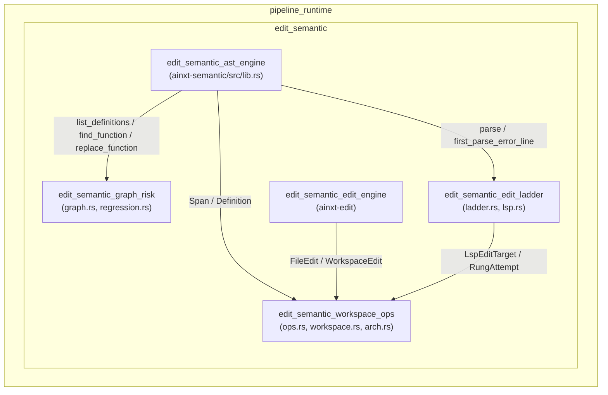
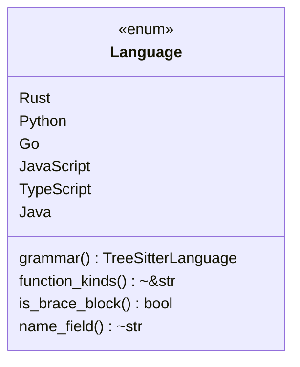
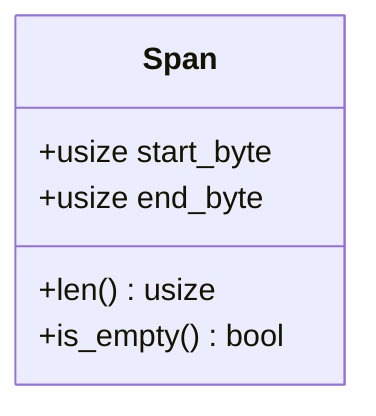
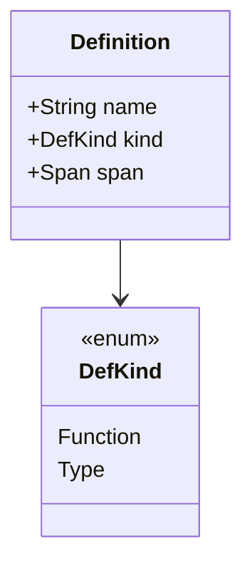
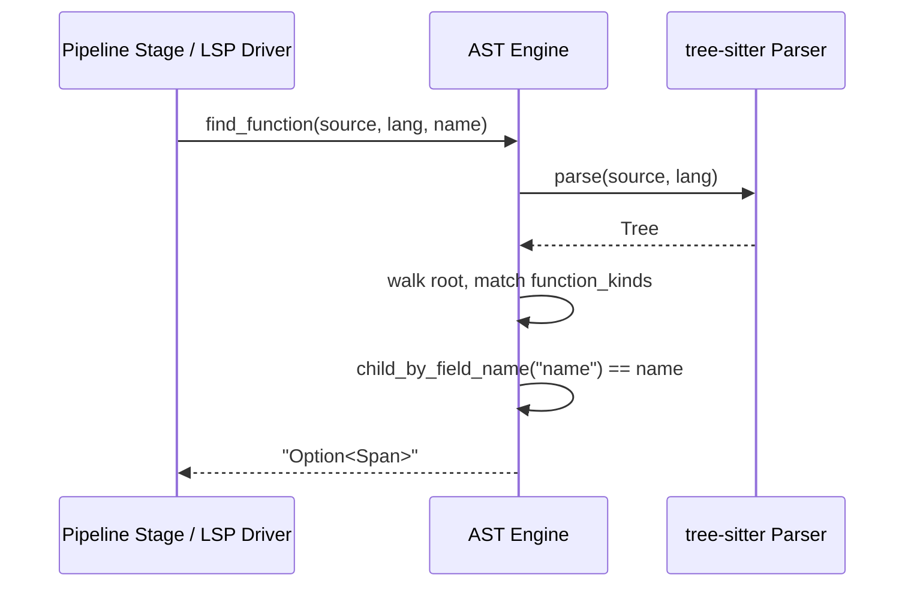
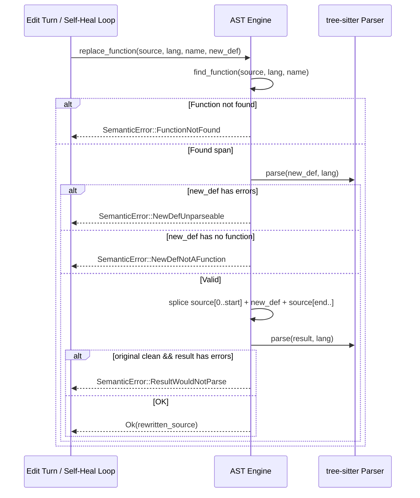
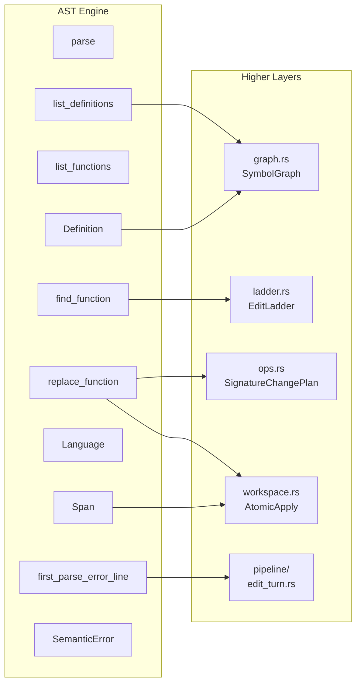
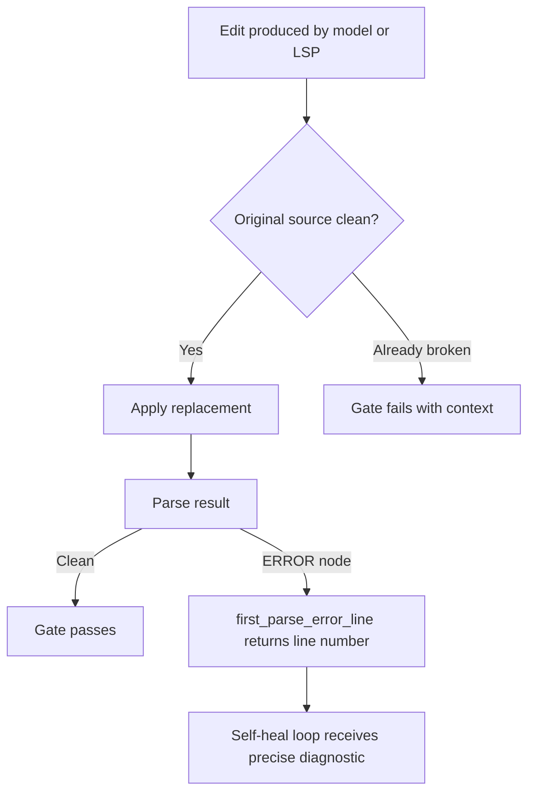

# edit_semantic_ast_engine

## Brief Introduction

The **AST Engine** (`edit_semantic_ast_engine`) is the foundational semantic editing layer of the `ainxt-semantic` crate. It provides **AST-precise, byte-exact code editing** over concrete syntax trees produced by tree-sitter. Unlike text-based patching, the engine operates on *meaning*: it locates functions, methods, and type definitions by their AST node kinds and names, then replaces only the exact byte span of the target definition while preserving every other byte of the source file.

The engine eliminates two common failure modes of naive patchers:

1. **Call sites are never mistaken for definitions.** Because the engine only matches AST nodes of kind `function_item`, `function_definition`, `method_declaration`, etc., a call expression such as `foo()` can never be selected as the target of a replacement.
2. **Replacements are never committed unless they parse.** Every replacement is dry-run parsed in isolation, and the resulting file is re-parsed to ensure no syntax errors are introduced into previously clean source.

This module is the lowest rung of the semantic editing ladder. Higher rungs—cross-file symbol graphs, atomic workspace applies, LSP-driven refactor ladders, and regression analysis—are built on top of the primitives defined here. See the related module documentation for those capabilities.

---

## Core Responsibilities

| Responsibility | Description |
| -------------- | ----------- |
| **Language binding** | Binds tree-sitter grammars for Rust, Python, Go, JavaScript, TypeScript, and Java. |
| **Definition location** | Locates function/method and type definitions by name, returning exact byte spans. |
| **Byte-precise replacement** | Replaces a single definition while preserving all surrounding bytes. |
| **Parse verification** | Validates replacement text in isolation and validates the post-splice file. |
| **Definition enumeration** | Lists all definitions in source order for symbol extraction and graph construction. |

---

## Architecture

The AST engine sits at the bottom of the `edit_semantic` subsystem. It exposes a small, deterministic surface that higher layers consume.

### Module Position

- **Parent:** `edit_semantic` under `pipeline_runtime`
- **Sibling modules:**
  - [`edit_semantic_edit_engine`](edit_semantic_edit_engine.md) — lower-level text edits and verification toolchains.
  - [`edit_semantic_graph_risk`](edit_semantic_graph_risk.md) — symbol/call graphs and regression coupling analysis.
  - [`edit_semantic_edit_ladder`](edit_semantic_edit_ladder.md) — LSP-driven refactor orchestration and fallback rungs.
  - [`edit_semantic_workspace_ops`](edit_semantic_workspace_ops.md) — cross-file atomic applies and semantic operations.
- **Consumers:** [`pipeline_orchestration`](pipeline_orchestration.md) stages such as `edit_turn_execution` and `self_healing` use the AST engine for deterministic compile-gate feedback.

---

## Core Components

### `Language`

An enum that binds a source language to its tree-sitter grammar and language-specific metadata.

Each variant declares:

- `grammar()` — the tree-sitter language object.
- `function_kinds()` — AST node kinds that denote definitions (e.g., `function_item` for Rust, `function_definition` for Python, `method_declaration` for Java). Call expressions are never in this set.
- `is_brace_block()` — distinguishes brace-delimited languages from Python's indentation model.
- `name_field()` — the field name (`"name"`) that holds the identifier on a definition node.

### `Span`

A half-open byte range `[start_byte, end_byte)` into the original source. It is the universal coordinate system for all edits in this module.

`Span` is intentionally minimal: it contains no text, no line numbers, and no file path. Higher layers (e.g., [`edit_semantic_workspace_ops`](edit_semantic_workspace_ops.md)) combine `Span` with file paths and `FileEdit` values to produce multi-file workspace edits.

### `Definition`

A named definition located in a single file, used by the symbol graph builder.

`list_definitions` returns all `Function` and `Type` definitions in source order. This is the primitive that [`edit_semantic_graph_risk`](edit_semantic_graph_risk.md) consumes to build `SymbolGraph` and compute `BlastRadius`.

### `SemanticError`

Every failure mode is explicit and actionable:

| Variant | Meaning | Caller Action |
| ------- | ------- | ------------- |
| `ParseFailed(reason)` | Grammar could not be loaded or parser yielded no tree. | Report infrastructure/config error. |
| `FunctionNotFound(name)` | No definition with the requested name exists. | Surface to user or fall back to text patch. |
| `NewDefUnparseable` | Replacement text has syntax errors. | Reject and ask model to regenerate. |
| `NewDefNotAFunction` | Replacement parses but defines no function. | Reject and ask model to regenerate. |
| `ResultWouldNotParse` | Splice would break a previously clean file. | Roll back and surface diagnostic. |

---

## Data Flow

### Locating a Definition

The walk is pre-order, so the first matching definition in source order wins. Because only definition node kinds are considered, a call site appearing earlier in the file is skipped automatically.

### Replacing a Definition

The splice is byte-precise: only `source[span.start_byte..span.end_byte]` is replaced. Imports, comments, sibling functions, and trailing whitespace are preserved exactly.

---

## Component Interactions

- [`edit_semantic_graph_risk`](edit_semantic_graph_risk.md) calls `list_definitions` to extract symbols and build `SymbolGraph`.
- [`edit_semantic_edit_ladder`](edit_semantic_edit_ladder.md) calls `find_function` and `replace_function` as the AST rung of the refactor ladder.
- [`edit_semantic_workspace_ops`](edit_semantic_workspace_ops.md) uses `Span` and `replace_function` inside `AtomicApply` to perform multi-file edits and rollbacks.
- [`pipeline_orchestration`](pipeline_orchestration.md) calls `first_parse_error_line` to feed deterministic compile-gate diagnostics into the self-heal loop.

---

## Process Flow: Compile-Gate Diagnostic

The AST engine supports the deterministic Compile gate in the pipeline by reporting the first parse error line.

This deterministic feedback is critical for the [`pipeline_orchestration.self_healing`](pipeline_orchestration.md) stage, which retries edits rather than silently committing broken code.

---

## Supported Languages

| Language | Function Kinds | Type Kinds | Block Model |
| -------- | -------------- | ---------- | ----------- |
| Rust | `function_item` | `struct_item`, `enum_item`, `trait_item` | Brace |
| Python | `function_definition` | `class_definition` | Indentation |
| Go | `function_declaration`, `method_declaration` | `type_spec` | Brace |
| JavaScript | `function_declaration`, `method_definition`, `generator_function_declaration` | `class_declaration` | Brace |
| TypeScript | `function_declaration`, `method_definition`, `generator_function_declaration` | `class_declaration`, `interface_declaration`, `enum_declaration`, `type_alias_declaration` | Brace |
| Java | `method_declaration`, `constructor_declaration` | `class_declaration`, `interface_declaration`, `enum_declaration` | Brace |

---

## Error Handling Philosophy

The AST engine refuses to guess. Every operation returns `Result<T, SemanticError>` rather than silently applying a best-effort patch. This aligns with the broader `pipeline_runtime` design: edits that cannot be verified are surfaced to the caller, which may fall back to a lower rung (text patch), request a regenerated edit, or escalate to human review.

---

## Dependencies

### Internal

- [`edit_semantic_edit_engine`](edit_semantic_edit_engine.md) — provides lower-level `FileEdit` and verification toolchains that complement AST-level operations.
- [`edit_semantic_graph_risk`](edit_semantic_graph_risk.md) — consumes `Definition` and `Span` to build symbol graphs and regression reports.
- [`edit_semantic_edit_ladder`](edit_semantic_edit_ladder.md) — orchestrates AST edits alongside LSP-driven refactors.
- [`edit_semantic_workspace_ops`](edit_semantic_workspace_ops.md) — implements multi-file atomic apply and cross-file semantic operations on top of this engine.
- [`pipeline_orchestration`](pipeline_orchestration.md) — uses the engine for compile-gate verification and edit-turn execution.

### External

- `tree-sitter` and language-specific grammars (`tree-sitter-rust`, `tree-sitter-python`, `tree-sitter-go`, `tree-sitter-javascript`, `tree-sitter-typescript`, `tree-sitter-java`).
- `serde` for `Language` serialization.

---

## See Also

- [`edit_semantic_edit_engine`](edit_semantic_edit_engine.md)
- [`edit_semantic_graph_risk`](edit_semantic_graph_risk.md)
- [`edit_semantic_edit_ladder`](edit_semantic_edit_ladder.md)
- [`edit_semantic_workspace_ops`](edit_semantic_workspace_ops.md)
- [`pipeline_orchestration`](pipeline_orchestration.md)
