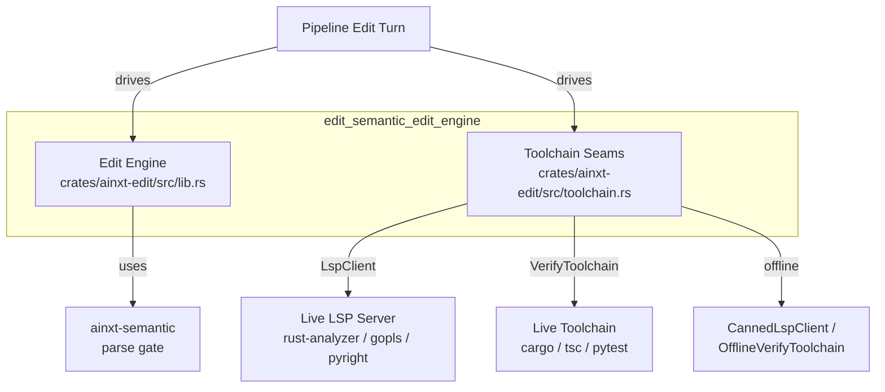
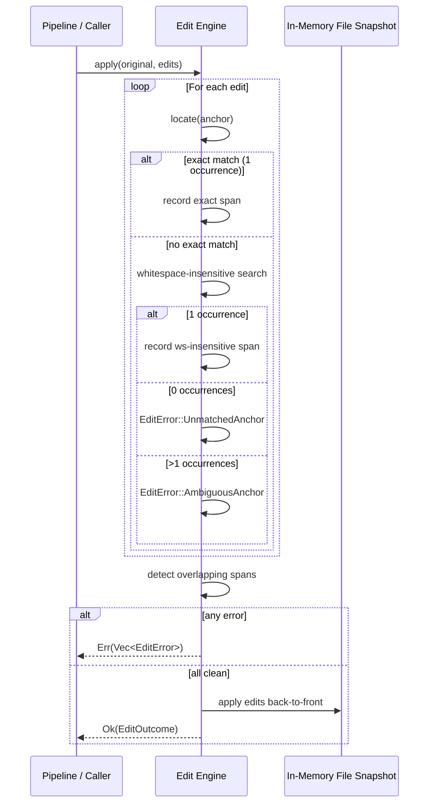
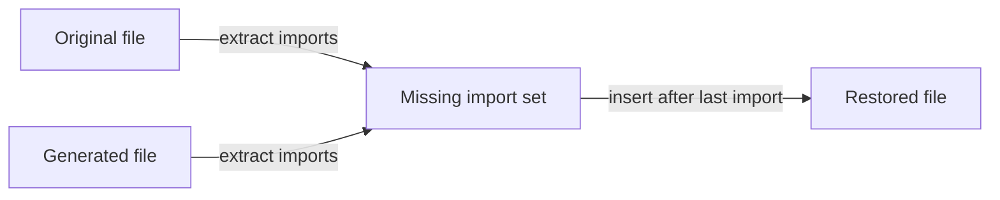
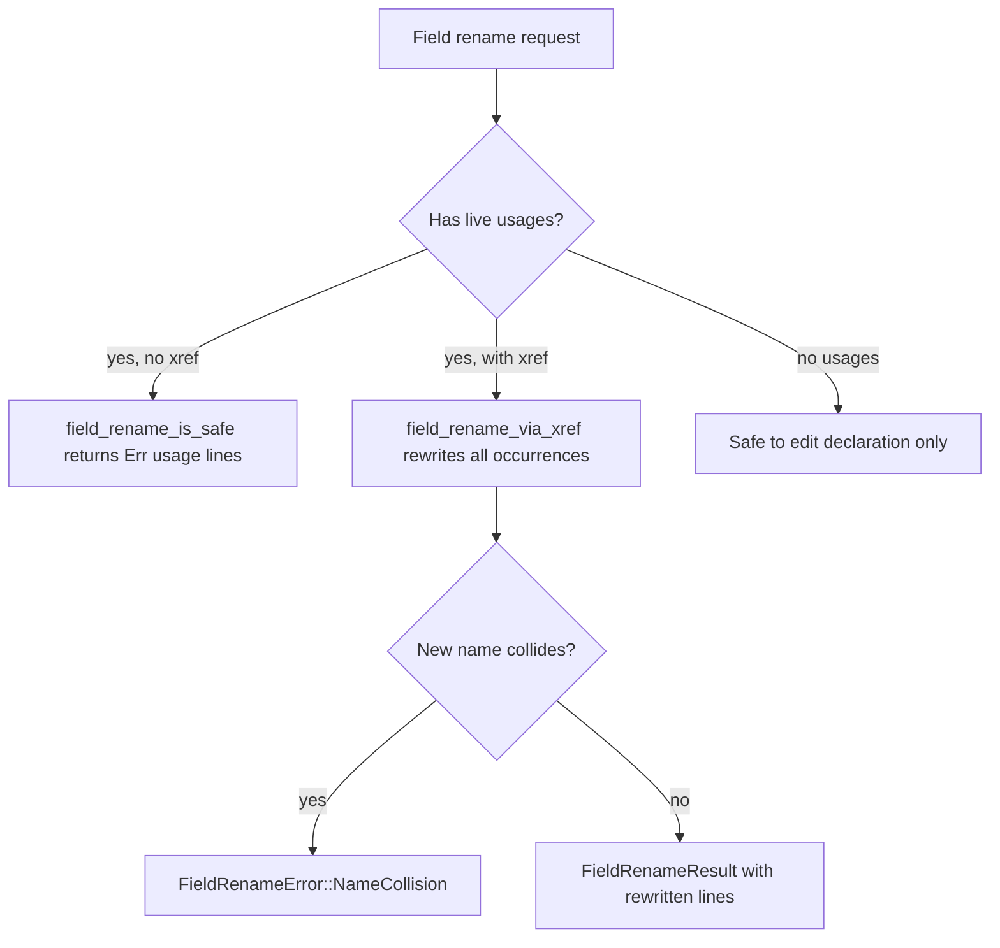
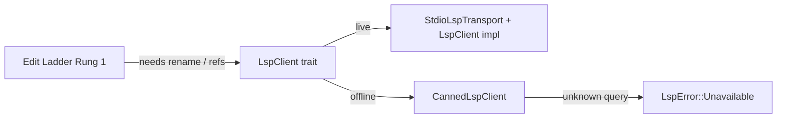
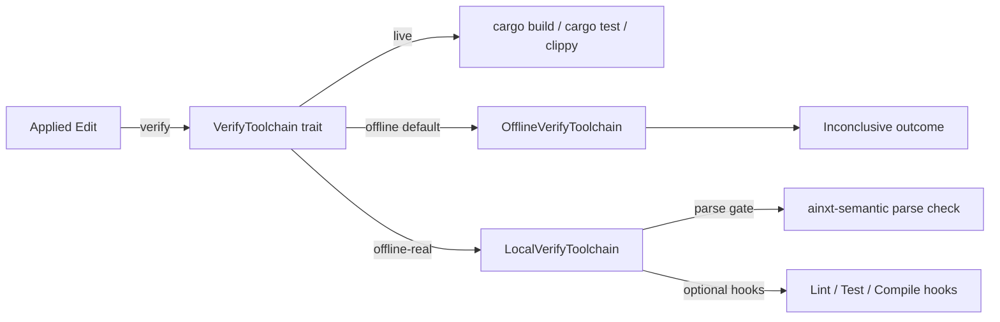
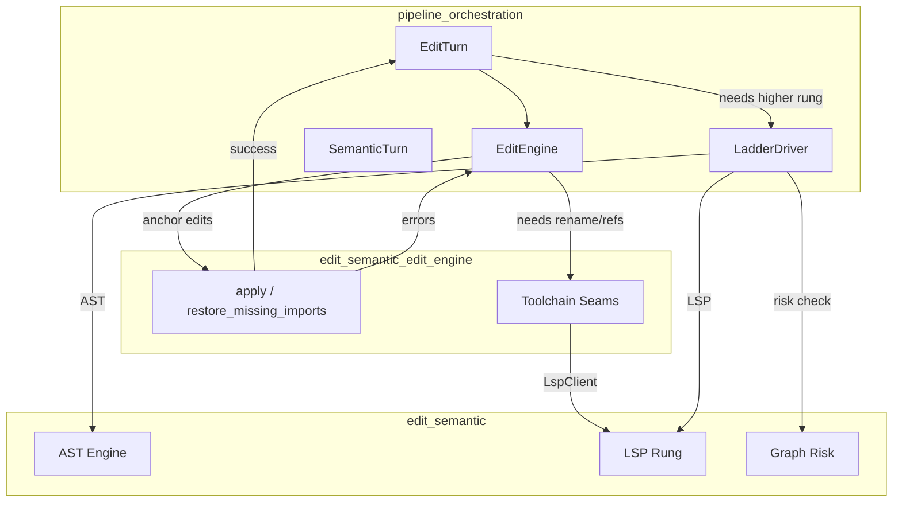
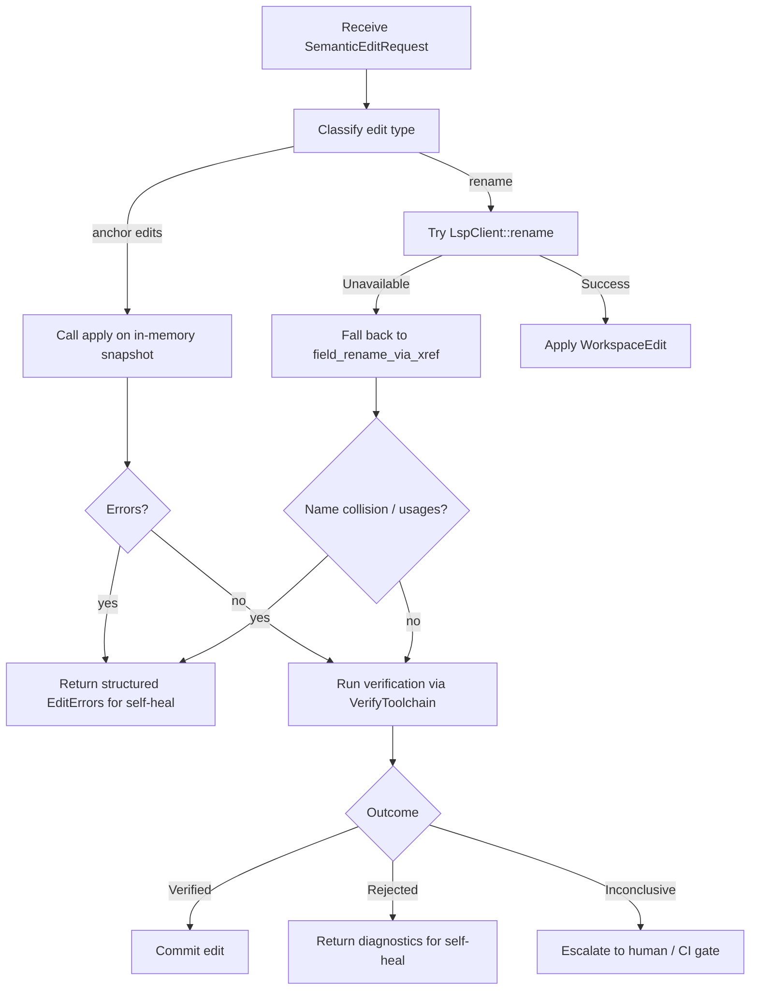

# edit_semantic_edit_engine

The **edit semantic edit engine** (`ainxt-edit`) is the lowest rung of the system's code-editing ladder. It applies model-generated edits to real source files using conservative, anchor-based text operations rather than fuzzy or semantic matching. The engine is deliberately string-based and deterministic so it can be exhaustively tested, while higher rungs in [`edit_semantic`](edit_semantic.md) provide AST-aware and LSP-backed precision when available.

This module is responsible for the core edit primitives used by the pipeline's edit turn execution. It also provides toolchain seams that let the pipeline invoke live language servers and compile/test verification without faking success when those tools are offline.

## Core Purpose

- Provide safe, all-or-nothing anchor-based edits (`Replace`, `InsertAfter`, `Delete`).
- Detect and recover from common SDLC editing bugs: dropped imports, unsafe field renames, and declaration/call-site confusion.
- Expose honest LSP and verification seams that degrade gracefully offline instead of manufacturing false "green" results.
- Remain pure (no I/O, no clocks, no RNG) so every path is unit-testable.

## Architecture

The module is split into two files:

- `crates/ainxt-edit/src/lib.rs` — the edit engine, language heuristics, and SDLC guards.
- `crates/ainxt-edit/src/toolchain.rs` — seams for LSP rename/references and deterministic compile/test/lint verification.

## Core Components

### Edit Engine (`lib.rs`)

| Component | Responsibility |
|-----------|----------------|
| `Edit` | The three primitive operations: `Replace`, `InsertAfter`, `Delete`. Each is anchored by literal text from the file. |
| `apply` | Dry-run classifies every edit, checks for overlaps, and applies all edits back-to-front only if every anchor resolves uniquely. |
| `MatchKind` | Records whether an anchor matched exactly or whitespace-insensitively. |
| `EditError` | Structured errors (`EmptyAnchor`, `UnmatchedAnchor`, `AmbiguousAnchor`, `Overlap`) fed back for self-correction. |
| `EditOutcome` | The new file content plus a record of how each edit matched. |
| `Language` | Best-effort language detection from file extension plus import/declaration vocabulary. |

### SDLC Guards (`lib.rs`)

| Component | Responsibility |
|-----------|----------------|
| `FullFileResult` / `restore_missing_imports` | Re-injects import lines that a full-file regeneration dropped. |
| `field_rename_is_safe` | Blocks renaming a field that has live usages, returning the usage lines. |
| `FieldRenameResult` / `field_rename_via_xref` | Performs a whole-word cross-reference rewrite of declaration and usages, refusing on name collision. |
| `find_declaration_line` | Prefers a real declaration line over an earlier call site when locating a symbol. |

### Toolchain Seams (`toolchain.rs`)

| Component | Responsibility |
|-----------|----------------|
| `LspClient` | Trait for find-references and rename via a live language server. |
| `CannedLspClient` | Offline stand-in that returns scripted answers or `LspError::Unavailable`. |
| `VerifyToolchain` | Trait for compile/test/lint verification. |
| `OfflineVerifyToolchain` | Reports every step as `ToolchainUnavailable` / `Inconclusive` — never verified. |
| `CannedVerifyToolchain` | Scripted verification responses for tests. |
| `LocalVerifyToolchain` | Offline-real toolchain that runs a tree-sitter parse gate and optional check hooks. |
| `VerifyReport` / `VerifyOutcome` / `StepResult` / `Diagnostic` | Normalized verification results with explicit `Verified`, `Rejected`, and `Inconclusive` outcomes. |

## Data Flow: Applying an Edit Set

## Edit Matching Rules

1. **Exact first.** The engine searches for the anchor as a literal substring. If it appears exactly once, that span is used.
2. **Whitespace-insensitive fallback.** If no exact match is found, the engine normalizes whitespace and searches line-bounded spans. If exactly one matches, that span is used.
3. **Ambiguity is an error.** Zero or multiple matches produce structured errors instead of best-guess application.
4. **All-or-nothing.** Every edit must resolve uniquely and not overlap before any text is changed.
5. **Back-to-front application.** Once validated, edits are applied from the highest byte offset to the lowest so earlier offsets remain valid.

## SDLC Bug Invariants

The engine encodes three specific failure modes that have corrupted the SDLC pipeline before:

### 1. Dropped Imports After Full-File Regeneration

When a model regenerates an entire file, it often drops imports. `restore_missing_imports` compares the original and generated files, finds import lines present in the original but missing in the generated file, and re-inserts them in the import block.

### 2. Unsafe Field Rename

Renaming a field by editing only its declaration leaves every usage dangling. The engine provides two paths:

- **Guard path:** `field_rename_is_safe` refuses the rename if the identifier appears on more than one line, returning the usage lines.
- **Designed path:** `field_rename_via_xref` rewrites every whole-word occurrence (declaration and usages) and refuses if the new name collides with an existing identifier.

### 3. Declaration vs. Call Site Confusion

The first `name(` in a file is often a call site, not the definition. `find_declaration_line` prefers a line that both contains a declaration keyword and has a token immediately preceding `name(`, falling back to the first call site only if no declaration is found.

## Toolchain Seams

The edit engine does not run a language server or compiler itself. Instead it defines narrow seams that real infrastructure implements.

### LSP Client Seam

- `LspClient::references` returns all workspace references for a symbol.
- `LspClient::rename` returns a `WorkspaceEdit` computed by the server.
- `CannedLspClient` only answers scripted queries; everything else returns `LspError::Unavailable` so the ladder can fall back to lower rungs honestly.

### Verify Toolchain Seam

- `VerifyOutcome::Verified` is only emitted when every requested step actually ran and passed.
- `VerifyOutcome::Inconclusive` means the edit is not proven safe (toolchain absent or skipped).
- `VerifyOutcome::Rejected` means at least one step ran and failed.
- `LocalVerifyToolchain` runs a real tree-sitter parse gate for supported languages and accepts pluggable hooks for lint/test/compile without ever fabricating a pass.

## Dependencies

The edit engine depends on:

- [`edit_semantic_ast_engine`](edit_semantic_ast_engine.md) — `ainxt-semantic` provides the parse gate used by `LocalVerifyToolchain`.
- [`pipeline_orchestration`](pipeline_orchestration.md) — the pipeline's edit turn drives the engine and consumes its outcomes.

Higher rungs of the edit ladder live in sibling modules:

- [`edit_semantic_edit_ladder`](edit_semantic_edit_ladder.md) — LSP/AST refactor rungs.
- [`edit_semantic_graph_risk`](edit_semantic_graph_risk.md) — symbol graph and regression analysis.
- [`edit_semantic_workspace_ops`](edit_semantic_workspace_ops.md) — workspace-level operations and architecture checks.

## Integration with the Pipeline

## Process Flow: A Single Edit Turn

## Key Design Invariants

1. **Never semantic-fuzzy.** Anchors are matched literally or whitespace-insensitively; no guesswork on ambiguous matches.
2. **All-or-nothing.** A partial edit set is never produced.
3. **Honest offline behavior.** Stand-in toolchain implementations report unavailability rather than fake verification.
4. **Pure and deterministic.** No I/O, clocks, or RNG inside the engine; every decision is reproducible.
5. **Exhaustively testable.** The string-based design plus canned seams allow unit tests to cover success, failure, overlap, and offline degradation paths.

## When to Use This Module

Use `edit_semantic_edit_engine` when:

- You need to apply model-generated text edits to source files safely.
- You want deterministic, testable edit primitives without requiring a live compiler or LSP server.
- You need to guard against common full-file regeneration and rename bugs.
- You are building or extending the pipeline's edit turn execution.

For AST-precise or cross-file refactor operations, prefer the higher rungs in [`edit_semantic`](edit_semantic.md). For end-to-end planning and program execution, see [`planning_program_execution`](planning_program_execution.md) and [`runtime_engine`](runtime_engine.md).
