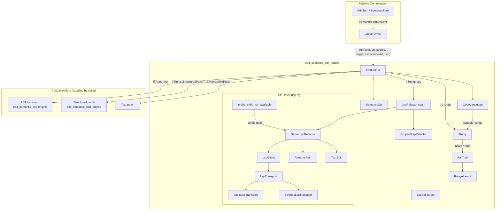
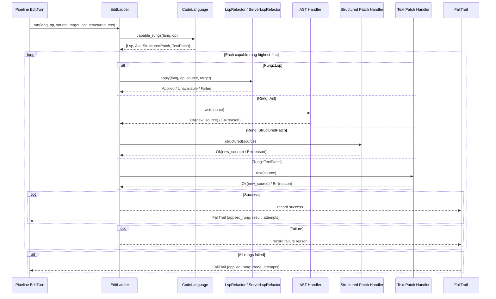
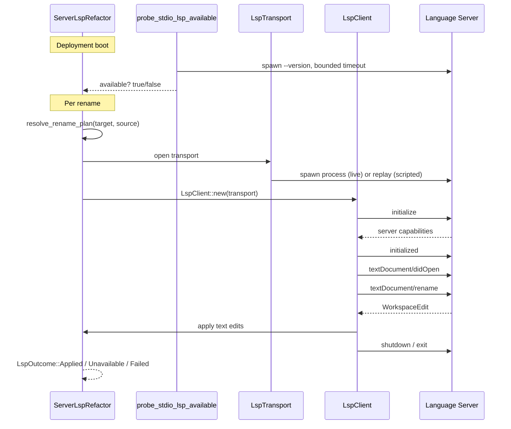
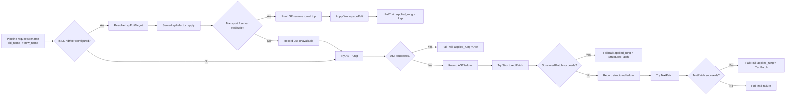

# edit_semantic_edit_ladder

## Brief Introduction

The `edit_semantic_edit_ladder` module implements the **semantic edit ladder** — a deterministic, fidelity-aware fallback strategy for applying code edits in the AI-NXT pipeline. When the system needs to perform a semantic operation (rename, signature change, function replacement, etc.) on source code, it tries the highest-fidelity rung available and **falls down** through lower-fidelity rungs on failure, recording every attempt in an auditable `FallTrail`.

The ladder has four rungs, ordered by fidelity:

1. **LSP semantic refactor** — toolchain-guaranteed renames via a live language server (rust-analyzer, gopls, pyright, tsserver, jdtls).
2. **AST transform** — tree-sitter-based structural edits for languages the semantic crate can parse.
3. **Structured patch** — anchored search/replace edits via the [`edit_semantic_edit_engine`](edit_semantic_edit_engine.md).
4. **Text patch** — raw text replacement, the last-resort floor.

This module owns **orchestration**, not implementation: it declares capability matrices, defines the `LspRefactor` seam, and runs the fall-down loop. The actual rung handlers (AST, structured patch, text patch) are supplied by callers, keeping the crate free of heavy dependencies while remaining composable with the rest of the pipeline.

---

## Core Functionality

### Fidelity-First Edit Application

The central type is [`EditLadder`](edit_semantic_edit_ladder.md#editladder). Given a language, a semantic operation, source text, and rung handlers, it:

1. Computes the **capable rungs** for `(language, operation)` using [`CodeLanguage::capable_rungs`](edit_semantic_edit_ladder.md#codelanguage).
2. Attempts each rung from highest to lowest fidelity.
3. Returns the first successful result together with a [`FallTrail`](edit_semantic_edit_ladder.md#falltrail) documenting every skipped or failed rung.
4. If no rung succeeds, the trail reports failure with the maximum confidence penalty.

Nothing is applied silently at a lower rung — the rung that actually applied is always reported. This lets downstream quality evaluators track per-language edit fidelity and adjust confidence scores accordingly.

### Language Capability Matrix

[`CodeLanguage`](edit_semantic_edit_ladder.md#codelanguage) models the languages the pipeline may edit (Rust, Python, JavaScript, TypeScript, Go, Java, COBOL, and a catch-all `Other`). For each language it declares:

- Whether an AST parser is bound in this crate (`ast_language`).
- Whether a language server is expected to be available in deployment (`has_lsp`).
- Which rungs are applicable for a given [`SemanticOp`](edit_semantic_edit_ladder.md#semanticop).

Non-AST languages such as COBOL degrade honestly to structured/text patching instead of pretending to perform structural transforms.

### Semantic Operations

[`SemanticOp`](edit_semantic_edit_ladder.md#semanticop) enumerates the structural edits the ladder understands:

- `RenameSymbol`
- `ChangeSignature`
- `ReplaceFunction`
- `AddFunction`
- `ExtractFunction`
- `InlineFunction`
- `MoveDefinition`
- `AnchorPatch` (non-structural fallback)

LSP and AST rungs are only considered for structural operations; `AnchorPatch` bypasses them and goes straight to structured/text patching.

### Confidence Penalty

Lower rungs carry a confidence penalty used by the code-review pipeline:

| Rung | Penalty |
|------|---------|
| LSP / AST | 0 |
| StructuredPatch | 3 |
| TextPatch | 8 |

See [`Rung::confidence_penalty`](edit_semantic_edit_ladder.md#rung) and [`FallTrail::confidence_penalty`](edit_semantic_edit_ladder.md#falltrail).

---

## LSP Rung (Rung 1)

The highest-fidelity rung is implemented in [`crates/ainxt-semantic/src/lsp.rs`](edit_semantic_edit_ladder.md#lsp-driver). It speaks **JSON-RPC 2.0 over the LSP base protocol** with `Content-Length` framing, performs the `initialize`/`initialized` handshake, opens the document via `textDocument/didOpen`, requests `textDocument/rename`, and applies the returned `WorkspaceEdit` byte-precisely.

### Transport Seam

The only infra-shaped seam is [`LspTransport`](edit_semantic_edit_ladder.md#lsptransport):

- [`StdioLspTransport`](edit_semantic_edit_ladder.md#stdiolsptransport) spawns a real language-server process and pipes JSON-RPC over stdio. This is gated behind deployment configuration and is never faked in offline tests.
- [`ScriptedLspTransport`](edit_semantic_edit_ladder.md#scriptedlsptransport) replays exact framed JSON-RPC messages the server would emit, so the entire client is tested end-to-end without a live process.

A missing or broken server degrades to `LspOutcome::Unavailable`, so the ladder falls to the AST rung rather than reporting a refactor failure.

### Per-Call Rename Resolution

Earlier versions baked the rename target into the driver at construction time, which prevented one driver instance from serving arbitrary renames. The current design passes an [`LspEditTarget`](edit_semantic_edit_ladder.md#lspedittarget) per `apply()` call. [`resolve_rename_plan`](edit_semantic_edit_ladder.md#resolverenameplan) locates the symbol as a whole-word match, converts its byte offset to an LSP `(line, character)` position, and returns a fresh [`RenamePlan`](edit_semantic_edit_ladder.md#renameplan) for each invocation.

### Boot-Time Availability Probe

[`probe_stdio_lsp_available`](edit_semantic_edit_ladder.md#probestdiolspavailable) performs a bounded, non-hanging check for a configured LSP binary (e.g. `rust-analyzer --version`). It clears the environment, keeps only `PATH`, and kills the child if it exceeds a timeout. This lets the deployment decide whether to wire `ServerLspRefactor` without risking daemon boot hangs.

---

## Architecture

---

## Component Relationships

### `EditLadder`

The orchestrator. Holds an optional `LspRefactor` driver and exposes `run(...)`, which iterates over capable rungs and returns a `FallTrail`. It consumes each handler closure at most once.

### `Rung`

An ordered enum representing fidelity. `Ord` is defined so that `Lsp < Ast < StructuredPatch < TextPatch`, which lets the ladder sort and iterate naturally.

### `CodeLanguage`

Encodes the language capability matrix. It maps each language to:

- An optional AST language from the semantic crate.
- A boolean LSP availability flag.
- The list of rungs applicable to a given operation.

### `SemanticOp`

Classifies the edit. Structural ops may use LSP/AST; `AnchorPatch` is the honest non-structural fallback.

### `LspRefactor` and `ScriptedLspRefactor`

`LspRefactor` is the seam a real language-server driver implements. `ScriptedLspRefactor` is the offline stand-in: it answers only exact `(lang, op, source)` matches and returns `Unavailable` otherwise, guaranteeing honest degradation.

### `LspEditTarget`

Carries per-call symbol/position material the LSP rung needs: document URI, current symbol name, and new name. This decouples driver lifetime from individual rename requests.

### `FallTrail` and `RungAttempt`

`RungAttempt` records one rung's outcome (success/failure and reason). `FallTrail` aggregates them into an auditable result, including the applied rung, edited source, and confidence penalty.

### `LspClient`

A JSON-RPC 2.0 LSP client that correlates responses by `id`, skips unrelated notifications, and exposes `initialize`, `did_open`, `rename`, and `shutdown`.

### `LspTransport`

The duplex frame channel seam. `StdioLspTransport` is the live process-backed transport; `ScriptedLspTransport` is the deterministic offline replay transport.

### `ServerLspRefactor`

The real `LspRefactor` implementation. It opens a fresh transport per rename, runs the full LSP round trip, applies `WorkspaceEdit` text edits, and maps transport errors to `Unavailable` and server errors to `Failed`.

---

## Data Flow

---

## LSP Driver Sequence

---

## How It Fits into the Overall System

The `edit_semantic_edit_ladder` module sits inside the [`pipeline_runtime`](pipeline_runtime.md) → `edit_semantic` subsystem. It bridges high-level semantic edit requests from the pipeline with concrete editing mechanisms of varying fidelity.

### Upstream Callers

- [`pipeline_orchestration`](pipeline_orchestration.md) / `edit_turn_execution` — `EditTurn` and `SemanticTurn` produce `SemanticEditRequest`s and invoke the ladder via `LadderDriver`.
- [`edit_semantic_workspace_ops`](edit_semantic_workspace_ops.md) — workspace-level operations such as signature changes may feed into the ladder as `SemanticOp::ChangeSignature`.

### Downstream/Peer Modules

- [`edit_semantic_edit_engine`](edit_semantic_edit_engine.md) — supplies the structured-patch rung (`ainxt-edit`) and verification toolchain.
- [`edit_semantic_ast_engine`](edit_semantic_ast_engine.md) — supplies the AST rung via tree-sitter parsing and structural transforms.
- [`edit_semantic_graph_risk`](edit_semantic_graph_risk.md) — provides symbol graphs and regression analysis that may influence which operations are attempted or how confidence is scored.
- [`ai_engine`](ai_engine.md) / `quality_verification` — consumes `FallTrail` confidence penalties and edit fidelity metrics for quality assessment.

### Integration Points

| Component | Role |
|-----------|------|
| `EditLadder::run` | Entry point from pipeline turns |
| `LspRefactor` seam | Plugs in live or scripted language-server drivers |
| `LspTransport` seam | Isolates process-spawning infra from protocol logic |
| `FallTrail` | Output consumed by review, confidence scoring, and audit |
| `probe_stdio_lsp_available` | Boot-time config gate for LSP availability |

---

## Process Flow: Applying a Rename in Rust

---

## Determinism and Safety Notes

- **No clocks or RNG** inside the ladder or LSP client logic; capability matrices and trails are pure data.
- **Honest degradation**: a missing/broken server is `Unavailable`, not a failure, so the ladder falls down without unfairly penalizing confidence.
- **Bounded boot probe**: `probe_stdio_lsp_available` never hangs the daemon on a missing or hung LSP binary.
- **No silent lower-rung application**: every rung attempt is recorded in `FallTrail`.
- **UTF-8/ASCII limitation**: LSP position conversion treats `character` as a byte offset within the line, which is exact for ASCII/BMP source; this is documented as an honest limitation.

---

## See Also

- [`edit_semantic_edit_engine`](edit_semantic_edit_engine.md) — structured patch and verification toolchain
- [`edit_semantic_ast_engine`](edit_semantic_ast_engine.md) — AST parsing and transforms
- [`edit_semantic_graph_risk`](edit_semantic_graph_risk.md) — symbol graph and regression analysis
- [`edit_semantic_workspace_ops`](edit_semantic_workspace_ops.md) — workspace operations and architecture checks
- [`pipeline_orchestration`](pipeline_orchestration.md) — pipeline turns and ladder driver
- [`pipeline_runtime`](pipeline_runtime.md) — runtime engine and serving surfaces
