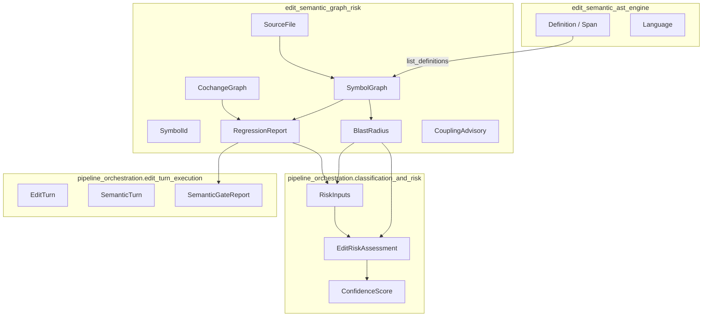
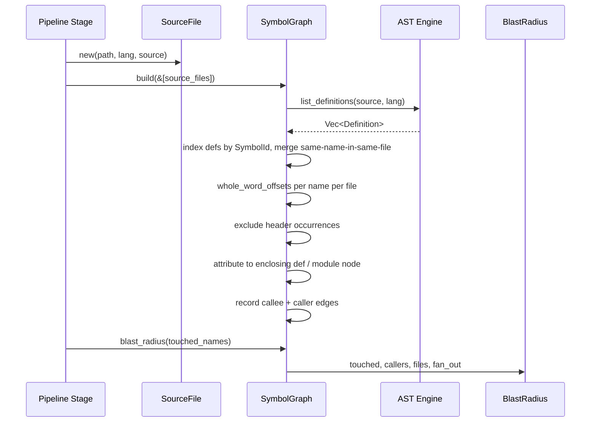
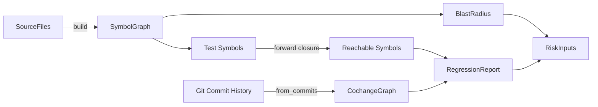
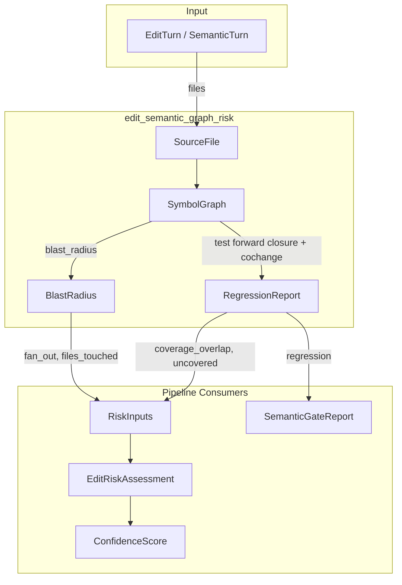
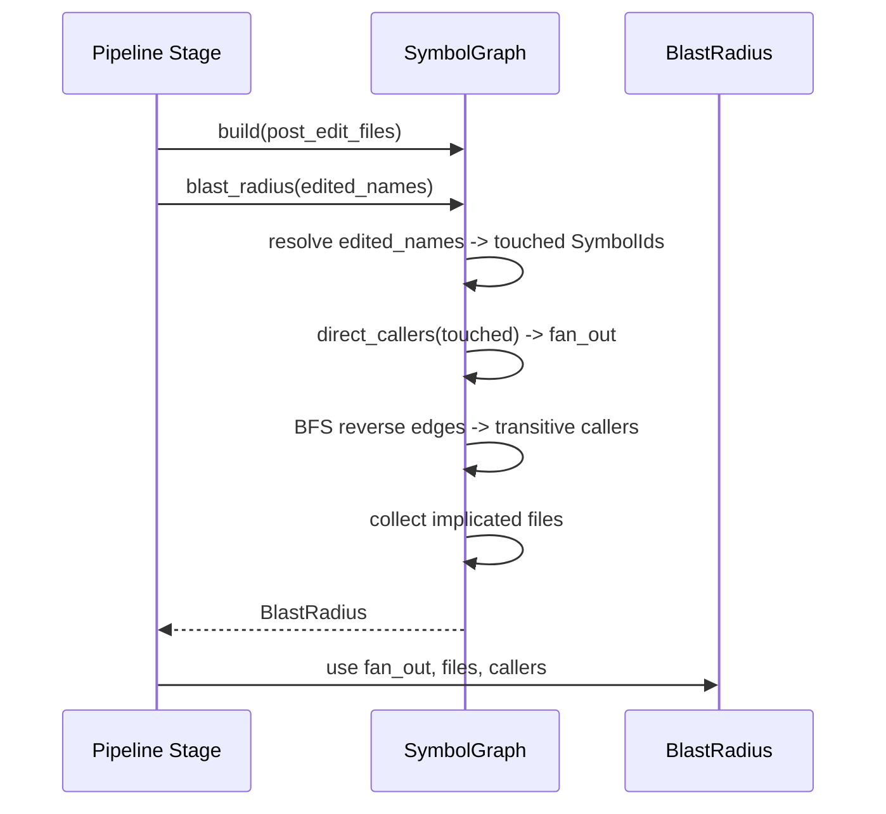
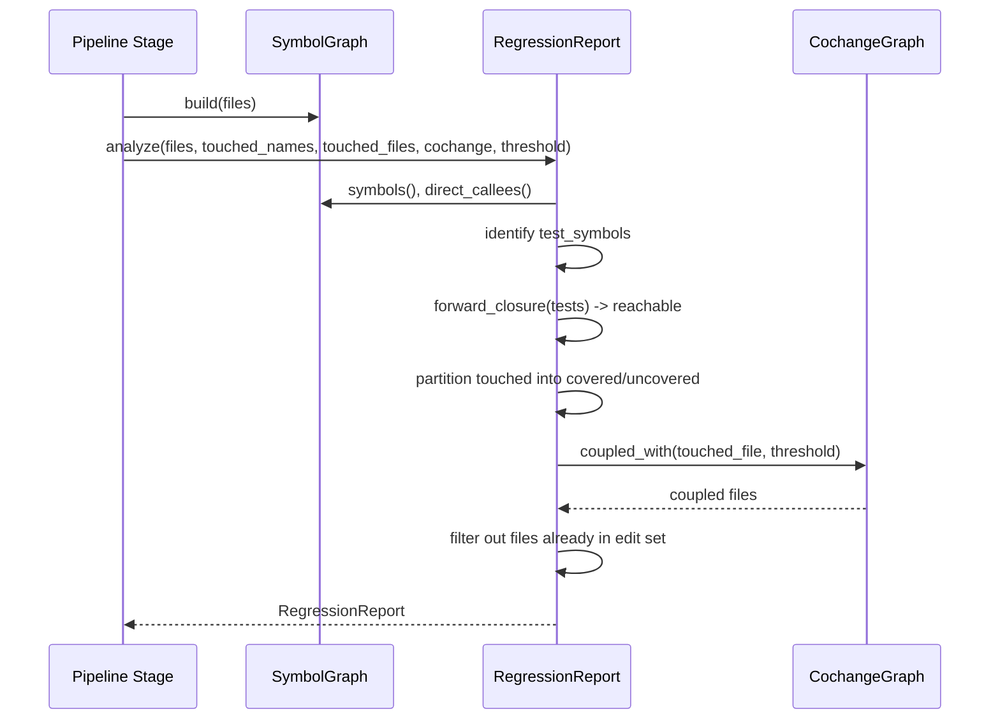
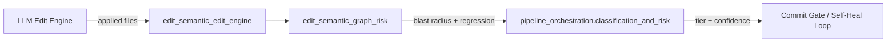

# edit_semantic_graph_risk

## Brief Introduction

`edit_semantic_graph_risk` is the risk-signal layer of the semantic editing subsystem. It builds a conservative, language-aware **symbol / call / import graph** from source files and uses it to compute two inputs the code-review pipeline consumes:

1. **Blast radius** — the transitive set of symbols and files reachable from any edited symbol through the call graph, plus the direct 1-hop fan-out that drives tier classification.
2. **Regression signals** — test-graph coverage of the blast radius and git-history change-coupling advisories.

The module is intentionally *not* a type-resolving compiler front-end. It over-approximates reachability so that risk classification errs on the side of larger, more-reviewed edits rather than missing a real caller. LSP-grade precise refactoring is handled by the sibling [`edit_semantic_edit_ladder`](edit_semantic_edit_ladder.md) rung; this module provides the fast, deterministic, language-server-free rung used for risk sizing.

---

## Core Responsibilities

| Responsibility | Implementation | Consumer |
|---|---|---|
| Parse source files into definitions and imports | [`SymbolGraph::build`](#symbolgraph) | Blast-radius and regression analysis |
| Compute transitive reverse reachability from edited symbols | [`SymbolGraph::blast_radius`](#blast-radius) | [`pipeline_orchestration.classification_and_risk`](pipeline_orchestration.md) |
| Measure test-graph coverage of touched symbols | [`regression::analyze`](#regression-analysis) | [`pipeline_orchestration.classification_and_risk`](pipeline_orchestration.md) |
| Surface historically coupled files missing from the edit | [`CochangeGraph`](#cochangegraph) | [`pipeline_orchestration.classification_and_risk`](pipeline_orchestration.md) |

---

## Architecture

### Component Overview



### Symbol Graph Construction

`SymbolGraph` is built in two passes:

1. **Definition pass** — each [`SourceFile`](#sourcefile) is scanned with [`list_definitions`](edit_semantic_ast_engine.md) from the AST engine. Definitions become [`SymbolId`](#symbolid) nodes keyed by `file::name`. Same-named definitions in the same file are merged by keeping the widest span, which conservatively widens rather than narrows the blast radius.
2. **Reference pass** — for every known symbol name, whole-word occurrences are found in every file. Occurrences on the definition's own header line are excluded. Each remaining occurrence is attributed to the innermost enclosing definition in that file (or a synthetic `<file>::<module>` node) and recorded as a `caller -> callee` edge.

Import targets are also extracted per language (Rust `use`, Python `from`/`import`, Go `import`, JS/TS `import`/`require`, Java `import`). These are stored but are not yet used for cross-file edge resolution; they support downstream architecture-gate checks in [`edit_semantic_workspace_ops`](edit_semantic_workspace_ops.md).



### Blast Radius

[`BlastRadius`](#blastradius) is the module's primary output:

- `touched` — symbols whose names match the edited names.
- `callers` — every symbol that transitively reaches a touched symbol (reverse reachability), excluding the touched set itself.
- `files` — every file containing a touched symbol or a caller.
- `fan_out` — the number of direct (1-hop) callers of any touched symbol.

The `fan_out` value is the scalar the pipeline's risk classifier tiers on. Because the graph merges same-named symbols conservatively, `fan_out` is an upper-bound estimate.

### Regression Analysis

[`regression::analyze`](#regression-analysis) consumes the same `SymbolGraph` and adds two deterministic signals:

1. **Uncovered blast-radius fraction** — test functions are identified by `#[test]` / `#[tokio::test]` attributes or `test`-prefixed names. Forward closure from tests yields every symbol reachable from a test. Touched symbols outside this set are `uncovered`; the ratio `covered / touched` is `coverage_overlap`.
2. **Change-coupling advisories** — a [`CochangeGraph`](#cochangegraph) built from historical commit file sets is queried for files that co-changed with a touched file at or above a threshold. Partners not already in the edit set become non-blocking [`CouplingAdvisory`](#couplingadvisory) entries.



---

## Core Components

### `SourceFile`

A single input to the graph builder.

```rust
pub struct SourceFile {
    pub path: String,
    pub lang: Language,
    pub source: String,
}
```

- `path` — file path used as the namespace for symbols.
- `lang` — language discriminator from the AST engine.
- `source` — full file content.

### `SymbolId`

A fully-qualified symbol: `file::name`.

```rust
pub struct SymbolId {
    pub file: String,
    pub name: String,
}
```

Same-named definitions in different files are distinct nodes. Same-named definitions in the *same* file are merged into a single node, widening the blast radius conservatively.

### `SymbolGraph`

The immutable, deterministic symbol/call/import graph.

```rust
#[derive(Debug, Clone, Default)]
pub struct SymbolGraph { /* defs, by_name, callees, callers, imports */ }
```

Key methods:

- `build(files: &[SourceFile]) -> Self` — construct the graph.
- `symbols() -> Vec<SymbolId>` — every definition id.
- `direct_callers(sym) / direct_callees(sym)` — 1-hop edges.
- `imports_of(file)` — raw import targets declared by a file.
- `blast_radius(touched_names: &[&str]) -> BlastRadius` — transitive reverse reachability.

### `BlastRadius`

The result of resolving what an edit touches.

```rust
pub struct BlastRadius {
    pub touched: BTreeSet<SymbolId>,
    pub callers: BTreeSet<SymbolId>,
    pub files: BTreeSet<String>,
    pub fan_out: usize,
}
```

- `symbol_count()` returns `touched.len() + callers.len()`.

### `RegressionReport`

Regression signals for one edit.

```rust
pub struct RegressionReport {
    pub uncovered: BTreeSet<SymbolId>,
    pub covered: BTreeSet<SymbolId>,
    pub coverage_overlap: f64,
    pub coupling_advisories: Vec<CouplingAdvisory>,
}
```

- `uncovered_fraction()` returns `1 - coverage_overlap`, clamped to `[0, 1]`.

### `CochangeGraph`

A symmetric git-history co-change graph.

```rust
#[derive(Debug, Clone, Default)]
pub struct CochangeGraph { /* counts: (file, file) -> usize */ }
```

- `record(a, b, n)` — insert/update symmetric edges.
- `from_commits(commits)` — populate from per-commit file sets.
- `coupled_with(file, threshold)` — query coupled files at/above threshold.

### `CouplingAdvisory`

A non-blocking "these files usually change together" advisory.

```rust
pub struct CouplingAdvisory {
    pub touched_file: String,
    pub coupled_file: String,
    pub cochange_count: usize,
}
```

---

## Data Flow



1. The edit turn supplies the post-edit file set as [`SourceFile`](#sourcefile) inputs.
2. `SymbolGraph::build` parses definitions and references.
3. `blast_radius` resolves edited names to touched symbols and computes transitive callers.
4. `regression::analyze` computes test coverage and change-coupling advisories.
5. The pipeline's risk classifier combines `fan_out`, `files_touched`, `coverage_overlap`, and other signals into an [`EditRiskAssessment`](pipeline_orchestration.md) and [`ConfidenceScore`](pipeline_orchestration.md).

---

## Dependencies

### Within `edit_semantic`

| Dependency | Relationship |
|---|---|
| [`edit_semantic_ast_engine`](edit_semantic_ast_engine.md) | Provides `Language`, `Definition`, `Span`, and `list_definitions` used to seed the graph. |
| [`edit_semantic_edit_ladder`](edit_semantic_edit_ladder.md) | Uses LSP for precise refactoring at higher rungs; this module provides the fast, server-free risk rung. |
| [`edit_semantic_workspace_ops`](edit_semantic_workspace_ops.md) | Consumes raw import targets and `SymbolId` for architecture-gate and signature-change planning. |
| [`edit_semantic_edit_engine`](edit_semantic_edit_engine.md) | Produces the applied file content that becomes the input `SourceFile` set. |

### Within `pipeline_runtime`

| Dependency | Relationship |
|---|---|
| [`pipeline_orchestration`](pipeline_orchestration.md) | Consumes `BlastRadius` and `RegressionReport` via `RiskInputs` and `SemanticGateReport`. |

### External

| Dependency | Relationship |
|---|---|
| `serde` | `SourceFile` is serializable for journal/replay use. |
| `std::collections` | `BTreeMap`/`BTreeSet` provide deterministic ordering, which is required for reproducible risk scores and tests. |

---

## Process Flows

### Computing Blast Radius for an Edit



### Computing Regression Report



---

## Design Notes

### Conservative Approximation

The module deliberately over-approximates reachability:

- References are whole-word name matches, not type-resolved xrefs.
- Same-name symbols in the same file merge.
- A reference to a name implicates *every* definition with that name across the codebase.

This means `fan_out` and `symbol_count` are upper bounds. The pipeline treats them as risk signals, not exact metrics, so over-estimation leads to more review rather than silent misses.

### Determinism

All collections are `BTreeMap`/`BTreeSet`, and all iteration order is deterministic. This is required for:

- Reproducible test assertions.
- Stable confidence scores across runs.
- Replay and journal compatibility in [`pipeline_orchestration`](pipeline_orchestration.md).

### Language Support

Graph construction supports Rust, Python, Go, JavaScript, TypeScript, and Java. Import extraction is best-effort and per-language. Definition scanning is delegated to the AST engine; if a file fails to parse, it contributes no definitions but its references are still scanned.

---

## How It Fits into the Overall System

`edit_semantic_graph_risk` sits between raw source content and the code-review pipeline's gating decisions:



- The edit engine produces candidate file content.
- This module turns that content into a conservative call graph and risk signals.
- The pipeline classifier combines those signals with diff class, critical-path tags, and rung metadata to decide the review tier and whether auto-approval is allowed.
- Higher-risk edits are routed through more rigorous stages (LSP ladder, SAST, judge panel, performance bench) in [`pipeline_orchestration`](pipeline_orchestration.md).

In short, `edit_semantic_graph_risk` is the *measurement* side of the risk equation; [`pipeline_orchestration.classification_and_risk`](pipeline_orchestration.md) is the *decision* side.
