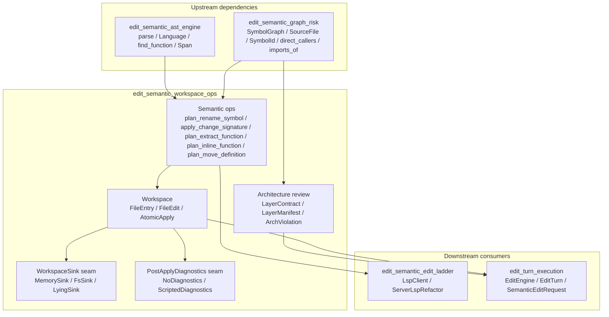
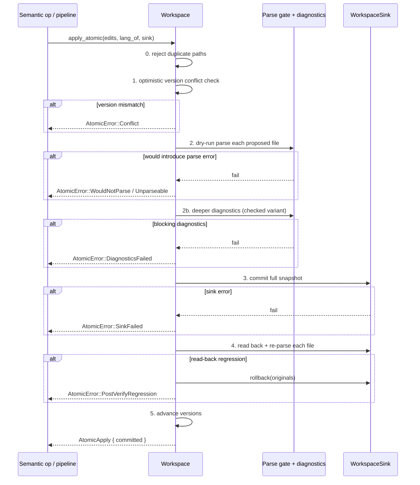
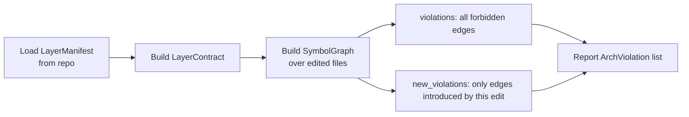
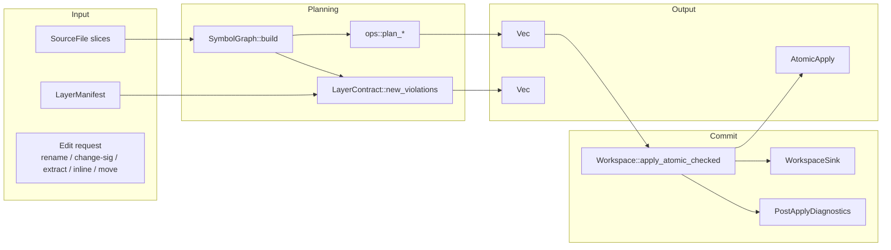

# edit_semantic_workspace_ops

The **edit semantic workspace operations** module is the durable, transactional foundation of the semantic editing pipeline. It turns single-file text rewrites into **multi-file, atomic, verified workspace edits** and enforces the architectural layering contract that keeps the codebase's dependency graph healthy. In short: it makes sure a rename, signature change, extract/inline/move, or import edit either lands everywhere it needs to land, with syntax (and optionally type-check / compile / LSP diagnostics) still clean, or rolls back and writes nothing.

This module deliberately sits on the **AST-rung** of the editing ladder ([`edit_semantic_edit_ladder`](edit_semantic_edit_ladder.md) wires the LSP rung above it). It is deterministic, language-agnostic over the supported surface (Rust, Python, Go, JavaScript/TypeScript, Java), and **refuses rather than guesses** when an operation would require type information or full language-server intelligence.

---

## Core responsibilities

1. **Atomic multi-file apply protocol** — commit a set of [`FileEdit`]s all-or-nothing, with optimistic concurrency, a parse gate, optional deeper diagnostics, post-write re-verification, and automatic rollback.
2. **Workspace state model** — track file content and monotonic versions so concurrent edits serialize safely.
3. **Persistence abstraction** — support in-memory tests ([`MemorySink`]) and durable filesystem writes ([`FsSink`]) through the [`WorkspaceSink`] seam.
4. **Semantic operation planning** — plan cross-file renames, signature changes, function extraction, inlining, and definition moves as [`FileEdit`] sets ready for atomic apply.
5. **Architecture review** — diff a proposed tree against a declarative [`LayerManifest`] and report only the *new* cross-layer dependency violations introduced by an edit.

---

## Module architecture

### Component roles

| Component | File | Role |
|-----------|------|------|
| `Workspace` | `workspace.rs` | In-memory model of the tree: path → content + version. Implements the atomic apply protocol. |
| `FileEntry` | `workspace.rs` | One file's content and optimistic-concurrency version. |
| `FileEdit` | `workspace.rs` | A proposed full-content replacement, tagged with the base version it was built against. |
| `AtomicApply` | `workspace.rs` | Result of a committed apply: map of paths to their new versions. |
| `WorkspaceSink` | `workspace.rs` | Durable destination seam; `commit` is called once per transaction, `read` for post-verify. |
| `MemorySink` | `workspace.rs` | Deterministic in-memory sink for tests and offline runs. |
| `FsSink` | `workspace.rs` | Filesystem-backed sink using temp-file + fsync + atomic rename for durability. |
| `PostApplyDiagnostics` | `workspace.rs` | Deeper verifier seam (type-check / compile / LSP diagnostics) invoked after parse gate, before commit. |
| `NoDiagnostics` | `workspace.rs` | Default parse-only verifier; keeps legacy behavior byte-for-byte. |
| `ScriptedDiagnostics` | `workspace.rs` | Offline stand-in that emits diagnostics when configured markers appear in proposed content. |
| `SignatureChangePlan` | `ops.rs` | Blast-radius report for a signature change: declarations + every direct caller. |
| `AddParamSpec` / `ChangeSigSpec` | `ops.rs` | Concrete spec for adding a parameter to a declaration and splicing an adapter argument at call sites. |
| `ParamPosition` | `ops.rs` | Where a new parameter is inserted: trailing, leading, or indexed. |
| `LayerContract` | `arch.rs` | Compiled layer boundary rules from a manifest. |
| `LayerManifest` | `arch.rs` | Declarative, serde-round-trippable contract: layers + allowed dependency edges. |
| `ArchViolation` | `arch.rs` | One deterministic boundary violation (file, from-layer, to-layer, exact import). |

---

## Atomic apply protocol

The protocol is the heart of the module. Every multi-file semantic operation produces a `Vec<FileEdit>` and asks [`Workspace::apply_atomic`] (or [`Workspace::apply_atomic_checked`]) to commit it.

### Guarantees

- **All-or-nothing**: if any file fails any gate, no file is written.
- **Optimistic concurrency**: an edit built against a stale version is refused before any work is done.
- **Parse safety**: a file that was syntactically clean before the edit cannot become unclean after it.
- **Deeper verification**: the checked variant can block commits that parse but fail `cargo check`, `tsc`, `mypy`, or LSP diagnostics.
- **Durability + rollback**: `FsSink` writes via temp file + `fsync` + atomic rename; post-write read-back detects torn or corrupted commits and rolls back to the pre-edit snapshot.

---

## Semantic operations

The operations in `ops.rs` are **planners**: they inspect the symbol graph, validate preconditions, and return `Vec<FileEdit>` for the atomic apply protocol to commit. They do not touch the filesystem directly.

### Rename symbol

[`plan_rename_symbol`] rewrites every whole-word occurrence of `old` to `new` across all files that contain the identifier.

Guards:
- `new` must be a valid identifier.
- `new` must not already name a definition (collision refused, not silently shadowed).
- `old` must have at least one definition.

> Whole-word matching prevents `rerun` from becoming `rego`, but the operation is intentionally text-based: comments and string literals containing the identifier are also rewritten. Type-accurate renaming is the LSP rung's job.

### Change signature

[`plan_change_signature`] resolves the blast radius of changing a function signature: the declaration(s) and every direct caller. [`apply_change_signature`] / [`apply_change_signature_ex`] then produce the actual edits, adding a parameter at a chosen position and splicing an adapter argument into every call site.

Guards:
- The symbol must be defined.
- Parameter / argument text must be non-empty.
- When call sites are intended to be updated, every file the symbol graph names as a caller must actually contain an updatable `name(` call head; otherwise the operation refuses with [`OpError::CallSiteUnresolved`] rather than leaving a stale call on the old signature.
- A **declaration-only defaulted parameter** (`call_argument: None`) is supported: existing callers are deliberately left untouched.

> Reordering, removing parameters, or type-driven adapter synthesis is out of scope and is refused; the LSP rung handles those cases.

### Extract / inline / move

- [`plan_extract_function`] pulls a line range from inside an enclosing function into a new zero-argument function and replaces the range with a call.
- [`plan_inline_function`] inlines a trivial zero-parameter, single-expression function into every call site and removes its definition.
- [`plan_move_definition`] moves a function definition from one file to another atomically.

All three refuse non-trivial cases rather than mis-transform them.

---

## Architecture review

[`LayerContract`] enforces deterministic, model-free architecture boundaries. A file is assigned to a layer by path-keyword matching; an import target is assigned to a layer by import-string matching. A cross-layer import that is neither same-layer nor explicitly allowed is an [`ArchViolation`].

The `new_violations` method is the one used by the review pipeline: it diffs the violations in the tree *before* the edit against the violations *after*, so pre-existing technical debt is not falsely attributed to the current change.

Unknown-layer targets (standard library, third-party crates) are ignored, never guessed.

---

## Data flow through the module

---

## Error model

### `OpError` (planning failures)

| Variant | Meaning |
|---------|---------|
| `InvalidIdentifier` | New name is not a valid identifier, or parameter text is empty. |
| `NameCollision` | New name already names a definition; rename would shadow. |
| `SymbolNotFound` | Target symbol or file is not present. |
| `CallSiteUnresolved` | Blast radius names a caller file, but no actual `name(` call head could be updated. |

### `AtomicError` (commit failures)

| Variant | Meaning |
|---------|---------|
| `DuplicatePath` | Two edits in one set target the same path. |
| `Conflict` | Optimistic-concurrency version mismatch. |
| `WouldNotParse` | A previously-clean file would become unparseable. |
| `Unparseable` | Proposed content does not parse at all. |
| `DiagnosticsFailed` | Deeper deterministic verifier reported blocking diagnostics. |
| `SinkFailed` | The sink rejected the write. |
| `PostVerifyRegression` | Read-back or re-parse failed; sink was rolled back. |

---

## Relationship to the rest of the system

- **Upstream**: relies on [`edit_semantic_ast_engine`](edit_semantic_ast_engine.md) for `parse`, `Language`, `find_function`, and `Span`, and on [`edit_semantic_graph_risk`](edit_semantic_graph_risk.md) for `SymbolGraph`, `SourceFile`, `SymbolId`, and caller/import resolution.
- **Peer**: [`edit_semantic_edit_ladder`](edit_semantic_edit_ladder.md) layers LSP-based refactoring above these AST-rung operations; [`edit_semantic_edit_engine`](edit_semantic_edit_engine.md) produces lower-level file edits that this module commits atomically.
- **Downstream**: consumed by [`edit_turn_execution`](edit_turn_execution.md) (`EditEngine`, `EditTurn`, `SemanticEditRequest`) inside the broader [`pipeline_orchestration`](pipeline_orchestration.md) stage, and ultimately surfaced through [`server_serving_core`](server_serving_core.md) HTTP routes.

---

## When to change this module

- Adding a new AST-rung semantic operation that must be atomic and parse-verified.
- Changing the concurrency, rollback, or durability semantics of multi-file edits.
- Adding support for a new `WorkspaceSink` backend (e.g., a git-backed or network-backed sink).
- Extending the architecture-review contract format or matching strategy.

## When *not* to change this module

- Type-aware refactoring, import resolution, or language-server features belong in [`edit_semantic_edit_ladder`](edit_semantic_edit_ladder.md).
- Pure single-file text replacement belongs in [`edit_semantic_edit_engine`](edit_semantic_edit_engine.md).
- Pipeline orchestration, review gates, and performance budgets belong in [`pipeline_orchestration`](pipeline_orchestration.md).
