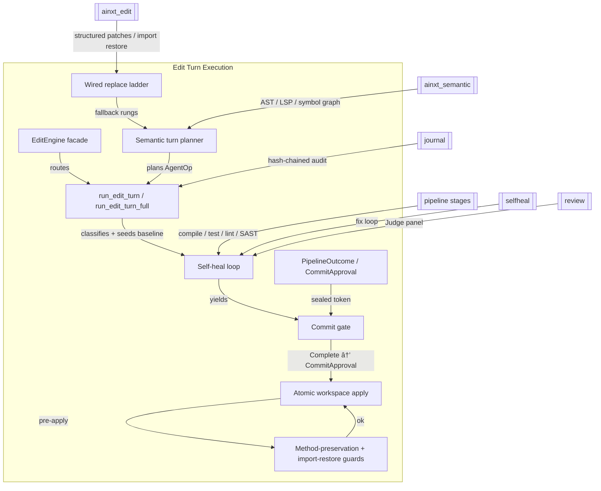
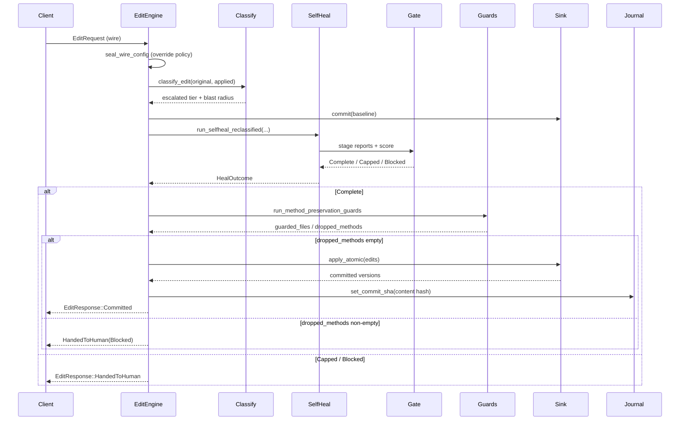

# Edit Turn Execution

The **edit turn execution** module is the commit-gated core of the code-review pipeline. It takes a candidate edit set (or an agent-expressed semantic operation), runs it through deterministic verification, optional self-healing, SAST scanning, performance analysis, architecture review, regression detection, and independent LLM review, and then either atomically commits the healed result to a workspace sink or hands the turn off to a human. The module's central invariant is structural, not conventional: a "done" / commit affordance can only be produced when the pipeline reaches a `Complete` outcome and the atomic sink write succeeds.

This module lives under **pipeline orchestration** in the broader **pipeline runtime** subsystem. It consumes the lower-level editing primitives from [`edit_semantic`](edit_semantic.md) (file edits, AST transforms, LSP refactor, symbol graphs) and composes them with the policy, review, performance, and journaling machinery defined elsewhere in [`pipeline_orchestration`](pipeline_orchestration.md).

## Architecture Overview

The module is organized around four tightly-coupled concerns:

1. **Edit turn core** ([`edit_turn_execution_core`](edit_turn_execution_core.md)) — the `EditEngine` facade, the `run_edit_turn*` family, and the route-ready `POST /v1/edit` entrypoints.
2. **Semantic turn execution** ([`edit_turn_execution_semantic`](edit_turn_execution_semantic.md)) — planning and gating agent-expressed structural operations (rename, change-signature, extract, inline, move, replace-function).
3. **Edit ladder driver** ([`edit_turn_execution_ladder`](edit_turn_execution_ladder.md)) — the wired fall-back ladder (LSP → AST → structured patch → text) and the import-restore / method-preservation guards.
4. **Pipeline outcome** ([`edit_turn_execution_outcome`](edit_turn_execution_outcome.md)) — the typed `PipelineOutcome` and the unforgeable `CommitApproval` seal.

## Core Responsibilities

- **Commit-gated durable writes.** The workspace sink is only written after the self-heal pipeline produces a `Complete` outcome and the atomic apply succeeds. `Capped` and `Blocked` outcomes always result in a human hand-off with no sink mutation.
- **Anti-sycophancy by construction.** `CommitApproval` has no public constructor; it can only be obtained from `PipelineOutcome::commit_approval()`, which returns `Some` exclusively for `PipelineOutcome::Complete`. The wire-level `EditResponse::Committed` variant is produced only from a real `TurnOutcome::Committed`.
- **Wire-seal of caller-supplied policy.** `EditRequest.config` arrives deserialized from the wire. `EditEngine` applies a deployment-owned `DeploymentEditPolicy` via `seal_wire_config`, replacing forged thresholds, rungs, or judge verdicts before they reach the gate.
- **Risk classification.** Every turn is re-classified from the code diff (AST diff + symbol-graph blast radius) before stage 1. Classification is escalate-only: a caller-declared low tier can only be raised, never lowered.
- **Semantic operation ladder.** Structural ops are planned at the AST rung, with an optional LSP driver for rung-1 toolchain-grade resolution. The ladder honestly records the rung actually used, and that rung feeds the Confidence Score as an edit-fidelity penalty.
- **Method preservation and import restore.** Before any durable write, full-file regenerations are checked for silently-dropped methods and missing imports. Dropped methods block the commit; missing imports are transparently restored.
- **Forensic reproducibility.** Each committed turn binds a deterministic SHA-256 content hash of the sorted `(path, content)` pairs into the journal, enabling later replay from a commit id alone.

## Data Flow

## Key Types

| Type | File | Purpose |
|------|------|---------|
| `EditEngine` | `edit_turn.rs` | Long-lived, `Clone`, `Send + Sync` facade that owns the Coder, StageTools, SAST scanner, and optional perf/review/semantic/LSP/breaker seams. |
| `EditTurn` | `edit_turn.rs` | One code-editing turn: pre-edit tree, applied edit set, and self-heal config. |
| `TurnOutcome` | `edit_turn.rs` | `Committed { approval, versions, rounds }` or `HandedToHuman { outcome, rounds }`. |
| `EditRequest` / `EditResponse` | `edit_turn.rs` | Serializable wire types for `POST /v1/edit`. |
| `SemanticTurn` / `AgentOp` | `semantic_turn.rs` | AST-level structural op + file set, planned before gating. |
| `SemanticTurnOutcome` | `semantic_turn.rs` | Result of a planned semantic op, including the resolved ladder rung. |
| `WiredReplace` / `GuardedApply` | `ladder_driver.rs` | Fully-specified replace-function edit and the result of import/method guards. |
| `PipelineOutcome` / `CommitApproval` | `outcome.rs` | Typed gate result and the unforgeable commit token. |

## Integration with the Rest of the System

- **Edit / semantic primitives:** [`edit_semantic`](edit_semantic.md) supplies `ainxt-edit` (structured patches, import restore) and `ainxt-semantic` (AST transforms, LSP refactor, symbol graphs, method listing).
- **Pipeline orchestration siblings:** [`classification_and_risk`](classification_and_risk.md) provides `classify_edit`; [`self_healing`](self_healing.md) provides the fix loop; [`performance`](performance.md) provides the optional benchmark stage; [`journaling`](journaling.md) provides the tamper-evident log; [`pipeline_stages_and_tools`](pipeline_stages_and_tools.md) provides compile/test/lint/SAST stages.
- **Runtime / server:** [`runtime_engine`](runtime_engine.md) and [`server_serving`](server_serving.md) own the actual HTTP routes and surface state; they assemble one `EditEngine` at startup and call its route-ready `*_for` methods.
- **Governance:** the `CAP_EDIT_APPLY` capability is checked before any turn is assembled, so unauthorized callers cannot trigger the pipeline or cause a durable write.

## Sub-module Documentation

- [`edit_turn_execution_core`](edit_turn_execution_core.md) — `EditEngine`, `run_edit_turn`, and route-ready entrypoints.
- [`edit_turn_execution_semantic`](edit_turn_execution_semantic.md) — planning and gating structural operations through the edit ladder.
- [`edit_turn_execution_ladder`](edit_turn_execution_ladder.md) — the wired replace ladder and pre-commit guards.
- [`edit_turn_execution_outcome`](edit_turn_execution_outcome.md) — typed outcomes and the `CommitApproval` seal.

All four sub-module files above were generated from the core components of `edit_turn_execution` and are the authoritative references for the corresponding source files.
