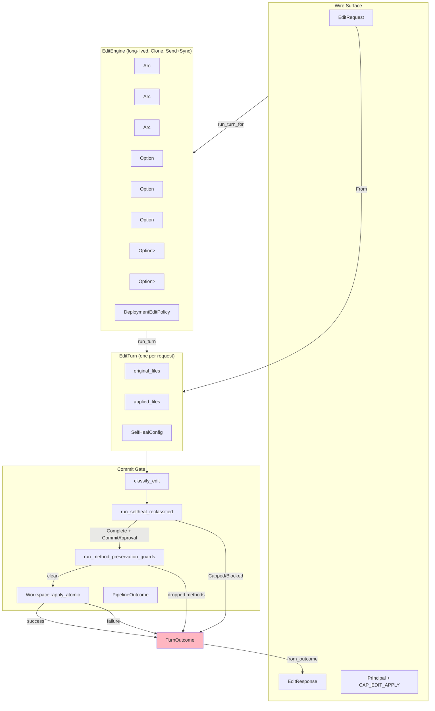
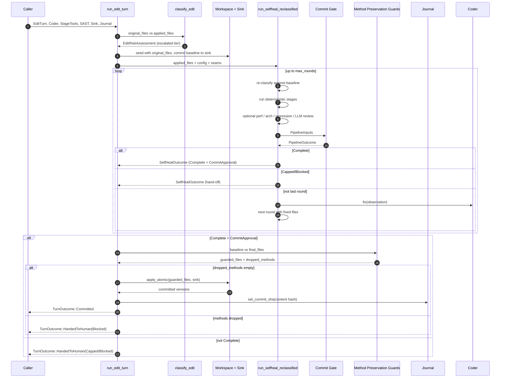
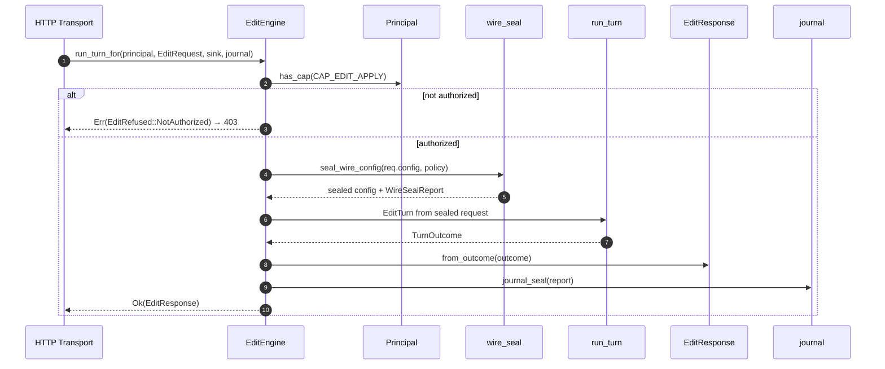

# Edit Turn Execution Core

## Brief Introduction

The **Edit Turn Execution Core** is the central commit-gate subsystem of the code-review pipeline. It binds a single code-editing turn — a set of proposed file changes — to a typed, auditable [`PipelineOutcome`](pipeline_orchestration.md). Its single most important responsibility is enforcing the **durable-write invariant**: a code edit is persisted to a [`WorkspaceSink`](edit_semantic.md) **if and only if** the self-healing review pipeline reaches `Complete` and the atomic apply succeeds. There is no code path that lets a renderer or caller claim "done" without holding a [`CommitReceipt`](edit_turn_execution_core.md#commitreceipt), and there is no code path that writes the workspace without a [`CommitApproval`](edit_turn_execution_outcome.md).

This module lives inside the broader [`pipeline_orchestration`](pipeline_orchestration.md) module, under [`edit_turn_execution`](edit_turn_execution.md). It is the *core* half of that execution layer; the semantic half is documented in [`edit_turn_execution_semantic`](edit_turn_execution_semantic.md), the ladder application half in [`edit_turn_execution_ladder`](edit_turn_execution_ladder.md), and the outcome types in [`edit_turn_execution_outcome`](edit_turn_execution_outcome.md).

---

## Core Concepts

### Edit Turn

An [`EditTurn`](edit_turn_execution_core.md#editturn) is one unit of work: the pre-edit file tree (`original_files`), the edit engine's proposed post-edit file tree (`applied_files`), and the self-heal configuration (`SelfHealConfig`) that controls language, risk tier, rung, round budget, and gate policy.

### Turn Outcome

[`TurnOutcome`](edit_turn_execution_core.md#turnoutcome) is the result of running one turn. It has exactly two variants:

- **`Committed`** — the gate cleared, the healed file set was atomically applied to the sink, and a [`CommitReceipt`](edit_turn_execution_core.md#commitreceipt) was issued.
- **`HandedToHuman`** — the gate did not clear (`Capped` or `Blocked`). The sink was **not** written. This is an honest hand-off, not an error.

The only way to obtain a "done" affordance is through [`TurnOutcome::commit_receipt()`](edit_turn_execution_core.md#turnoutcome), which returns `Some` only for `Committed`.

### Edit Engine

[`EditEngine`](edit_turn_execution_core.md#editengine) is the long-lived, `Clone`, `Send + Sync` facade that a server surface assembles once at startup and shares across concurrent turns. It owns the pipeline seams behind `Arc`s:

- [`Coder`](self_healing.md) — the LLM fix loop.
- [`StageTools`](pipeline_stages_and_tools.md) — compile, test, lint, type-check.
- [`SastScanner`](pipeline_stages_and_tools.md) — static security scan.
- Optional performance seams ([`BenchmarkHarness`](performance.md), [`PerfAdvisor`](performance.md)).
- Optional LLM review + independent Judge panel seams ([`Reviewer`](quality_verification.md), [`JudgePanel`](quality_verification.md)).
- Optional architecture/regression seams ([`LayerContract`](edit_semantic.md), [`CochangeGraph`](edit_semantic.md)).
- Optional Tier-3 differential breaker oracle ([`DifferentialOracle`](classification_and_risk.md)).
- Optional LSP refactor driver ([`LspRefactor`](edit_turn_execution_semantic.md)).

The engine also carries the **deployment edit policy** ([`DeploymentEditPolicy`](edit_turn_execution_core.md#deploymenteditpolicy)), which seals wire-supplied thresholds and budgets so a caller cannot forge a zero-threshold auto-complete.

---

## Architecture

### Module Position

```mermaid
flowchart TB
    subgraph pipeline_runtime["pipeline_runtime"]
        direction TB
        edit_semantic["edit_semantic"]
        pipeline_orchestration["pipeline_orchestration"]
        planning_program_execution["planning_program_execution"]
        runtime_engine["runtime_engine"]
        server_serving["server_serving"]

        subgraph pipeline_orchestration_inner["pipeline_orchestration"]
            direction TB
            edit_turn_execution["edit_turn_execution"]
            classification_and_risk["classification_and_risk"]
            pipeline_stages_and_tools["pipeline_stages_and_tools"]
            performance["performance"]
            self_healing["self_healing"]
            journaling["journaling"]
            wire_seal["wire_seal"]

            subgraph edit_turn_execution_inner["edit_turn_execution"]
                direction TB
                edit_turn_execution_core["edit_turn_execution_core (this module)"]
                edit_turn_execution_semantic["edit_turn_execution_semantic"]
                edit_turn_execution_ladder["edit_turn_execution_ladder"]
                edit_turn_execution_outcome["edit_turn_execution_outcome"]
            end
        end
    end

    server_serving --> edit_turn_execution_core
    runtime_engine --> edit_turn_execution_core
    edit_turn_execution_core --> self_healing
    edit_turn_execution_core --> classification_and_risk
    edit_turn_execution_core --> pipeline_stages_and_tools
    edit_turn_execution_core --> performance
    edit_turn_execution_core --> journaling
    edit_turn_execution_core --> wire_seal
    edit_turn_execution_core --> edit_turn_execution_semantic
    edit_turn_execution_core --> edit_turn_execution_ladder
    edit_turn_execution_core --> edit_turn_execution_outcome
```



### Component Diagram



---

## Data Flow

### Plain Edit Turn (`run_edit_turn`)



### Route-Ready Edit Turn (`run_turn_for`)



---

## Component Reference

### `EditTurn`

```rust
pub struct EditTurn {
    pub edit_id: String,
    pub original_files: Vec<(String, String)>,
    pub applied_files: Vec<(String, String)>,
    pub config: SelfHealConfig,
}
```

One code-editing turn. `original_files` is the pre-edit tree; `applied_files` is what the edit engine proposes to write. The pipeline verifies and optionally heals `applied_files` before any durable write.

### `TurnOutcome`

```rust
pub enum TurnOutcome {
    Committed { approval: CommitApproval, versions: BTreeMap<String, u64>, rounds: u8 },
    HandedToHuman { outcome: PipelineOutcome, rounds: u8 },
}
```

The result of a turn. `commit_receipt()` returns `Some(CommitReceipt)` **only** for `Committed`, making it structurally impossible for a renderer to show "done" for a hand-off.

### `CommitReceipt`

```rust
pub struct CommitReceipt {
    approval: CommitApproval,
    versions: BTreeMap<String, u64>,
    rounds: u8,
    seal: (),
}
```

The renderer-facing "done" affordance. No public constructor; produced only from `TurnOutcome::Committed`. Exposes `confidence()`, `spot_audit()`, `committed_versions()`, and `rounds()`.

### `EditEngine`

The long-lived engine facade. Key methods:

- `new(coder, tools, scanner)` — assemble the engine.
- `with_edit_policy(policy)` — set the deployment policy that seals wire requests.
- `with_lsp(lsp)` — enable rung-1 LSP semantic refactor driver.
- `with_breaker(oracle)` — enable Tier-3 differential breaker run.
- `with_semantic_review(contract, cochange, threshold)` — enable architecture + regression stages.
- `with_review(reviewer, judges, criteria, task)` — enable LLM review + independent Judge panel.
- `with_perf(bench, advisor, budget)` — enable performance analysis.
- `run_turn(turn, sink, journal)` — run one turn (internal/embedded use).
- `run_turn_for(principal, req, sink, journal)` — RBAC-scoped `POST /v1/edit` entrypoint.
- `classify_and_run_turn_for(...)` — same as above plus pre-stage-1 risk assessment.
- `run_semantic_op_for(...)` — RBAC-scoped `POST /v1/edit/semantic` entrypoint.
- `run_review_for(...)` — RBAC-scoped review-only entrypoint (no sink, no write).
- `seal_wire_request(req)` / `sealed_request(req)` — pure policy-seal helpers.

### `EditRequest`

```rust
#[serde(deny_unknown_fields)]
pub struct EditRequest {
    pub edit_id: String,
    pub original_files: Vec<(String, String)>,
    pub applied_files: Vec<(String, String)>,
    pub config: SelfHealConfig,
}
```

The wire body for `POST /v1/edit`. Converts to `EditTurn` via `From`. Unknown fields are rejected.

### `EditResponse`

```rust
#[serde(tag = "result", rename_all = "snake_case")]
pub enum EditResponse {
    Committed { confidence: u8, spot_audit: bool, versions: BTreeMap<String, u64>, rounds: u8 },
    HandedToHuman { outcome: PipelineOutcome, rounds: u8 },
}
```

The serializable wire response. `committed()` is the single predicate a transport should use to render "done".

### `SemanticEditRequest` / `SemanticEditResponse`

Wire types for the semantic-op entrypoint. `SemanticEditRequest` carries an [`AgentOp`](edit_turn_execution_semantic.md) and AST-parseable `SourceFile`s. `SemanticEditResponse` is either `Resolved { rung, response }` or `PlanRejected { reason }`.

### `ClassifiedEditResponse`

```rust
pub struct ClassifiedEditResponse {
    pub assessment: EditRiskAssessment,
    pub response: EditResponse,
}
```

Returned by `classify_and_run_turn_for`. Surfaces the effective tier and rationale alongside the outcome.

### `EditRefused` / `ReviewRefused`

Authorization refusal types. `NotAuthorized` is raised **before** the turn is assembled, so an unauthorized caller cannot probe the pipeline. `ReviewNotConfigured` is raised when `run_review_for` is called on an engine with no review seam.

### `CAP_EDIT_APPLY`

```rust
pub const CAP_EDIT_APPLY: &str = "code.edit.apply";
```

The capability required for every route-ready edit/review entrypoint. Checked before any work is done.

---

## Process Flows

### Risk Classification and Escalation

Before any stage runs, `run_edit_turn_full_guarded` calls [`classify_edit`](classification_and_risk.md) to derive the effective tier from the AST diff and symbol-graph blast radius. The declared tier is a floor; classification can only raise it. The same re-classification runs inside each self-heal round via [`ReclassifySeams`](self_healing.md), so a fix that pulls in a settlement-path module is escalated immediately.

### Self-Heal Loop

The edit turn delegates to [`run_selfheal_reclassified`](self_healing.md), which:

1. Re-classifies the current file set against the baseline.
2. Runs deterministic Phase-A stages (compile, test, lint, type-check, SAST).
3. Optionally runs performance, architecture/regression, and LLM-review stages.
4. Computes a Confidence Score and asks the Commit Gate to decide.
5. On `Complete`, returns the healed file set and a `CommitApproval`.
6. On failure, asks the [`Coder`](self_healing.md) to fix and repeats, up to `max_rounds`.

See [`self_healing`](self_healing.md) for full details.

### Method-Preservation Guards

After the self-heal loop returns `Complete`, the turn runs the add/replace-method guards from [`edit_turn_execution_ladder`](edit_turn_execution_ladder.md):

- **Import restore** — re-inject imports the regeneration dropped.
- **Method preservation** — detect methods present in the baseline but absent from the regenerated file.

If any methods were dropped, the turn is `HandedToHuman(Blocked)` and the sink is never touched. For planned AST-precise structural ops (rename, change-signature, extract), the semantic entrypoint calls the guarded path with `guard_methods = false` so intentional symbol disappearance is not misclassified as a drop.

### Atomic Apply

If the guards pass, the turn builds [`FileEdit`](edit_semantic.md) entries and calls [`Workspace::apply_atomic`](edit_semantic.md). The apply is all-files-or-none. On success, a deterministic commit SHA (content hash of sorted path/content pairs) is written to the journal for forensic replay. On failure, the turn is `HandedToHuman(Blocked)`.

### Wire Sealing

Every route-ready entrypoint seals the wire-supplied `SelfHealConfig` against the engine's `DeploymentEditPolicy` using [`seal_wire_config`](wire_seal.md). This prevents a caller from forging low auto-complete thresholds, high round budgets, or self-asserted Judge verdicts. The seal report is journaled after the pipeline trail so a regulator can see every overridden field.

---

## Dependencies

### Direct sibling modules

| Module | Why it is used |
|--------|----------------|
| [`edit_turn_execution_semantic`](edit_turn_execution_semantic.md) | Plans and runs semantic ops (rename, change-signature, extract, replace-function) through the edit ladder. |
| [`edit_turn_execution_ladder`](edit_turn_execution_ladder.md) | Provides `guarded_full_file_apply` and `run_replace_ladder` for import restore, method preservation, and structured replacement. |
| [`edit_turn_execution_outcome`](edit_turn_execution_outcome.md) | Defines `PipelineOutcome`, `CommitApproval`, and the commit-gate decision types. |
| [`self_healing`](self_healing.md) | Runs the self-heal loop (`run_selfheal_reclassified`) and defines `Coder`, `SelfHealConfig`, and observation types. |
| [`classification_and_risk`](classification_and_risk.md) | Provides `classify_edit` and `EditRiskAssessment` for tier escalation. |
| [`pipeline_stages_and_tools`](pipeline_stages_and_tools.md) | Provides `StageTools`, `SastScanner`, `Stage`, and `StageReport`. |
| [`performance`](performance.md) | Provides `PerfConfig`, `BenchmarkHarness`, `PerfAdvisor`, and `PerfBudget`. |
| [`journaling`](journaling.md) | Provides `Journal` and `PipelineEvent` for tamper-evident audit trails. |
| [`wire_seal`](wire_seal.md) | Provides `seal_wire_config`, `DeploymentEditPolicy`, and `WireSealReport`. |

### External crates

| Crate | Role in this module |
|-------|---------------------|
| [`ainxt_semantic`](edit_semantic.md) | `Workspace`, `WorkspaceSink`, `FileEdit`, `Rung`, `LspRefactor`, `CodeLanguage`, `LayerContract`, `CochangeGraph`. |
| [`ainxt_judge`](quality_verification.md) | `JudgePanel`, `Reviewer`, `JudgeCriteria`, `ReviewFinding`, `PanelVerdict`. |
| [`ainxt_types`](core_infrastructure.md) | `Principal` and capability-based RBAC. |
| [`ainxt_edit`](edit_semantic.md) | Structured edit primitives used by the ladder. |

---

## How It Fits into the Overall System

The Edit Turn Execution Core sits at the boundary between the **AI engine** (which proposes edits) and the **runtime/serving layer** (which durably applies them). It is called by:

- [`runtime_engine`](runtime_engine.md) surfaces such as `ainxt-runtimed` that mount `POST /v1/edit` and `POST /v1/edit/semantic`.
- [`server_serving`](server_serving.md) HTTP routes in `ainxt-server`.
- Higher-level program-execution surfaces in [`planning_program_execution`](planning_program_execution.md) that need to commit a planned code change.

It consumes:

- Deterministic build/test/lint tools from [`pipeline_stages_and_tools`](pipeline_stages_and_tools.md).
- Security scanning from [`pipeline_stages_and_tools`](pipeline_stages_and_tools.md).
- Self-healing from [`self_healing`](self_healing.md).
- Risk classification from [`classification_and_risk`](classification_and_risk.md).
- Semantic editing from [`edit_turn_execution_semantic`](edit_turn_execution_semantic.md) and [`edit_turn_execution_ladder`](edit_turn_execution_ladder.md).
- Independent adjudication from [`quality_verification`](quality_verification.md) via `ainxt_judge`.

It produces:

- A typed, journaled, serializable outcome.
- A durable workspace write only when the gate clears.
- A `CommitReceipt` that higher-level renderers use as the sole "done" token.

---

## Security and Safety Invariants

1. **No write without approval.** `WorkspaceSink::commit` is reachable only after `CommitApproval` is produced by a `Complete` pipeline outcome.
2. **No "done" without receipt.** `CommitReceipt` has no public constructor and is produced only from `TurnOutcome::Committed`.
3. **Authorization first.** `CAP_EDIT_APPLY` is checked before the turn is assembled, preventing capability probing and unauthorized writes.
4. **Wire policy sealing.** Deployment policy overrides caller-supplied thresholds, round budgets, and Judge verdicts.
5. **Method preservation.** Silent method drops are detected before the atomic apply and block the commit.
6. **Tier-3 human hand-off.** Critical-path edits force `HandedToHuman` regardless of score.
7. **Mandatory independent Judge at Tier 2+.** The Commit Gate requires a context-isolated panel verdict for `Moderate` and above.
8. **Forensic replay.** Every committed turn writes a deterministic content-hash SHA to the journal, enabling full stage-by-stage reconstruction.

---

## See Also

- [`edit_turn_execution`](edit_turn_execution.md) — parent module overview.
- [`edit_turn_execution_semantic`](edit_turn_execution_semantic.md) — semantic op planning and the edit ladder.
- [`edit_turn_execution_ladder`](edit_turn_execution_ladder.md) — guarded apply and structured replacement.
- [`edit_turn_execution_outcome`](edit_turn_execution_outcome.md) — pipeline outcomes and commit approval.
- [`self_healing`](self_healing.md) — the self-heal loop and Coder interface.
- [`classification_and_risk`](classification_and_risk.md) — edit risk classification.
- [`pipeline_stages_and_tools`](pipeline_stages_and_tools.md) — deterministic stages and SAST.
- [`performance`](performance.md) — performance analysis stage.
- [`journaling`](journaling.md) — tamper-evident audit journal.
- [`wire_seal`](wire_seal.md) — wire policy sealing.
- [`edit_semantic`](edit_semantic.md) — workspace, ladder, and semantic primitives.
- [`quality_verification`](quality_verification.md) — Judge panel and reviewer abstractions.
