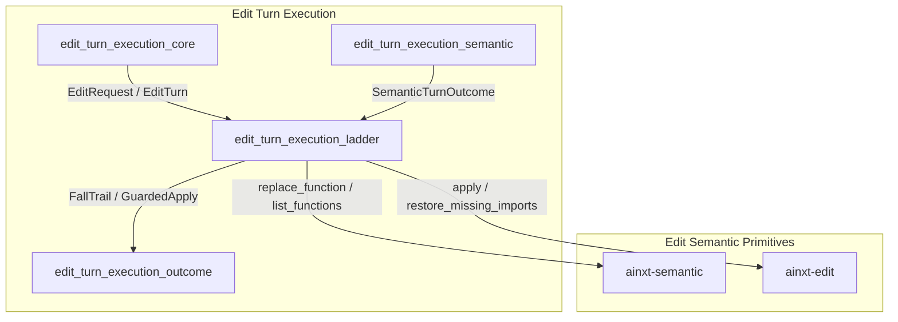
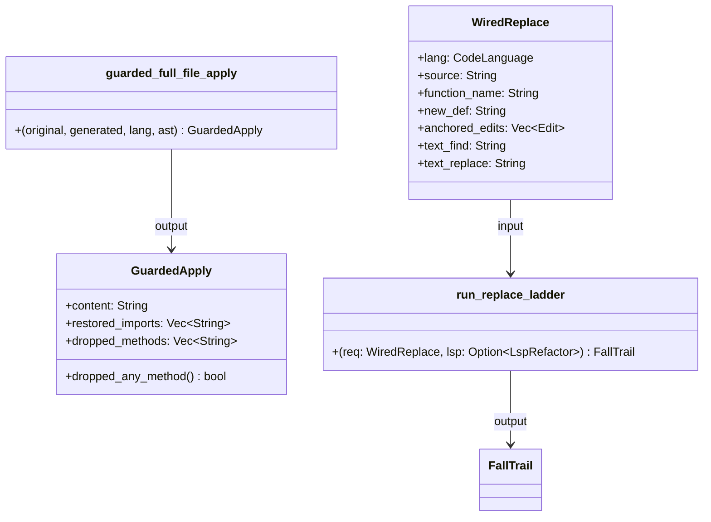
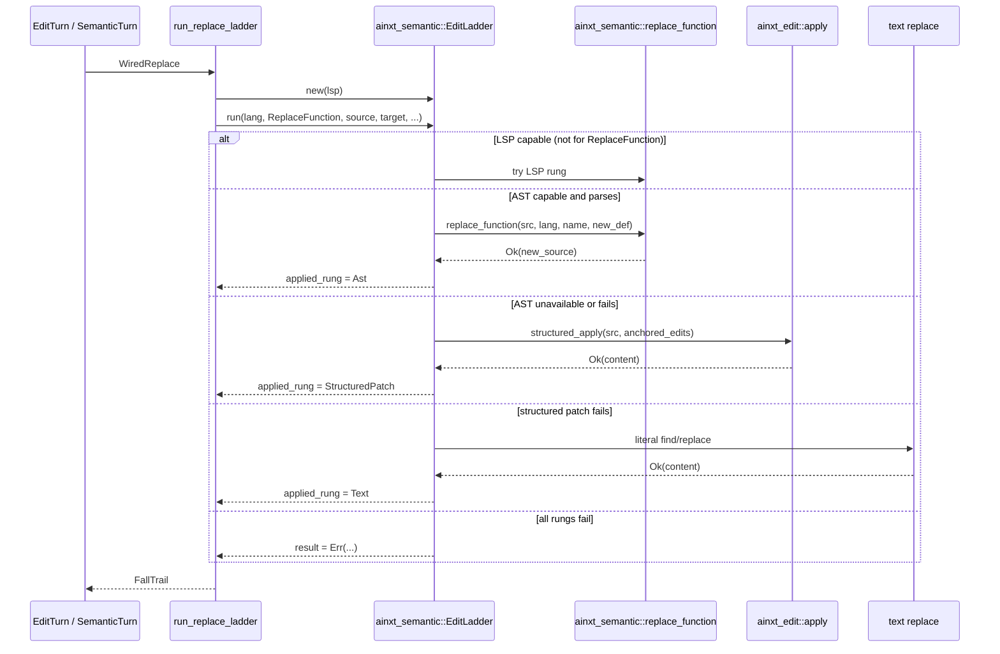
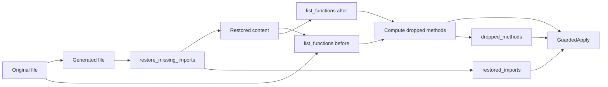
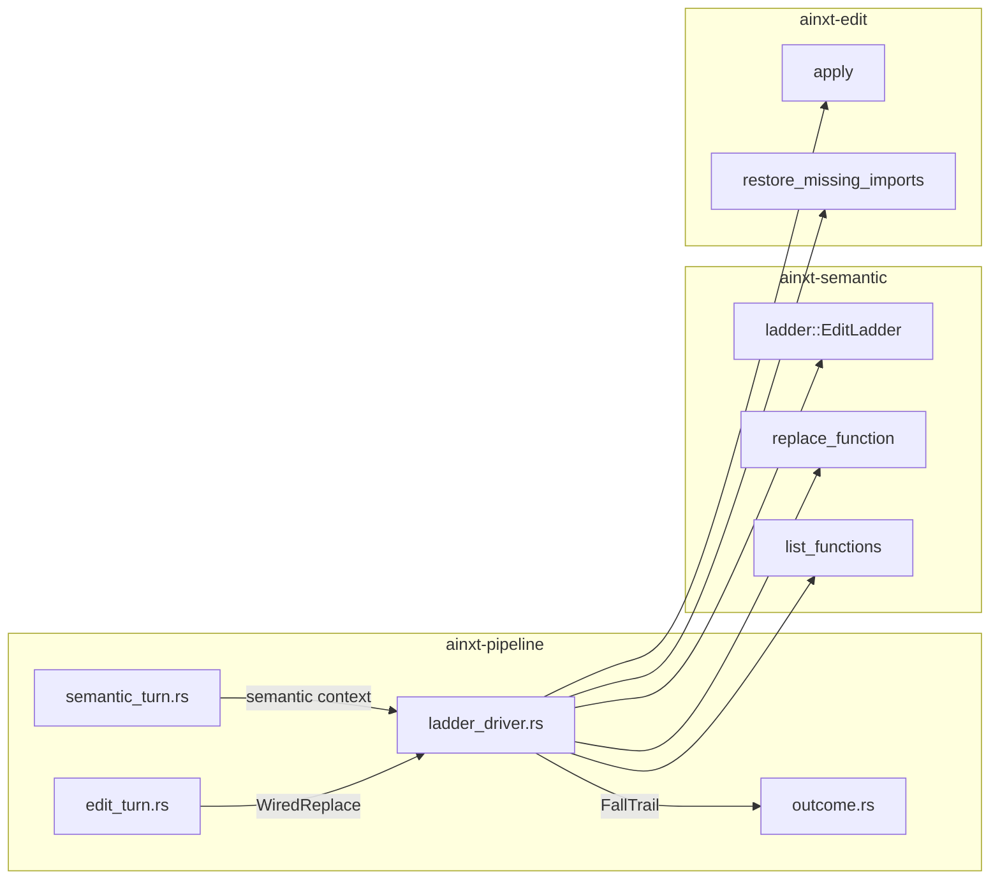
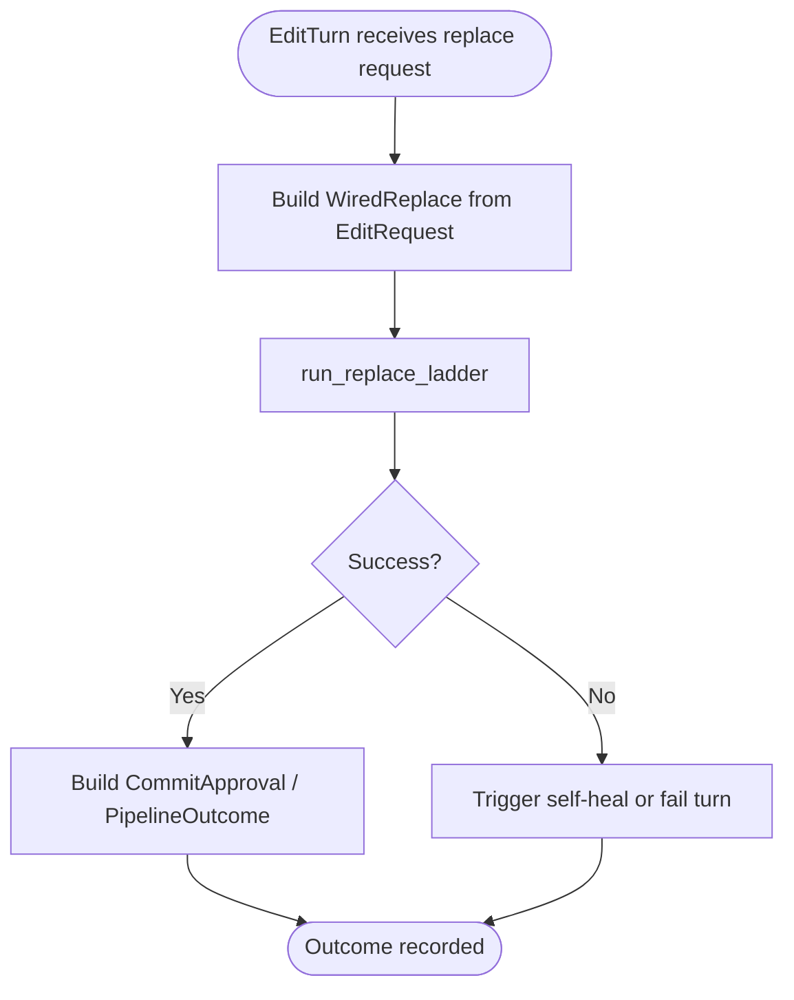
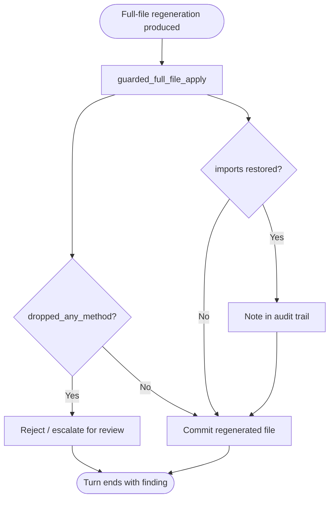

# edit_turn_execution_ladder

## Brief Introduction

The `edit_turn_execution_ladder` module implements the **wired edit ladder** for the pipeline's edit turn execution. It is the concrete binding that composes multiple editing strategies—AST transformation, structured patching, and literal text replacement—into a single degradable operation. The module also runs the **add/replace-method guards** on the semantic apply path, ensuring that full-file regenerations do not silently drop imports or methods.

In the broader system, this module sits inside [`edit_turn_execution`](edit_turn_execution.md) under [`pipeline_orchestration`](pipeline_orchestration.md). It bridges the high-level edit intent produced by [`edit_turn_execution_core`](edit_turn_execution_core.md) and [`edit_turn_execution_semantic`](edit_turn_execution_semantic.md) with the low-level editing primitives provided by [`edit_semantic`](edit_semantic.md) (`ainxt-semantic` and `ainxt-edit`).

---

## Core Functionality

### 1. Wired Replace Ladder (`run_replace_ladder`)

`run_replace_ladder` executes a function-replacement edit by walking a **capability ladder** of rungs, from highest-fidelity to lowest-fidelity, stopping at the first successful rung and recording every fall reason in a [`FallTrail`](edit_semantic.md).

The rungs are:

| Rung | Provider | When it applies |
|------|----------|-----------------|
| LSP (seam) | External language server | Not offered for `ReplaceFunction` in the current capability matrix |
| AST | `ainxt_semantic::replace_function` | Language has a bound tree-sitter grammar and the new definition parses |
| Structured patch | `ainxt_edit::apply` with anchored edits | AST rung unavailable or fails |
| Text replace | Literal `find` → `replace` | Last resort when structured patch fails |

The ladder is honest about degradation: if a language has no grammar, the AST rung is skipped and recorded as unavailable, never silently ignored.

### 2. Guarded Full-File Apply (`guarded_full_file_apply`)

`guarded_full_file_apply` runs two atomic guards on a full-file regeneration before it is committed:

1. **Import-restore guard** (`ainxt_edit::restore_missing_imports`) — re-injects imports that were present in the original file but missing from the generated file.
2. **Method-preservation guard** (`ainxt_semantic::list_functions`) — compares function definitions before and after and reports any method that was silently dropped.

The result is returned as a [`GuardedApply`](#guardedapply), which carries the corrected content, the list of restored imports, and the list of dropped methods.

---

## Architecture

### Component Relationships

---

## Data Flow

### Replace Ladder Flow

### Guarded Full-File Apply Flow

---

## Component Interaction

---

## Process Flows

### Function Replacement Turn

### Full-File Regeneration Turn

---

## How It Fits into the System

The `edit_turn_execution_ladder` module is the **mechanical bridge** between planning and execution in the edit pipeline:

- It receives structured edit requests from [`edit_turn_execution_core`](edit_turn_execution_core.md) (`EditTurn`, `EditRequest`).
- It receives semantic context from [`edit_turn_execution_semantic`](edit_turn_execution_semantic.md) (`SemanticTurn`, `SemanticTurnOutcome`).
- It delegates actual source manipulation to [`edit_semantic`](edit_semantic.md):
  - `ainxt-semantic` for AST-level operations and the ladder framework.
  - `ainxt-edit` for structured patching and import restoration.
- It returns a `FallTrail` or `GuardedApply` to [`edit_turn_execution_outcome`](edit_turn_execution_outcome.md), which decides whether to approve, reject, or self-heal.

By encoding fallback logic directly in the ladder, the module ensures that an edit turn degrades gracefully when high-fidelity tools are unavailable, while still producing an auditable record of which rung was used and why lower rungs were attempted.

---

## Key Types

### `WiredReplace`

A fully-specified edit carrying the material each ladder rung needs. It includes:

- `lang`: the [`CodeLanguage`](edit_semantic.md) being edited.
- `source`: the original file content.
- `function_name` + `new_def`: inputs for the AST rung.
- `anchored_edits`: inputs for the structured-patch rung.
- `text_find` + `text_replace`: inputs for the text rung.

### `GuardedApply`

The result of running the add/replace-method guards on a full-file regeneration:

- `content`: the generated content with restored imports.
- `restored_imports`: imports re-injected by the import-restore guard.
- `dropped_methods`: methods present in the original but absent after regeneration.
- `dropped_any_method()`: convenience predicate for escalation logic.

---

## References

- [`edit_turn_execution`](edit_turn_execution.md) — parent module coordinating edit turns.
- [`edit_turn_execution_core`](edit_turn_execution_core.md) — core edit-turn types and engine.
- [`edit_turn_execution_semantic`](edit_turn_execution_semantic.md) — semantic turn execution.
- [`edit_turn_execution_outcome`](edit_turn_execution_outcome.md) — outcome approval and commit logic.
- [`edit_semantic`](edit_semantic.md) — AST and structured editing primitives (`ainxt-semantic`, `ainxt-edit`).
- [`pipeline_orchestration`](pipeline_orchestration.md) — broader pipeline orchestration context.
