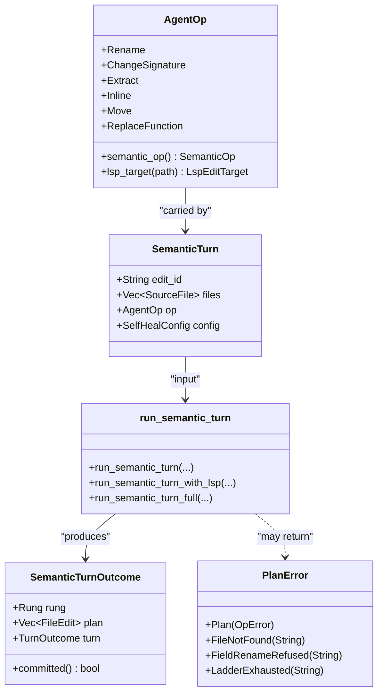
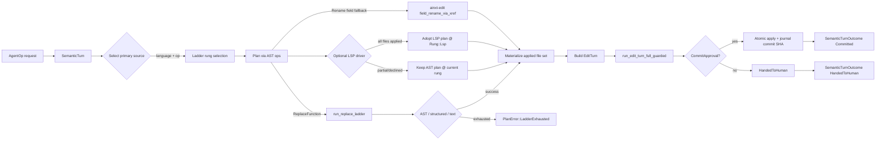
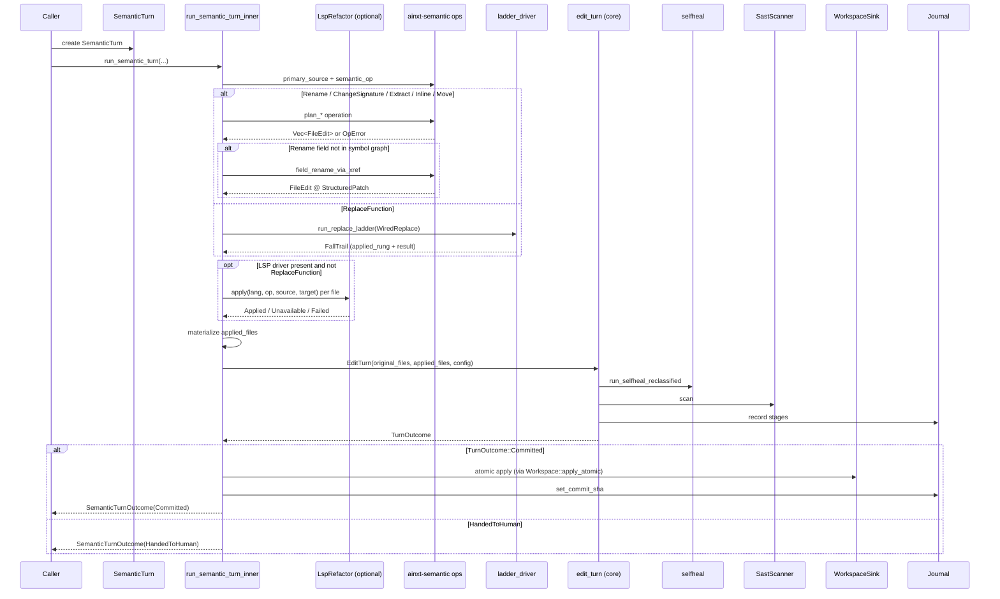

# `edit_turn_execution_semantic` — Semantic-Op Edit Turn

> Source: `crates/ainxt-pipeline/src/semantic_turn.rs`


## Brief Introduction

The `edit_turn_execution_semantic` module is the bridge between *agent-expressed*
structural code operations — rename a symbol, change a signature, extract/inline/move
a function, or replace a single function body — and the pipeline's durable,
atomic commit gate.

It lives inside the broader **edit-turn execution** subsystem
(`pipeline_runtime → pipeline_orchestration → edit_turn_execution`).
While [`edit_turn_execution_core`](edit_turn_execution_core.md) handles generic
file-level edits and [`edit_turn_execution_ladder`](edit_turn_execution_ladder.md)
handles multi-rung replacements, this module is responsible for:

1. **Parsing** a high-level [`AgentOp`](#agentop) into the concrete planning
   primitives provided by [`edit_semantic`](edit_semantic.md).
2. **Selecting the correct fidelity rung** (LSP → AST → structured patch → text)
   for the operation and language.
3. **Planning** a deterministic, multi-file [`FileEdit`](edit_semantic.md) set.
4. **Handing the planned edit set to the full guarded edit turn**, which runs
   self-heal, SAST, review seams, classification, and atomic commit/rollback.

A durable write is only reachable when the underlying gate returns
`TurnOutcome::Committed` with a [`CommitApproval`](edit_turn_execution_outcome.md).
Planning failures never touch the workspace sink.

---

## Core Components

### `AgentOp`

`AgentOp` is the user/agent-facing request vocabulary. It is intentionally
restricted to operations that the AST rung can plan deterministically, so the
system never silently falls back to a dangerous text patch for a structural
operation.

| Variant | Maps to `SemanticOp` | Notes |
|---|---|---|
| `Rename { old, new }` | `RenameSymbol` | Cross-file AST rename; falls back to `field_rename_via_xref` for struct/enum fields |
| `ChangeSignature { name, spec }` | `ChangeSignature` | Adds a parameter and updates every call site |
| `Extract { file, enclosing, start_line, end_line, new_name }` | `ExtractFunction` | Extracts a line range into a new function |
| `Inline { name }` | `InlineFunction` | Inlines a single-expression function |
| `Move { name, from_file, to_file }` | `MoveDefinition` | Moves a definition across files |
| `ReplaceFunction { file, function_name, new_def, ... }` | `ReplaceFunction` | Smaller-blast-radius function replacement via the full wired ladder |

`AgentOp::semantic_op()` returns the [`edit_semantic`](edit_semantic.md) operation
class, and `AgentOp::lsp_target()` builds the `LspEditTarget` needed by an LSP
driver (currently populated for `Rename`).

`AgentOp` is serialized with `#[serde(tag = "op", rename_all = "snake_case")]`,
so external callers (HTTP API, planner surfaces, CLI) send requests such as:

```json
{ "op": "rename", "old": "charge", "new": "payment" }
```

### `SemanticTurn`

A `SemanticTurn` binds together everything needed for one semantic pass:

- `edit_id` — stable identifier for the turn.
- `files` — the working tree of AST-parseable [`SourceFile`](edit_semantic.md)
  snapshots the op is planned against.
- `op` — the [`AgentOp`](#agentop) to perform.
- `config` — a [`SelfHealConfig`](self_healing.md) that carries the rung, tier,
  and self-heal parameters.

### `PlanError`

`PlanError` captures why an operation could not be turned into an edit set
*before* any write occurs:

- `Plan(OpError)` — the AST planner rejected the op (invalid identifier, name
  collision, symbol not found, etc.).
- `FileNotFound(path)` — a file referenced by the op is missing from the turn.
- `FieldRenameRefused(detail)` — the field-rename fallback refused because the
  old identifier does not occur or the new one collides.
- `LadderExhausted(detail)` — the `ReplaceFunction` ladder exhausted every
  capable rung.

Because planning is pure, returning a `PlanError` leaves the sink untouched.

### `SemanticTurnOutcome`

The result of a planned and gated semantic turn:

- `rung` — the fidelity rung the operation actually resolved at. This is fed
  into the Confidence Score as an honest edit-fidelity penalty.
- `plan` — the multi-file `FileEdit` set produced by the planner.
- `turn` — the final `TurnOutcome` from the guarded edit turn
  (`Committed` or `HandedToHuman`).


### Public API

The module exposes three entry points in `crates/ainxt-pipeline/src/semantic_turn.rs`:

- `run_semantic_turn(turn, coder, tools, scanner, sink, journal)` — plans the
  op through the AST rung and drives it through the full guarded edit turn.
- `run_semantic_turn_with_lsp(turn, lsp, coder, tools, scanner, sink, journal)` —
  same as above, but first attempts a language-server refactor for every file
  the AST plan would touch.
- `run_semantic_turn_full(turn, lsp, review, coder, tools, scanner, sink, journal)` —
  the most general entry point, adding the optional independent `ReviewSeams`
  panel required for Tier 2+ edits.

All three return `Result<SemanticTurnOutcome, PlanError>`.

---

## Architecture



The module itself is thin and compositional: it does not implement the gate,
the workspace, or the semantic planner. It translates an `AgentOp` into the
right lower-level primitives and then delegates to:

- [`edit_semantic`](edit_semantic.md) for AST-precise planning.
- [`edit_turn_execution_ladder`](edit_turn_execution_ladder.md) for the
  `ReplaceFunction` wired ladder.
- [`edit_turn_execution_core`](edit_turn_execution_core.md) for the guarded
  self-heal commit gate.
- [`journaling`](journaling.md) for the hash-chained audit trail.

---

## Data Flow



---

## Component Interaction



---

## Process Flow: Planning and Gating a Semantic Turn

### 1. Language and Rung Selection

The primary source file is chosen from the turn's file set:

- `Extract`, `Move`, and `ReplaceFunction` use the file named in the op.
- All other ops use the first file.

The source language is converted to the ladder's `CodeLanguage`, and the
operation's `SemanticOp` class is used to confirm that the AST rung is capable.
For every structural op except `ReplaceFunction`, the initial rung is `Ast`.

### 2. Planning the Edit Set

The planner dispatches by op:

| Op | Planner | Fallback |
|---|---|---|
| `Rename` | `plan_rename_symbol` | `field_rename_via_xref` for struct/enum fields |
| `ChangeSignature` | `apply_change_signature` | — |
| `Extract` | `plan_extract_function` | — |
| `Inline` | `plan_inline_function` | — |
| `Move` | `plan_move_definition` | — |
| `ReplaceFunction` | `run_replace_ladder` | AST → structured anchored patch → literal text replace |

The `ReplaceFunction` path is intentionally different from a plain full-file
regeneration: it targets a single function body, keeping the blast radius small.
See [`edit_turn_execution_ladder`](edit_turn_execution_ladder.md) for the ladder
mechanics.

### 3. Optional LSP Refactor

If an `LspRefactor` driver is supplied, the module attempts to apply the
language server to *every* file the AST plan would touch. A partial LSP result
is never mixed with AST edits; if any file is `Unavailable` or `Failed`, the
system falls back to the already-selected plan and records the original rung.
When the LSP succeeds for all files, the plan is replaced with the LSP result
and the rung is recorded as `Rung::Lsp`.

### 4. Materialize the Applied Tree

The planned `FileEdit` set is overlaid onto the original file set by path,
producing `applied_files`. This is the candidate tree that the gate will verify.

### 5. Run the Guarded Edit Turn

An [`EditTurn`](edit_turn_execution_core.md) is constructed from the original
and applied file sets, with `config.rung` set to the selected rung. The turn is
passed to `run_edit_turn_full_guarded`, which:

- Classifies the edit (see
  [`classification_and_risk`](classification_and_risk.md)).
- Runs the self-heal loop (see [`self_healing`](self_healing.md)).
- Enforces SAST, review seams, and optional performance/semantic gates.
- Requires a `CommitApproval` before any durable write.
- Applies the method-preservation guard and then atomically commits to the sink.

For structural ops, `guard_methods` is set to `false` because a rename or
extract legitimately makes an old symbol name disappear; the import-restore half
of the guard still runs.

### 6. Outcome

- `Committed` — the sink now holds the new file versions and the journal records
  a content-hash commit SHA.
- `HandedToHuman` — the gate did not clear; the sink remains at the pre-edit
  baseline.

---

## Rung Fidelity and Confidence Scoring

The selected rung is stored in `SemanticTurnOutcome::rung` and in the turn's
`SelfHealConfig`. The pipeline's Confidence Score uses the rung as an honest
edit-fidelity penalty:

- `Lsp` — toolchain-grade refactor, no penalty.
- `Ast` — tree-sitter AST transform, small penalty.
- `StructuredPatch` — anchored text rewrite, larger penalty.
- `TextPatch` — literal find/replace, largest penalty.

This prevents a lower-fidelity apply from being scored as if it were a precise
LSP/AST transform.

---

## Error Handling

All planning errors are returned as `PlanError` before any side effects:

```rust
pub enum PlanError {
    Plan(OpError),
    FileNotFound(String),
    FieldRenameRefused(String),
    LadderExhausted(String),
}
```

Runtime failures inside the guarded edit turn (deterministic stage failures,
SAST findings, review rejection, atomic apply failure, method-preservation
guard) are captured in `TurnOutcome::HandedToHuman` and surfaced through
`SemanticTurnOutcome::turn`.

---

## How It Fits into the System

`edit_turn_execution_semantic` sits at the intersection of three larger
subsystems:

1. **Semantic code understanding** — it consumes the symbol graph, LSP refactor
   seam, and AST-precise operations from [`edit_semantic`](edit_semantic.md).
2. **Edit-turn execution** — it delegates the actual gate, rollback, and atomic
   commit to [`edit_turn_execution_core`](edit_turn_execution_core.md) and the
   replace-function ladder to
   [`edit_turn_execution_ladder`](edit_turn_execution_ladder.md).
3. **Pipeline orchestration** — it participates in the stage/tooling ecosystem
   ([`pipeline_stages_and_tools`](pipeline_stages_and_tools.md)), risk
   classification ([`classification_and_risk`](classification_and_risk.md)),
   self-healing ([`self_healing`](self_healing.md)), and audit journaling
   ([`journaling`](journaling.md)).

Higher-level callers (for example, the server's `EditState` or planner-driven
program surfaces) express intent as an `AgentOp`; this module turns that intent
into a safe, observable, and reversible code change.

---

## References

- [`edit_turn_execution_core`](edit_turn_execution_core.md) — generic edit turn,
  `EditTurn`, `TurnOutcome`, and `run_edit_turn_full_guarded`.
- [`edit_turn_execution_ladder`](edit_turn_execution_ladder.md) — the
  `run_replace_ladder` and `WiredReplace` multi-rung replacement driver.
- [`edit_turn_execution_outcome`](edit_turn_execution_outcome.md) —
  `CommitApproval` and pipeline outcome types.
- [`edit_semantic`](edit_semantic.md) — AST-precise planning, `SymbolGraph`,
  `FileEdit`, `WorkspaceSink`, and the `Rung` ladder model.
- [`self_healing`](self_healing.md) — the self-heal loop, `Coder`,
  `SelfHealConfig`, and `ReviewSeams`.
- [`classification_and_risk`](classification_and_risk.md) — edit risk
  classification and tier escalation.
- [`pipeline_stages_and_tools`](pipeline_stages_and_tools.md) — `StageTools`,
  `SastScanner`, and stage execution.
- [`journaling`](journaling.md) — `Journal`, commit SHA binding, and forensic
  replay support.
