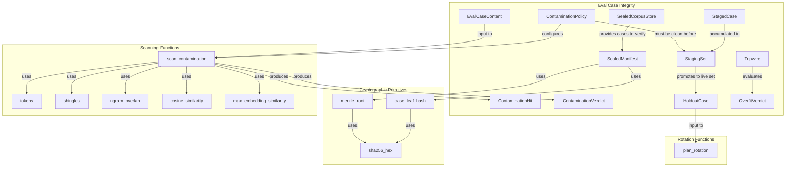
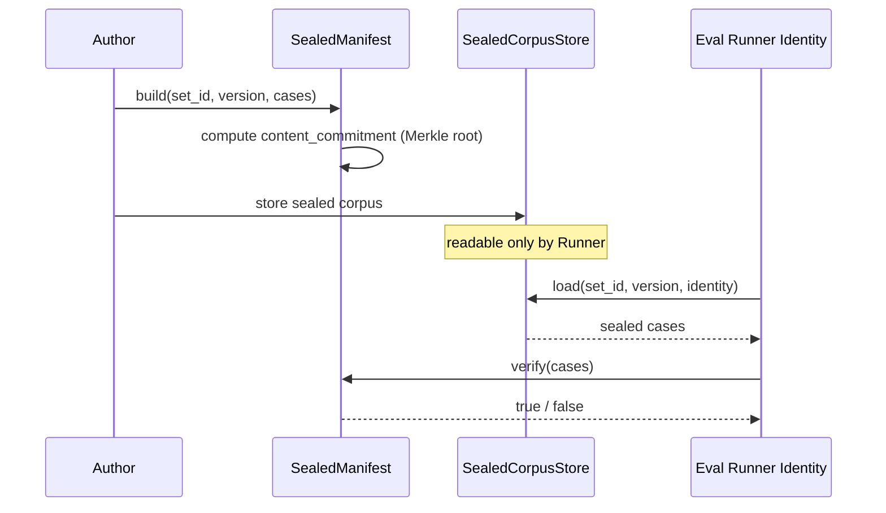
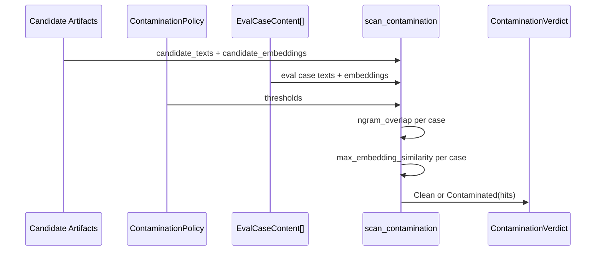
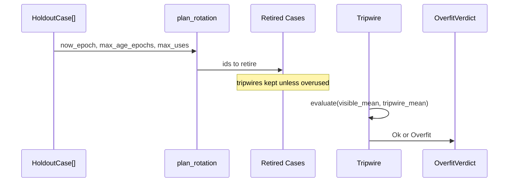
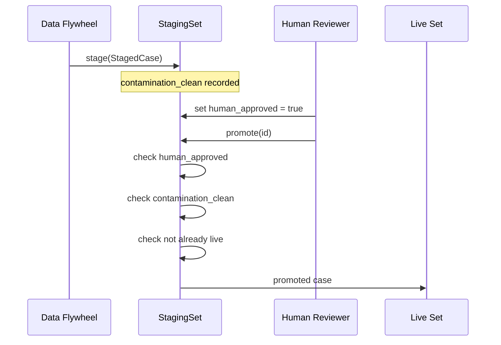

# eval_cases_integrity

The `eval_cases_integrity` module safeguards the trustworthiness of evaluation datasets by making eval corpora tamper-evident, contamination-resistant, and resistant to memorization-driven overfitting. It implements the eval-integrity mechanisms described in `EVAL_PLATFORM.md` §9: sealed holdouts with cryptographic content commitments, contamination scanning, deterministic holdout rotation, tripwire-based overfit detection, and human-gated promotion of flywheel-derived cases.

An eval that can be passed by memorization is worse than no eval. This module treats eval rot as a concrete failure mode and provides deterministic, auditable defenses against three specific risks:

1. **Corpus tampering or substitution** — solved by [`SealedManifest`](./eval_cases_integrity.md#sealedmanifest) and [`SealedCorpusStore`](./eval_cases_integrity.md#sealedcorpusstore).
2. **Training or prompt contamination** — solved by [`scan_contamination`](./eval_cases_integrity.md#scan_contamination) with n-gram and embedding overlap detection.
3. **Memorization and overfitting** — solved by [`plan_rotation`](./eval_cases_integrity.md#plan_rotation), [`HoldoutCase`](./eval_cases_integrity.md#holdoutcase), and [`Tripwire`](./eval_cases_integrity.md#tripwire).
4. **Flywheel self-legislation** — solved by [`StagingSet`](./eval_cases_integrity.md#stagingset) with mandatory human approval and contamination checks before promotion.

---

## Architecture

---

## Component Overview

### Content Commitment Primitives

| Component | Type | Purpose |
|-----------|------|---------|
| `sha256_hex` | Function | Computes a hex-encoded SHA-256 digest of a byte slice. |
| `case_leaf_hash` | Function | Computes a domain-separated SHA-256 hash of an eval case `(id, input, gold)`. |
| `merkle_root` | Function | Builds a deterministic binary Merkle root over ordered leaf hashes; duplicates the last node on odd levels. |

These primitives provide the cryptographic foundation for [`SealedManifest`](./eval_cases_integrity.md#sealedmanifest). The domain-separated leaf hashing and node hashing ensure that case content cannot be rearranged or substituted without changing the root.

### SealedManifest

[`SealedManifest`](./eval_cases_integrity.md#sealedmanifest) is the PII-free, reviewable identity of an eval set. It binds `set_id`, `version`, and `case_count` to a `content_commitment` (Merkle root) computed over the sealed case leaves. The manifest is readable by everyone; the actual case corpus is readable only through [`SealedCorpusStore`](./eval_cases_integrity.md#sealedcorpusstore) by the eval-runner identity.

Key operations:

- `build(set_id, version, cases)` — constructs a manifest from raw case triples.
- `verify(cases)` — checks that the provided cases reproduce the manifest's commitment and match the declared count.

This design mirrors an ADR-026 `control.lock` check: a swapped corpus is caught by a Merkle mismatch.

### SealedCorpusStore

[`SealedCorpusStore`](./eval_cases_integrity.md#sealedcorpusstore) is the access-control seam for the encrypted at-rest corpus. It returns `None` when the caller identity is not the eval runner or when the set is unknown. Production implementations are expected to integrate with a KMS and encrypted data-plane store (ADR-022). The trait intentionally decouples integrity logic from storage backend details.

### Contamination Scanning

#### EvalCaseContent

[`EvalCaseContent`](./eval_cases_integrity.md#evalcasecontent) represents one eval case's content for scanning: `id`, `text`, and an optional embedding vector. It is deliberately plain to avoid coupling with other modules.

#### ContaminationPolicy

[`ContaminationPolicy`](./eval_cases_integrity.md#contaminationpolicy) defines thresholds:

- `ngram_n` — shingle size (default 8).
- `ngram_threshold` — Jaccard overlap threshold (default 0.30).
- `embedding_threshold` — cosine similarity threshold (default 0.95).

#### Scanning Pipeline

1. `tokens` lowercases and splits text into alphanumeric runs.
2. `shingles` produces sorted, deduplicated n-gram shingles.
3. `ngram_overlap` computes Jaccard similarity between two texts.
4. `cosine_similarity` computes cosine similarity between equal-length embedding vectors.
5. `max_embedding_similarity` finds the highest similarity between a candidate embedding and any eval-case embedding.
6. `scan_contamination` runs both checks across all candidate texts/embeddings and all eval cases, returning either `Clean` or `Contaminated(Vec<ContaminationHit>)`.

Any hit at or above threshold is treated as a platform defect: the candidate has memorized or leaked eval content.

### Rotation and Tripwires

#### HoldoutCase

[`HoldoutCase`](./eval_cases_integrity.md#holdoutcase) tracks per-case rotation state:

- `id` — case identifier.
- `minted_epoch` — epoch when the case was created or last rotated.
- `use_count` — how many times the case has gated a change.
- `tripwire` — whether the case is a never-tuned overfitting detector.

#### plan_rotation

[`plan_rotation`](./eval_cases_integrity.md#plan_rotation) deterministically selects cases to retire based on `now_epoch`, `max_age_epochs`, and `max_uses`. Tripwires are never rotated for age alone (they must persist to detect overfitting) but are retired if overused.

#### Tripwire

[`Tripwire`](./eval_cases_integrity.md#tripwire) compares a candidate's mean score on the visible (tunable) set against its mean score on the sealed tripwire slice. If the drop exceeds `max_drop` (default 5.0), the candidate is declared overfit via [`OverfitVerdict`](./eval_cases_integrity.md#overfitverdict).

### Flywheel Staging and Promotion

#### CaseProvenance

[`CaseProvenance`](./eval_cases_integrity.md#caseprovenance) records how a candidate case was authored:

- `Seed` — hand-authored, highest trust.
- `Breaker` — verified Breaker repro.
- `Flywheel` — derived from production traffic, lowest trust, never auto-added.
- `Incident` — confirmed incident postmortem.

#### StagedCase

[`StagedCase`](./eval_cases_integrity.md#stagedcase) holds a candidate's `id`, `input`, `gold`, `provenance`, `human_approved` flag, and `contamination_clean` flag. The `human_approved` flag can only be set by an explicit human review action.

#### StagingSet

[`StagingSet`](./eval_cases_integrity.md#stagingset) is the fail-closed staging area. It:

- Accumulates proposed cases via `stage`.
- Tracks already-live ids to ensure idempotent promotion.
- `promote(id)` enforces three gates:
  1. The case must exist in staging.
  2. The case must be `human_approved`.
  3. The case must be `contamination_clean`.
  4. The id must not already be live.

Failures are reported as [`PromotionError`](./eval_cases_integrity.md#promotionerror): `NeedsHumanApproval`, `Contaminated`, or `AlreadyLive`.

---

## Data Flow

### Sealed Holdout Verification

### Contamination Scan

### Holdout Rotation and Tripwire Evaluation

### Flywheel Case Promotion

---

## Integration with the System

`eval_cases_integrity` sits inside the [`eval_cases`](./eval_cases.md) submodule of [`evaluation_testing`](./evaluation_testing.md) within the [`ai_engine`](./ai_engine.md) domain. It is consumed by higher-level evaluation orchestration components.

### Upstream Consumers

- [`eval_pipeline`](./eval_pipeline.md) — uses sealed manifests, contamination scans, rotation plans, and tripwire verdicts to gate releases. See [`ReleaseGateConfig`](./eval_pipeline.md), [`ContaminationScan`](./eval_pipeline.md), and [`ReleaseGateReport`](./eval_pipeline.md).
- [`eval_judging`](./eval_judging.md) — may use tripwire results and contamination status as inputs to judge panels and statistical aggregation. See [`GateReport`](./eval_judging.md) and [`MetricCell`](./eval_judging.md).
- [`eval_cases_core`](./eval_cases_core.md) — provides the base [`EvalCase`](./eval_cases_core.md) and [`EvalReport`](./eval_cases_core.md) abstractions that integrity mechanisms protect.
- [`eval_cases_manifest`](./eval_cases_manifest.md) — may embed [`SealedManifest`](./eval_cases_integrity.md#sealedmanifest) commitments into [`EvalSetManifest`](./eval_cases_manifest.md).
- [`eval_cases_vault`](./eval_cases_vault.md) — may store regression vault cases that need integrity protection. See [`RegressionVault`](./eval_cases_vault.md).

### Downstream Dependencies

This module intentionally minimizes external coupling. It depends only on:

- `serde` for serialization.
- `sha2` for cryptographic hashing.

It does not depend on provider adapters, retrieval, memory, or runtime crates, so it can be used safely in CI, dogfood, and release-gate contexts without pulling in heavy infrastructure.

### Cross-Cutting Concerns

- **Governance and compliance**: The sealed-corpus access model aligns with [`governance_compliance`](./governance_compliance.md) identity and audit patterns, particularly [`IdentityAuthority`](./governance_compliance.md) and break-glass flows.
- **Security config**: [`SealedCorpusStore`](./eval_cases_integrity.md#sealedcorpusstore) production implementations may rely on [`security_config_token`](./security_config_token.md) and [`security_config_cryptoagility`](./security_config_cryptoagility.md) for encryption and key management.
- **Memory and lifecycle**: Rotation epochs and holdout retirement may feed into [`memory_management`](./memory_management.md) retention and [`lifecycle`](./lifecycle.md) erasure policies.

---

## Design Principles

1. **Determinism**: Rotation uses explicit epochs, not wall clocks. Hashing and Merkle construction are deterministic.
2. **Fail-closed**: Contamination scanning reports any hit as a defect; staging promotion requires human approval and a clean scan.
3. **Separation of concerns**: The manifest is public and reviewable; the corpus is sealed and access-controlled.
4. **Minimal coupling**: Case content is represented as plain `(id, input, gold)` triples and optional embeddings, avoiding dependencies on richer domain types.
5. **Auditability**: Every integrity decision (Merkle mismatch, contamination hit, promotion error, overfit verdict) is represented as a concrete, serializable value.

---

## See Also

- [`eval_cases_core`](./eval_cases_core.md) — base eval case types.
- [`eval_cases_manifest`](./eval_cases_manifest.md) — eval set manifests and metric specifications.
- [`eval_cases_vault`](./eval_cases_vault.md) — regression vault storage.
- [`eval_cases_audit`](./eval_cases_audit.md) — verdict records and audit trails.
- [`eval_judging`](./eval_judging.md) — judge panels and statistical aggregation.
- [`eval_pipeline`](./eval_pipeline.md) — release gates and CI integration.
- [`ai_engine`](./ai_engine.md) — parent domain overview.
