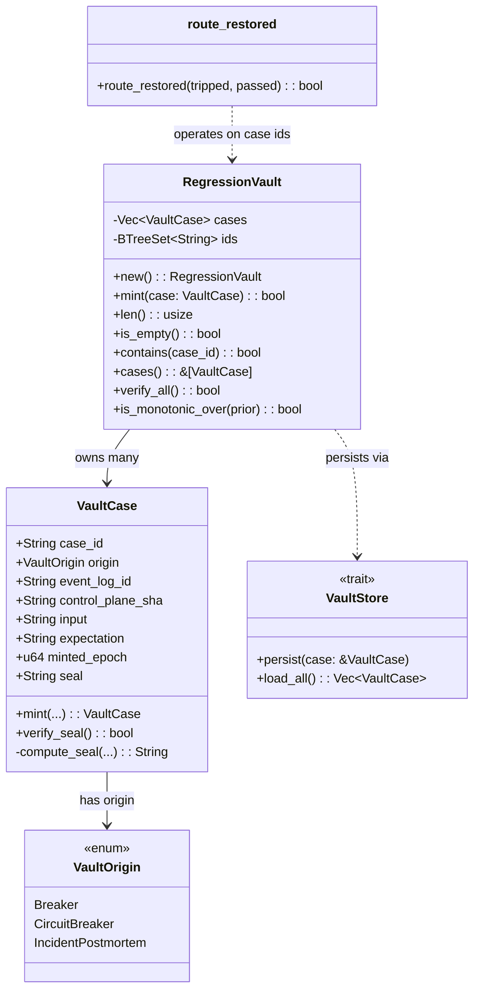
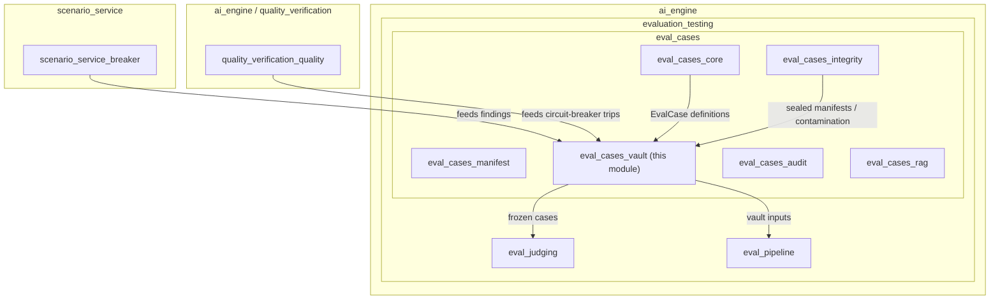
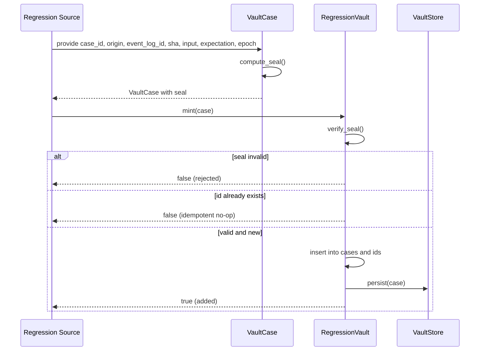
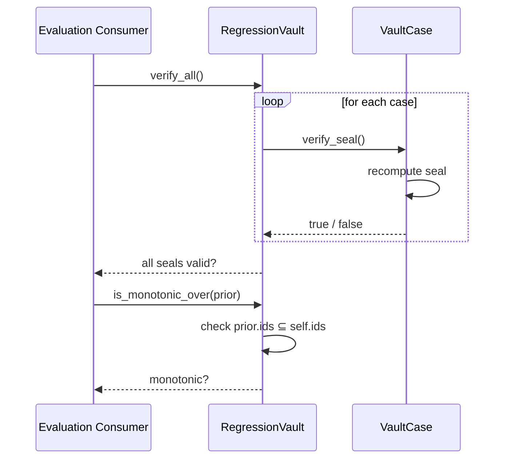
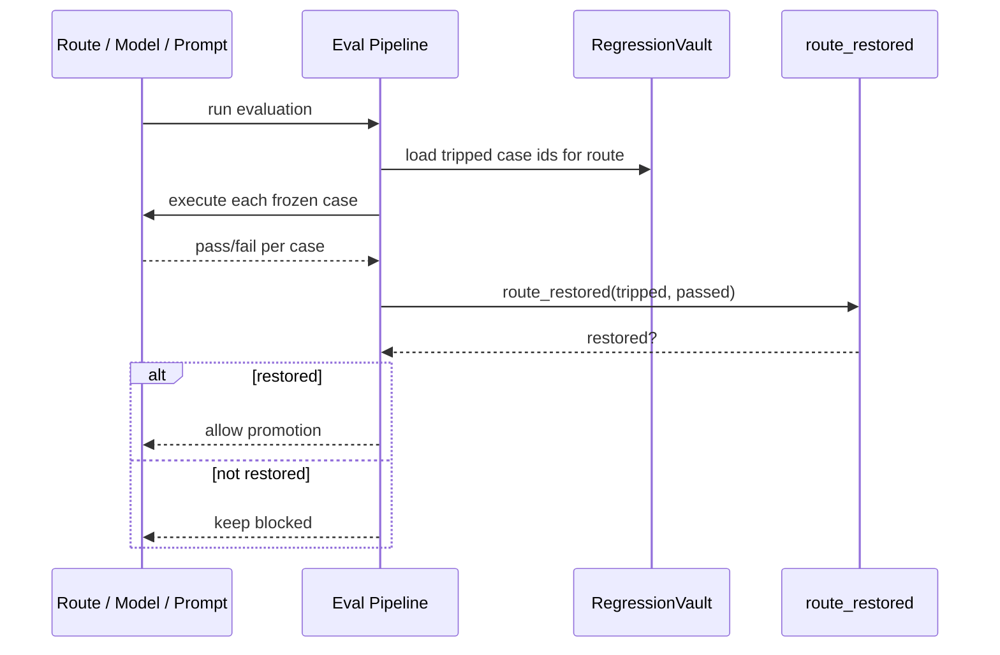

# eval_cases_vault

## Brief Introduction

The `eval_cases_vault` module implements the **Regression Vault**: a frozen, append-only, cryptographically sealed collection of regression test cases for the AI engine. Its central guarantee is that **a bug found once is tested forever**. Cases minted into the vault originate from breaker findings, live quality-circuit-breaker trips, and incident postmortems. The vault enforces two invariants: **monotonic growth** (cases are never dropped) and **reproducibility-from-SHA** (every case carries an event-log id, control-plane commit SHA, and a content seal).

This module is part of the broader [`eval_cases`](eval_cases.md) subsystem under [`evaluation_testing`](evaluation_testing.md) in the [`ai_engine`](ai_engine.md) domain.

---

## Purpose and Core Functionality

The Regression Vault solves a specific operational safety problem: once a regression is discovered, it must remain detectable across future changes. Live quality metrics can fluctuate, and thresholds can be gamed by unrelated improvements. The vault freezes the exact failing input and expectation, so a route, model, or prompt is only considered **restored** when it passes every frozen case that previously tripped it.

Key responsibilities:

- **Mint frozen regression cases** with tamper-evident content seals.
- **Persist cases append-only and idempotently** by `case_id`.
- **Verify seals** to detect accidental or malicious edits.
- **Prove monotonicity** across snapshots (no case may be silently dropped).
- **Decide route restoration** based on passing the exact set of tripped vault cases.
- **Abstract durable storage** behind the `VaultStore` seam.

---

## Architecture

### Component Overview



### Module Position



---

## Core Components

### `VaultOrigin`

An enum describing where a vault case came from:

- **`Breaker`** — a verified, minimized repro from the adversarial breaker system (see [`scenario_service_breaker`](scenario_service_breaker.md)).
- **`CircuitBreaker`** — a live quality-circuit-breaker trip in production or staging (see [`quality_verification_quality`](quality_verification_quality.md)).
- **`IncidentPostmortem`** — a confirmed AI-incident postmortem.

### `VaultCase`

A single frozen regression case. It captures:

- `case_id`: unique identifier.
- `origin`: source of the case.
- `event_log_id`: event-log entry the case was born from.
- `control_plane_sha`: commit SHA at the time of minting.
- `input`: the reproducing input.
- `expectation`: a machine-checkable description of "fixed."
- `minted_epoch`: deterministic epoch.
- `seal`: SHA-256 content hash over all immutable fields.

The seal is computed with a length-prefixed feeding function so distinct field boundaries cannot collide. `VaultCase::verify_seal` recomputes the digest and detects any silent edit.

### `RegressionVault`

The container for all frozen cases. It guarantees:

- **Append-only minting**: `mint` rejects duplicate `case_id`s and never overwrites.
- **Seal verification**: a case with a stale or invalid seal is rejected.
- **Set monotonicity**: `is_monotonic_over(prior)` proves a newer snapshot contains every case id from a prior snapshot.
- **Bulk verification**: `verify_all` checks every case seal in the vault.

### `VaultStore`

A storage seam for durable, encrypted persistence. The production implementation is runner-only and described in the platform evaluation docs. The trait exposes:

- `persist(&mut self, case: &VaultCase)` — store a case.
- `load_all(&self) -> Vec<VaultCase>` — load all cases.

### `route_restored`

The load-bearing behavioral rule: a route that regressed is **not** restored by merely beating a live threshold. It is restored only when it passes **all** frozen vault cases that tripped it.

```rust
pub fn route_restored(tripped: &[String], passed: &BTreeSet<String>) -> bool
```

- `tripped`: case ids the route previously failed.
- `passed`: case ids the route now passes.
- Returns `true` only if `tripped` is non-empty and every id in `tripped` is in `passed`.

---

## Data Flow

### Minting a New Vault Case



### Verifying Vault Integrity



### Route Restoration Decision



---

## Process Flows

### Adding a Regression Case

1. A regression is discovered by a breaker run, a live circuit-breaker trip, or an incident postmortem.
2. The originating system supplies the reproducing input, expectation, event-log id, and current control-plane SHA.
3. `VaultCase::mint` computes the content seal.
4. `RegressionVault::mint` verifies the seal and inserts the case idempotently.
5. The `VaultStore` seam persists the case to durable storage.

### Proving a Snapshot is Safe to Promote

1. Load the prior vault snapshot and the candidate snapshot.
2. Call `candidate.is_monotonic_over(prior)` to ensure no case was dropped.
3. Call `candidate.verify_all()` to ensure no case was tampered with.
4. Only if both checks pass is the snapshot eligible for promotion.

### Restoring a Regressed Route

1. Identify the set of vault case ids the route previously tripped.
2. Re-run the route against each of those exact frozen cases.
3. Collect the ids of cases now passing.
4. Call `route_restored(tripped, passed)`.
5. If and only if every tripped case now passes, the route is restored.

---

## Dependencies and Integration

### Upstream Producers

| Producer Module | Relationship |
|-----------------|--------------|
| [`scenario_service_breaker`](scenario_service_breaker.md) | Supplies minimized, verified breaker findings as `VaultOrigin::Breaker` cases. |
| [`quality_verification_quality`](quality_verification_quality.md) | Supplies live quality-circuit-breaker trips as `VaultOrigin::CircuitBreaker` cases. |
| Incident / postmortem workflows | Supply confirmed incidents as `VaultOrigin::IncidentPostmortem` cases. |

### Sibling Eval Modules

| Sibling Module | Relationship |
|----------------|--------------|
| [`eval_cases_core`](eval_cases_core.md) | Provides the base `EvalCase`, `EvalCriteria`, and `CaseResult` abstractions used across eval cases. |
| [`eval_cases_integrity`](eval_cases_integrity.md) | Provides sealed manifests, contamination policies, and holdout sets that protect vault provenance. |
| [`eval_cases_manifest`](eval_cases_manifest.md) | Defines eval-set manifests and metric specs that may reference vault cases. |
| [`eval_cases_audit`](eval_cases_audit.md) | Records verdicts (`VerdictRecord`) for vault-case executions. |
| [`eval_cases_rag`](eval_cases_rag.md) | Provides retrieval-augmented eval cases that can be frozen into the vault. |

### Downstream Consumers

| Consumer Module | Relationship |
|-----------------|--------------|
| [`eval_judging`](eval_judging.md) | Judges execute vault cases and produce pass/fail verdicts. |
| [`eval_pipeline`](eval_pipeline.md) | Release gates consume `VaultInputs` and `RegressionVault` snapshots to block or allow promotion. |

---

## Safety Invariants

1. **Monotonic in safety**: `RegressionVault::is_monotonic_over` proves a newer snapshot never drops a prior case. Dropping a regression case is treated as a safety violation.
2. **Reproducible-from-SHA**: every case carries `event_log_id`, `control_plane_sha`, and a `seal`. A tampered case fails `verify_seal`.
3. **Append-only, idempotent minting**: `mint` returns `true` only for newly added, valid cases. Duplicate ids are no-ops; invalid seals are rejected.
4. **Restoration only by frozen cases**: `route_restored` ensures a route is not considered fixed by unrelated live-metric improvements.

---

## Testing

The module includes unit tests covering:

- **Seal tampering detection**: editing a case after minting invalidates its seal.
- **Append-only idempotency**: re-minting the same `case_id` is a no-op.
- **Tampered-case rejection**: the vault rejects cases whose seals do not verify.
- **Monotonicity enforcement**: growing snapshots pass; dropped cases fail.
- **Route restoration logic**: a route is restored only after passing all tripped cases.
- **Store seam round-trip**: an in-memory `VaultStore` implementation persists and loads cases correctly.

---

## References

- [`eval_cases`](eval_cases.md) — parent module for all eval-case subsystems.
- [`eval_cases_core`](eval_cases_core.md) — base eval-case types and results.
- [`eval_cases_integrity`](eval_cases_integrity.md) — sealed manifests and contamination controls.
- [`eval_cases_manifest`](eval_cases_manifest.md) — eval-set manifests and metric specifications.
- [`eval_cases_audit`](eval_cases_audit.md) — verdict recording for eval executions.
- [`eval_cases_rag`](eval_cases_rag.md) — retrieval-augmented eval cases.
- [`eval_judging`](eval_judging.md) — judges that produce pass/fail verdicts on vault cases.
- [`eval_pipeline`](eval_pipeline.md) — release gates that consume vault inputs.
- [`scenario_service_breaker`](scenario_service_breaker.md) — adversarial breaker that feeds breaker-origin vault cases.
- [`quality_verification_quality`](quality_verification_quality.md) — quality monitoring that feeds circuit-breaker-origin vault cases.
- [`evaluation_testing`](evaluation_testing.md) — parent evaluation and testing domain.
- [`ai_engine`](ai_engine.md) — top-level AI engine documentation.
