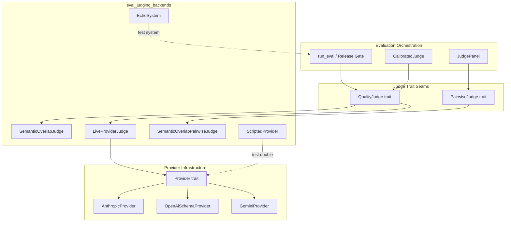
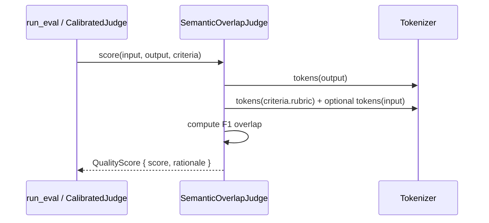
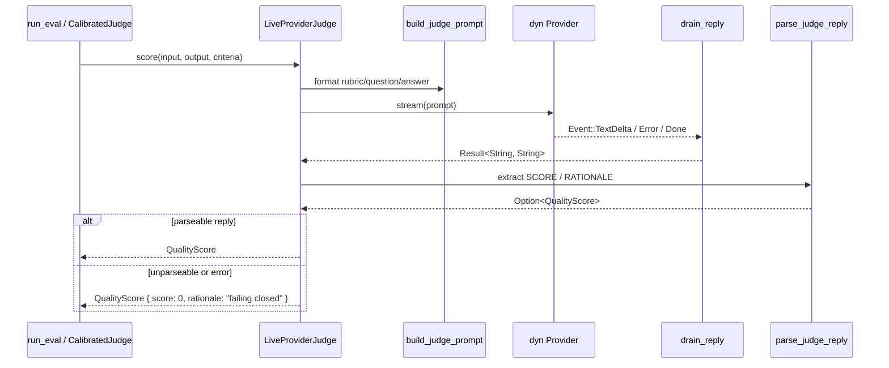
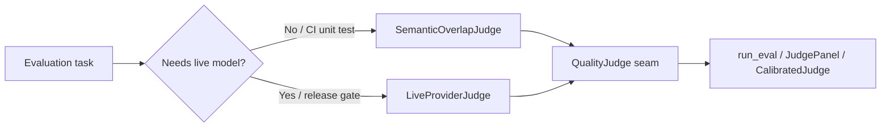
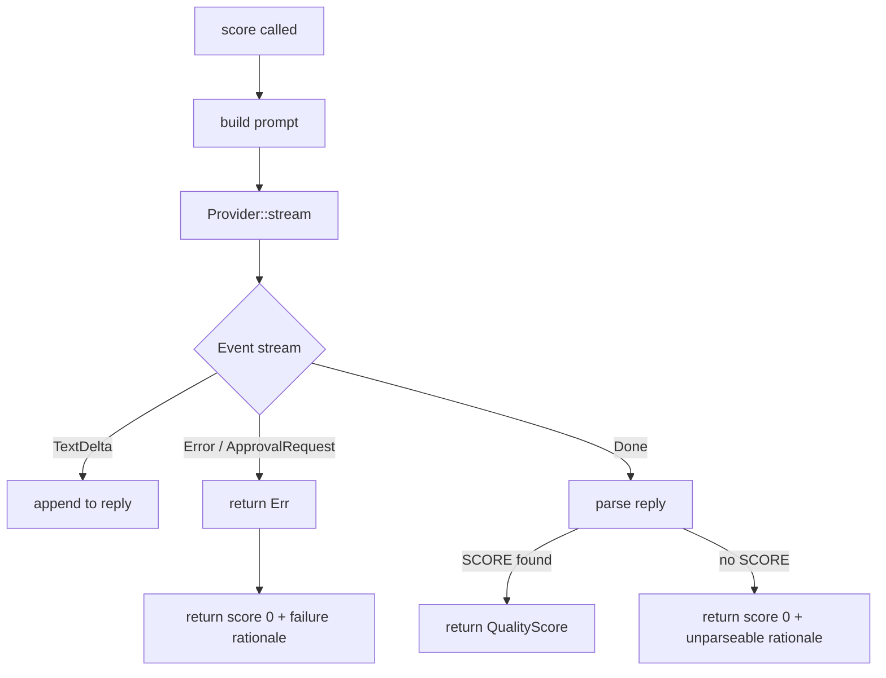
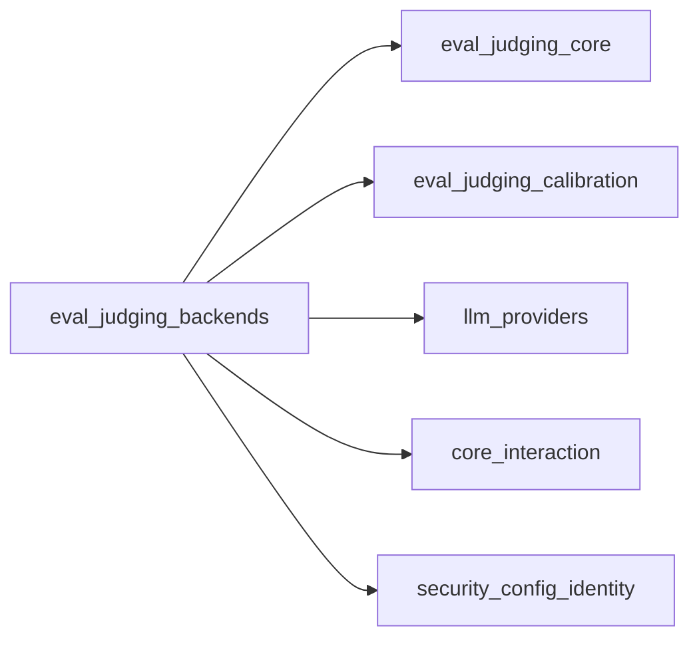

# eval_judging_backends

The `eval_judging_backends` module provides the concrete scoring implementations behind the evaluation platform's judge seams. It contains both an **offline, deterministic semantic-overlap judge** for reproducible testing without model infrastructure, and a **live provider-backed judge** that routes scoring requests through the same provider adapters used by the production runtime. Both implementations plug into the same [`QualityJudge`](eval_judging_core.md) and [`PairwiseJudge`](eval_judging_calibration.md) trait seams, making the choice between offline simulation and live model evaluation a configuration-time decision.

---

## Overview

Evaluation in the AI engine depends on a family of judge traits defined in [`eval_judging_core`](eval_judging_core.md) and [`eval_judging_calibration`](eval_judging_calibration.md). The backends in this module are the interchangeable engines that satisfy those traits:

- **[`SemanticOverlapJudge`](#semanticoverlapjudge)** — a deterministic, dependency-free groundedness scorer used for offline CI gates, unit tests, and local development.
- **[`SemanticOverlapPairwiseJudge`](#semanticoverlappairwisejudge)** — a deterministic pairwise comparator built on the same overlap logic.
- **[`LiveProviderJudge`](#liveproviderjudge)** — the production-caliber backend that sends rubric-scoring prompts to a pinned LLM through any [`Provider`](llm_providers.md) adapter.
- **[`ScriptedProvider`](#scriptedprovider-and-echosystem)** — an in-memory test double for the provider seam.
- **[`EchoSystem`](#scriptedprovider-and-echosystem)** — a trivial [`EvalSystem`](eval_judging_core.md) used to exercise end-to-end evaluation wiring in tests.

The module's design goal is to keep the evaluation gate's orchestration logic independent of whether the judge is a cheap token-overlap heuristic or a calibrated, infrastructure-gated LLM reached over the network.

---

## Architecture



### Component responsibilities

| Component | Responsibility |
|-----------|----------------|
| `SemanticOverlapJudge` | Scores an answer against a rubric using token-set F1 overlap; no external dependencies. |
| `SemanticOverlapPairwiseJudge` | Compares two answers by applying `SemanticOverlapJudge` to each and returning `A`, `B`, or `Tie`. |
| `LiveProviderJudge` | Builds a rubric-scoring prompt, streams it through a `Provider`, parses the reply, and returns a `QualityScore`. |
| `ScriptedProvider` | In-memory `Provider` double that emits fixed `TextDelta` chunks for offline tests. |
| `EchoSystem` | In-memory `EvalSystem` double that echoes the input so `run_eval` can be exercised without a real model. |

---

## Core Components

### `SemanticOverlapJudge`

`SemanticOverlapJudge` is the offline stand-in for a pinned LLM judge. It tokenizes the answer and the grounding text (the rubric, optionally plus the input question) into lowercase alphanumeric word tokens of at least three characters, then computes the token-overlap F1 score scaled to 0–100.

- **Precision** penalizes hallucinated or unsupported answer tokens.
- **Recall** penalizes incomplete answers that miss rubric concepts.
- Empty grounding returns a neutral `50` (no signal).
- Empty answer returns `0`.

Because it is a pure function with no model, network, or file dependencies, it is ideal for deterministic CI tests and for exercising the `QualityJudge` seam without provisioning GPU or API keys.

### `SemanticOverlapPairwiseJudge`

`SemanticOverlapPairwiseJudge` wraps `SemanticOverlapJudge` to satisfy the `PairwiseJudge` trait. It scores both candidate answers independently and returns:

- `PairwiseVerdict::A` if `score_a` exceeds `score_b` by more than `tie_epsilon`.
- `PairwiseVerdict::B` if `score_b` exceeds `score_a` by more than `tie_epsilon`.
- `PairwiseVerdict::Tie` when the difference is within the tolerance.

The default `tie_epsilon` is `2` points. Because the comparison is a pure function of `(input, a, b, criteria)`, it has no position bias.

### `LiveProviderJudge`

`LiveProviderJudge` is the live scoring backend. It accepts any object-safe `dyn Provider` (for example the vendor adapters in [`llm_providers`](llm_providers.md)) and implements `QualityJudge` by:

1. Building a deterministic prompt via `build_judge_prompt`.
2. Calling `Provider::stream` inside a fresh current-thread Tokio runtime.
3. Draining the event stream with `drain_reply`.
4. Parsing the reply with `parse_judge_reply`.
5. Failing closed (`score: 0`) on provider errors or unparseable replies.

The prompt instructs the model to reply with exactly one line of the form:

```text
SCORE: <integer 0-100> RATIONALE: <one sentence>
```

`parse_judge_reply` scans for the first `SCORE:` token, clamps values above 100, and falls back to the full reply text if no `RATIONALE:` tag is present. It returns `None` for genuinely unparseable replies so the caller can distinguish a governance failure from a zero score.

`drain_reply` concatenates `TextDelta` events, ignores reasoning/tool/artifact/usage events, and fails closed on `Event::Error` or `ApprovalRequest`.

### `ScriptedProvider` and `EchoSystem`

These are test-only helpers:

- `ScriptedProvider` implements the `Provider` trait by spawning a Tokio task that emits a configured sequence of `Event::TextDelta` chunks followed by `Event::Done`. It mirrors the fixture-driven testing discipline used in `ainxt-providers`.
- `EchoSystem` implements the `EvalSystem` trait by returning `format!("answer for: {input}")`, allowing tests to verify that `LiveProviderJudge` plugs into `run_eval` unchanged.

---

## Data Flow

### Offline semantic scoring



### Live provider scoring



---

## Process Flows

### Choosing a judge backend



### Fail-closed behavior in `LiveProviderJudge`



---

## Dependencies

`eval_judging_backends` depends on the following modules and crates:

| Dependency | Role |
|------------|------|
| [`eval_judging_core`](eval_judging_core.md) | Provides `QualityJudge`, `EvalCriteria`, `QualityScore`, `EvalCase`, `EvalSystem`, and `run_eval`. |
| [`eval_judging_calibration`](eval_judging_calibration.md) | Provides `PairwiseJudge`, `PairwiseVerdict`, `CalibratedJudge`, and `JudgePanel`. |
| [`llm_providers`](llm_providers.md) | Provides concrete `Provider` adapters (`AnthropicProvider`, `OpenAiSchemaProvider`, `GeminiProvider`) and the `Provider` trait seam. |
| [`core_interaction`](core_interaction.md) | Provides the normalized `Event` enum consumed by `drain_reply`. |
| [`security_config_identity`](security_config_identity.md) | Provides `DataClass` used by `Provider::eligible`. |



---

## Integration with the System

This module sits at the bottom of the [`eval_judging`](eval_judging.md) hierarchy. Higher-level components such as `CalibratedJudge`, `JudgePanel`, and the release-gate pipeline in [`eval_pipeline`](eval_pipeline.md) consume judges only through the `QualityJudge` / `PairwiseJudge` traits. That means:

- A local developer running unit tests uses `SemanticOverlapJudge` and gets deterministic, fast feedback.
- A CI release gate can swap in `LiveProviderJudge` with a pinned `AnthropicProvider` or `OpenAiSchemaProvider` without changing any orchestration code.
- A pairwise A/B test can use `SemanticOverlapPairwiseJudge` offline or a calibrated pairwise LLM backend online through the same `PairwiseJudge` seam.

The module therefore bridges the gap between "evaluation logic that must be testable offline" and "evaluation scoring that must eventually be backed by a real, governed model."

---

## Key Design Decisions

1. **Trait seams, not concrete judges, are the public contract.** Both backends implement the same `QualityJudge` trait, so callers cannot accidentally depend on implementation-specific behavior.
2. **Offline judges are deterministic and dependency-free.** `SemanticOverlapJudge` uses a simple alphanumeric tokenizer and `BTreeSet` intersection so scores are reproducible across platforms.
3. **Live judges fail closed.** Any provider error, approval request, or unparseable reply yields a score of `0` with an explanatory rationale, preventing silent false passes.
4. **Prompt and parser are independently testable.** `build_judge_prompt` and `parse_judge_reply` are public free functions, enabling unit tests that do not need a running provider.
5. **Runtime isolation.** `LiveProviderJudge::score_blocking` creates a dedicated current-thread Tokio runtime per call, avoiding the panic that occurs when a provider's internal `tokio::spawn` runs outside an active runtime.

---

## References

- [`eval_judging_core`](eval_judging_core.md) — judge trait definitions and basic keyword judging.
- [`eval_judging_calibration`](eval_judging_calibration.md) — calibrated judges, panels, and pairwise verdicts.
- [`eval_judging_statistics`](eval_judging_statistics.md) — statistical aggregation of judge results.
- [`eval_judging_dogfood`](eval_judging_dogfood.md) — runtime dogfood and conformance testing of judges.
- [`eval_pipeline`](eval_pipeline.md) — release gates and evaluation orchestration.
- [`llm_providers`](llm_providers.md) — provider adapters consumed by `LiveProviderJudge`.
- [`core_interaction`](core_interaction.md) — protocol events and streaming primitives.
