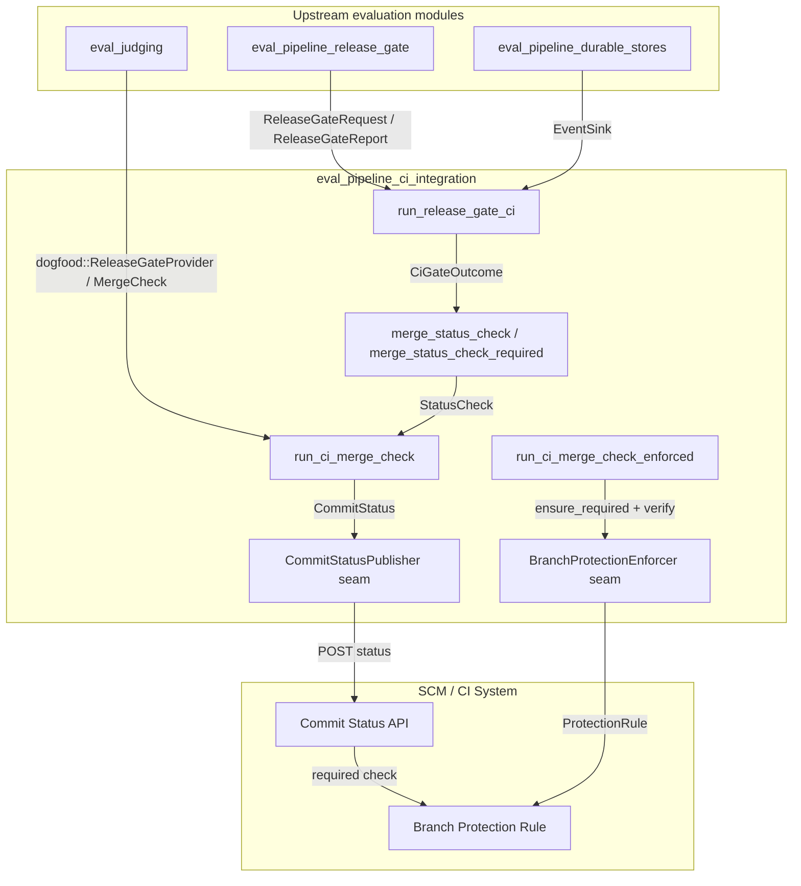
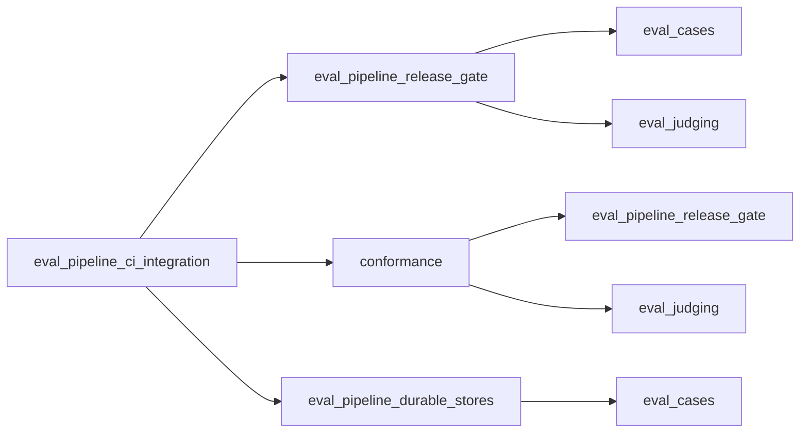
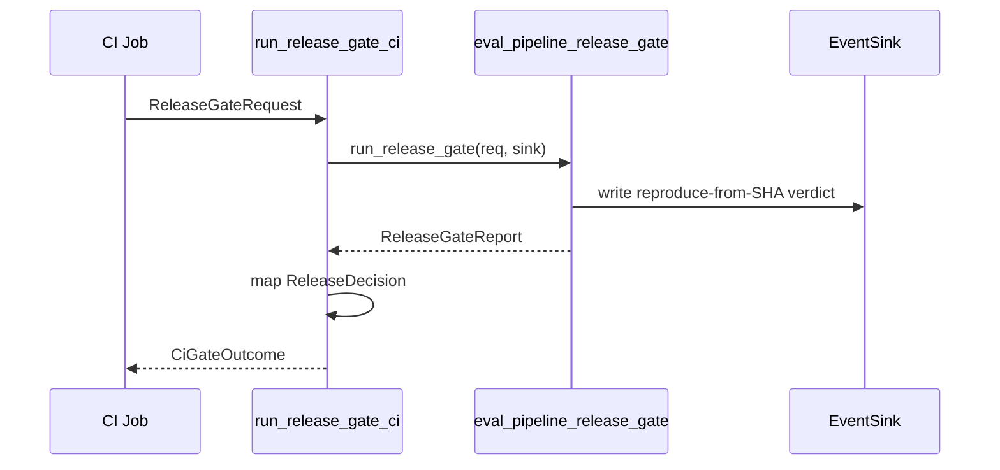
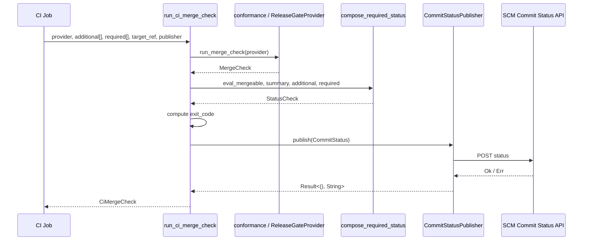
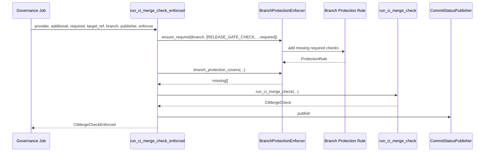
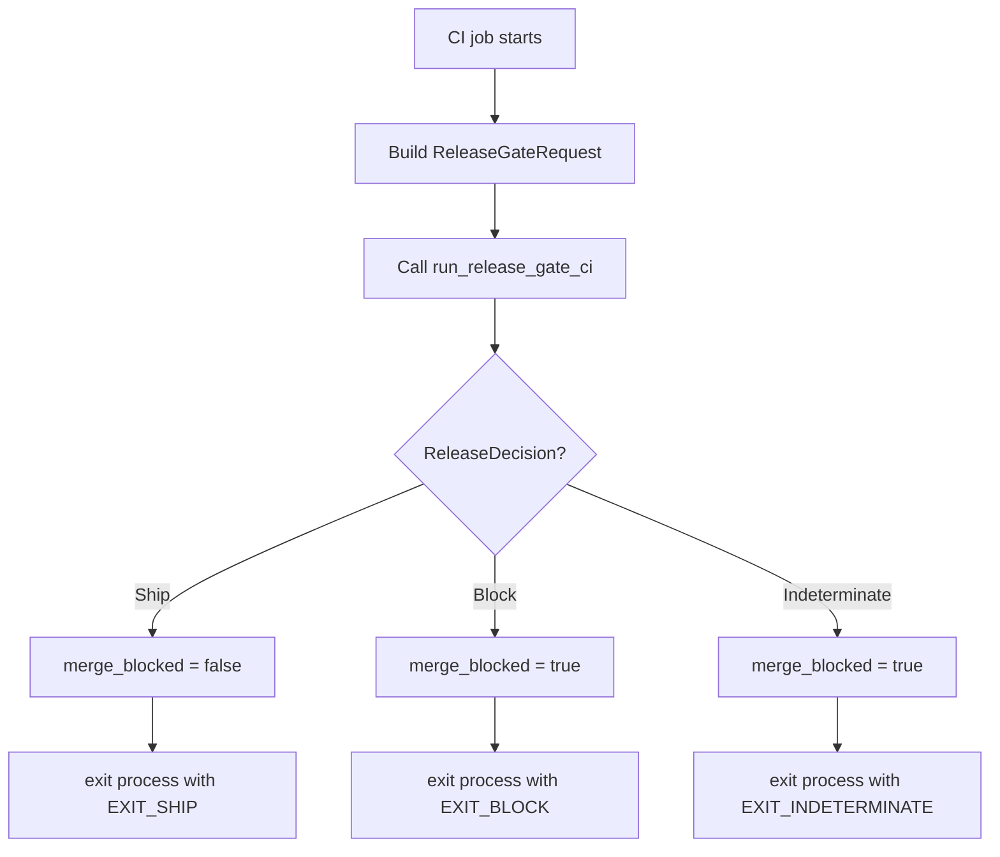
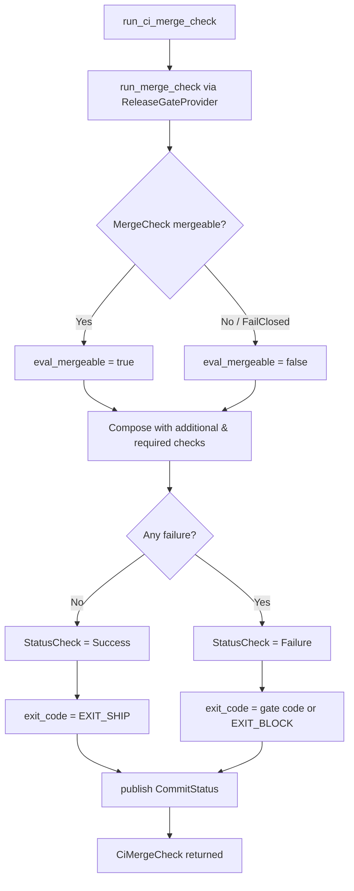
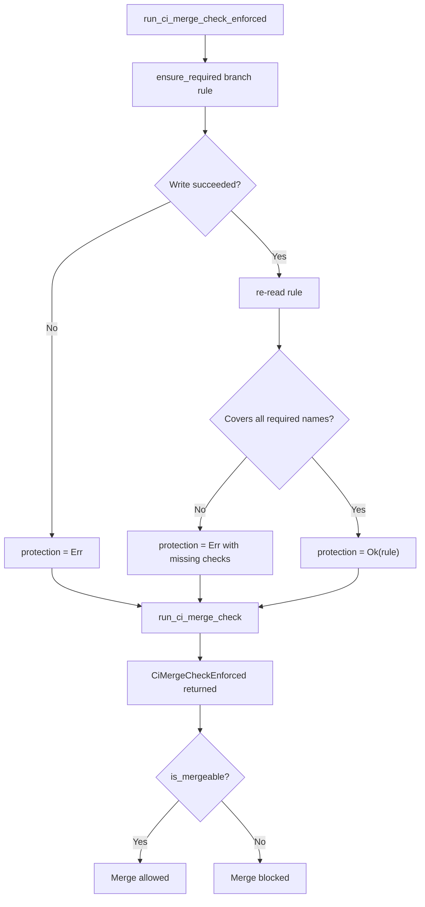

# eval_pipeline_ci_integration

The **CI integration layer** for the evaluation release gate. This module exposes the offline, statistically-valid release gate as a **merge-blocking CI status check** and, optionally, as an **enforced branch-protection rule**. It is the callable entrypoint that turns the internal [`ReleaseDecision`](eval_pipeline_release_gate.md) into the two things a CI system actually needs: a boolean merge-block verdict and a process exit code.

In short: the release gate proves a change does not regress quality; this module wires that proof into the SCM so that a regression cannot merge.

---

## Overview

The evaluation pipeline ([`eval_pipeline_release_gate`](eval_pipeline_release_gate.md)) produces a rigorous, reproducible verdict (`Ship`, `Block`, or `Indeterminate`) by composing sealed-corpus integrity checks, judge calibration, contamination scans, statistical gating, and regression-vault comparisons. Before this module existed, that verdict was only exercised from unit tests — there was no production surface a CI job could call.

`eval_pipeline_ci_integration` closes that gap with three layers:

1. **Gate-to-CI mapping** — `run_release_gate_ci` runs the real composed gate and maps `ReleaseDecision` to `CiGateOutcome`, including a fail-closed merge-block flag and a process exit code.
2. **Status-check composition & publishing** — `merge_status_check` / `merge_status_check_required` compose the eval gate with other required Definition-of-Done gates (e.g. the Scenario Matrix), and `run_ci_merge_check` publishes the composite status to the SCM commit-status API via the `CommitStatusPublisher` seam.
3. **Branch-protection enforcement** — `run_ci_merge_check_enforced` ensures the SCM branch-protection rule actually requires the named status check, so a posted `failed` status cannot be ignored.

The module is intentionally thin: all heavy evaluation logic lives in sibling modules, and only the CI-specific semantics (status vocabulary, fail-closed composition, SCM wire seams) live here.

---

## Architecture

### Component roles

| Component | Responsibility |
|-----------|----------------|
| `CiGateOutcome` | The CI-facing result of a release-gate run: merge-block flag, exit code, summary, and full report. |
| `StatusCheck` / `CheckState` | The named status-check vocabulary (`Pending`, `Success`, `Failure`) that branch protection understands. |
| `RequiredCheck` | An external required gate (e.g. Scenario Matrix) supplied by the CI job; fail-closed if missing or failed. |
| `merge_status_check` | Composes the eval gate with additional checks into the single `ainxt/release-gate` status. |
| `merge_status_check_required` | Strict variant: a required gate that is *absent* from the supplied list is treated as a hard failure. |
| `CommitStatus` | The payload posted to the SCM commit-status API, including target ref. |
| `CommitStatusPublisher` | Seam for the live SCM commit-status API; `RecordingStatusPublisher` is the offline deterministic stand-in. |
| `CiMergeCheck` | End-to-end result of `run_ci_merge_check`: status, merge-block, exit code, publish result, and underlying gate check. |
| `ProtectionRule` | The branch-protection rule listing required status checks. |
| `BranchProtectionEnforcer` | Seam to read and idempotently strengthen branch-protection rules; `RecordingBranchProtectionEnforcer` is the offline stand-in. |
| `CiMergeCheckEnforced` | Result of the fully enforced path: merge check plus confirmed protection rule. |

---

## Dependencies

- **[`eval_pipeline_release_gate`](eval_pipeline_release_gate.md)** — supplies `run_release_gate`, `ReleaseGateRequest`, `ReleaseGateReport`, and `ReleaseDecision`. This module does not reimplement gating; it only adapts the verdict.
- **[`conformance`](conformance.md)** — supplies the dogfood provider seam (`ReleaseGateProvider`, `run_merge_check`, `MergeCheck`) used by `run_ci_merge_check` to obtain a gate outcome through the production runtime path.
- **[`eval_pipeline_durable_stores`](eval_pipeline_durable_stores.md)** — supplies the `EventSink` seam used to write the reproduce-from-SHA verdict to the audit log before the decision is returned.

---

## Data Flow

### 1. Simple gate-to-CI mapping

`run_release_gate_ci` is the minimal entrypoint. It guarantees that the full composed gate runs and that the audit sink receives the verdict **before** the CI outcome is produced.

### 2. Composite status-check publishing

### 3. Fully enforced merge check

---

## Fail-Closed Semantics

The module is designed to be **fail-closed** in every direction:

| Condition | Merge blocked? | Exit code | Rationale |
|-----------|---------------|-----------|-----------|
| `ReleaseDecision::Ship` | No | `EXIT_SHIP` (0) | Explicit pass only. |
| `ReleaseDecision::Block` | Yes | `EXIT_BLOCK` (1) | Statistically-valid regression or integrity failure. |
| `ReleaseDecision::Indeterminate` | Yes | `EXIT_INDETERMINATE` (2) | Cancelled, over-budget, corpus unavailable — never treated as pass. |
| Required gate missing | Yes | `EXIT_BLOCK` | A gate that never reported cannot satisfy "both gates green by rule". |
| Required gate failed | Yes | `EXIT_BLOCK` | The other DoD gate regressed. |
| SCM publish failed | Yes | — | The required status never turns green; branch protection stays blocking. |
| Branch-protection enforcement failed | Yes | — | A `Success` status on an unprotected branch is not mergeable. |

---

## Process Flows

### Running the eval gate as a CI merge-check

### Publishing the composite required status

### Enforcing branch protection

---

## Integration Points

### CI job contract

A CI job (e.g. `cargo xtask eval-gate`) typically calls one of two entrypoints:

- **`run_release_gate_ci`** — when the job only needs the gate outcome and exit code.
- **`run_ci_merge_check_enforced`** — when the job must also publish a commit status and guarantee the branch-protection rule requires it.

Both return a process exit code that the CI job can pass directly to `std::process::exit` or return as `std::process::ExitCode`.

### SCM seams

The module defines two traits that the reserved server/daemon crates implement for live SCM interaction:

- `CommitStatusPublisher::publish` — posts a `CommitStatus` to the SCM commit-status API.
- `BranchProtectionEnforcer::ensure_required` — idempotently adds required checks to a branch-protection rule.

Offline deterministic implementations (`RecordingStatusPublisher`, `RecordingBranchProtectionEnforcer`) are provided for tests and dry-runs.

### Required DoD gates

The composite status check can include any number of `RequiredCheck` results. By convention the Scenario Matrix check ([`SCENARIO_MATRIX_CHECK`]) is always required, reflecting the operating-system rule that "nothing ships until it passes both gates" — the eval gate (quality) and the scenario matrix (safety/correctness).

---

## Relationship to the System

`eval_pipeline_ci_integration` sits at the boundary between the **evaluation/testing subsystem** and the **CI/CD subsystem**. It does not perform evaluation itself; it is the adapter that makes the evaluation subsystem's verdict actionable by external merge automation.

Upstream modules of interest:

- [`eval_pipeline_release_gate`](eval_pipeline_release_gate.md) — the composed release-gate logic this module exposes.
- [`eval_cases`](eval_cases.md), [`eval_judging`](eval_judging.md) — the cases and judges consumed by the release gate.
- [`conformance`](conformance.md) — the dogfood provider that runs the gate through the production runtime.
- [`eval_pipeline_durable_stores`](eval_pipeline_durable_stores.md) — the durable audit/event-log sink.

---

## Key Design Decisions

1. **Fail-closed by default.** Only an explicit `Ship` is mergeable; every other state blocks.
2. **No stand-ins.** `run_release_gate_ci` calls the real `run_release_gate`, not a simplified aggregate gate.
3. **Audit-first.** The reproduce-from-SHA verdict is written to the `EventSink` before the CI outcome is returned.
4. **Separation of decision and enforcement.** `run_ci_merge_check` computes and publishes the status; `run_ci_merge_check_enforced` additionally verifies the branch-protection rule.
5. **Offline-provable seams.** Live SCM calls are behind traits with deterministic in-memory implementations, so the merge-blocking logic can be tested without network access.
