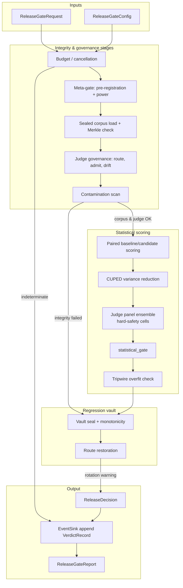
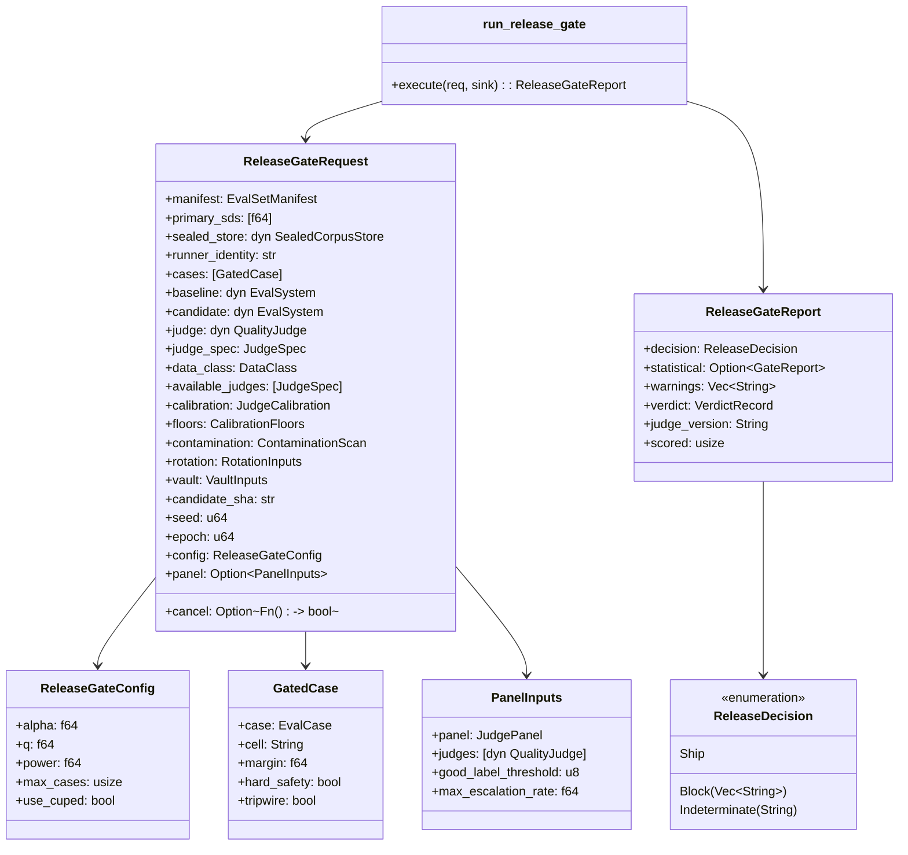
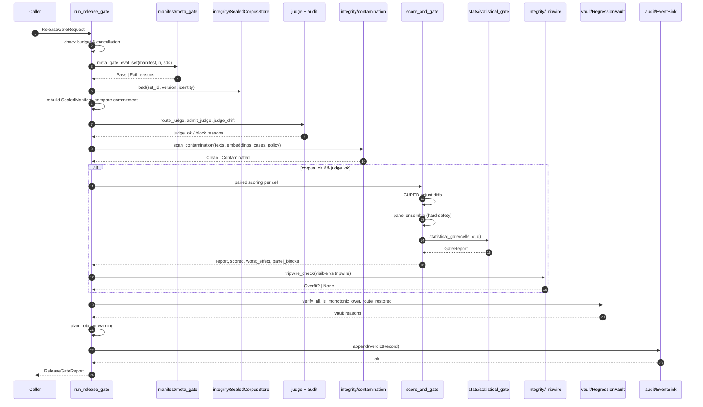
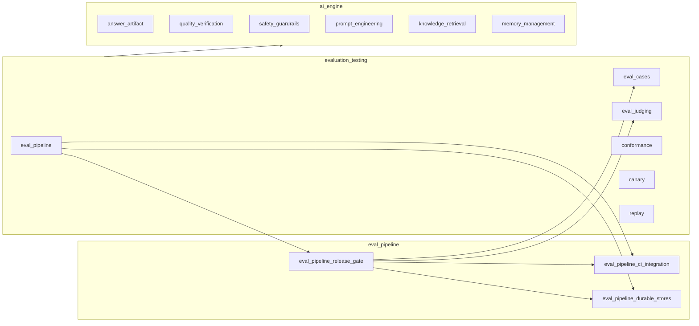

# eval_pipeline_release_gate

The **Release Gate** is the merge-blocking evaluation pipeline that decides whether a candidate change to an AI system may ship. It replaces naive pass-rate arithmetic with a statistically valid, fail-closed, auditable composition of the evaluation primitives defined across the `ainxt-eval` crate. A single entrypoint, `run_release_gate`, orchestrates budget checks, pre-registration validation, sealed-corpus integrity, judge governance, contamination scanning, paired statistical testing, overfit detection, regression-vault verification, and rotation hygiene, writing a reproduce-from-SHA verdict to the Event Log before returning a `Ship`, `Block`, or `Indeterminate` decision.

---

## Core responsibilities

- **Fail-closed ship decision.** Any stage that cannot be evaluated, any integrity failure, or any significant per-cell regression blocks the change. Cancelled or over-budget runs are `Indeterminate`, never a silent pass.
- **Statistical validity.** The ship decision is based on per-cell paired non-inferiority tests with FDR (Benjamini–Hochberg) control for ordinary cells and family-wise (Holm) control for hard-safety cells, not on aggregate pass-rate comparisons.
- **Integrity and contamination defense.** The pipeline verifies the sealed corpus content commitment, checks that the candidate has not memorized eval cases, and ensures the scoring Judge is admitted, routed correctly, and not silently drifting.
- **Auditability.** A deterministic `VerdictRecord` is written to an `EventSink` before the decision is returned, keyed by candidate SHA, eval-set identity, judge version, and a hash of the analysis parameters.
- **Enterprise operability.** Supports cooperative cancellation, per-run case budgets, CUPED variance reduction, optional Judge panels for hard-safety cells, and non-blocking rotation warnings.

---

## Architecture

### Component map

---

## Data flow

---

## Component relationships

### Within `ainxt-eval`

| Component | Role in the release gate | See also |
|-----------|--------------------------|----------|
| `run_release_gate` | Single composed entrypoint that runs all stages and returns a `ReleaseGateReport`. | — |
| `ReleaseGateRequest` | Value object carrying every input and trait seam required for a run. | — |
| `ReleaseGateConfig` | Statistical and operational parameters (α, FDR q, power, case budget, CUPED toggle). | — |
| `GatedCase` | An `EvalCase` annotated with its metric cell, non-inferiority margin, hard-safety flag, and tripwire flag. | [eval_cases.md](eval_cases.md) |
| `PanelInputs` | Optional hard-safety Judge panel configuration. | [eval_judging.md](eval_judging.md) |
| `score_and_gate` | Paired scoring loop, CUPED adjustment, panel aggregation, and statistical gate invocation. | [eval_judging.md](eval_judging.md), [eval_pipeline_stats.md](eval_pipeline_stats.md) |
| `statistical_gate` | Per-cell non-inferiority testing with FDR / Holm correction. | [eval_pipeline_stats.md](eval_pipeline_stats.md) |
| `meta_gate_eval_set` | Validates pre-registration and checks statistical power. | [eval_pipeline_manifest.md](eval_pipeline_manifest.md) |
| `SealedCorpusStore` / `SealedManifest` | Loads the gold corpus and verifies its Merkle content commitment. | [eval_pipeline_integrity.md](eval_pipeline_integrity.md) |
| `route_judge`, `admit_judge`, `judge_drift` | Judge routing, admission against gold labels, and silent-swap drift detection. | [eval_judging.md](eval_judging.md) |
| `scan_contamination` | Detects candidate memorization of eval cases via n-gram and embedding overlap. | [eval_pipeline_integrity.md](eval_pipeline_integrity.md) |
| `Tripwire` | Overfit detector comparing visible-case and sealed tripwire-case performance. | [eval_pipeline_integrity.md](eval_pipeline_integrity.md) |
| `RegressionVault` | Frozen regression cases; verifies seal integrity, monotonicity, and route restoration. | [eval_pipeline_durable_stores.md](eval_pipeline_durable_stores.md) |
| `VerdictRecord` / `EventSink` | Deterministic, reproduce-from-SHA audit record written before the decision returns. | [eval_pipeline_durable_stores.md](eval_pipeline_durable_stores.md) |
| `run_release_gate_ci` / `merge_status_check` | CI adapter that turns the report into a merge-blocking status check. | [eval_pipeline_ci_integration.md](eval_pipeline_ci_integration.md) |

### Upstream consumers

The release gate is the **composition keystone** of `eval_pipeline`. It consumes primitives from `eval_cases` (the eval-set manifest and gated cases), `eval_judging` (Judge admission, drift, panels, and statistical testing), `eval_pipeline_durable_stores` (sealed corpus, regression vault, verdict records), and `eval_pipeline_ci_integration` (merge-blocking status checks). It does not duplicate those concerns; it wires them into a single fail-closed decision.

---

## Process flow

### 1. Budget and cancellation (fail-closed)

Before any expensive work, `run_release_gate` checks:

- `config.max_cases` — if non-zero and the request has more cases, the run is `Indeterminate`.
- `cancel` callback — if present and returns `true`, the run is `Indeterminate`.

Both paths still write a `VerdictRecord` with outcome `"indeterminate"` so that an aborted run is auditable.

### 2. Meta-gate

`meta_gate_eval_set` validates the `EvalSetManifest` pre-registration and checks that the set is powered to detect its declared minimum detectable effect (MDE) given the supplied per-metric sample standard deviations and the number of non-tripwire cases per arm. An underpowered or malformed set blocks immediately.

### 3. Sealed corpus integrity

The pipeline loads the corpus from `sealed_store` using the runner identity. A non-runner identity is refused. If the store returns cases, the pipeline rebuilds a `SealedManifest` and compares its `content_commitment` (Merkle root) to the manifest. A mismatch indicates tampering or corpus swap and blocks.

### 4. Judge governance

Three checks run in sequence:

1. **Routing** — `route_judge` selects an eligible Judge for the dimension. Regulated data classes require an in-house-only Judge; absence blocks.
2. **Admission** — `admit_judge` compares the Judge's calibration labels to human gold labels using Cohen's κ and balanced accuracy against `CalibrationFloors`.
3. **Drift** — `judge_drift` re-audits the Judge on the same gold set and quarantines it if κ has dropped more than `max_kappa_drop` (silent provider model swap detection).

### 5. Contamination scan

`scan_contamination` compares candidate texts and embeddings against the sealed eval-case content. Any n-gram or embedding overlap above the configured thresholds blocks as a memorization defect.

### 6. Statistical gate (scoring only if integrity passed)

If the corpus and Judge are trustworthy, `score_and_gate` runs:

- For each non-tripwire case, call `baseline.respond` and `candidate.respond`.
- Score both outputs with the Judge.
- For hard-safety cells with a panel, replace the single-Judge candidate score with the panel ensemble median and record `PanelVerdict`s.
- Build per-cell `MetricCell` objects of `candidate − baseline` diffs.
- Apply CUPED variance reduction using the baseline score as the covariate when `use_cuped` is true.
- Invoke `statistical_gate` with α (Holm for hard-safety) and q (Benjamini–Hochberg for ordinary cells).
- Check for panel systematic disagreement on hard-safety cells; a batch escalation rate above `max_escalation_rate` blocks.

### 7. Overfit tripwire

`tripwire_check` compares the candidate's mean score on visible (non-tripwire) cases to its mean score on the sealed tripwire slice. A drop larger than the tripwire threshold blocks as overfitting.

### 8. Regression vault

The pipeline verifies:

- `vault.verify_all()` — no tampered vault cases.
- `vault.is_monotonic_over(prior)` — if a prior snapshot is supplied, no frozen case was dropped.
- `route_restored(previously_tripped, now_passing)` — any previously tripped route must now pass all its frozen vault cases.

### 9. Rotation hygiene

`plan_rotation` identifies holdout cases that are too old or too heavily used. Rotation-due cases are surfaced as non-blocking warnings.

### 10. Finalize and audit

All block reasons are collected, sorted, and deduplicated. The decision is:

- `Ship` if no reasons exist.
- `Block(reasons)` otherwise.
- `Indeterminate` only if the run was cancelled or over budget.

`build_verdict` constructs a deterministic `VerdictRecord` from the eval-set identity, judge version, candidate SHA, parameter hash, seed, dimension, outcome, worst effect, and epoch. The record is appended to `sink` **before** the `ReleaseGateReport` is returned.

---

## Key design decisions

- **Fail-closed composition.** Every integrity stage feeds a single `block_reasons` vector. Scoring is skipped if the corpus or Judge is untrusted, so a block cannot be accidentally overridden by a passing score.
- **Paired design.** Each case is run through both baseline and candidate, producing paired differences. This controls case-level variance and enables CUPED.
- **Cell-level testing.** Cases are grouped by `metric × model_family × category`. Each cell is tested independently, with appropriate multiple-testing correction.
- **Hard-safety panels.** Optional `PanelInputs` allow model-diverse Judge panels for safety-critical cells. The median score enters the cell, and systematic disagreement blocks the gate.
- **Reproduce-from-SHA.** The verdict record is deterministic and keyed by the candidate commit SHA, enabling later replay and dispute resolution.

---

## Integration with CI

The release gate is invoked from CI via `run_release_gate_ci` in the `ci` module. That adapter returns a `CiGateOutcome` with a merge-blocking flag, exit code, and summary. `merge_status_check` composes the eval outcome with additional required checks (for example, the scenario matrix) so that a PR cannot merge unless **both** the eval gate and the safety scenario matrix pass. See [eval_pipeline_ci_integration.md](eval_pipeline_ci_integration.md) for details.

---

## References

- [eval_cases.md](eval_cases.md) — eval-case definitions, manifests, and integrity content.
- [eval_judging.md](eval_judging.md) — Judge admission, drift, panels, and scoring.
- [eval_pipeline_stats.md](eval_pipeline_stats.md) — `statistical_gate`, CUPED, and cell-level testing.
- [eval_pipeline_integrity.md](eval_pipeline_integrity.md) — sealed corpus, contamination scanning, and tripwire.
- [eval_pipeline_durable_stores.md](eval_pipeline_durable_stores.md) — regression vault and verdict records.
- [eval_pipeline_ci_integration.md](eval_pipeline_ci_integration.md) — CI adapters and merge-blocking status checks.
- [conformance.md](conformance.md) — runtime conformance and dogfood testing.
- [canary.md](canary.md) — canary traffic-split validation.
- [replay.md](replay.md) — deterministic replay and drift detection.
