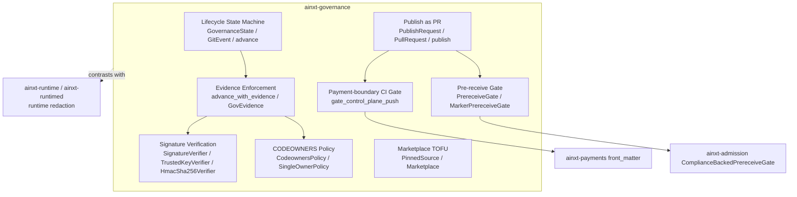
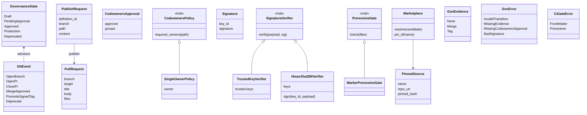
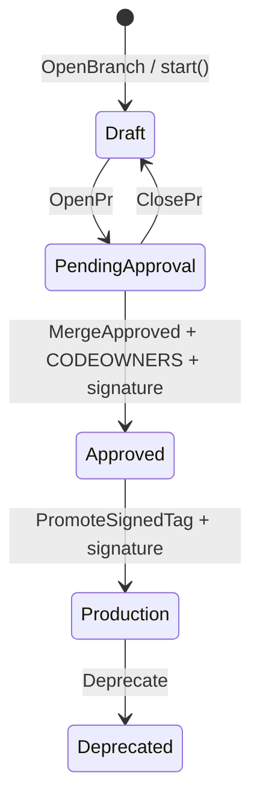
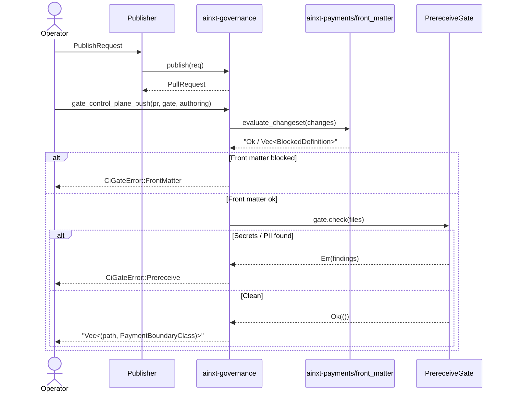
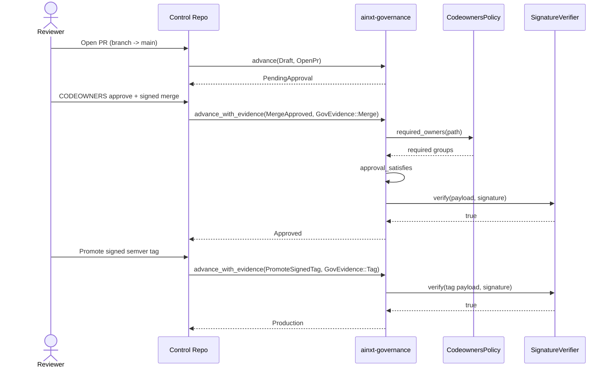
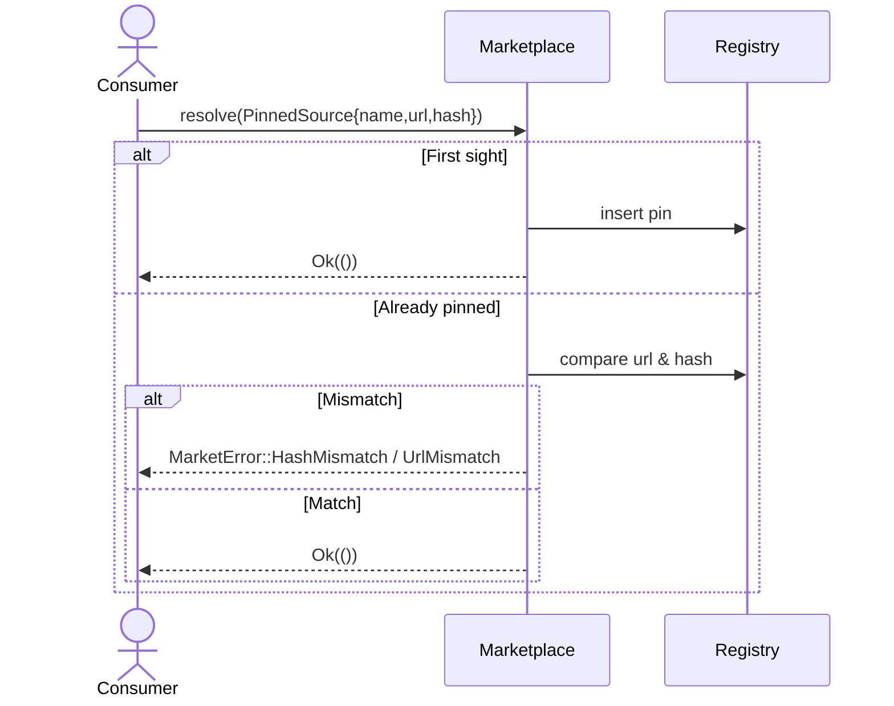

# Governance Module

The **governance** module (`ainxt-governance`) implements the git-native control plane for the AI system. It governs the lifecycle of definitions such as harnesses, skills, agents, roles, and policies by mapping every state change onto git primitives (branches, pull requests, signed merge commits, and signed semver tags) rather than mutable database rows.

The module is intentionally pure and testable: it contains no database writes, no network I/O, and only a minimal cryptographic dependency (`sha2` for the optional HMAC-SHA256 verifier). All real-world side effects happen in the composition roots of the surrounding crates that call into this library.

## Core Responsibilities

- **Git-native lifecycle state machine** — `GovernanceState`, `GitEvent`, and the `advance` / `advance_with_evidence` functions encode the only valid transitions for a definition.
- **CODEOWNERS + signature enforcement** — Merges and promotions require both CODEOWNERS approval and a verified cryptographic signature.
- **Publishing as a pull request** — `publish` emits a `PullRequest` descriptor; the artifact of publishing is a PR, never a database row.
- **Pre-receive blocking gate** — `PrereceiveGate` rejects pushes that contain PII or secrets, because git history is permanent.
- **Payment-boundary CI gate** — `gate_control_plane_push` delegates front-matter validation to [`ainxt-payments`](payments.md) and blocks unauthorized payment-adjacent changes.
- **Trust-on-first-use marketplace** — `Marketplace` pins git sources by URL and content hash on first sight and rejects repointed or tampered dependencies.

## Architecture

### Component Model

## Lifecycle State Machine

Every definition starts as a branch (`Draft`), moves through an open PR (`PendingApproval`), is merged to `main` (`Approved`), promoted via a signed semver tag (`Production`), and can finally be retired (`Deprecated`).

The pure transition function `advance(state, event)` validates only the label-level transition. The enforcement function `advance_with_evidence` adds the real gates:

- `MergeApproved` requires `GovEvidence::Merge` with a `CodeownersApproval` that satisfies the path's required owners and a `Signature` that verifies against the merge payload.
- `PromoteSignedTag` requires `GovEvidence::Tag` with a verified tag signature.
- All other transitions are label-only and accept `GovEvidence::None`.

This design keeps the state machine testable while making the enforced path cryptographically and organizationally binding.

## Publishing Flow

Publishing never writes a database row. It returns a `PullRequest` descriptor that a caller opens on the control repository.

The payment-boundary gate is fail-closed: it parses each file's `payment_boundary` front-matter, rejects the reserved `payment-initiating` value and any unknown value, and requires payments-council CODEOWNERS approval plus a signed commit for payment-adjacent definitions. The policy core lives in [`ainxt-payments`](payments.md); governance only orchestrates the call and surfaces every offending file in the push.

## Merge and Promotion Enforcement

### Signature Verification

`SignatureVerifier` is a seam. The crate ships two implementations:

- `TrustedKeyVerifier` — a deterministic placeholder for tests and OSS deployments. It is **not** real cryptography, but it is a non-tautological check: an untrusted key or a forged string is rejected.
- `HmacSha256Verifier` — a real keyed-MAC verifier built on `sha2::Sha256`. It uses constant-time comparison and is strictly stronger than the placeholder, while still allowing an enterprise plugin to swap in detached GPG/SSH/sigstore verification behind the same trait.

## Pre-receive Gate

The pre-receive gate is the boundary between the mutable world and permanent git history. Unlike the runtime layer, which may redact and proceed, this gate **blocks** any push that carries PII or secrets.

- `MarkerPrereceiveGate` is the OSS deterministic implementation. It rejects digit runs of 12 or more characters and known secret markers such as `PAN=`, `SECRET=`, `API_KEY=`, `TOKEN=`, and `PRIVATE KEY`.
- Production deployments can inject a compliance-backed gate, such as [`ComplianceBackedPrereceiveGate`](admission.md), behind the `PrereceiveGate` trait.

## Marketplace

The `Marketplace` provides supply-chain integrity for external definitions by pinning each source on first use:

A repointed URL or a changed hash is rejected, preventing tampered or unexpectedly updated dependencies from entering the system.

## Dependencies and Integration

| Dependency | Role | Documentation |
|------------|------|---------------|
| `ainxt-payments` | Payment-boundary front-matter parsing and authoring authorization. | [payments](payments.md) |
| `ainxt-admission` | Compliance-backed pre-receive gate implementation. | [admission](admission.md) |
| `sha2` | HMAC-SHA256 implementation for the OSS signature verifier. | — |
| `serde` | Serialization for `PullRequest` and `PinnedSource` descriptors. | — |

Governance sits upstream of the runtime: it decides what definitions are allowed to reach `Approved` / `Production`, while the runtime engine ([runtime_engine](runtime_engine.md), [server_serving](server_serving.md)) enforces redaction, admission, and serving gates at execution time.

## Relationship to the Wider System

- **Identity & trust**: Signature verification can be upgraded to use the identity and attestation infrastructure provided by [`ainxt-identity`](identity.md).
- **Responsible AI**: Model cards, system cards, and governance records maintained by [`ainxt-responsibleai`](responsible_ai.md) can be pinned and promoted through the same lifecycle.
- **Lifecycle & compliance**: Retention, legal hold, DSAR, and erasure workflows are handled by [`ainxt-lifecycle`](lifecycle.md) and [`ainxt-compliance`](compliance.md); governance ensures the authoritative versions of those policies themselves are review-gated.
- **Incident response**: [`ainxt-incident`](incident.md) can consume the immutable audit trail produced by the signed lifecycle transitions.
- **Workforce & teams**: Role definitions published by [`ainxt-workforce`](workforce.md) and task handoffs managed by [`ainxt-teams`](teams.md) enter production through this governance module.
- **Testing**: Adversarial and scenario testing in [`scenario_service`](scenario_service.md) and [`injection_service`](injection_service.md) can reference governed definitions by their pinned hashes.

## Key Invariants

1. **Publish emits a PR, never a DB row.** Authoritative state changes are reviewable git events.
2. **The pre-receive gate blocks, it does not redact.** Git history is immutable, so leaked secrets must never land in it.
3. **Merges and promotions are never label-only.** CODEOWNERS approval and verified signatures are mandatory.
4. **Marketplace dependencies are trust-on-first-use pinned.** A changed URL or hash is rejected.
5. **The module is pure.** All I/O, storage, and enterprise crypto are injected by callers.
