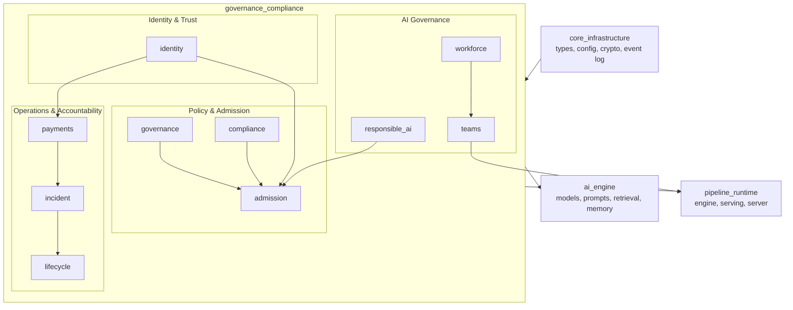
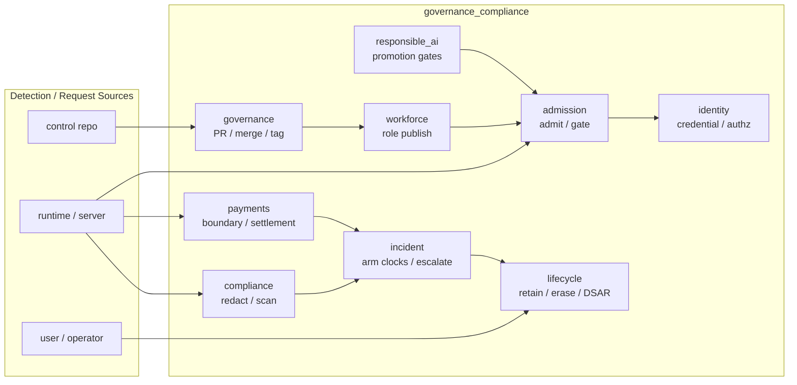

# `governance_compliance` Module Overview

## Purpose

The `governance_compliance` module is the **trust, policy, and accountability layer** of the Ainxt platform. It enforces the rules that keep autonomous AI workloads safe, compliant, and auditable in regulated environments such as financial infrastructure.

Its responsibilities span:

- **Admission & capability control** – deciding what a harness, role, or agent is allowed to run and access.
- **Data-loss prevention & redaction** – removing secrets, payment-card data, and PII before persistence or display.
- **Git-native governance** – managing the lifecycle of definitions through pull requests, CODEOWNERS, and signed commits.
- **Workload identity & attestation** – issuing short-lived, per-run credentials bound to human delegation and attestation.
- **Incident response** – arming statutory clocks, escalating breaches, and producing court-admissible evidence.
- **Data lifecycle** – enforcing retention, legal hold, and right-to-erasure workflows.
- **Payments boundary** – preventing autonomous value movement while supporting audited, human-authorized settlement.
- **Responsible AI** – gating model promotion on fairness, DPIA, outsourcing due diligence, and exit planning.
- **Workforce & teams** – governing digital roles, adversarial breaker gates, and multi-agent team orchestration.

All sub-modules are designed to be **pure, deterministic, and fail-closed**: they perform no I/O, use no wall clock or RNG, and inject all side effects through caller-supplied seams. This makes safety invariants fast to test and regulator-provable.

---

## Architecture

The module is organized into ten sub-modules, each owning a distinct governance surface:

| Sub-module | Responsibility |
|------------|----------------|
| [admission](admission.md) | Admit or deny harness execution based on capabilities, budgets, RBAC, data-class ceilings, and autonomy. |
| [compliance](compliance.md) | Generic DLP/redaction layer with `StrongRedactor`, `CompositeGate`, and durable `GuardedSink` write-path protection. |
| [governance](governance.md) | Git-native lifecycle for definitions: PRs, signed merges/tags, CODEOWNERS, pre-receive gates, and marketplace TOFU. |
| [identity](identity.md) | Per-run workload identity, OBO delegation, attestation, kill-switch, separation-of-duties, and transparency logging. |
| [incident](incident.md) | Statutory incident register, armed clocks, escalation ladder, evidence export, and tamper-evident event chain. |
| [lifecycle](lifecycle.md) | Retention policy, legal hold, DSAR workflow, guarded erasure, and break-glass redaction. |
| [payments](payments.md) | Payment-boundary authoring gate, egress settlement perimeter, settlement saga, and payment-adjacent mandates. |
| [responsible_ai](responsible_ai.md) | DPIA, model risk, bias/fairness, outsourcing, exit plans, and composed governance promotion gates. |
| [teams](teams.md) | Hierarchical multi-agent team scheduling, handoffs, 3-tier verification, cost accounting, and learning flywheel. |
| [workforce](workforce.md) | Digital role authoring, Breaker adversarial gate, role lifecycle controls, and runtime team assembly. |

---

## Data Flow

Typical flows:

1. **Publishing a role or harness** – `governance` validates the PR, `workforce` runs the Breaker gate, and `admission` enforces runtime capability/budget constraints.
2. **Running an agent** – `identity` issues a short-lived credential, `admission` gates each step, `compliance` redacts outputs, and `payments` blocks unauthorized value movement.
3. **Detecting a breach** – `compliance` or `payments` raises an `IncidentCandidate`, `incident` arms statutory clocks and escalates, and `lifecycle` preserves or erases evidence under legal hold.

---

## Core Components Documentation

- **[admission.md](admission.md)** – `HarnessManifest`, `HarnessRuntime`, `HarnessRegistry`, lint, approval/HITL, and compliance-backed execution.
- **[compliance.md](compliance.md)** – `StrongRedactor`, `RedactorConfig`, `CompositeGate`, `SinkGuard`, `GuardedSink`, and PCI scope reduction.
- **[governance.md](governance.md)** – `GovernanceState`, `PullRequest`, `Marketplace`, `PrereceiveGate`, signature verification, and payment-boundary CI gate.
- **[identity.md](identity.md)** – `AgentWorkloadCredential`, `IdentityAuthority`, `ControlPlane`, `RunAuthorization`, separation-of-duties, and transparency log.
- **[incident.md](incident.md)** – `IncidentRegister`, `StatutoryClock`, `ArmingPolicy`, evidence export, and BSA §763 report drafting.
- **[lifecycle.md](lifecycle.md)** – `RecordStore`, `RetentionPolicy`, `LegalHold`, DSAR workflow, `GuardedErasure`, and `BreakGlassProgram`.
- **[payments.md](payments.md)** – `PaymentBoundary`, `SettlementCoordinator`, `PolicyGate`, `PaymentAdjacentMandate`, and front-matter enforcement.
- **[responsible_ai.md](responsible_ai.md)** – `ModelCard`, `SystemCard`, `DpiaCiGate`, `GovernancePromotionGate`, outsourcing register, and exit plans.
- **[teams.md](teams.md)** – `TaskGraph`, `RunReport`, 3-tier loop, `HandoffContract`, cost accounting, and learning flywheel.
- **[workforce.md](workforce.md)** – `RoleSpec`, `PublishedRole`, `RoleStudio`, `Breaker`, lifecycle controls, and `DigitalTeam`.

---

## Key Invariants

1. **Fail-closed by default** – missing capabilities, unknown data classes, unregistered renderers, and unrecognized payment boundaries are denied.
2. **Least privilege** – effective capabilities are the intersection of requested, granted, and principal-held sets.
3. **No autonomous value movement** – payment-initiating definitions are rejected at authoring time; payment-adjacent writes require human mandates.
4. **Immutable audit trail** – governance merges, incident events, erasure attestations, and identity issuances are hash-chained or signed.
5. **Pure & deterministic cores** – decision functions depend only on injected state and logical time, enabling reproducible testing and regulator-proof replay.
6. **Redact-and-proceed** – sensitive data is removed before persistence or display; the runtime never hard-blocks ordinary content.
7. **Per-run identity** – credentials are short-lived and unique per execution, with revocation and kill-switch reaching in-flight dispatches.