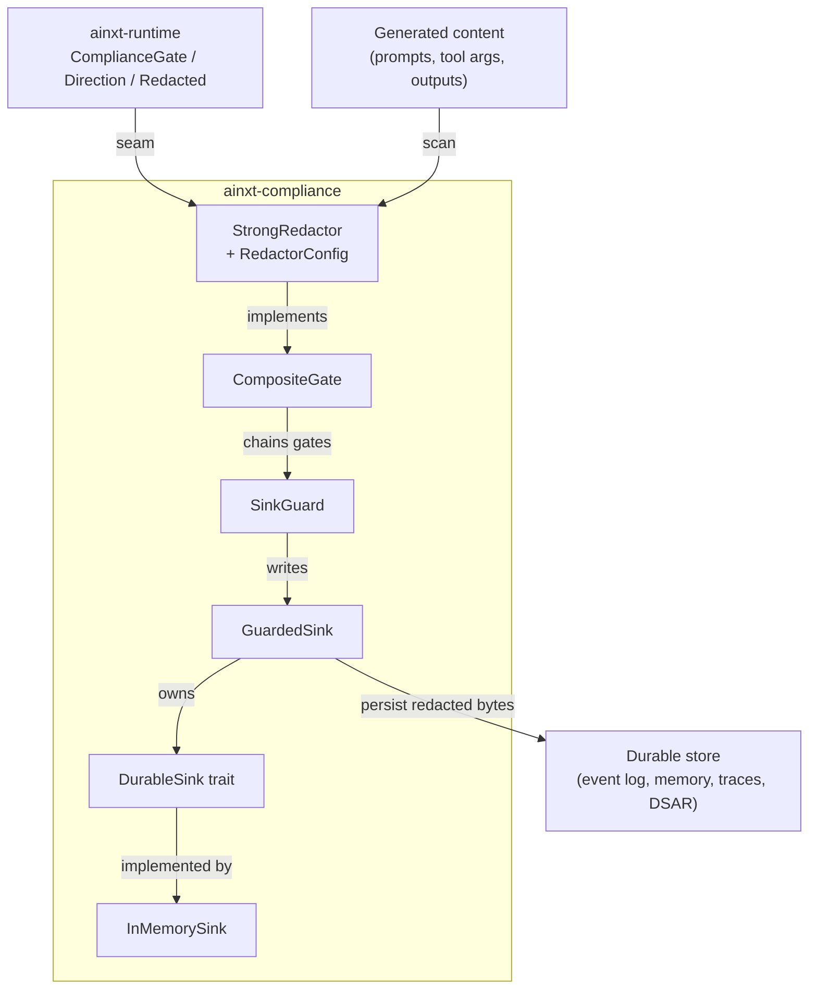
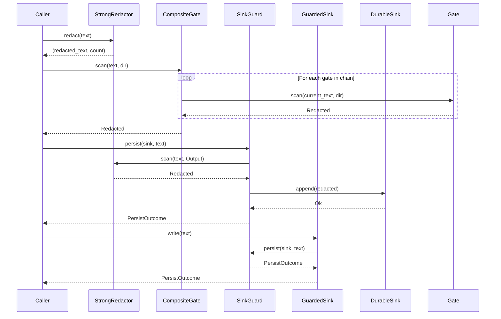
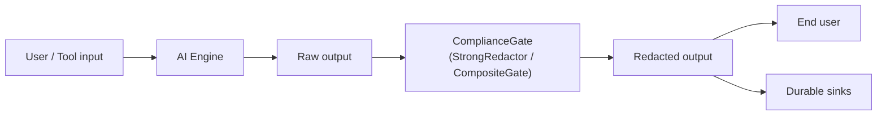
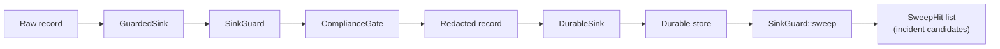
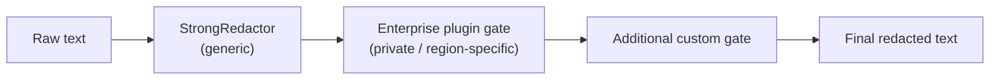
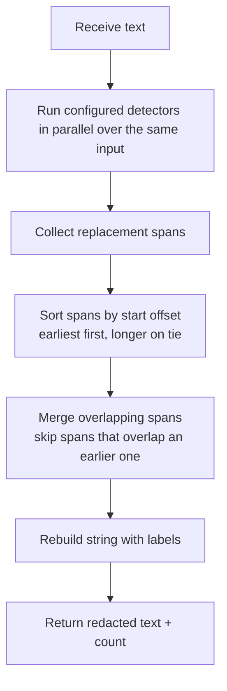
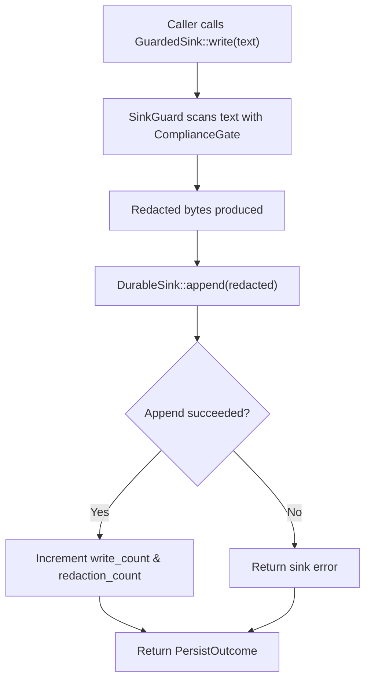
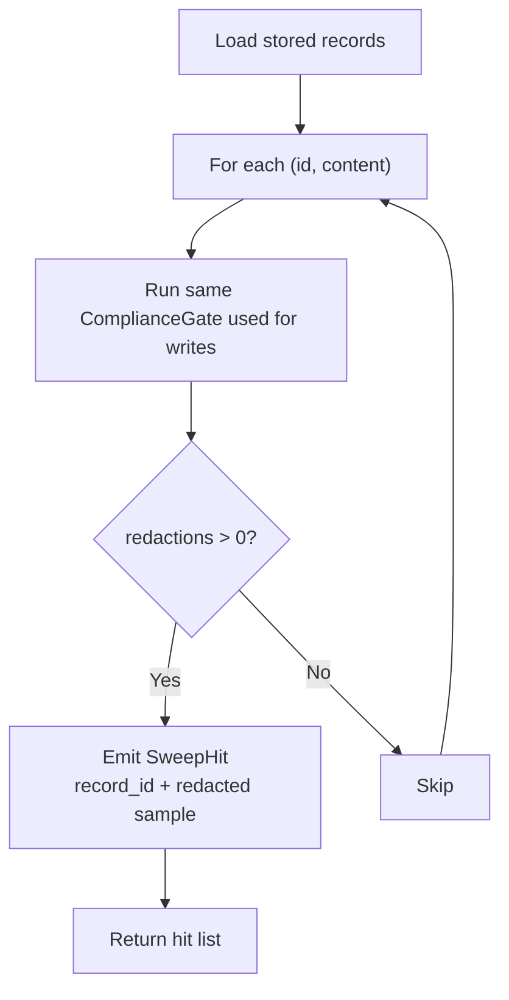

# Compliance Module

The **Compliance** module (`ainxt-compliance`) provides a strong, generic data-loss-prevention (DLP) and redaction layer that closes the recall gaps left by the runtime's placeholder redactor. It implements the mandatory `ComplianceGate` seam from `ainxt-runtime` with a detector set that redacts payment-card numbers, secrets, bearer tokens, credential prefixes, emails, CVVs, and high-entropy tokens. The module also supplies write-path sink guards and an enforced durable-sink wrapper so that cardholder data (CHD) and secrets are removed *before* bytes ever reach a durable store.

This module is part of the larger [`governance_compliance`](governance_compliance.md) subsystem. It sits downstream of content generation and upstream of every durable sink (event log, memory, vector index, traces, DSAR exports, incident registers), giving the system a single, auditable redaction seam.

---

## Table of Contents

1. [Purpose and Core Functionality](#purpose-and-core-functionality)
2. [Architecture](#architecture)
3. [Component Reference](#component-reference)
4. [Data Flow](#data-flow)
5. [Process Flows](#process-flows)
6. [Dependencies and Integration](#dependencies-and-integration)
7. [Configuration](#configuration)
8. [Security and Compliance Posture](#security-and-compliance-posture)

---

## Purpose and Core Functionality

`ainxt-compliance` has three responsibilities:

1. **Strong generic redaction** — `StrongRedactor` replaces the runtime's deliberately weak `RedactAndProceed` placeholder. It detects:
   - Luhn-valid payment cards, including spaced and hyphenated PANs.
   - Long contiguous digit runs (safety net for account/PAN-like numbers).
   - Marked secrets (`password=...`, `api_key: ...`, etc.), redacting the *value* while keeping the marker.
   - `Authorization: Bearer <token>` headers.
   - Publicly documented credential prefixes (`AKIA…`, `ghp_…`, `sk-…`, `xox…`, `AIza…`).
   - Context-gated CVV/CVC values.
   - RFC-shaped email addresses.
   - High-entropy standalone tokens (Shannon bits-per-char threshold).

2. **Composable detector chains** — `CompositeGate` chains any number of `ComplianceGate` implementations, scanning the redacted output of each gate in sequence. This is the core/enterprise split seam: the open-source tree ships only generic detectors, while private enterprise plugins (for example, NPCI-specific CHD/PII patterns) can extend the chain without modifying this crate.

3. **Durable-sink write-path protection** — `SinkGuard` and `GuardedSink` ensure CHD/secrets are redacted *before* persistence. `GuardedSink` structurally prevents raw writes by owning the inner sink and exposing only a guarded `write` path. A defense-in-depth `sweep` can later prove that stored records are clean.

The module follows a **redact-and-proceed** mandate: every detector produces a replacement span and the text continues to flow. Blocking is avoided because it would cause day-one abandonment of the system.

---

## Architecture

The module is organized into four layers:

- **Detector layer** (`StrongRedactor`, `RedactorConfig`) — scans text and emits replacement spans.
- **Composition layer** (`CompositeGate`) — chains multiple `ComplianceGate` implementations.
- **Sink-guard layer** (`SinkGuard`, `DurableSink`, `InMemorySink`, `PersistOutcome`, `SweepHit`) — redacts before durable writes and sweeps stored records.
- **Enforced write layer** (`GuardedSink`) — wraps a `DurableSink` so that all writes go through the guard.



### Component Interaction



---

## Component Reference

### `StrongRedactor`

The primary `ComplianceGate` implementation. It is generic, international, and config-driven. All detectors default to **on**; individual detectors can be disabled through `RedactorConfig`, but the gate itself is mandatory.

Key methods:

- `new()` — all detectors enabled.
- `with_config(cfg: RedactorConfig)` — explicit configuration.
- `redact(text: &str) -> (String, usize)` — scan and replace spans.
- `scan(text: &str, dir: Direction) -> Redacted` — trait implementation.

### `RedactorConfig`

Toggles and thresholds for every detector:

| Field | Default | Meaning |
|-------|---------|---------|
| `cards` | `true` | Luhn-valid payment cards (separator-tolerant) |
| `long_digit_runs` | `true` | Contiguous long digit runs |
| `long_digit_run_min` | `12` | Minimum digit-run length |
| `marked_secrets` | `true` | `marker=value` / `marker: value` secrets |
| `prefixed_tokens` | `true` | Public credential prefixes |
| `bearer_tokens` | `true` | `Authorization: Bearer <token>` |
| `emails` | `true` | RFC-shaped email addresses |
| `cvv` | `true` | Context-gated CVV/CVC |
| `high_entropy` | `true` | Shannon-entropy tokens |
| `entropy_min_len` | `20` | Minimum token length for entropy scan |
| `entropy_bits_per_char` | `3.5` | Entropy threshold (bits per char) |

### `CompositeGate`

Chains `ComplianceGate` implementations. Each gate scans the redacted output of the previous gate. The total redaction count is the sum of all gates. An empty chain is a no-op.

Key methods:

- `new()` — empty chain.
- `with_strong()` — chain starting with `StrongRedactor`.
- `then(gate)` / `push(gate)` — append a gate.
- `scan(text, dir)` — run the chain.

### `SinkGuard<G: ComplianceGate>`

Write-path guard that redacts text before appending it to a `DurableSink`.

Key methods:

- `strong()` — full `StrongRedactor` guard.
- `cde()` — cardholder-data-only guard (PAN, long runs, CVV; keeps other text).
- `new(gate)` — custom gate.
- `persist(sink, text)` — redact then append.
- `would_redact(text)` — check if text still contains sensitive data.
- `sweep(records)` — defense-in-depth sweep of stored records.

### `GuardedSink<S: DurableSink, G: ComplianceGate>`

Enforced wrapper around a `DurableSink`. The inner sink is private; the only write path is `GuardedSink::write`, which redacts first. This gives a type-level guarantee that raw CHD cannot be appended.

Key methods:

- `strong(sink)` / `cde(sink)` — convenience constructors.
- `with_guard(sink, guard)` — explicit guard.
- `write(text)` — only write path.
- `write_count()` / `redaction_count()` — operational metrics.
- `guard()` / `sink()` — read-only accessors.
- `into_inner()` — consume wrapper and return inner sink.

### `DurableSink` and `InMemorySink`

`DurableSink` is the trait for durable stores. `InMemorySink` is a reference/test implementation. `FailingSink` and `SpySink` are test doubles used to prove the write-path guarantees.

### `PersistOutcome` and `SweepHit`

- `PersistOutcome` records what was stored and how many redactions occurred.
- `SweepHit` records a record that still contains sensitive data after a sweep, indicating a bypass of the write-path guard.

---

## Data Flow

### Runtime I/O Redaction Flow

Text generated by the AI engine or received from users/tools flows through the `ComplianceGate` seam before being echoed or persisted.



### Durable Write Flow

The sink-guard layer ensures redaction happens *before* bytes reach storage.



### Composition Flow

Enterprise or region-specific detectors can be chained after the generic redactor without changing the OSS crate.



---

## Process Flows

### Redacting a Single Piece of Text



### Persisting a Record Safely



### Defense-in-Depth Store Sweep



---

## Dependencies and Integration

### Direct Dependencies

- `ainxt-runtime` — provides the `ComplianceGate` trait, `Direction` enum, and `Redacted` struct. The runtime also ships the weak `RedactAndProceed` placeholder that this crate supersedes.

### Sibling Modules in `governance_compliance`

The compliance module works with other governance modules to enforce policy end-to-end:

- [`admission`](admission.md) — harness runtime and approval gates; compliance redaction is applied before admitted runs are logged or audited.
- [`governance`](governance.md) — marketplace and publish-request governance; redaction protects sensitive metadata in governance records.
- [`identity`](identity.md) — identity authority, attestation, and workload credentials; compliance guards identity-related logs and evidence exports.
- [`incident`](incident.md) — incident register and evidence chain; `SweepHit` values feed incident candidates.
- [`lifecycle`](lifecycle.md) — retention, DSAR, and erasure workflows; the sink-guard ensures DSAR exports and erasure receipts are CHD-free.
- [`payments`](payments.md) — payment intents and settlement perimeters; PCI scope reduction relies on the no-CDE-persistence guarantee.
- [`responsible_ai`](responsible_ai.md) — model cards, bias reports, and monitoring scoreboards; compliance redacts PII in evaluation artifacts.
- [`teams`](teams.md) and [`workforce`](workforce.md) — role execution and collaboration; redaction protects role outputs and handoff records.

### Upstream Consumers

- [`injection_service`](../injection_service/injection_service.md) — the injection service performs keyword scanning and judge-based policy enforcement; compliance redaction is a complementary layer that protects the content surfaced by that service.
- [`ai_engine`](../ai_engine/ai_engine.md) — answer composition, artifact generation, prompt engineering, and knowledge retrieval all produce text that should pass through a `ComplianceGate` before persistence or display.
- [`pipeline_runtime`](../pipeline_runtime/pipeline_runtime.md) — edit, planning, and serving pipelines use the runtime engine, which delegates redaction to the configured `ComplianceGate`.
- [`core_infrastructure`](../core_infrastructure/core_infrastructure.md) — event log, telemetry, cache, and session stores are wrapped by `GuardedSink` to remain CHD-free.

---

## Configuration

`RedactorConfig` is the primary configuration surface. Example:

```rust
use ainxt_compliance::{RedactorConfig, StrongRedactor};

let cfg = RedactorConfig {
    emails: false,                 // keep emails in this surface
    high_entropy: false,           // disable entropy detector
    long_digit_run_min: 14,        // stricter safety net
    ..RedactorConfig::default()
};
let redactor = StrongRedactor::with_config(cfg);
let (text, count) = redactor.redact("api_key=secret123 email=a@b.com");
```

For durable stores, choose the appropriate guard:

```rust
use ainxt_compliance::GuardedSink;
use ainxt_compliance::InMemorySink;

// Strong default: redact everything sensitive.
let mut sink = GuardedSink::strong(InMemorySink::new());

// CHD-only: keep non-CHD text for audit logs.
let mut audit_sink = GuardedSink::cde(InMemorySink::new());
```

To compose an enterprise detector after the generic redactor:

```rust
use ainxt_compliance::{CompositeGate, StrongRedactor};
use ainxt_runtime::compliance::ComplianceGate;

let gate = CompositeGate::with_strong()
    .then(Box::new(enterprise_plugin::NpciDetector::new()));
```

---

## Security and Compliance Posture

### Design Invariants

1. **Redact-and-proceed, never hard-block** — every detector produces a replacement span; text continues to flow.
2. **Never ship the secret value** — marker detectors redact the value, not just the marker.
3. **Generic + international** — uses Luhn (ISO/IEC 7812), RFC-shaped emails, and publicly documented token prefixes only. Region-specific patterns (for example, NPCI Aadhaar / UPI VPA / IFSC / India-PAN) belong in private enterprise plugins behind the `CompositeGate` seam.
4. **Config-first** — every detector and threshold is toggleable; the gate itself is mandatory.
5. **Std-only** — zero new dependency or license surface; scanners are hand-rolled and exhaustively tested.

### PCI Scope Reduction

The module supports a no-CDE-persistence posture:

- The runtime I/O gate protects user-facing surfaces.
- `SinkGuard` and `GuardedSink` redact CHD before durable writes.
- A periodic `sweep` proves that stores remain CHD-free by construction.

Because every path to a sink goes through the guard, the durable store falls out of PCI "stores CHD" scope structurally rather than by audit luck.

### Precision vs. Recall Trade-offs

- Over-redaction is preferred over leakage in payment contexts, so long digit runs and context-gated CVV deliberately err toward recall.
- High-entropy detection is gated by length and character-class mix to avoid false positives on ordinary prose.

### Testing Guarantees

The crate includes tests that prove:

- Spaced and hyphenated Luhn-valid PANs are redacted.
- Marked secret values are removed while markers remain.
- Bearer tokens and prefixed credentials are redacted.
- Emails, CVVs, and high-entropy tokens are handled.
- Overlapping detectors do not double-count or corrupt output.
- Unicode text is byte-safe.
- `GuardedSink` never passes raw CHD to the inner sink.
- Failed writes do not leak raw bytes.
- Store sweeps detect bypassed writes without re-leaking the sensitive data.
