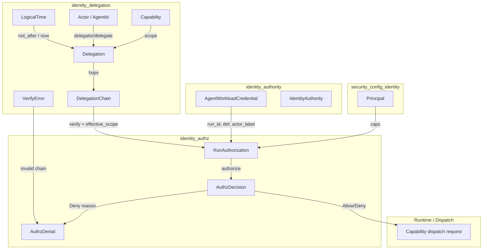
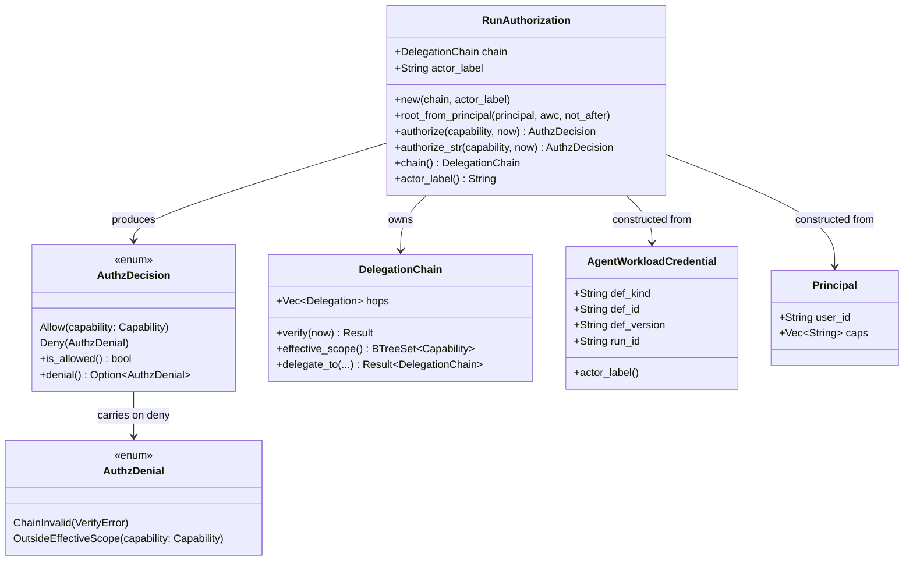
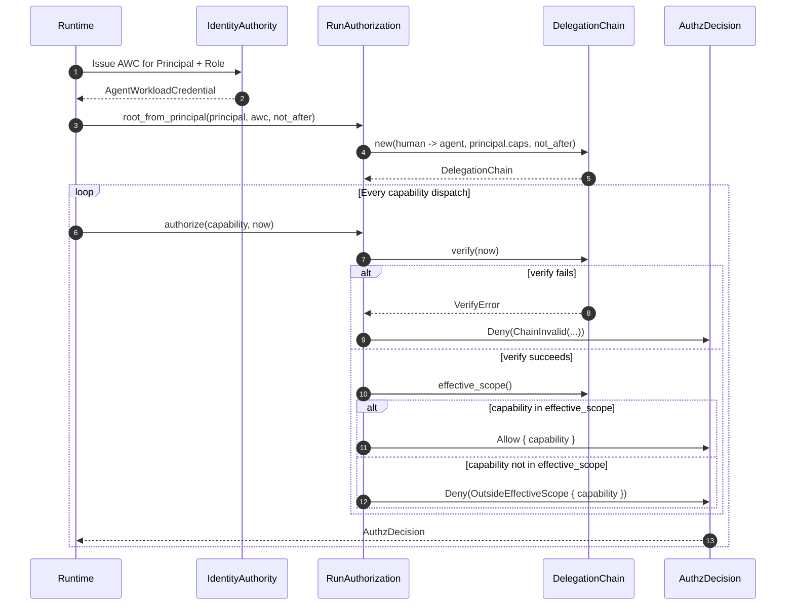
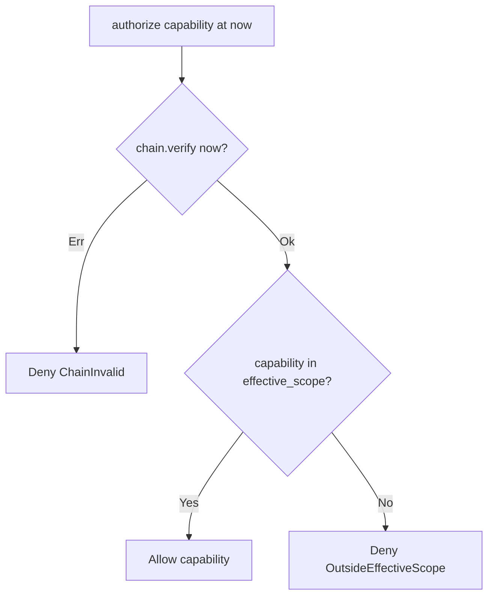
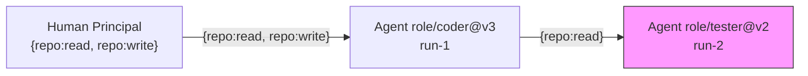

# identity_authz

## Overview

`identity_authz` is the **on-behalf-of (OBO) authorization decision layer** inside the `identity` subsystem. It turns the abstract delegation algebra implemented in [`identity_delegation`](identity_delegation.md) into concrete, auditable **allow/deny** decisions for every capability-bearing dispatch in a Run.

The module closes a critical seam: an [`AgentWorkloadCredential`](identity_authority.md) (AWC) proves *which* ephemeral workload is acting, and a [`DelegationChain`](identity_delegation.md) proves *what authority was granted to it*, but neither object by itself answers the runtime question: **“May this actor perform capability X at time T?”** `RunAuthorization` binds those two concepts together and produces a structured, serializable [`AuthzDecision`] that the dispatch path can branch on and the event log can record.

This design is governed by:

* ADR-022 §12/§15 — OBO delegation facet
* ADR-003 — per-turn authz seam that evaluates the AWC
* Pass-5 gap **[AI]** — confused-deputy / on-behalf-of authorization

---

## Core Responsibilities

1. **Bind identity to authority**  
   Construct a per-Run authorization context from an authenticated human [`Principal`](../core_infrastructure/security_config_identity.md) and the issued [`AgentWorkloadCredential`](identity_authority.md).

2. **Evaluate capability requests**  
   For any requested [`Capability`], decide `Allow` or `Deny` with a named reason.

3. **Fail closed**  
   Any invalid chain (widening, expiry, broken link, cycle, reserved payment verb) results in a `Deny` decision for **all** capabilities.

4. **Support narrowing sub-delegation**  
   A Run may further delegate a subset of its authority to a sub-agent; the authz context follows the narrowed chain.

5. **Produce auditable decisions**  
   [`AuthzDecision`] and [`AuthzDenial`] are serializable, tagged enums suitable for event logs, forensics, and non-Rust auditors.

---

## Architecture

`identity_authz` sits at the boundary between **identity issuance** and **runtime dispatch**. It consumes primitives from [`identity_delegation`](identity_delegation.md), [`identity_authority`](identity_authority.md), and [`security_config_identity`](../core_infrastructure/security_config_identity.md), and emits decisions that upstream dispatch code can act on.

### Component Diagram

---

## Data Model

### `RunAuthorization`

The per-Run OBO authorization context. It owns:

* `chain: DelegationChain` — the grant chain the Run acts under.
* `actor_label: String` — the composite actor of record, derived from the AWC, used for attribution.

The canonical constructor is `root_from_principal`, which builds a one-hop chain:

* **Root delegator** — the authenticated human `Principal`.
* **Delegate** — the per-Run agent identity derived from the AWC (`def_kind/def_id@def_version` + `run_id`).
* **Scope** — the principal’s own capabilities, which form the widest authority the agent may ever hold.
* **Expiry** — `not_after`, a short logical-time window.

### `AuthzDecision`

A tagged enum representing the result of one authorization check:

* `Allow { capability }` — the chain is valid and the capability is within the effective scope.
* `Deny(AuthzDenial)` — the action is denied, with a precise reason.

Helper methods:

* `is_allowed()` — returns `true` only for `Allow`.
* `denial()` — returns the reason when denied.

### `AuthzDenial`

Distinguishes two failure classes:

* `ChainInvalid(VerifyError)` — the delegation chain is structurally invalid or expired; it holds no authority at all.
* `OutsideEffectiveScope { capability }` — the chain is valid, but the requested capability is outside its narrowed effective scope.

This distinction is important for audit and debugging: the first is a *trust* failure, the second is a *policy* failure.

---

## Authorization Flow

The runtime consults `RunAuthorization` before every capability-bearing dispatch.

### Decision Logic

---

## Sub-Delegation and Narrowing

A Run is not limited to a single hop. After `RunAuthorization` is created, the runtime may extend the chain via [`DelegationChain::delegate_to`](identity_delegation.md). Each extension must be a **narrowing** grant:

* The delegate scope must be a subset of the delegator’s effective scope.
* The delegate expiry must not exceed the delegator’s expiry.
* The delegate must be an `Agent`, not a human.

A new `RunAuthorization` can then be constructed from the extended chain. Authorization decisions over the extended chain correctly allow only the retained capabilities and deny any dropped capabilities.

In the diagram above, the sub-agent may perform `repo:read` but not `repo:write`, because the sub-delegation narrowed the scope.

---

## Security Properties

### Fail-Closed by Default

If the chain cannot be verified, every authorization returns `Deny(ChainInvalid(...))`. There is no implicit allow path.

### Reserved Payment Verb Protection

If any hop in the chain contains a reserved payment-initiation capability (e.g., `payment:initiate`), `DelegationChain::verify` returns `VerifyError::ReservedCapability`. `RunAuthorization` converts this into `Deny(ChainInvalid(...))`, meaning the chain authorizes **nothing**. This prevents value-movement authority from being smuggled through an agent via confused-deputy delegation.

### Time-Bounded Authority

Every hop carries a `not_after` logical time. A request past the window is denied as `Expired`. Sub-delegations cannot extend the window (`ExpiryWidening`).

### Structural Integrity

The chain must be:

* Non-empty
* Rooted in a human
* Connected (each delegator is the previous delegate)
* Acyclic
* Non-widening at every hop

Any violation yields `ChainInvalid`.

---

## Integration with the Event Log

`AuthzDecision` and `AuthzDenial` derive `Serialize`/`Deserialize` with tagged, externally-named variants. This makes them safe to embed in:

* Audit event logs
* Forensic exports
* Non-Rust policy reviewers
* Downstream admission gates

The `actor_label` field in `RunAuthorization` provides a stable, human-readable attribution string for each decision.

---

## Testing Strategy

The module’s tests validate the end-to-end OBO decision on real identity objects:

* Mint a real AWC through the real `IdentityAuthority` gate.
* Build a `RunAuthorization` from a `Principal` and the AWC.
* Verify granted capabilities are allowed within the time window.
* Verify non-granted capabilities are denied as `OutsideEffectiveScope`.
* Verify expired chains deny everything as `ChainInvalid(Expired)`.
* Verify narrowing sub-delegation retains only the narrowed scope.
* Verify a principal carrying a reserved payment verb produces a chain that denies everything as `ChainInvalid(ReservedCapability)`.

---

## Module Boundaries

`identity_authz` does **not**:

* Issue AWCs — see [`identity_authority`](identity_authority.md).
* Define the delegation algebra or chain verification — see [`identity_delegation`](identity_delegation.md).
* Define the human principal type — see [`security_config_identity`](../core_infrastructure/security_config_identity.md).
* Enforce runtime admission, payment boundaries, or connector authorization — those are handled by [`admission`](admission.md), [`payments`](payments.md), and [`connectors_runtime`](../core_infrastructure/connectors_runtime.md) respectively, which may consume `AuthzDecision` as input.

---

## Related Modules

* [`identity_delegation`](identity_delegation.md) — `DelegationChain`, `Delegation`, `Capability`, `Actor`, `AgentId`, `LogicalTime`, `VerifyError`
* [`identity_authority`](identity_authority.md) — `AgentWorkloadCredential`, `IdentityAuthority`, attestation, AWC issuance
* [`identity_control_plane`](identity_control_plane.md) — run leases, control-plane admission, kill-switch integration
* [`security_config_identity`](../core_infrastructure/security_config_identity.md) — `Principal`, JWT claims, capability lists
* [`admission`](admission.md) — harness admission and capability grants that may layer on top of OBO authz
* [`payments`](payments.md) — payment boundary enforcement that consumes reserved-verb protections from this layer
* [`core_interaction`](../core_infrastructure/core_interaction.md) — event logging and telemetry surfaces that record `AuthzDecision`
