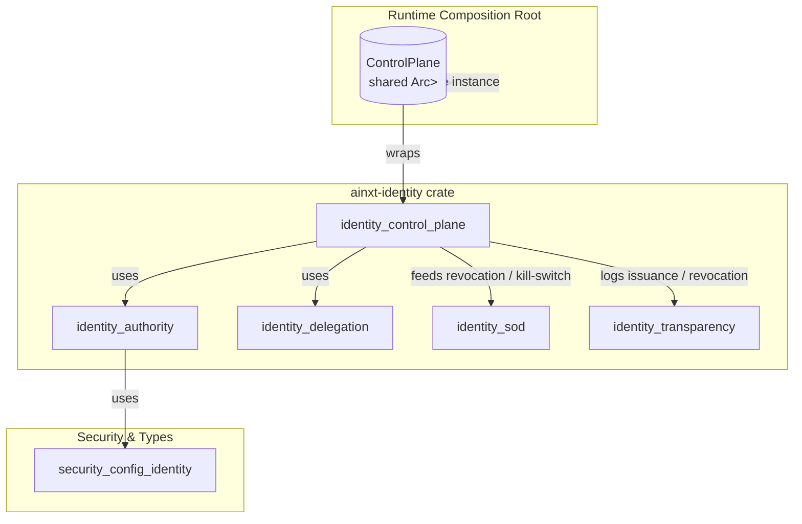
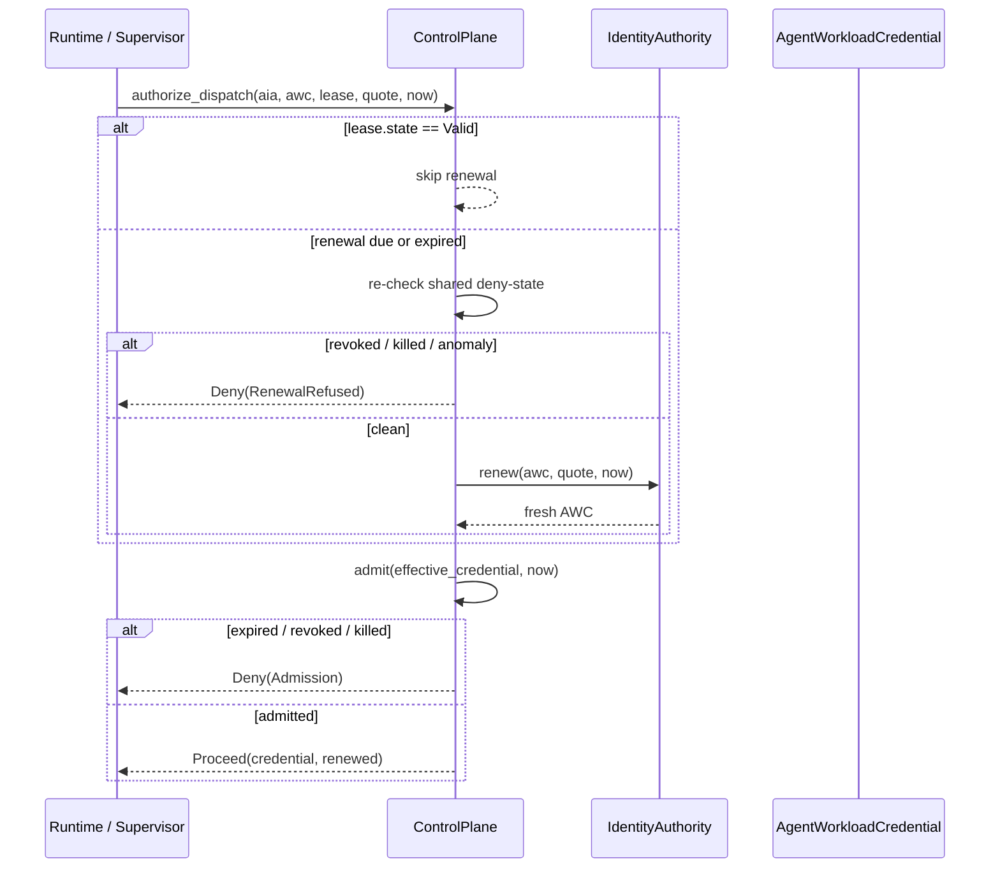

# identity_control_plane

The **identity control plane** is the shared, live control surface that governs every running non-human workload in the system. It is the single operational-state object the runtime constructs once at its composition root and consults before every capability-bearing dispatch. By centralizing revocation, kill-switch, anomaly, and short-TTL renewal state, the control plane ensures that a security action taken against a run, user, or workforce scope reaches work that is already in flight—not just runs that start afterward.

This module implements the runtime-facing half of the agent identity subsystem. The other half—credential issuance, attestation verification, revocation registries, kill-switch authority, and anomaly baselines—is provided by [identity_authority](identity_authority.md). The control plane does not mint credentials itself; it orchestrates the authority so that every dispatch is both freshly authorized and immediately revocable.

---

## Architecture

The control plane is intentionally **stateless with respect to the runtime lock**: the `ControlPlane` struct itself is plain data (`Clone`, `serde`), containing only the three deny-state facets from [identity_authority](identity_authority.md):

- `RevocationRegistry` — run-level and user-level revocations.
- `KillSwitch` — scoped, authority-gated workforce halt.
- `AnomalyMonitor` — behavioral baseline deviation detection.

The runtime wraps the single `ControlPlane` instance in its own `Arc<RwLock<...>>`. The crate itself remains lock-free and deterministic so every decision is unit-testable without concurrency machinery.

---

## Core Components

### `ControlPlane`

The central shared live control surface. It exposes:

- **Control actions**: `revoke_run`, `revoke_user`, `pull_kill_switch`, `release_kill_switch`.
- **Observation hook**: `observe` for UEBA-style anomaly samples.
- **In-flight gate**: `admit` checked before every capability-bearing dispatch.
- **JIT issuance gate**: `issue_jit` mints a run's first short-TTL credential against the shared deny-state.
- **Renewal driver**: `renew_if_due` performs conditional continuation for long-lived runs.
- **Unified dispatch entrypoint**: `authorize_dispatch` fuses renewal and admission into one call.

### `RunLease`

Defines the short-TTL renewal cadence for a long-lived run. A lease specifies a `renew_ahead` margin; when `now` enters that margin, renewal becomes due. The lease also provides `jittered_renew_at`, which spreads the renewal times of thousands of concurrent runs across the margin window using a caller-supplied per-run jitter value (for example, a hash of the run id). The crate reads no random number generator, so schedules are reproducible.

### `LeaseState`

Classifies a credential relative to its TTL:

- `Valid` — comfortably within TTL.
- `RenewDue` — inside the renew-ahead margin.
- `Expired` — past expiry; the run cannot act until it renews.

### `Renewal`

The outcome of a conditional-continuation renewal step:

- `StillValid` — no renewal was needed.
- `Renewed(AgentWorkloadCredential)` — a fresh credential was minted.

### `AdmissionDecision` / `AdmissionDenial`

The result of the per-dispatch in-flight admission gate. Denial reasons are ordered from most fundamental outward:

1. `Expired` — credential TTL has lapsed.
2. `RunRevoked` — this exact run was individually revoked.
3. `UserRevoked` — the OBO human's delegated authority was revoked.
4. `KillSwitchActive` — an active kill-switch scope halts this run.

### `DispatchOutcome` / `DispatchDenial`

The unified result of `authorize_dispatch`. A dispatch is denied either at the renewal stage (`RenewalRefused`) or at the in-flight admission stage (`Admission`). On success, `Proceed` carries the exact credential to attribute the action to, plus a flag indicating whether a fresh credential was minted this tick.

### `AnomalyResponse`

The graduated response policy for anomalous behavior:

- `RenewalChoke` — flag the run so it drains at its next TTL.
- `RevokeRun` — additionally revoke the run so in-flight dispatches are denied immediately.

---

## Data Flow

---

## Process Flows

### Per-Dispatch Authorization

`ControlPlane::authorize_dispatch` is the single entrypoint the runtime calls before every capability-bearing dispatch:

1. **JIT renew-and-re-attest**. If the lease says the credential is within its renew-ahead margin or already expired, the control plane first re-checks the shared deny-state. If the state is clean, it delegates attestation, definition validity, and TTL minting to the `IdentityAuthority`. If the state is not clean, the renewal is refused and the run drains.
2. **In-flight admission**. The credential that will act for this dispatch—either the freshly renewed one or the existing one—is run through `admit`. Expired TTL, individual run revocation, OBO user revocation, or an active kill-switch scope denies the dispatch immediately.

Because both stages consult the same shared `ControlPlane`, a kill-switch pull or revocation mid-run reaches the run already in flight: the next `authorize_dispatch` is denied either at stage 1 (if renewal is due) or at stage 2 (if it is not).

### Initial Issuance

`ControlPlane::issue_jit` mints a run's first short-TTL credential. Before delegating to `IdentityAuthority::issue`, it re-checks the shared deny-state so that a workforce halt or revoked OBO user also refuses brand-new runs. This closes the gap where a stateless minting service with empty local registries would otherwise issue credentials even while the shared control surface is locked down.

### Renewal Choke for Long-Lived Runs

For a long-lived program run, `renew_if_due` is called at each supervisor checkpoint. If the credential is still valid, nothing happens. If renewal is due, the shared deny-state is consulted before the authority mints a fresh credential. A kill-switch, revocation, or anomaly flag on the shared plane therefore stops the run within one TTL by refusing continuation, even though the per-run `IdentityAuthority` may carry empty local registries.

### Anomaly Graduated Response

The `observe` hook scores an activity sample against its role baseline. With `AnomalyResponse::RenewalChoke`, an anomalous run is flagged only for the renewal choke; it can continue in-flight work but cannot renew. With `AnomalyResponse::RevokeRun`, the run is additionally revoked, so its next in-flight dispatch is denied immediately. This mirrors the §20 graduated-response design in the agent identity architecture.

---

## Dependencies

| Dependency | Module | Purpose |
|------------|--------|---------|
| `crate::authority` | [identity_authority](identity_authority.md) | Credential issuance, attestation, revocation registry, kill-switch, anomaly monitor, behavioral baseline. |
| `crate::lib` | [identity_delegation](identity_delegation.md) | `LogicalTime`, `AgentId`, `Delegation`, `DelegationChain`. |
| `ainxt_types` | [security_config_identity](../core_infrastructure/security_config_identity.md) | `Principal`, `DataClass`, and other shared identity primitives. |

The control plane also interacts indirectly with:

- [identity_authz](identity_authz.md) — run-level authorization decisions are informed by the credential the control plane returns.
- [identity_sod](identity_sod.md) — signed handoffs and separation-of-duty gates may be triggered when a run is revoked or a kill-switch is pulled.
- [identity_transparency](identity_transparency.md) — issuance, revocation, and kill-switch events can be logged into the transparency log for auditability.

---

## Integration with the Wider System

The identity control plane sits at the boundary between governance/compliance and runtime execution:

- **Upstream**, it receives control actions from administrative interfaces, incident response, and responsible-AI monitors (for example, a kill-switch pull or a UEBA anomaly flag).
- **Downstream**, it gates every dispatch in the [runtime_engine](../pipeline_runtime/runtime_engine.md), [server_serving](../pipeline_runtime/server_serving.md), and [workforce](workforce.md) surfaces by supplying the current valid credential or a denial reason.

By keeping the control plane as a single shared object, the system satisfies the ADR-022 requirements that:

- Revocation and kill-switch are consulted **per dispatch** so in-flight calls are denied immediately.
- Long-lived runs renew with short TTLs, and renewal is gated on the same live deny-state.
- Anomaly monitoring's strongest lever is the renewal choke, with optional escalation to hard revocation.

---

## Design Notes

- **No clock, no RNG**: `now` and jitter are supplied by the caller, keeping the crate deterministic and fully unit-testable.
- **Plain data**: `ControlPlane` is `Clone` and serializable; the runtime supplies its own concurrency wrapper.
- **Fail-closed ordering**: Denial reasons are checked from most fundamental (expired) to most contextual (kill-switch), so the first matching reason is reported.
- **Anomaly flag is not an in-flight denial by default**: the graduated response is a renewal choke. Only explicit `RevokeRun` escalation denies in-flight work, which is then caught by the run-revoked admission arm.
