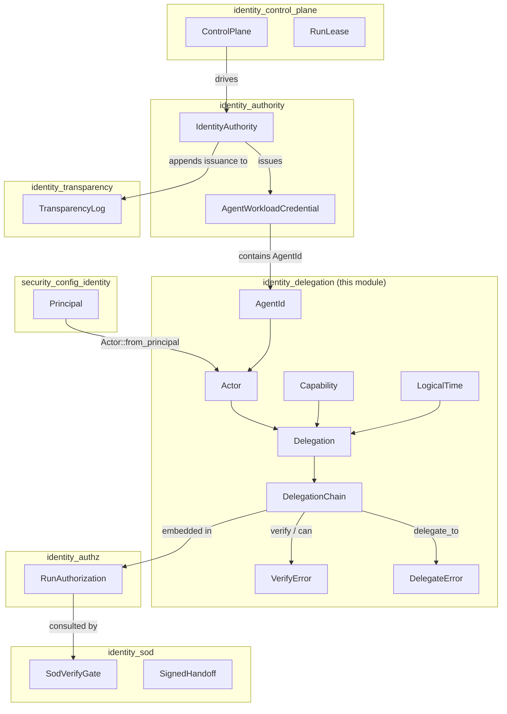
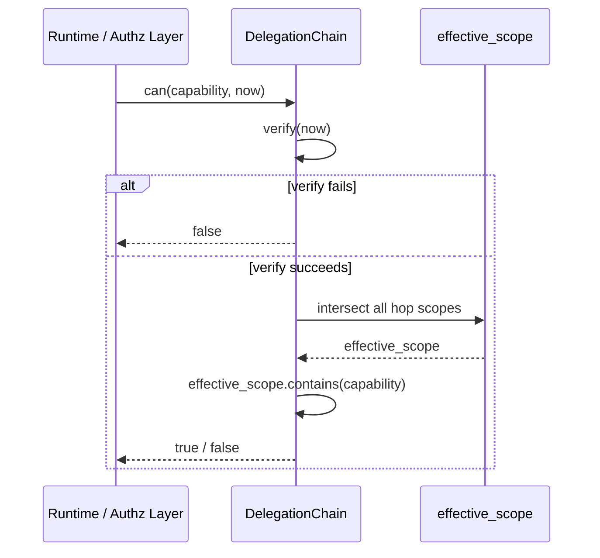
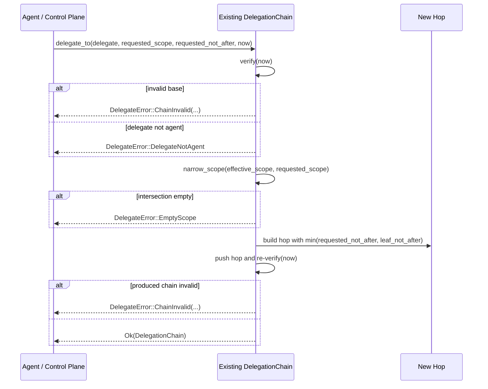
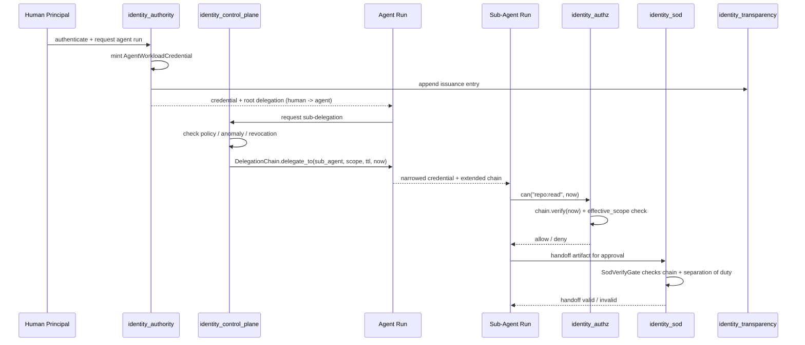
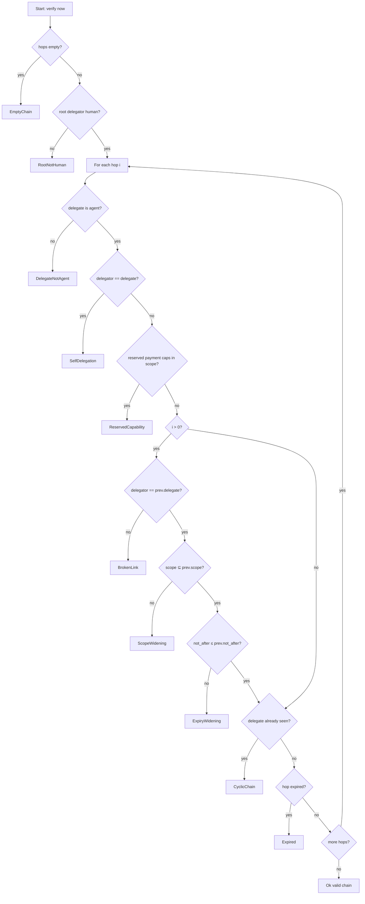
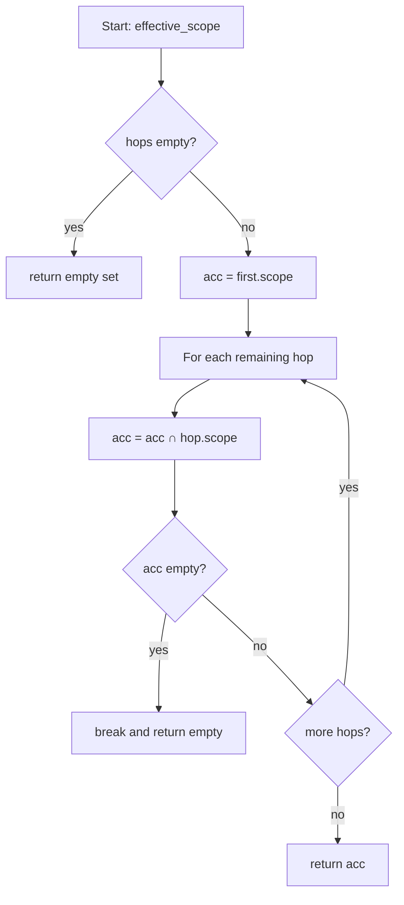

# identity_delegation

## Brief Introduction

The `identity_delegation` module is the **pure authority-algebra layer** for on-behalf-of (OBO) delegation in the ainxt agent-identity system. It defines what a delegation *means*, when a delegation chain is *valid*, and what a chain *permits* — without performing any I/O, cryptography, or wall-clock reads. Every decision is deterministic and reproducible, parameterized on a caller-supplied [`LogicalTime`].

The module's single guarantee is that **authority can only narrow as it flows downward**: a human roots authority, an agent receives a subset, and a sub-agent can receive only a further subset. A valid chain can never widen privileges, extend an authority window beyond its parent, or carry reserved payment-initiation capabilities. This is the identity-layer half of the confused-deputy defense.

This module lives inside the [`identity`](identity.md) subsystem under [`governance_compliance`](governance_compliance.md). It is consumed by the operational identity crates (`identity_authority`, `identity_control_plane`, `identity_authz`, `identity_sod`, `identity_transparency`, `identity_remediation`) and by runtime surfaces that need to authorize agent actions.

---

## Core Concepts

| Type | Purpose |
|------|---------|
| [`AgentId`](identity_delegation.md#agentid) | A per-Run workload identity: `definition` (versioned role) + `run_id` (ephemeral instance). Two Runs of the same role are distinct identities. |
| [`Actor`](identity_delegation.md#actor) | Either a `Human` (JWT principal, the accountable root) or an `Agent` (workload identity). |
| [`Capability`](identity_delegation.md#capability) | A single authority verb such as `repo:read` or `jira:comment`. Scopes are sets of capabilities. |
| [`LogicalTime`](identity_delegation.md#logicaltime) | A monotonic logical tick supplied by the caller. Grants are valid *through* `not_after` (inclusive). |
| [`Delegation`](identity_delegation.md#delegation) | One hop: `delegator` confers `scope` on `delegate`, valid through `not_after`. |
| [`DelegationChain`](identity_delegation.md#delegationchain) | An ordered list of hops: `human → agent → sub-agent → ...`. The public authority algebra is defined over this. |
| [`VerifyError`](identity_delegation.md#verifyerror) | A structured, hop-indexed reason why a chain is invalid. |
| [`DelegateError`](identity_delegation.md#delegateerror) | Why a safe sub-delegation could not be constructed. |

### `AgentId`

`AgentId` answers the question *"which running instance is this?"*. It is composed of:

- `definition`: the versioned role approved in the git control plane (e.g. `role/coder@v3`).
- `run_id`: an ephemeral, unique-per-Run instance identifier.

Because equality is structural, two Runs of the same role are **distinct identities**. This makes "not a shared token" true by construction and lets the verifier distinguish the actor receiving a delegation from the one granting it.

### `Actor`

An `Actor` is either:

- `Actor::Human(String)` — the authenticated human principal (JWT `sub`). Only humans can be the root of a delegation chain.
- `Actor::Agent(AgentId)` — a workload identity. Agents can receive delegated authority and further narrow it, but authority never flows *back* to a human mid-chain.

`Actor::from_principal` converts a [`Principal`](../core_infrastructure/security_config_identity.md) from [`security_config_identity`](../core_infrastructure/security_config_identity.md) into a human actor.

### `Capability`

A `Capability` is an opaque string newtype. The capability vocabulary lives in the control plane, not in this crate. The module provides a small set of **reserved payment-initiation capabilities** that are **not representable as a grant**:

- `payment:initiate`, `payment:authorize`, `payment:commit`, `payment:send`
- `settlement:initiate`, `settlement:commit`, `settlement:release`, `settlement:post`
- `netting:release`
- `mandate:sign`, `mandate:present`
- `value:transfer`, `value:move`

A chain whose any hop contains one of these is rejected as [`VerifyError::ReservedCapability`]. This closes confused-deputy for value-movement at the grant layer.

### `LogicalTime`

`LogicalTime` is a `u64` wrapper supplied by the caller. The crate never reads a wall clock, so authority decisions are reproducible. A grant is valid *through* its `not_after` tick (inclusive); it is expired once `now` moves strictly past it.

### `Delegation`

A `Delegation` is one hop with four fields:

- `delegator: Actor`
- `delegate: Actor`
- `scope: BTreeSet<Capability>`
- `not_after: LogicalTime`

The hop itself does not enforce narrowing; enforcement happens at the chain level in [`DelegationChain::verify`].

### `DelegationChain`

`DelegationChain` is the central type. It exposes the authority algebra:

- `verify(now)` — checks all structural, connectivity, narrowing, and expiry invariants.
- `effective_scope()` — the intersection of every hop's scope.
- `can(capability, now)` — true iff the chain verifies and the capability is in the effective scope.
- `delegate_to(...)` — safely extends a valid chain by constructing a narrowing hop.

### `VerifyError`

Every failure variant names the offending hop (0-indexed) so rejections are diagnosable and attributable:

- `EmptyChain` — no hops.
- `RootNotHuman` — the first delegator is not a human.
- `DelegateNotAgent { hop }` — a hop delegates to a non-agent.
- `SelfDelegation { hop }` — a hop delegates to itself.
- `BrokenLink { hop }` — a hop's delegator is not the previous hop's delegate.
- `CyclicChain { hop }` — an identity appears more than once.
- `ReservedCapability { hop, reserved }` — a hop carries a reserved payment-initiation capability.
- `ScopeWidening { hop, offending }` — a hop grants capabilities its delegator does not hold.
- `ExpiryWidening { hop, hop_not_after, delegator_not_after }` — a sub-delegation outlives its delegator.
- `Expired { hop, not_after, now }` — a hop is expired at `now`.

### `DelegateError`

Failures when *constructing* a safe sub-delegation:

- `ChainInvalid(VerifyError)` — the base chain is invalid, or the produced hop would be invalid.
- `DelegateNotAgent` — the proposed delegate is not an agent.
- `EmptyScope` — the narrowed scope is empty.

---

## Verification Invariants

A `DelegationChain` is valid at `now` **if and only if** all of the following hold:

1. The chain is non-empty.
2. The root delegator is a human.
3. Every delegate is an agent.
4. No hop delegates to itself.
5. No identity repeats (no cycles).
6. The chain is connected: each hop's delegator equals the previous hop's delegate.
7. Every hop's scope is a subset of its delegator's scope (no widening).
8. Every hop's `not_after` is `<=` its delegator's `not_after` (no time escalation).
9. No hop is expired at `now`.
10. No hop contains a reserved payment-initiation capability.

The effective scope is the **intersection** of all hop scopes, naturally capped by the root. A capability dropped at any hop is absent from the result.

---

## Architecture

### Component Relationships

- [`identity_authority`](identity_authority.md) issues `AgentWorkloadCredential`s. Each credential contains an `AgentId` and an OBO user identity. It relies on this module's algebra to know what a valid delegation chain means before signing credentials.
- [`identity_control_plane`](identity_control_plane.md) owns the `ControlPlane`, `RunLease`, revocation registry, kill switch, and anomaly monitor. It supplies the `LogicalTime` and policy context that make delegation decisions concrete at runtime.
- [`identity_authz`](identity_authz.md) wraps a `DelegationChain` in `RunAuthorization` and answers "can this Run do X?" by calling `chain.can(...)`.
- [`identity_sod`](identity_sod.md) applies separation-of-duty checks to handoffs. It uses the chain's actor labels and scope to decide whether a signed handoff is valid.
- [`identity_transparency`](identity_transparency.md) logs credential issuance and delegation events. The chain's deterministic structure is what gets logged and audited.
- [`identity_remediation`](identity_remediation.md) reacts to invalid or anomalous chains by revoking leases or triggering kill switches.
- [`security_config_identity`](../core_infrastructure/security_config_identity.md) provides the `Principal` type that roots a chain as `Actor::Human`.

---

## Data Flow

### Authorizing a Single Capability

### Constructing a Safe Sub-Delegation

### Full Runtime Delegation Lifecycle

---

## Process Flows

### Verifying a Chain

### Computing Effective Scope

---

## How This Module Fits into the System

`identity_delegation` is the **kernel** of the agent identity subsystem. It is deliberately pure:

- **No I/O**: it does not read clocks, databases, or network state.
- **No cryptography**: it does not sign or verify signatures.
- **No policy engine**: it does not decide which capabilities exist or what a role means.

Those responsibilities live in sibling modules:

- [`identity_authority`](identity_authority.md) performs attestation, credential issuance, and signing.
- [`identity_control_plane`](identity_control_plane.md) supplies runtime policy, revocation, kill switches, and lease management.
- [`identity_authz`](identity_authz.md) applies the chain to concrete authorization decisions.
- [`identity_sod`](identity_sod.md) enforces separation of duty on handoffs.
- [`identity_transparency`](identity_transparency.md) provides auditable, append-only logs of identity events.
- [`identity_remediation`](identity_remediation.md) handles revocation and incident response.

By keeping the authority algebra pure, the system can test delegation logic exhaustively, reproduce authorization decisions, and share one correct definition of "valid OBO" across all operational layers.

The module also connects upward to runtime surfaces. For example, [`runtime_engine`](../pipeline_runtime/runtime_engine.md) and [`server_serving`](../pipeline_runtime/server_serving.md) use authorized Runs to dispatch tools, while [`workforce`](workforce.md) and [`teams`](teams.md) define the roles that become `AgentId.definition` values.

---

## Design Rationale

### Why Logical Time?

Wall clocks are non-deterministic and attacker-influencable in some environments. By parameterizing expiry on a caller-supplied `LogicalTime`, the crate makes authority decisions reproducible and testable. The control plane advances logical time in a monotonic, auditable way.

### Why Per-Run Identity?

A shared token for a role would let a compromised Run impersonate every other Run of that role. `AgentId` includes a unique `run_id`, so each Run has its own identity. This is enforced structurally: even if two Runs share the same `definition`, they are not equal.

### Why Reserved Payment Capabilities?

Closing confused-deputy by "not implementing a dispatch arm" is fragile. By making payment-initiation capabilities ungrantable at the identity layer, the system guarantees that no OBO context — even one rooted in a fully privileged human — can carry value-movement authority to an agent.

### Why Intersection for Effective Scope?

Computing effective scope as the intersection of all hops means the result is correct even for invalid chains. It also makes the security property obvious: a capability survives only if every hop in the chain agreed to carry it.

---

## References

- Parent module: [`identity`](identity.md)
- Top-level group: [`governance_compliance`](governance_compliance.md)
- Sibling identity modules:
  - [`identity_authority`](identity_authority.md)
  - [`identity_control_plane`](identity_control_plane.md)
  - [`identity_authz`](identity_authz.md)
  - [`identity_sod`](identity_sod.md)
  - [`identity_transparency`](identity_transparency.md)
  - [`identity_remediation`](identity_remediation.md)
- Principal type: [`security_config_identity`](../core_infrastructure/security_config_identity.md)
- Runtime consumers: [`runtime_engine`](../pipeline_runtime/runtime_engine.md), [`server_serving`](../pipeline_runtime/server_serving.md)
- Role definitions: [`workforce`](workforce.md), [`teams`](teams.md)
