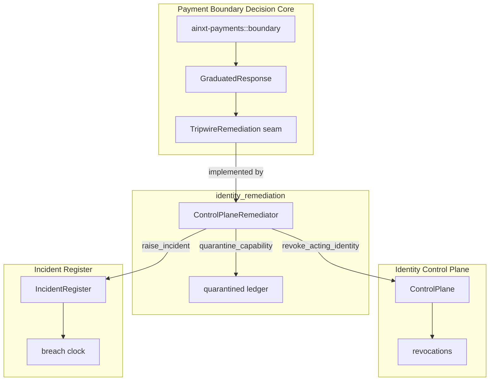
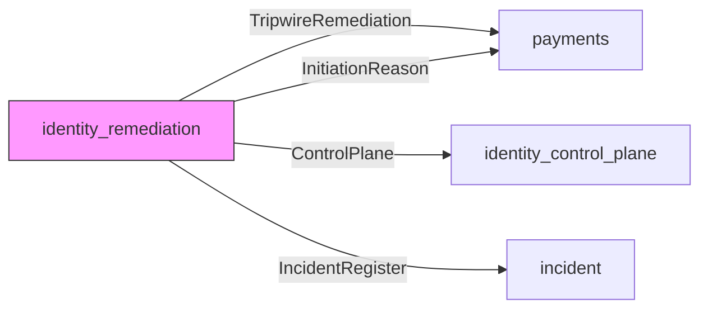
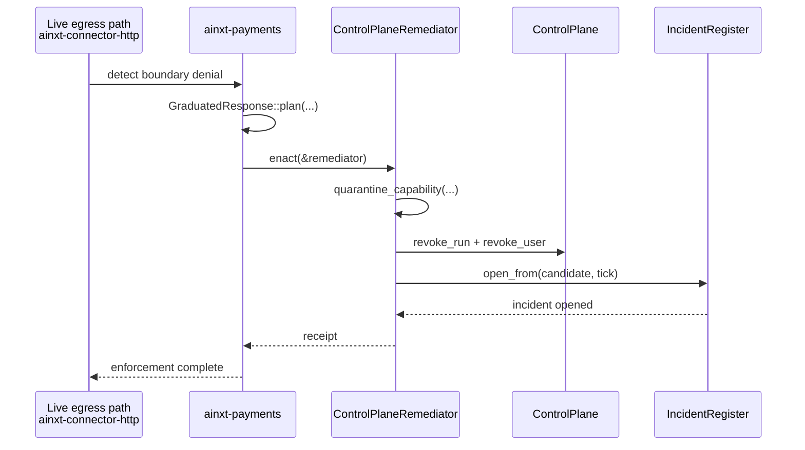
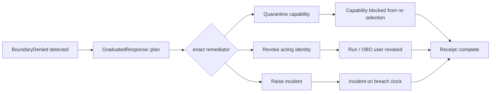

# identity_remediation

The `identity_remediation` module is the runtime enactment layer for the payment boundary's graduated tripwire response. It bridges the pure decision core in [`ainxt-payments`](payments.md) with the real identity control plane and incident register, converting advisory [`GraduatedResponse`](payments.md) directives into durable, queryable control-plane facts: capability quarantines, identity revocations, and security incidents.

## Overview

When the live egress path detects a payment-boundary violation, [`ainxt-payments`](payments.md) emits an ordered set of structured directives through the [`TripwireRemediation`](payments.md) seam. `ainxt-payments` intentionally performs no side effects and depends on neither identity nor incident crates, preserving a clean, acyclic dependency graph. This module provides the `ControlPlaneRemediator`, the production implementation of that seam, which turns each directive into an enforced state change that other runtime surfaces can observe and audit.

The three escalation actions are:

1. **Quarantine capability** — the offending capability is added to an internal ledger and is neither re-selectable nor dispatchable until an authenticated review clears it.
2. **Revoke acting identity** — the acting Run or OBO-user identity is revoked on the [`ControlPlane`](identity_control_plane.md), causing any in-flight dispatch carrying it to be denied at the next dispatch or renewal.
3. **Raise security incident** — a typed incident is opened on the shared [`IncidentRegister`](incident.md) breach clock, armed from `CandidateSource::PaymentBoundary`.

## Architecture

## Component Responsibilities

### `ControlPlaneRemediator`

`ControlPlaneRemediator` is the sole public type in this module. It is interior-mutable, `Send + Sync`, and designed to be held behind an `Arc` and shared across worker threads by the live connector dispatch gate.

| Constructor | Purpose |
|-------------|---------|
| `new()` | Creates a remediator with fresh, private control-plane and incident register instances. Useful for unit tests and standalone use. |
| `with_parts(...)` | Wraps caller-owned `ControlPlane` and `IncidentRegister` in fresh `Arc`s for backward-compatible test wiring. |
| `with_shared(...)` | **Production constructor.** Takes the runtime's shared `Arc<Mutex<ControlPlane>>` and `Arc<Mutex<IncidentRegister>>` so every side effect is visible to served routes, the breach clock, and other runtime surfaces. |

### Query methods

| Method | Returns |
|--------|---------|
| `is_quarantined(capability_id)` | Whether the capability is currently quarantined. |
| `is_identity_revoked(id)` | Whether the identity is revoked in either the Run or OBO-user namespace (fail-closed). |
| `incident_count()` | Number of incidents opened on the register. |
| `incident_ids()` | IDs of opened incidents. |

### `TripwireRemediation` implementation

| Directive | Effect |
|-----------|--------|
| `quarantine_capability` | Inserts the capability ID into an internal `HashSet<String>` protected by a `Mutex`. |
| `revoke_acting_identity` | Locks the shared `ControlPlane` and calls `revoke_run` and `revoke_user` with the same identity, ensuring fail-closed behavior regardless of which namespace the actor URI belongs to. |
| `raise_incident` | Builds an `IncidentCandidate::from_payment_boundary` using the current Unix timestamp, control-plane commit SHA, capability ID, and a PII-free description, then opens it on the shared `IncidentRegister`. |

## Dependencies

- [`payments`](payments.md) — supplies the `GraduatedResponse`, `BoundaryDenied`, `InitiationReason`, and `TripwireRemediation` seam. `ainxt-payments` remains a pure decision core with no side effects.
- [`identity_control_plane`](identity_control_plane.md) — supplies the `ControlPlane` and revocation registry (`revoke_run`, `revoke_user`, `revocations`).
- [`incident`](incident.md) — supplies the `IncidentRegister`, `IncidentCandidate`, `ArmingPolicy`, and statutory breach clock machinery.

## Data Flow

## Process Flow: Graduated Response Enactment

## Shared-State Design

A key design requirement (documented as GAP-AUDIT regulated-fi #2) is that the remediator must operate on the **same** shared organs as the rest of the daemon. Earlier versions used an owned, private pair of `ControlPlane` and `IncidentRegister`, which meant incidents raised by the payment boundary were invisible to `/v1/regfi/auditor` and the statutory breach clock.

The production constructor `with_shared` accepts `Arc<Mutex<ControlPlane>>` and `Arc<Mutex<IncidentRegister>>` so that:

- Revocations are visible to every dispatch gate and renewal path.
- Incidents are visible to the breach clock and regulatory auditor endpoints.
- The `control_plane_sha` is recorded as evidentiary metadata showing which policy definitions were live when the tripwire fired.

## Fail-Closed Identity Revocation

The tripwire revokes the acting identity in **both** the Run and OBO-user namespaces. The actor URI carried by a mis-declared call is treated as both a Run ID and a user ID, so whichever namespace it actually belongs to, the in-flight dispatch carrying it is denied at the next dispatch or renewal. This implements ADR-022 §17 (individual Run/OBO-user revocation).

## Incident Raising

Incidents are raised with:

- A real Unix timestamp (`SystemTime::now`) so statutory notification deadlines are computed correctly.
- A PII-free description containing the capability ID, actor identity, and deterministic `InitiationReason` enum labels.
- `IncidentCandidate::from_payment_boundary`, which arms the incident as `AgentSettlementAction` and records the involved system as the offending capability.

This satisfies ADR-017 (statutory incident breach clock) and makes the payment boundary a first-class incident source alongside the breach clock and `/v1/regfi/*` routes.

## Testing

The module includes unit tests that verify:

1. **End-to-end enactment** (`r14_enact_binds_all_three_to_real_organs`) — a planned `GraduatedResponse` results in quarantine, revocation, and exactly one incident.
2. **Shared-register visibility** (`gap_regfi_02_shared_register_incident_is_visible_to_the_other_arc_holder`) — an incident raised through `with_shared` is visible to another holder of the same `Arc<Mutex<IncidentRegister>>`, confirming production observability.

## Relationship to Other Modules

- [`identity`](identity.md) — parent identity module; this crate implements the remediation sub-domain.
- [`identity_control_plane`](identity_control_plane.md) — owns the `ControlPlane`, revocation registry, and Run/OBO-user namespaces.
- [`identity_authority`](identity_authority.md) — higher-level identity authority and attestation; remediation enforces its revocation decisions downstream.
- [`incident`](incident.md) — owns the `IncidentRegister` and breach-clock machinery used for statutory notification.
- [`payments`](payments.md) — pure decision core that emits `GraduatedResponse` directives through the `TripwireRemediation` seam.
- [`connectors`](../core_infrastructure/connectors.md) / [`connectors_http`](../core_infrastructure/connectors_http.md) — the live egress path that drives `GraduatedResponse::enact` against a `ControlPlaneRemediator`.

## See Also

- [identity.md](identity.md)
- [identity_control_plane.md](identity_control_plane.md)
- [identity_authority.md](identity_authority.md)
- [incident.md](incident.md)
- [payments.md](payments.md)
- [connectors.md](../core_infrastructure/connectors.md)
