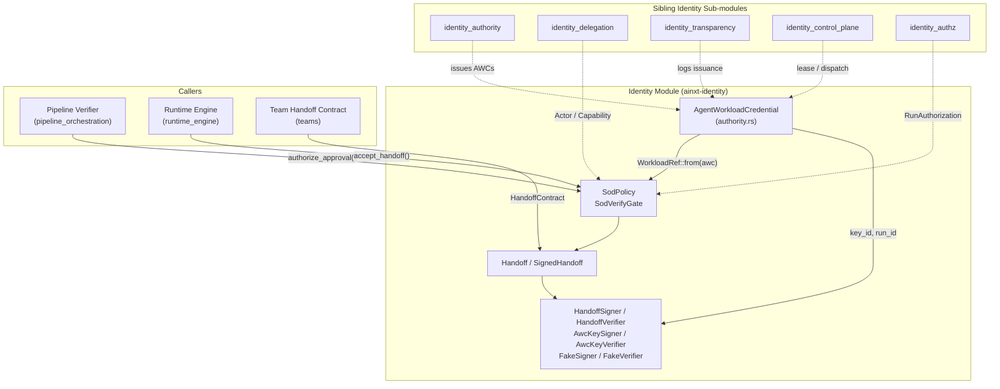
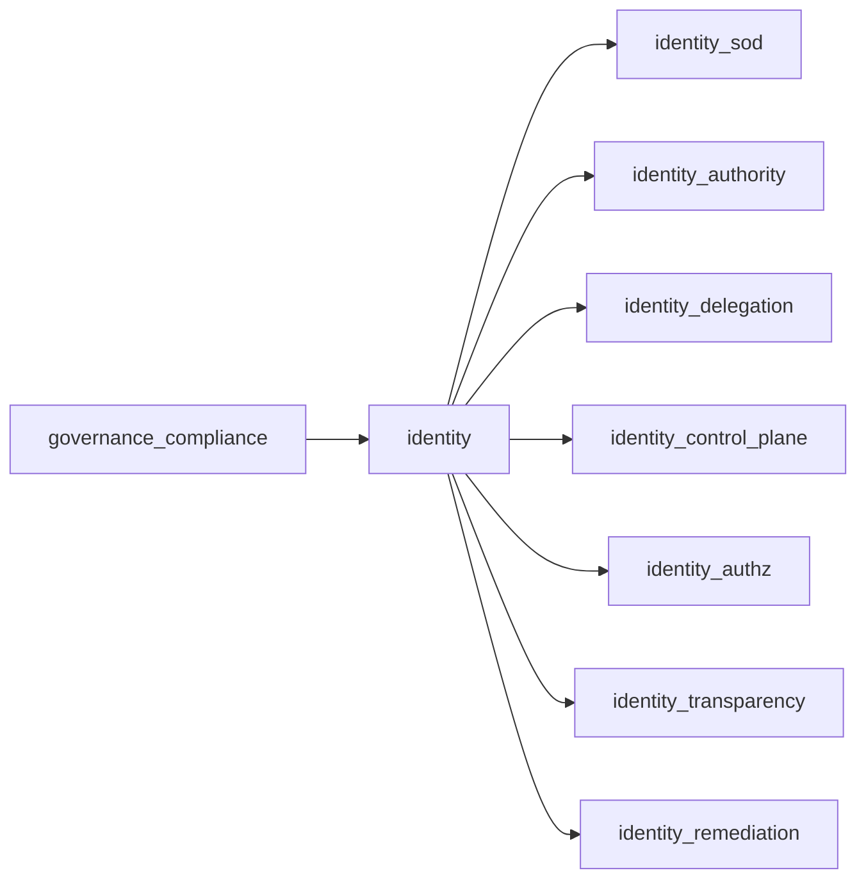
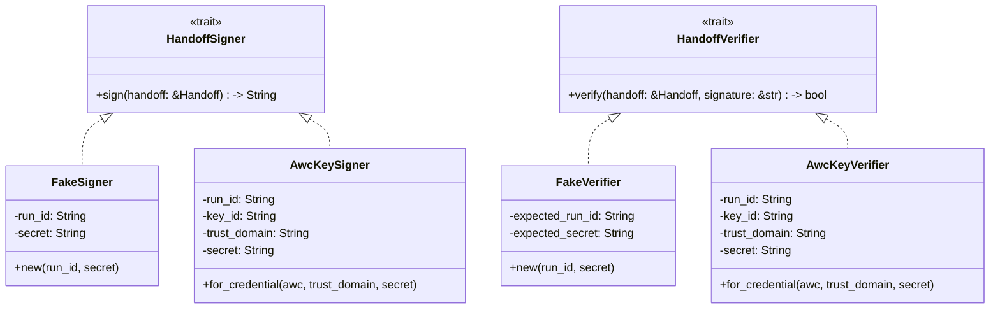
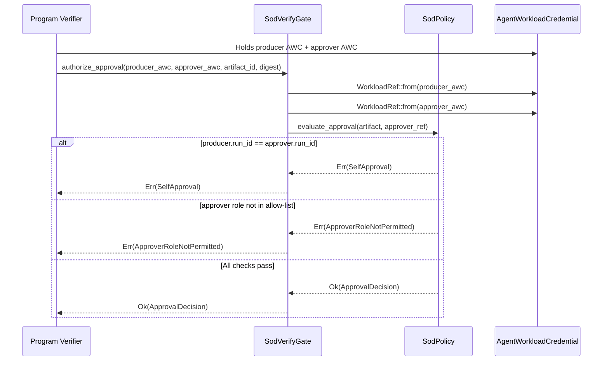
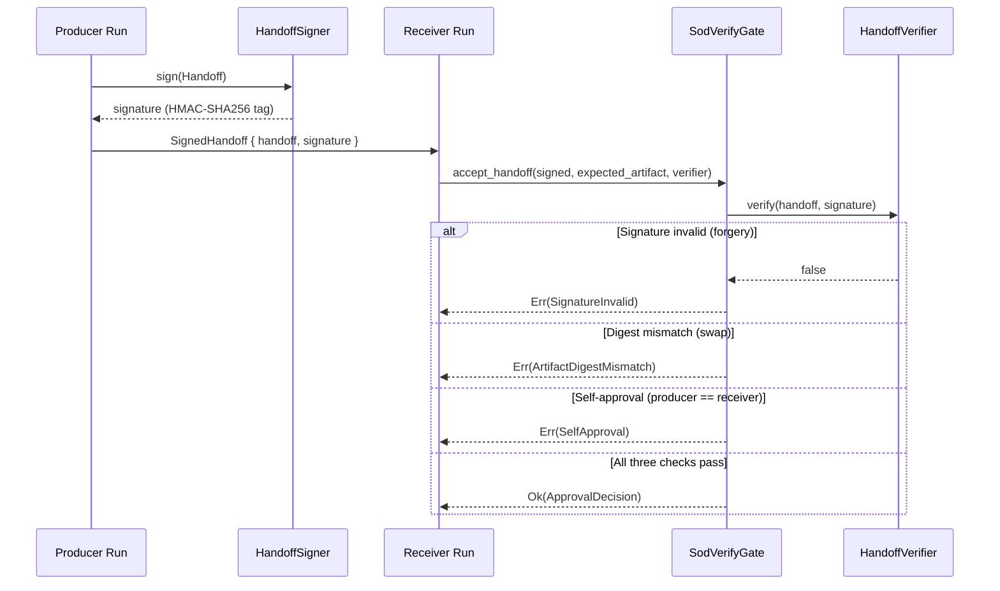
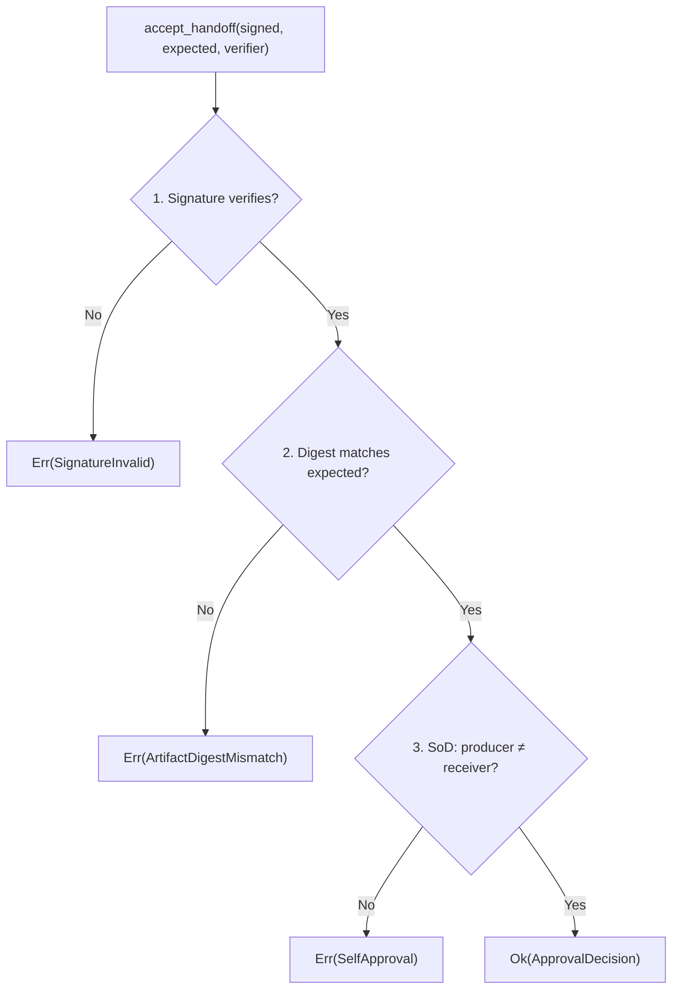
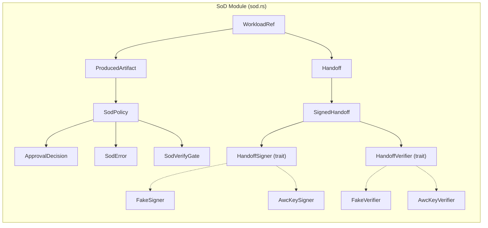

# Identity SoD — Separation of Duties & Signed Handoffs

> **Source file:** `crates/ainxt-identity/src/sod.rs`
> **Design reference:** `docs/architecture/AGENT_IDENTITY_AND_PAYMENT_BOUNDARY.md` §18 (ADR-022)
> **Parent module:** [identity](identity.md) → `identity_sod`

---

## 1. Purpose

The `identity_sod` module enforces **producer ≠ approver Separation of Duties (SoD)** and
**cryptographically signed handoffs** for agent workloads. It is the identity-layer close of
Pass-5 threat **[17]** — *a compromised agent forges a peer's approval*.

The module provides two structural guarantees that together prevent a single Run from both
producing and approving its own work, and prevent a compromised Run from forging another Run's
approval signature:

1. **Producer ≠ Approver, keyed on identity.** The `AgentWorkloadCredential` (AWC) that produced
   an artifact is recorded on it. `SodPolicy::evaluate_approval` **refuses** any approval whose
   approver is the same Run as the producer. Because two Runs of the same role have distinct
   `run_id`s, this is *stronger* than a cross-model producer≠judge rule: even the identical model
   running as two Runs cannot self-approve, and even the identical Run cannot re-approve its own work.

2. **Signed handoffs.** A handoff artifact is signed by the producer's AWC key material
   (`HandoffSigner`); the receiver verifies the signature (`HandoffVerifier`) **and** re-checks
   SoD before acting. A compromised Coder cannot forge a Judge's "approved" handoff because it
   cannot produce the Judge's AWC signature, and the SoD check rejects a self-produced approval
   even if the signature somehow verified.

---

## 2. Architecture Overview

### Module Hierarchy

---

## 3. Core Components

### 3.1 Identity Reference: `WorkloadRef`

A stable projection of an AWC used as the SoD identity key. SoD keys on `run_id` — globally
unique per Run — so two Runs of the same `def_ref` are distinct actors.

| Field | Description |
|-------|-------------|
| `def_ref` | Versioned definition, `def:<kind>/<id>@<version>` — used for approver-role policy |
| `run_id` | Per-Run instance id — **the SoD identity key** |

`WorkloadRef::from(&AgentWorkloadCredential)` projects the AWC's `def_ref()` and `run_id` into
this lightweight reference. See [identity_authority](identity_authority.md) for AWC structure.

### 3.2 Produced Artifact: `ProducedArtifact`

An artifact produced by a Run, carrying the producer's identity. The `content_digest` binds the
artifact bytes to the identity so a later approval/handoff is provably *about this artifact*,
not a swapped one.

| Field | Description |
|-------|-------------|
| `artifact_id` | Logical identifier for the artifact |
| `producer` | `WorkloadRef` of the producing Run |
| `content_digest` | Digest of the artifact content (injected — the crate does not hash bytes) |

### 3.3 SoD Policy: `SodPolicy`

The git-controlled Separation-of-Duties policy (§18 "SoD policy is git-controlled"). An empty
allow-list means *any distinct Run* may approve (the producer≠approver rule still always applies);
a non-empty list additionally restricts approvers by role.

**Key methods:**

| Method | Behavior |
|--------|----------|
| `identity_only()` | Policy enforcing only producer≠approver (no role restriction) |
| `with_permitted_approvers(defs)` | Restrict approvers to given `def_ref`s in addition to identity rule |
| `evaluate_approval(artifact, approver)` | Rejects self-approval (`SelfApproval`) or wrong-role (`ApproverRoleNotPermitted`); returns `ApprovalDecision` on success |
| `accept_handoff(signed, expected, verifier)` | Verifies signature → checks digest match → applies SoD rule (all three must pass) |

### 3.4 SoD Verify Gate: `SodVerifyGate`

A credential-facing façade over `SodPolicy` that the live program verifier calls. It projects
AWC identities via `WorkloadRef::from` and applies the SoD rule, providing a single named
entrypoint (`authorize_approval`) for the program-verification loop.

| Method | Description |
|--------|-------------|
| `new(policy)` | Gate over an explicit git-controlled `SodPolicy` |
| `identity_only()` | Gate enforcing only the producer≠approver identity rule |
| `authorize_approval(producer_awc, approver_awc, artifact_id, digest)` | **Main entrypoint** — projects both AWCs to `WorkloadRef`s and evaluates SoD |
| `accept_handoff(signed, expected, verifier)` | Signed-handoff variant — verifies signature + digest + SoD |

### 3.5 Approval Decision: `ApprovalDecision`

The audit-ready verdict carried by a *granted* approval. Only constructed by
`evaluate_approval` / `accept_handoff` after all checks pass, so its existence *is* the proof
that producer ≠ approver.

| Field | Description |
|-------|-------------|
| `artifact_id` | The artifact that was approved |
| `producer` | `WorkloadRef` of the producing Run |
| `approver` | `WorkloadRef` of the approving Run |
| `content_digest` | Digest of the approved artifact content |

### 3.6 Error Types: `SodError`

Every arm names the actors so audit sees exactly what was blocked and why — never a bare boolean.

| Variant | Trigger |
|---------|---------|
| `SelfApproval` | Approver is the same Run that produced the artifact |
| `ApproverRoleNotPermitted` | Approver's `def_ref` not in the git-controlled allow-list |
| `SignatureInvalid` | Signed handoff's signature did not verify (forged-approval attack) |
| `ArtifactDigestMismatch` | Handoff's artifact digest ≠ expected (artifact swap) |

### 3.7 Handoff Structures

#### `Handoff`

A handoff of produced work from one Run to another (LOOP handoff contract, §18). Signed by the
producer's AWC; the receiver verifies before acting.

| Field | Description |
|-------|-------------|
| `artifact_id` | The artifact being handed off |
| `producer` | `WorkloadRef` of the Run that produced and signs |
| `receiver` | `WorkloadRef` of the Run receiving (prospective approver) |
| `content_digest` | Digest of the artifact content |

`Handoff::signing_material()` produces the canonical bytes a signer signs / a verifier checks —
deterministic and field-delimited with `\u{1f}`.

#### `SignedHandoff`

A `Handoff` plus the producer's signature over it.

### 3.8 Cryptographic Seams: `HandoffSigner` / `HandoffVerifier`

Trait-based seams so a deployment can swap in its PKI/HSM-backed ADR-023 signer with no
call-site change.

#### `FakeSigner` / `FakeVerifier`

Offline seam implementations using real **HMAC-SHA256** (RFC 2104) keyed by a per-identity shared
secret. The tag is `hex(HMAC-SHA256(secret, run_id \x1f signing_material))` — a real keyed MAC
that reveals nothing about the secret and is unforgeable without it.

#### `AwcKeySigner` / `AwcKeyVerifier`

AWC-key-bound signers that bind the signature to the credential's versioned `key_id` (ADR-023
signing key) and a `trust_domain` (attestation/PKI root). A signer for one credential cannot
produce a signature that a verifier bound to a *different* trust domain will accept — **cross-domain
unforgeability**.

The message the tag is computed over includes `trust_domain`, `run_id`, `key_id`, and
`signing_material`, so a mismatch on any of these produces a non-matching HMAC tag.

---

## 4. Cryptographic Design

### GAP-FIX: Real HMAC-SHA256 (not a fake stub)

Before the fix, `FakeSigner`/`AwcKeySigner` were not cryptography at all: the "signature" was a
`format!()` string that concatenated the raw shared secret *in cleartext* into the returned tag,
and verification was a non-constant-time `==` string compare. This was worse than no crypto:
any party who observed a "signature" read the signing key itself, and the byte-by-byte compare
leaked timing information.

**Current implementation:**

- **HMAC-SHA256** (RFC 2104) built from the `sha2` primitive already vetted for this crate's §13
  transparency-log Merkle/STH work — no new dependency.
- The tag is keyed by the (never-transmitted) secret; verification recomputes the tag and compares
  in **constant time** (`ct_eq`).
- The tag reveals nothing about the key; a forged/altered handoff or a guessed/wrong key produces
  a non-matching tag with cryptographic (not string-luck) probability.
- The real deployment swaps the shared-secret HMAC key for the AWC's ADR-023 asymmetric key
  material behind the identical `HandoffSigner`/`HandoffVerifier` seam — no call-site changes.

### Cryptographic Primitives

| Function | Description |
|----------|-------------|
| `hmac_sha256(key, message)` | RFC 2104 HMAC-SHA256, returns raw 32-byte tag |
| `hex_encode(bytes)` | Lower-hex encode (no external hex crate) |
| `hex_decode(s)` | Lower-hex decode; `Err` on odd length or non-hex digit (fails closed) |
| `ct_eq(a, b)` | Constant-time byte-slice comparison (no timing leak on first mismatch) |

---

## 5. Data Flow

### 5.1 Direct Approval Flow

### 5.2 Signed Handoff Flow

### 5.3 Three-Check Pipeline for `accept_handoff`

---

## 6. Component Interaction Diagram

---

## 7. Dependencies & Cross-Module References

### 7.1 Intra-Identity Dependencies

| Dependency | Relationship |
|------------|-------------|
| [identity_authority](identity_authority.md) | `AgentWorkloadCredential` — the AWC whose `run_id`/`key_id`/`def_ref` are projected into `WorkloadRef` and bound into signatures |
| [identity_delegation](identity_delegation.md) | `Actor`, `Capability`, `LogicalTime` — foundational identity types shared across the identity crate |
| [identity_control_plane](identity_control_plane.md) | `ControlPlane`, `RunLease` — the control plane that governs Run lifecycle; SoD operates on credentials the control plane admits |
| [identity_authz](identity_authz.md) | `RunAuthorization`, `AuthzDecision` — capability-level authorization; SoD is the *approval-level* complement |
| [identity_transparency](identity_transparency.md) | `TransparencyLog`, `IssuanceEntry` — AWC issuance is logged in the transparency log; SoD signatures chain to the same `key_id` |
| [identity_remediation](identity_remediation.md) | `ControlPlaneRemediator` — incident-driven remediation can quarantine Runs that fail SoD checks |

### 7.2 External Consumers

| Consumer | Usage |
|----------|-------|
| [pipeline_orchestration](../pipeline_runtime/pipeline_orchestration.md) | The program verifier calls `SodVerifyGate::authorize_approval` at each commit boundary before treating a produced artifact as approved/committable |
| [runtime_engine](../pipeline_runtime/runtime_engine.md) | The runtime engine threads AWCs through turns; SoD gates apply when a Run's output is verified by another Run |
| [teams](teams.md) | `HandoffContract` in the teams crate carries artifact references between roles; the SoD `Handoff`/`SignedHandoff` provides the cryptographic backing for those handoffs |

### 7.3 Cryptographic Primitives

The module uses the `sha2` crate (already a dependency for §13 transparency-log Merkle/STH work)
to implement HMAC-SHA256. No new cryptographic dependencies are introduced. See
[security_config_cryptoagility](../core_infrastructure/security_config_cryptoagility.md) for the broader crypto-agility
framework (ADR-023) that governs key rotation.

---

## 8. Security Guarantees Summary

| Threat | Defense | Component |
|--------|---------|-----------|
| Run approves its own work | `run_id` equality check → `SelfApproval` | `SodPolicy::evaluate_approval` |
| Wrong role approves | Git-controlled allow-list → `ApproverRoleNotPermitted` | `SodPolicy::role_permitted` |
| Forged approval signature | HMAC-SHA256 verification → `SignatureInvalid` | `HandoffVerifier::verify` |
| Artifact swap (valid sig, wrong artifact) | Digest comparison → `ArtifactDigestMismatch` | `SodPolicy::accept_handoff` |
| Cross-domain signature forgery | `trust_domain` bound into HMAC message | `AwcKeySigner` / `AwcKeyVerifier` |
| Timing attack on signature compare | Constant-time `ct_eq` comparison | `ct_eq` function |
| Key leakage via signature observation | HMAC tag reveals nothing about the key | `hmac_sha256` |

---

## 9. Testing Strategy

The SoD decision (producer≠approver by identity, and the approver-role allow-list) is pure,
deterministic, and needs no crypto, so it is exhaustively unit-tested. A forged signature and a
self-approval are *both* rejected, and the tests prove each independently and in combination.

**Key test categories:**

| Test | What it proves |
|------|----------------|
| `gap_idn_02_self_approval_is_rejected_same_run` | Same Run cannot approve its own artifact |
| `gap_idn_02_same_model_two_runs_still_cannot_self_approve` | Keying on `run_id` (not model/role): same role, different Run CAN approve; same Run cannot |
| `gap_idn_02_approver_role_allow_list_is_enforced` | Distinct identity but wrong role is rejected |
| `gap_idn_02_forged_handoff_signature_is_rejected` | Compromised Coder cannot forge Judge's signature |
| `gap_idn_02_valid_judge_handoff_to_distinct_receiver_is_accepted` | Legitimate signed handoff passes all three checks |
| `gap_idn_02_validly_signed_but_self_approval_still_rejected` | Valid signature does not bypass SoD |
| `gap_idn_02_artifact_swap_is_rejected` | Valid signature over different digest is rejected |
| `gap_idn_sod_signature_never_contains_the_raw_secret` | HMAC tag does not leak the key |
| `gap_idn_sod_hmac_is_deterministic_and_unforgeable_without_the_key` | Wrong key rejects; single-bit tamper rejects; malformed input fails closed |
| `gap_idn_sod_hmac_binds_the_full_message_not_just_a_prefix` | Different digest → different tag (full message authenticated) |
| `gap_idn_sod_hmac_helper_matches_known_answer` | RFC test-vector sanity check on the primitive |
| `gap_idn_sod_constant_time_eq_is_correct` | `ct_eq` correctness for equal/unequal/length-mismatch inputs |

---

## 10. Design Decisions

### Why key on `run_id` instead of model or role?

Two Runs of the same role/model have distinct `run_id`s. Keying SoD on `run_id` means:
- A Run can **never** approve its own work (even the same model re-instantiated).
- A **peer** Run of the same role CAN approve (distinct identity, legitimate peer review).
- This is *stronger* than a cross-model producer≠judge rule.

### Why trait-based signer/verifier seams?

The real deployment uses the AWC's ADR-023 asymmetric key material (PKI/HSM-backed). The
`HandoffSigner`/`HandoffVerifier` traits allow swapping the crypto backend with **no call-site
change**. The offline implementations (`FakeSigner`, `AwcKeySigner`) model the exact
unforgeability property using HMAC-SHA256 so the SoD guarantee is testable without a crypto
dependency.

### Why include `trust_domain` in `AwcKeySigner`?

A signer for one credential cannot produce a signature that a verifier bound to a *different*
trust domain will accept. This provides **cross-domain unforgeability**: a compromised Run in
domain A cannot mint a signature that domain B's verifier trusts, even for its own `run_id`.

### Why constant-time comparison?

A variable-time `==` on a MAC leaks how many leading bytes are correct, letting an attacker forge
the tag one byte at a time. The `ct_eq` function XORs all bytes and checks the aggregate, so no
timing information leaks about which bytes matched.
